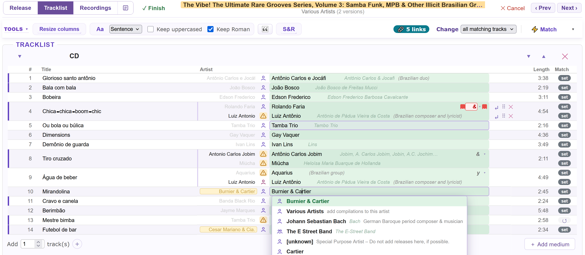
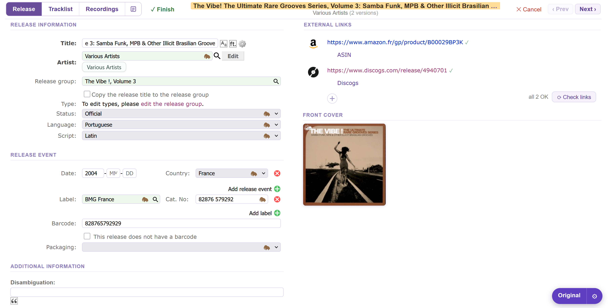
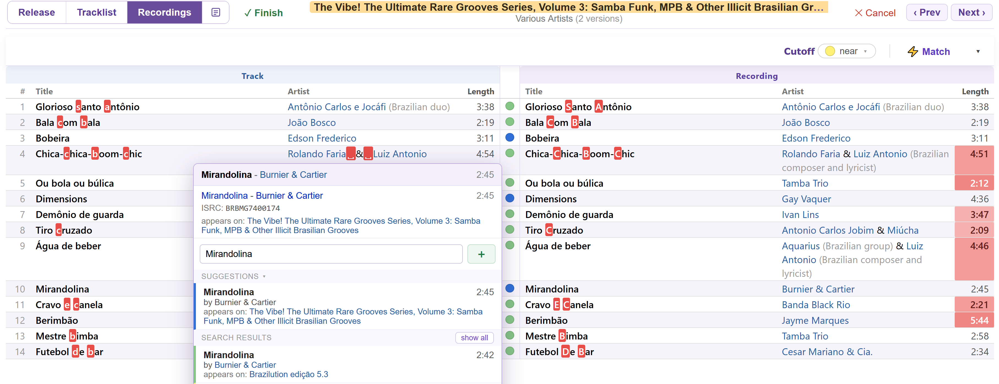
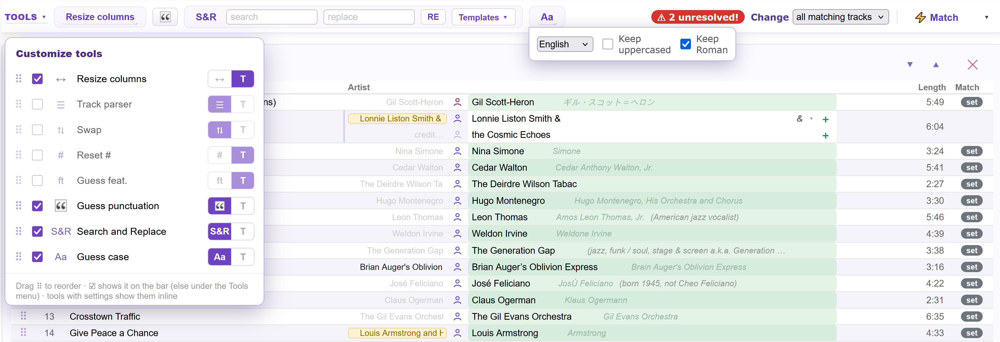
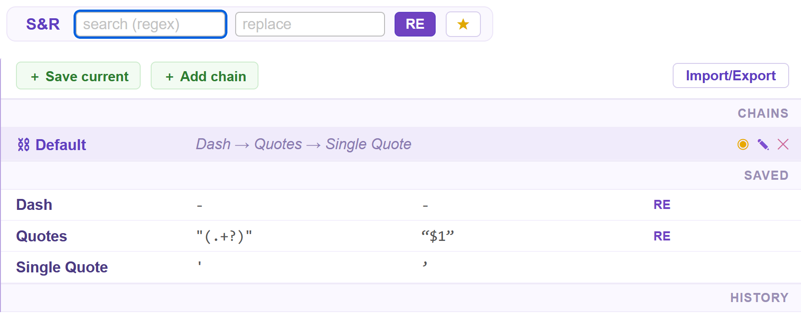
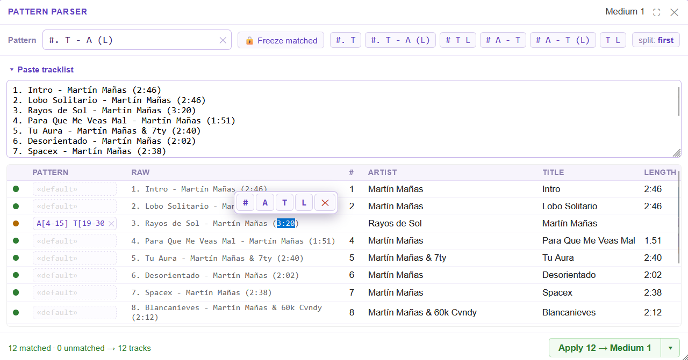
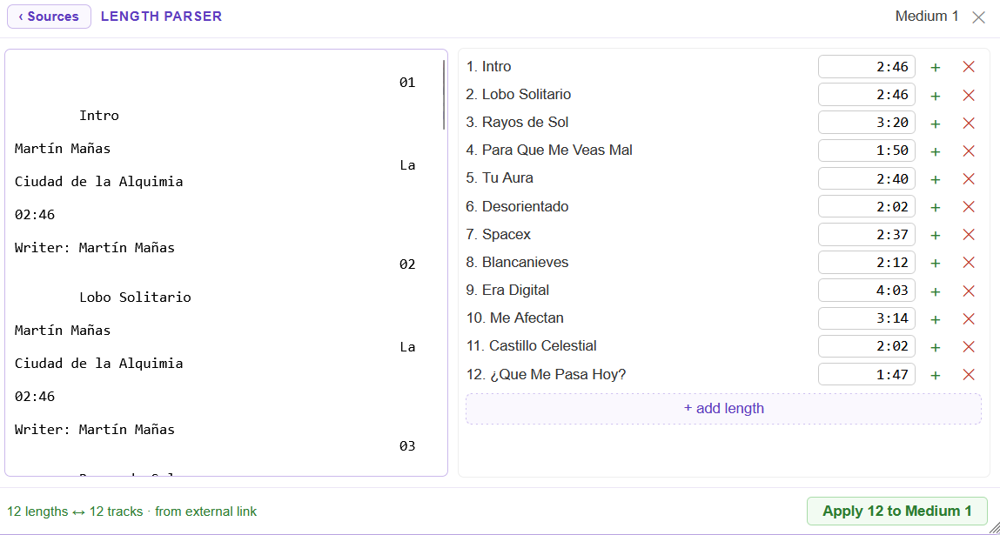
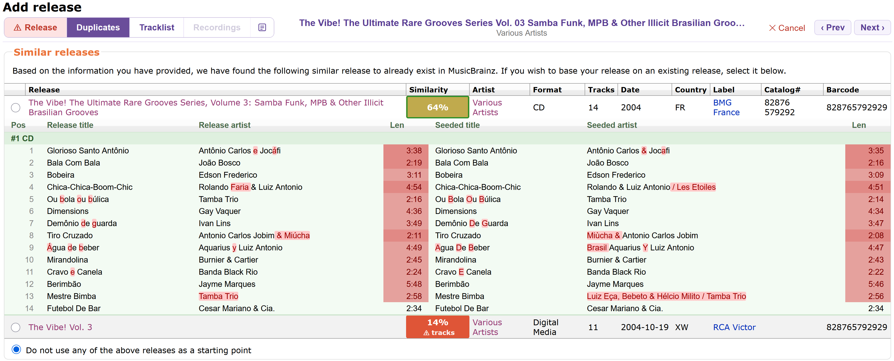
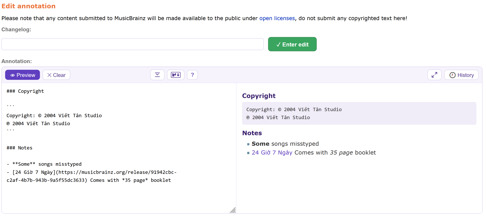
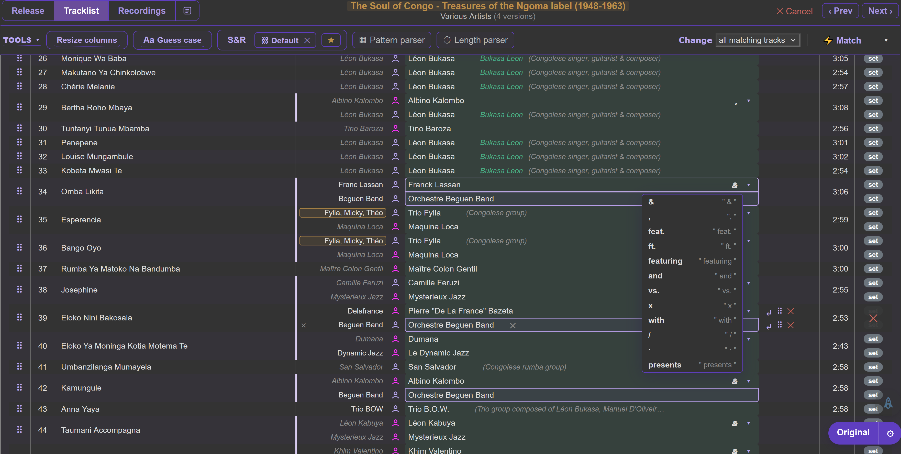

# Apollo Editor 

A faster release editor for MusicBrainz: artists and recordings matched in one pass, clean tables for the tracklist and recordings, and tools for everything MusicBrainz's own editor makes slow.

- Install: [stable](https://raw.githubusercontent.com/majkinetor/musicbrainz-userscripts/refs/heads/stable/userscripts/apollo_editor/apollo_editor.user.js) or [latest](https://raw.githubusercontent.com/majkinetor/musicbrainz-userscripts/refs/heads/main/userscripts/apollo_editor/apollo_editor.user.js)
    - Or via bundle: [String Theory](../string_theory/README.md)
- [Changelog](./CHANGELOG.md)
- [View users](https://musicbrainz.org/search/edits?auto_edit_filter=&order=desc&negation=0&combinator=and&conditions.1.field=edit_note_content&conditions.1.operator=includes&conditions.1.args.0=Apollo+Editor)



## Features

- **[Release information](#release-information)**: external links in a right column with a dead-link checker, a cover thumbnail, no help bubbles.
- **[Tracklist](#tracklist)**: an artist table with confidence colours, splitting, reordering and keyboard navigation.
- **[Recordings](#recordings)**: track and recording side by side, with the differing characters highlighted.
- **[Matching](#matching)**: artists, recordings, the release label and the release artist matched automatically.
- **[Tools](#tools)**: a configurable toolbar with the native tools and Apollo's own.
- **[Duplicates](#duplicates)**: a similarity score for each existing release, with a track-by-track comparison.
- **[Annotation editor](#annotation-editor)**: Markdown with a live preview.
- **[Highlighting](#highlighting)**: confusable punctuation, invisible characters and missing spaces made visible.

Each part is optional, and Apollo's icon in the bottom-right corner switches back to MusicBrainz's own editor at any time; it's highlighted while Apollo is on.

## Release information



- **External links** sit in a right column, checked for dead links. Right-click a favicon or type to edit it. A link type that takes the video attribute shows a small camera glyph instead of a checkbox: click it to mark the link as video (filled when on).
- **+** takes several links at once and pulls URLs out of anything pasted, HTML included, dropping duplicates and setting each link's type.
- A **front-cover thumbnail** under the links opens the cover-art page.
- Right-click a date's or label's ✕ to remove all of them.
- The help bubbles are gone, including the "You selected …" ones on the artist, label and release group: the badges say what is linked.
- The release **Artist** field is the Tracklist's artist cell, in place of MusicBrainz's box and its Edit popup. One line per artist: the credited-as name takes the place of the **Artist** label, the artist search lines up with Title, then the join phrase and the line's match badge. **↵** adds an artist, **⋔** splits a combined name, **⠿** reorders, **✕** removes, and **＋** / **🔗** / **⚠** offer to create the artist or add its link. The **Original** view brings back MusicBrainz's editor.
- The release **Artist** is [matched](#artist-matching) on load like a track artist, through the same stages: the Discogs or platform link, the release artist of other editions, the exact name or alias, and co-credit with the artists on the tracks. A confident match is linked. Each artist's badge sits at the end of its line, its match card on hover; click an uncertain **LOW** badge to link its candidate.
- The release **Label** is linked on load by its Discogs or platform link when exactly one label has it, else when exactly one label has its name or alias. A badge by the field says which; a label already on the release shows **set**, one you picked shows **user**. Hover the badge for the label and its disambiguation; click it to open the label.
- The **Label** field searches with Apollo's picker, as the artist does: each label shows its aliases, disambiguation, type, label code and years, and an icon that opens it. **↑↓** + **Enter** pick, **Show more…** fetches more, and a pasted MBID or label URL is set at once. **＋** in place of the search icon creates the typed label, with its Discogs or platform link when no label has it yet, and sets it once saved; right-click to create it silently in a background tab. A linked label shows its disambiguation after its name. The **Original** view brings back MusicBrainz's search.

## Tracklist


**Artists**

- The picker colours each artist by [match confidence](#artist-matching), and shows aliases, disambiguation and a type icon linking to the artist.
- **Change** in the toolbar sets whether an edit applies to one track or to every track with the same credit.
- Ctrl-click a search result to set it on every unresolved track. Paste an MBID or artist URL to resolve it directly.
- **＋** creates an unresolved artist in the background, with sort name, type and its Discogs or platform link filled in.
- On hover: **split** an artist (with a join-phrase picker), remove a split artist, or reorder artists within a credit.
- The **N unresolved** badge jumps to the first unresolved artist.

**Tracks**

- On hover: **Split** and **Guess case**; left-click for one track, right-click for all.
- **⠿** drags a track within its medium. **⤓** moves a track and everything below it into the data section; **⤒** moves it back. A medium with a disc ID can't have data tracks.
- On hover, the last column has the track's **↺** (revert, when it has changed) and **✕** (remove). It sits after **Match**, so it never covers the match badges.
- Changed tracks get a coloured left border; pending changes, splittable tracks and tracks Guess case would change are highlighted.
- Left-click a collapsed medium to expand it, right-click to expand all.
- Pregap and data tracks and disc IDs are supported.

## Recordings



- Each row shows the track and its recording, a [confidence](#recording-matching) circle, and the characters that differ.
- The picker offers MusicBrainz's suggestions, a search, and the releases each candidate appears on. Paste a recording MBID or URL, or an ISRC: one match is linked at once, several are listed.
- **＋** on hover unlinks a recording, so the track gets a new one; **↺** restores the link the page loaded with.
- Videos have a camera marker before their name.
- Right-click a title or artist cell to copy it to the other side:

| Gesture                  | Copies                                               |
| ------------------------ | ---------------------------------------------------- |
| Right-click              | that cell                                            |
| Ctrl + right-click       | both fields of the row                               |
| Alt + right-click        | that field in every row                              |
| Ctrl + Alt + right-click | both fields in every row                             |
| Right-drag               | every cell it passes over, on the side it started on |

On the recording side the copy is applied when you submit, like MusicBrainz's own checkboxes; the cell shows `→ New` and the old value struck through. On the track side it's applied at once. A copy is offered wherever MusicBrainz would show its checkbox, including case-only differences.

## Matching

**⚡ Match** matches everything still unresolved, or it runs when the page loads (see [Settings](#settings)). The best candidate is applied when it's confident enough; anything uncertain is left for you, as a candidate to confirm.

### Artist matching

Stages, most confident first:

1. **Discogs or platform link.** When the release links to Discogs, each credited artist (featured ones too) is matched by the Discogs link on the MusicBrainz artist. Badge: **DISC**. When the release was imported with [First Contact](../first_contact/README.md), each credited artist is matched the same way by its page on the platform the release came from (Deezer, Spotify, Tidal, …). Badge: the platform, such as **DZ** for Deezer.
2. **Release group.** The same track on other releases in the group, with its credited artists. This settles most tracks, compilations included. Badge: **RG**.
3. **Same position on other editions.** The track at the same position on the release group's other editions and on the [duplicates](#duplicates), when that track passes the [recording](#recording-matching) test (similar title and length within tolerance, or a title in another script on a medium that lines up). Its artist is taken if the name matches loosely (spaces, punctuation, quotes, a leading *The* ignored, or 85% similar): *Juan Formel* → *Juan Formell*, *Cedric Im Brooks* → *Cedric “Im” Brooks*. When the editions agree the artist is linked, keeping the seeded credited name. Badge: **POS**. When they disagree nothing is linked, and they head the picker under **On other editions at this position**.
4. **Exact name or alias.** Linked only when exactly one artist has the credited name as its name or an alias, among all of MusicBrainz's matches, not only the first page. Badge: **NAME** or **ALIAS**.
5. **Co-credit.** For a shared name, an artist credited with that name next to an artist already on this release. Exactly one such artist is linked; a tie is offered to pick from. Badge: **CRED**.

Green means matched confidently; a white search box means unresolved, counted by **N unresolved**.

**Match card.** Hover a badge for half a second and a card opens under it. It shows:
- the stage, and whether Apollo linked the artist or you picked it;
- the linked artist, with its disambiguation, type, area and dates;
- the evidence the stage had: the Discogs artist or the platform page; the release-group release and track; each other edition and whom it credits (✓ / ✗), with a release found by the duplicate search (the same title and artist, outside the release group) marked as such, since it may be this very release already in MusicBrainz; the alias; the co-credit counts;
- the other candidates;
- when it matched.

The card stays open while the pointer is on it, so its links can be followed; Esc or moving away closes it. It only shows what the match already read, so it makes no requests.

| Badge | Meaning |
| --- | --- |
| **DISC** | the Discogs artist credited on the release is linked from this MusicBrainz artist |
| **DZ**, **SP**, **TD**, … | the artist's page on the platform the release was imported from is linked from this MusicBrainz artist: **DZ** Deezer, **SP** Spotify, **TD** Tidal, **AM** Apple Music, **YTM** YouTube Music, **BC** Bandcamp, **BP** Beatport, **QZ** Qobuz, **SC** SoundCloud, **AMZ** Amazon Music, **VO** Volumo, **HD** HDtracks, **AMK** Audiomack, **7D** 7digital, **OTO** Ototoy |
| **RG** | another release in the release group credits this artist on the same track |
| **POS** | other editions credit this artist on the track at this position |
| **NAME** | the only MusicBrainz artist with this name (aliases checked too) |
| **ALIAS** | the only MusicBrainz artist with this credit as an alias |
| **CRED** | credited alongside an artist already on this release, more often than any other artist of this name |
| **USER** | picked by you |
| **SET** | linked before Apollo matched: by the release, the seed or the page |
| **LOW** | uncertain; the card lists what each stage found |

**Discogs links.** When the Discogs link is known, the type icon offers what's missing: **🔗** creates the artist with the link, or adds the link to the matched artist. **⚠** warns that the link belongs to a different artist, or that the artist links a different Discogs page (often a wrong match). **🔗 N links** in the toolbar counts them and steps through them.

**Platform links.** A release imported with First Contact gets the same offers for each artist's platform page: **🔗** creates the artist with it, or adds it to the matched artist; **⚠** warns that it belongs to a different artist.

The release **Artist** and **Label** are matched on load too; see [Release information](#release-information).

> [!NOTE]
> After a match, Apollo sometimes rebuilds its table, when the page's tracklist changed meanwhile. The badges are kept. If one is ever lost (the artist stays linked, but shows as *set*), a toast says so and offers **Copy log**: please paste it into [#638](https://github.com/majkinetor/musicbrainz-userscripts/issues/638).

### Recording matching

**ISRC first.** On a release imported with [First Contact](../first_contact/README.md) from a platform that gives ISRCs (Deezer, Apple Music, Tidal, Beatport, …), the release's ISRCs are looked up first, together in one search. A recording that is the only one with that ISRC, and agrees with the track on title and artist, is linked ahead of every other candidate. When several recordings share the ISRC, or the one that has it differs from the track, they are only offered: the picker lists them on top with an **ISRC** badge.

All the release group's recordings come in one request and are matched by title, artist and length. Tracks the group can't answer are looked up one by one. When a title is worded differently (*Part 1* / *Pt. 1*), the same position on other editions, and then on releases of the same title and artist in other groups, is used if the title is similar and the length agrees. A title in another script (*Kalimba Night* for *カリンバナイト*) can't be compared, so its position is used when that edition's whole medium lines up: as many tracks, and every length within the tolerance.

| Colour | Confidence |                                               |
| :----: | ---------- | --------------------------------------------- |
|   🔵    | Exact      | every field the same                          |
|   🟢    | Tolerance  | within the [tolerances](#settings)            |
|   🟡    | Near       | one field differs, or lengths 3–15 s apart    |
|   🟠    | Low        | two fields differ, or lengths over 15 s apart |
|   🔴    | Very low   | all three differ, lengths over 10 s apart     |

**Cutoff** in the toolbar sets the lowest confidence that's linked. *Credited as* doesn't affect matching.

## Tools



The toolbar holds the tools you choose; the rest are in **Tools ▾**, with **Customize…** to pick, reorder and show each tool as icon, text or both. A tool with settings picked from the menu joins the bar until the page closes. Right-click a tool's name to fold its settings into a hover flyout.

| Tool                                                    |                                                                                                                                   |
| ------------------------------------------------------- | --------------------------------------------------------------------------------------------------------------------------------- |
| Track parser, Swap, Reset #, Guess feat., Guess case    | MusicBrainz's own                                                                                                                 |
| [Search and Replace](#search-and-replace)               | replace text in titles, with saved patterns                                                                                       |
| [Pattern parser](#pattern-parser)                       | a tracklist from text, by a pattern                                                                                               |
| [Length parser](#length-parser)                         | track lengths from any text or page                                                                                               |
| [Merge mediums, Split medium](#merge-and-split-mediums) | restructure the mediums, keeping the recordings                                                                                   |
| Resize columns                                          | Fit, Centered or Default widths                                                                                                   |
| Guess punctuation                                       | kellnerd's [guess-unicode-punctuation](https://github.com/kellnerd/musicbrainz-scripts#guess-unicode-punctuation), when installed |
| **↺ Revert all**, **✕ Clear all** (under ▾)             | back to the loaded page, or empty                                                                                                 |

### Search and Replace



Replaces text in track titles. **★** saves patterns under a name; the last five are kept as history. **⛓** puts patterns in a **chain** run in order; **◉** marks one pattern or chain as the default, applied when the tracklist first opens. **Import / Export** is the whole set as JSON.

### Pattern parser



Fills a medium from pasted text, by a pattern. It opens with the current tracklist, so it also bulk-edits.

| Token |              | Token |                               |
| ----- | ------------ | ----- | ----------------------------- |
| `#`   | track number | `M`   | medium                        |
| `T`   | title        | `-`   | separator: any of `- – — / :` |
| `A`   | artist       | `_`   | skip the rest                 |
| `L`   | length       |       |                               |

Anything else is literal and whitespace is elastic. A capital is a token only standing alone; `$T` forces one. Fields split at the first separator; **split: last** splits at the last. Examples: `#. T`, `# A - T (L)`, `# A - T (_`.

For fixed-width text a token takes a range: `T[6-]`, `T[6-20]`, `T[-5]`, `T[~3-]` (last 3), or `[from:to]` up to a character, such as `#[1:.]` or `L[(:)]`. `~` before a character means its last occurrence: `L[~(:)]`.

Each line's dot shows whether it matched (amber: by its own pattern). A row can get its own pattern, or you select part of its raw text and bind it to a field. **🔒 Freeze matched** keeps the current pattern on every row it matches, so you can change the pattern for the rest. **Apply** writes only the fields the pattern has; its ▾ applies one field, or adds missing tracks first.

### Length parser



Reads every duration (`5:50`, `1′23″`, `1:02:03`) out of text and ignores the rest. The source is typed or pasted text, the clipboard, a page linked on the release (one favicon each), or a link pasted with **Ctrl+V**; a fetched page's URL goes into the edit note.

The lengths line up with the tracks by order: **✕** removes a row, **+** inserts one, click a value to edit it. An invalid time blocks **Apply**; an empty row leaves that track's length alone. On a release with several mediums, pick the medium in the header.

### Merge and split mediums


- **Merge mediums**: the ticked mediums go into the first of them, in order; the others are removed.
- **Split medium**: the chosen track and the ones after it become a new medium after it, in the same format.

Titles, lengths, credits and recordings are kept and tracks are renumbered. Nothing is submitted until you enter the edit. A medium with a disc ID is refused.

> [!NOTE]
> MusicBrainz records this as an *Edit medium* plus a *Remove medium* per merged-away medium, or an *Add medium* for a split. The moved tracks get new track MBIDs. Without auto-edit rights, *Remove medium* waits for votes, so the old mediums show beside the merged one until then.

### Other scripts' tools

Apollo lists a button another userscript adds to the page like one of its own. A few are recognised by their text; any element with `class="apollo-tool"` is offered too:

```html
<button class="apollo-tool" data-apollo-label="My tool" data-apollo-icon="★">…</button>
```

`data-apollo-icon` is a glyph or an image URL (default 🔧); `data-apollo-id` keeps its place on the bar. Apollo clicks the element and re-reads the tracklist, so this suits tools without inline settings.

## Duplicates



On the Add release *Duplicates* tab, a **Similarity** score for each existing release, from the titles, the artist and the track count. Click a score for a track-by-track comparison. Once artists are matched, the *Seeded* artists there are links, and the unmatched ones are underlined in amber.

## Annotation editor



Edits the annotation as Markdown, in the release editor and on every entity's *Edit annotation* page. The toolbar has **Preview** (side by side, live), **Clear**, **Markup** (Markdown or MusicBrainz's own), **Help**, **Maximize** and **History**, which shows earlier versions and loads one back.

- An unnamed MusicBrainz link gets the entity's name.
- Enter continues a list; Tab on a selection makes a list and cycles bullets and numbers; Shift+Tab removes it.
- Links, emphasis, headings, nested lists, code blocks and rules convert both ways.

## Highlighting

With *Enable detailed highlighting* on:

- the differing characters of a title or artist are marked, and a length gap is shaded by its size. A different artist is boxed whole; a *credited as* difference on the same artist marks only its characters;
- confusable characters (`'` `’` `"` `-` `–` `—`) are enlarged, and invisible ones (no-break, zero-width, tab) are drawn, with their Unicode name in the tooltip;
- a join phrase missing a space shows `␣`, and a missing join phrase `␣?␣`.

A tracklist title shows styled until you click it, then becomes the input with the caret where you clicked.



Apollo follows a dark MusicBrainz theme, such as kellnerd's [userstyle](https://github.com/kellnerd/userstyles#musicbrainz).

## Settings

Right-click Apollo's corner icon. Column widths, the toolbar layout, **Change**, **Cutoff** and the picker's folded sections are remembered as you use them.

| Setting                                                       | Default |                                                                                                |
| ------------------------------------------------------------- | ------- | ---------------------------------------------------------------------------------------------- |
| Modify Release information, Tracklist, Recordings, Duplicates | on      | replace that part of the editor                                                                |
| Modify annotations with Markdown                              | on      | the [annotation editor](#annotation-editor)                                                    |
| Modify header and footer                                      | on      | a compact step switcher instead of the tabs and footer                                         |
| Zen editing                                                   | on      | hide the site header, title and footer; the title moves into Apollo's bar                      |
| Auto confirm release submissions                              | on      | skip the confirmation page when a site seeds a release (`?skip_confirmation` bypasses it once) |
| Auto-match on start: Tracklist, Recordings                    | off     | match on load                                                                                  |
| Auto-match on start: Label, Artist                            | on      | match the release [artist and label](#release-information) on load                             |
| Discogs artist link matching                                  | on      | match by [Discogs link](#artist-matching) and offer missing links                              |
| Length tolerance                                              | 5 s     | `0` for exact                                                                                  |
| Title tolerance                                               | 1       | differing characters allowed                                                                   |
| Ignore casing                                                 | on      | case, accents and spacing don't count                                                          |
| Ignore punctuation                                            | on      | `&`/*and*, brackets, quotes, dashes and dots don't count                                       |
| Enable detailed highlighting                                  | on      | see [Highlighting](#highlighting)                                                              |
| Row layout                                                    | normal  | compact, normal or cozy                                                                        |
| Alternate row colors                                          | off     |                                                                                                |
| Show grid                                                     | rows    | lines between rows and/or columns                                                              |
| Enlarge punctuation by                                        | 3 px    | `0` stops the enlarging; the markers stay                                                      |
| Keep caret position on row navigation                         | on      | off: a cell is selected whole on arrival                                                       |
| Highlight all instances of an artist on hover                 | off     |                                                                                                |

## Shortcuts

| Where         | Key                |                                                 |
| ------------- | ------------------ | ----------------------------------------------- |
| Tracklist     | ↓, Enter           | next row                                        |
| Tracklist     | ↑, Shift+Enter     | previous row                                    |
| Tracklist     | Tab, Shift+Tab     | next, previous column                           |
| Join phrase   | typing, ↓ ↑, Enter | filter the presets, move, pick                  |
| Length parser | Ctrl+V             | read the lengths from the link on the clipboard |
| Length parser | Ctrl+Enter         | apply                                           |
| Annotation    | Ctrl+B, Ctrl+I     | bold, italic                                    |
| Annotation    | Tab, Shift+Tab     | make or change a list, remove it                |
