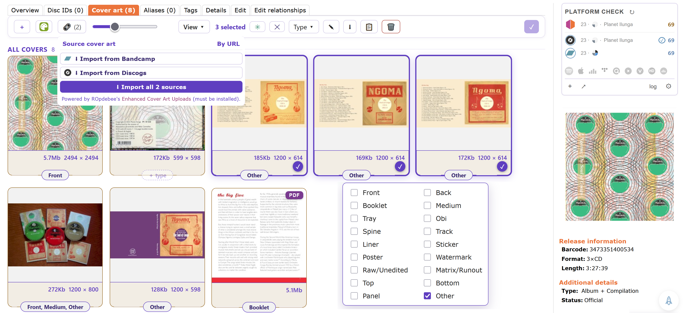
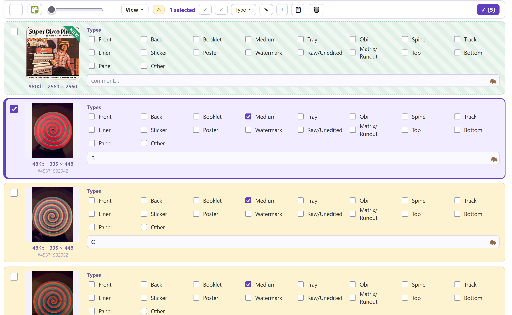

# Art Station 

A cover and event art editor for MusicBrainz: one gallery to view, sort, reorder, retype, comment, remove, download and source a release's art, all staged and applied on **Enter edit**.

- Install: [stable](https://raw.githubusercontent.com/majkinetor/musicbrainz-userscripts/refs/heads/stable/userscripts/art_station/art_station.user.js) or [latest](https://raw.githubusercontent.com/majkinetor/musicbrainz-userscripts/refs/heads/main/userscripts/art_station/art_station.user.js)
    - Or via bundle: [String Theory](../string_theory/README.md)
    - [Picker](./as_picker/README.md) companion: [install](https://raw.githubusercontent.com/majkinetor/musicbrainz-userscripts/refs/heads/main/userscripts/art_station/as_picker/as_picker.user.js)
- [Changelog](./CHANGELOG.md)
- [View users](https://musicbrainz.org/search/edits?auto_edit_filter=&order=desc&negation=0&combinator=and&conditions.0.field=edit_note_content&conditions.0.operator=includes&conditions.0.args.0=Art+Station)



## Features

- **Gallery** on a release's *Cover art* and an event's *Event art* tab: thumbnail size, grid or detailed view, group by [type](https://musicbrainz.org/doc/Cover_Art/Types), sort by position, type, dimensions or date.
- **Reorder** by dragging one cover or a whole selection. Select with right-click or right-drag.
- **[Actions](#actions)** on one cover or the selection: type, comment, remove, download, report.
- **[Add images](#add-images)**: files, folders, zips, URLs, MH Covers, reverse-image search.
- **[Full-screen viewer](#full-screen-viewer)** with zoom, pan and slideshow.
- **[File names ⇄ types](#file-names--types)**: a downloaded archive re-adds with its types and comments.
- **[Applying changes](#applying-changes)** as parallel edits, with automatic retries.

| Grouped by type | Detailed view |
|---|---|
|  |  |

Each cover shows its size and resolution. *Show each cover's file type next to its size* (⚙, off by default) adds the format: `3.2Mb PNG`.

## Actions

- **Set type**: tick one or more types; right-click a type to set only that one.
- **Set comment**: Enter moves to the next cover's comment. With [Mammoth](../mammoth) installed, the comment field gets its 🦣 memory.
- **Remove**: marks the cover for removal.
- **Only this**: on a new cover, while there are others (after *Import all*, say), **✓ only this** in its top-left corner marks every other new cover for removal; the release's own covers stay. **↺ keep** brings one back.
- **Download** as a zip, [named by type](#file-names--types).
- **Report** in HTML or Markdown: inline, captioned, or a table (position, file, resolution, size) that also serves as the archive's `README.md`.

## Add images

| Source | |
|---|---|
| Files | drop or pick; the type is [guessed from the name](#file-names--types) |
| Folder | drop one, or Shift-click the drop zone; one level of subfolders, up to 100 files |
| Zip | drop or pick one; unpacked in the browser like a folder. An Art Station download restores each cover's types and comment. |
| URL | **Ctrl+V** a URL anywhere on the gallery, or the **URL (N)** panel: one import per source the release links, plus [registered providers](#plugin-api). Right-click **URL (N)** to import from all of them; middle-click to import from all and keep only the best cover (highest resolution, then smallest file); the others are discarded, and the edit note says Art Station chose it. Needs [Enhanced Cover Art Uploads](https://raw.github.com/ROpdebee/mb-userscripts/dist/mb_enhanced_cover_art_uploads.user.js). |
| [MH Covers](https://covers.musichoarders.xyz) | pick a cover; it's staged as a new one |
| Reverse-image search | 🔍 on a cover searches Yandex, Google Lens, TinEye or Bing for a bigger copy. With the [Picker](./as_picker/README.md), clicking the copy on the results sends it back to the gallery. |

> [!NOTE]
> Zips may be stored or deflated; encrypted and ZIP64 archives are skipped with a message. Pasting into an input (the URL box, a comment) is left to that input.

## Full-screen viewer

← → move between covers, ↑ ↓ zoom (the level is remembered). When zoomed, the image follows the mouse (switch it off in ⚙ to drag instead). **P** runs a slideshow, **Enter** edits the comment, **Delete** marks the cover for removal. See [Shortcuts](#shortcuts).

## File names ⇄ types

When an added image has no type, it's guessed from its file name (switch it off in ⚙):

| Type | Name contains |
|---|---|
| Front | `front`, `folder`, `cover`, `frontal`, `recto` |
| Back | `back`, `rear`, `verso` |
| Booklet | `booklet`, `inlay`, `insert` |
| Medium | `cd`, `disc`, `disk`, `vinyl`, `medium`, `label`, `side a/b/…` |
| *by name* | `tray`, `obi`, `spine`, `sticker`, `liner`, `poster`, `matrix`, `runout`, `track`, `top`, `bottom`, `raw`, `unedited`, `watermark`; for events `flyer`, `ticket`, `setlist`, `banner`, `program`, `schedule`, `map`, `logo`, `merch` |

Matching is by whole word and order-aware: `back cover` is **Back**, and *Super Disco Pirata* is no type at all.

Downloads are named `<NN> <types> <comment>.<ext>`, with `none` for no type, e.g. `09 front,sticker Front cover with the sticker.jpg`.

## Applying changes

**Enter edit** lists the staged operations and submits them as MusicBrainz edits, with one edit note and *make votable* for all.

- Each operation shows the cover it acts on and its own progress bar; the bar at the top counts the whole batch.
- The edit note starts folded to one line: its line count and first line. Click it to edit. With [Mammoth](../mammoth) installed, 🦣 opens the note with Mammoth's saved notes.
- **Dry run** is in the menu on **Submit edits** (▾): it shows what each edit would send, and submits nothing.
- Removes, edits and uploads run in parallel; one reorder edit runs last and sets the final order.
- **Repeat** re-runs only the failed operations, and the reorder after them.
- With *Automatically repeat failures* on (the default), Art Station retries the failed operations by itself, up to 10 times or 10 minutes. The pause between attempts grows as they pile up. A footer row shows the attempt and the countdown; **Close** stops it.
- While a run is in progress, leaving the page asks first, and a click outside the dialog doesn't close it.

> [!NOTE]
> *Upload timeout* (⚙, default 10 minutes, at most 120) is how long one file may take to reach the Internet Archive. Raise it for large PDF booklets when the Archive is slow; the failure message says when this limit was hit.

## Plugin API

Another userscript can add its own source. It appears as **Import from &lt;name&gt;** in the URL panel, and its images are staged like any other. A site script that's logged in to a fan site, say, can fetch with its own session and hand the images over:

```js
window.ArtStation?.registerProvider({
  name: 'SpringsteenLyrics',              // the button label
  id: 'springsteen',                      // optional de-dupe key (defaults to name)
  icon: 'https://example.com/favicon.ico',// optional
  match: 'springsteenlyrics.com',         // optional: string | string[] | RegExp | (url) => boolean
  async run(ctx) {                        // ctx = { mbid, entity: 'release'|'event', artist, title, url, link, links }
    return [{ url: 'https://…/front.jpg', types: ['Front'], comment: '' }];
  },
});
```

- **`match`** shows the button only when the release or event links a matching URL; those are passed as `ctx.link` and `ctx.links`.
- Each returned item is `{ types?, comment? }` plus one image: **`url`** or **`dataUrl`** (preferred: Art Station fetches it itself), or **`blob`** with its **`source`** URL.
- If your manager isolates `window` between scripts, dispatch `artstation:register-provider` with the provider as `detail` instead.

## Shortcuts

| Key | Where | |
|---|---|---|
| Ctrl+V | gallery | import the URL on the clipboard |
| ← → ↑ ↓ | gallery | move between covers |
| Enter | gallery | open the cover full-screen |
| Space | gallery | select or deselect the cover |
| Delete | gallery, viewer | mark for removal |
| ← → / ↑ ↓ | viewer | previous, next / zoom |
| Enter | viewer | edit the comment |
| D | viewer | download the original |
| P | viewer | slideshow |

| Mouse | |
|---|---|
| right-click / right-drag | select / paint-select covers |
| right-click **URL (N)** | import from every source |
| middle-click **URL (N)** | import from every source, keep only the best cover |
| wheel on the size slider, or right button held + wheel | resize thumbnails |
| viewer: wheel | zoom toward the cursor |

## Notes

- [Development documentation](./DEVELOP.md)
