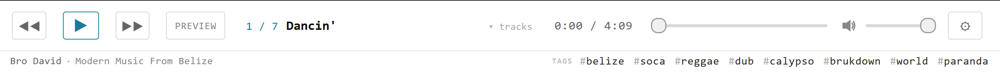
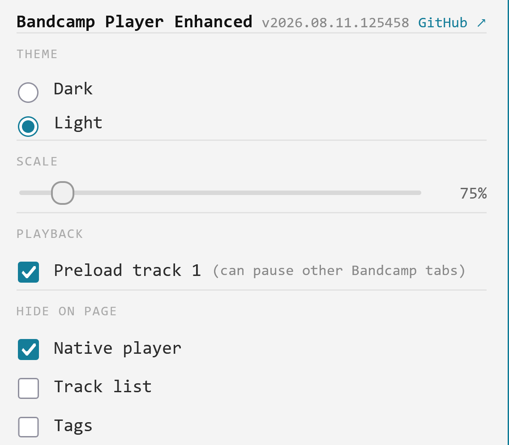

# Bandcamp Player Enhanced 

A Bandcamp album player with keyboard shortcuts, an album preview, and a few customizations.

- Install: [latest](https://raw.githubusercontent.com/majkinetor/musicbrainz-userscripts/refs/heads/main/userscripts/bandcamp_player_enhanced/bandcamp_player_enhanced.user.js)
- [Changelog](./CHANGELOG.md)

## Shortcuts

| Key | |
|---|---|
| Space | play / pause |
| ↑ / ↓ | previous / next track; with Shift, volume up / down |
| ← / → | back / forward 5 s; with Shift, 30 s |
| P | album preview (30 s of each track) |

The mouse wheel over the player bar seeks too; over the open track list it scrolls, over the volume control it sets the volume.

## Settings

**⚙** on the player bar:

| Setting | Default | |
|---|---|---|
| Theme | Page | follows the album page: dark on a dark page, light on a light one; or always Dark or Light |
| Scale | 100% | 70–130% |
| Start from track 1 | on | Bandcamp sometimes starts a page on a "featured" track; this moves the player to track 1 without playing it |
| Hide on page | the native player | also the track list and the tags row |

