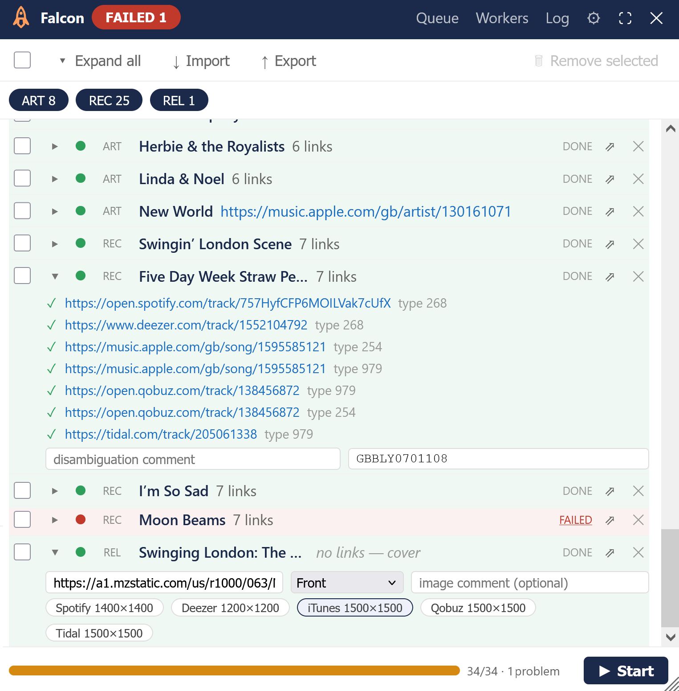
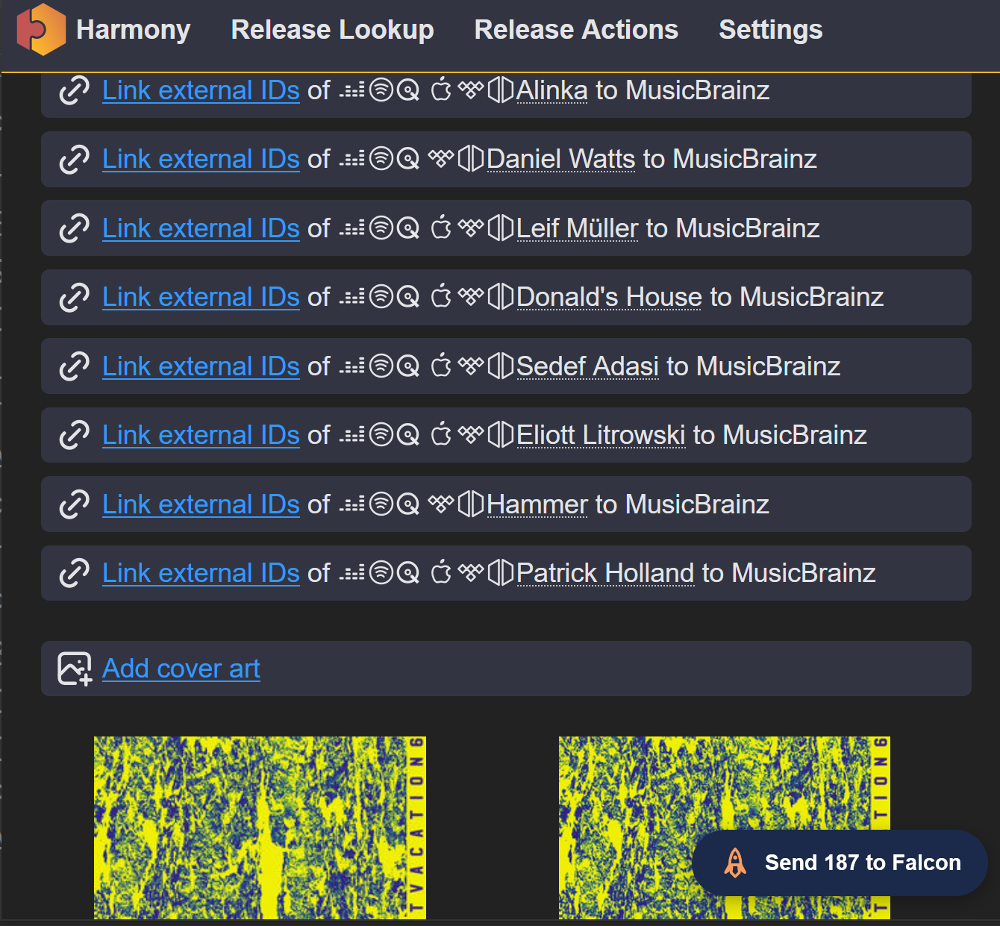
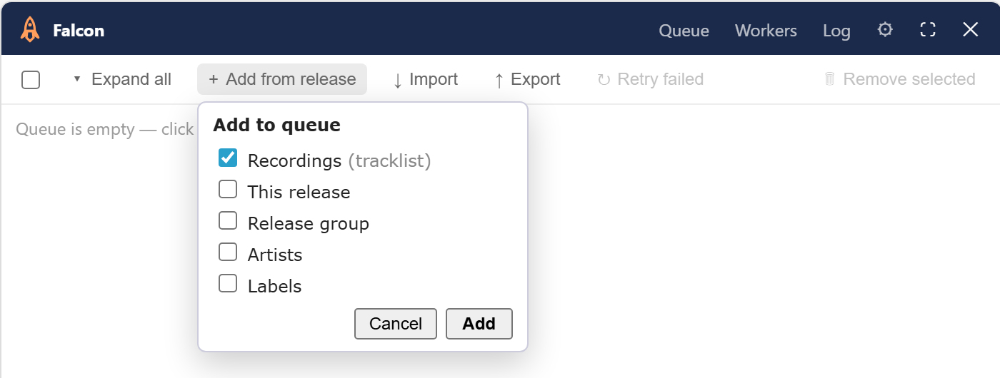
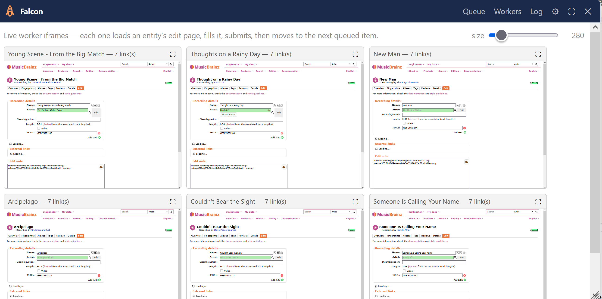

# Falcon 

A MusicBrainz batch editor: queue many entities, then let a pool of workers add their links, ISRCs, names, aliases, disambiguations and cover art, through MusicBrainz's own forms or its API.

- Install: [stable](https://raw.githubusercontent.com/majkinetor/musicbrainz-userscripts/refs/heads/stable/userscripts/falcon/falcon.user.js) or [latest](https://raw.githubusercontent.com/majkinetor/musicbrainz-userscripts/refs/heads/main/userscripts/falcon/falcon.user.js)
- [Changelog](./CHANGELOG.md)
- [View users](https://musicbrainz.org/search/edits?auto_edit_filter=&order=desc&negation=0&combinator=and&conditions.1.field=edit_note_content&conditions.1.operator=includes&conditions.1.args.0=Falcon)



An importer like [Harmony] hands you 20–50 artists, recordings and labels that each need links, ISRCs and a cover. MusicBrainz has no write API for most of that, so tools open a tab per entity for you to handle one by one. Falcon does them as one batch.

## Features

- **[Queue from anywhere](#filling-the-queue)**: a [Harmony](#from-harmony) import, [the page you're on](#from-the-current-page), [a series](#from-a-series), a [JSON file](#json-model), or [another script](#from-another-script) such as Platform Check.
- **[Attributes](#attributes)**: links, names, disambiguations, aliases, ISRCs, the video flag, cover art.
- **[Failures you can inspect](#the-run)**: MusicBrainz's own error on the row, the worker left where it stopped, retry in place.
- **Export and import** a run as JSON, with each item's outcome, so a partial batch can be rerun without repeating what went through.
- **[Batch edit note](#batch-edit-note)** on every edit of a run.
- **[Hands-free Harmony import](#hands-free-import)**, including retries when MusicBrainz errors.
- **[Disc IDs from a rip log](#disc-ids-from-a-rip-log)**, computed in the browser.
- **[Picard](#settings)** hand-off once a run finishes.

Untouched rows and aliases the entity already has are skipped, not submitted again. So is a link the entity already has, even in another locale: a Qobuz or Apple Music page already linked as `gb-en` or `/gb/` (or open.qobuz.com, itunes.apple.com) isn't added again as `us-en`. The row says which link it already is.

## Filling the queue

Open Falcon on any MusicBrainz page with **Ctrl+Alt+F** (or its corner icon).

### From Harmony

On a [Harmony] *Release Actions* page, **Send N to Falcon** (bottom-right) opens MusicBrainz with the batch queued: links for every entity, the recordings' ISRCs, and the front cover.



- **ISRCs** go by tracklist position: ISRC *N* to track *N* as MusicBrainz has it. If the counts differ, the extras are dropped and logged. (A recording linked to the wrong provider track still gets that track's ISRC; Falcon can't tell.)
- **Cover art**: Falcon measures every candidate itself (Harmony's sizes are often wrong) and picks the largest, then the smallest file. Expand the row to change the pick, its type or its comment. The edit note names the source, its size, and what it was chosen over.

> [!WARNING]
> A cover is added even if the release already has one, unless *Add covers only when there aren't any* is on; the row warns when the release has art. If you upload covers with [ECAU] or [Art Station](../art_station) instead (they fetch the full-size image), turn on *Ignore Harmony cover art*.

### From the current page

On a release or release group page, **+ Add from** fills the queue with its entities, with empty fields. Fill in the rows you care about and press Start; untouched rows are skipped. **Export** turns it into a JSON worksheet to fill in later.



Ticking the *Video* camera on a selected recording ticks it on every selected recording.

### From a series

On a series page, **+ Add from series** queues its release groups (optionally every release in them), or its releases (optionally their release groups), in the series' own order. Together with [renaming](#attributes), this is how a series gets its titles conformed.

## Editing the queue

The **List** / **Grid** button, right of the type chips, switches between two views. Falcon remembers the one you last used.

- **List**: expand a row to edit it as a labelled form. Its links are listed one per URL, each with its link types by name; a URL added under two types shows both. The mark before a URL (✓ done, ✗ failed, ↗ not run yet) opens it. Long link lists fold after three, with *+ N more*.
- Links are editable: change a URL in its box (empty it to drop it). A type badge is a dropdown: pick another type to change it, or **✕** it off. The **+** after the types adds one from that entity's link types, the row's **✕** removes the link, and the **+** by the *Links* label adds a link. The **↗** mark opens the link (✓ / ✗ once it has run). A link with no type shows *auto* and is left for MusicBrainz to guess.
- **Grid**: one line per row, with its name, disambiguation and ISRCs editable in place. **▸** opens the row's links and aliases (and a release's cover art) beneath it, lined up under *Name*; aliases are added and edited only there.

The select-all box, **▸** expand-all and the number of rows selected head the rows, in both views. The open tab is underlined.

The [keyboard](#shortcuts) moves between fields in both views, like a spreadsheet. In the list, the row you move into opens and the one you leave closes again.

## The run

Review the queue (remove rows, edit fields), then press **Start**. Right-click a row's type to select every item of that type; the header chips (`art`, `lbl`, `rec`, `rel`, `rg`) exclude a type without removing it.

| Status | |
|---|---|
| queued | not processed yet |
| in progress | being processed |
| done | everything went through |
| partial | some of it failed |
| failed | nothing went through |
| manual | finished by you in a tab |
| skipped | nothing to submit, or MusicBrainz reported no change |
| excluded | its type's chip is off |

- A failed row shows MusicBrainz's own error on hover. **FAILED** / **PARTIAL** / **MANUAL** chips at the top filter the queue to those rows.
- A worker that can't commit stays where it stopped, dimmed but live, and a fresh one takes over. Click a red status to jump to it in the **Workers** tab; **⛶** enlarges it.
- **⇗** opens the entity's edit page in a tab, prefilled, for you to finish.
- **Retry failed**, in Start's **▾** menu, reruns the failed and partial rows in place.



> [!NOTE]
> Workers are MusicBrainz edit pages in same-origin iframes. Each is loaded with MusicBrainz's seed parameters, so the page fills itself. Falcon only touches the form for what seeding can't express (a link that needs two types, a row MusicBrainz couldn't classify), and submits. Where MusicBrainz has an API (cover art, aliases), Falcon uses it instead. The worker count never grows with the queue.

A link MusicBrainz can't classify on its own (a Bandcamp track: purchase or streaming?) fails with that reason instead of blocking its row; use **⇗** to pick the type.

## Attributes

| | artist | label | recording | release | release group |
|---|:---:|:---:|:---:|:---:|:---:|
| links, name, aliases, disambiguation | ✓ | ✓ | ✓ | ✓ | ✓ |
| ISRCs, video | | | ✓ | | |
| cover art | | | | ✓ | |

- **Name**: an expanded row's ✎ box starts with the current name, so a fix is an edit, not a retype. A rename is votable, so it shows once the edit passes.
- **Aliases**: one row per alias, with its name, its language and **✕**; the **+** by the *Aliases* label adds one, or use [JSON](./examples/aliases.json) for many. A new alias takes the language last typed; `name@locale` typed in the name box sets the language too. Enter on a filled alias opens the next one, on an empty one moves on to the next row's aliases; Esc drops a new, still empty row.
- **Video** is only ever set, never cleared.

> [!WARNING]
> MusicBrainz silently drops the locale of a *Search hint* alias; Falcon warns in the log. Use the `<entity> name` type for a localised title.

## Batch edit note

**✎ Note**, left of Start, adds its text to every edit of the run: forms, aliases and covers. The button is marked while a note is set. The note is not kept across reloads, so an old reason can't slip into a new batch.

## Hands-free import

Two settings carry a finished Harmony import to a finished run:

| | Runs on | Does |
|---|---|---|
| *Auto send* | Harmony | presses *Send to Falcon* |
| *Auto start Harmony import* | MusicBrainz | presses *Start* |

*Auto send* waits until the import is complete (the page has a `release_mbid`) and Harmony has finished listing its actions. It stands down if there's nothing to send. It counts down on the button first; a click cancels.

**When Harmony errors**, the page still loads, just short of actions. Falcon handles this without a setting:

- **a MusicBrainz error**: Falcon reloads the page, up to 5 times, backing off from 5 s to 60 s;
- **a provider error**, or retries exhausted: Falcon sends what it has, as *Send 43 to Falcon (partial)*, with the reason as the batch's edit note (reloading can't fix a provider).

Falcon is idempotent, so a partial run can be topped up later. *Reload release page after import without errors* (a Harmony option, like Picard: both follow only a queue Harmony sent) shows the result on the release page and turns the corner icon green. A run with failures isn't reloaded, since the queue wouldn't survive it; the log would.

## Disc IDs from a rip log

On a release's **Disc IDs** tab, each medium gets a drop zone for a rip log. Falcon reads the TOC, computes the disc ID in the browser, and takes you straight to MusicBrainz's attach page with the edit note signed. **Enter edit** is yours.

| Program | Reads |
|---|---|
| EAC, XLD, fre:ac | the TOC table (localised EAC too) |
| whipper | the `TOC:` block |
| dBpoweramp | `Track N: Ripped LBA x to y` |
| cyanrip | `Start LSN` / `End LSN` |

Like Picard, whose parsers these are, it refuses a partial rip, a non-standard track sequence or an unknown file, and drops a trailing data track. A log whose track count doesn't match the medium asks before continuing.

## JSON model

What **Import** reads, **Export** writes, and Harmony and other scripts produce: a bare array of items, or `{ "items": [...] }` with an optional root `note` (the [batch edit note](#batch-edit-note)) and `name` (the run's name in the log history, for a queue with no release in it to be named after).

```json
{
  "note": "Links and covers from the label's site",
  "items": [
    { "entityType": "artist", "mbid": "d31f76d2-1d8e-4271-8027-148f375979d7", "urls": [{ "url": "https://myspace.com/x", "linkTypeId": null }], "status": "done" },
    { "entityType": "recording", "mbid": "e42f8e08-3150-4c6c-be5b-4030c29b1bf7", "disambiguation": "live version", "isrcs": ["NLTH62000001"] },
    { "entityType": "release", "mbid": "8ad416ad-f3a1-43bb-9e85-786efefd5173",
      "urls": [{ "url": "https://www.discogs.com/release/1", "linkTypeId": "75" }],
      "cover": [{ "url": "https://e-cdns-images.dzcdn.net/images/cover/x/1000x1000.jpg", "type": "Booklet", "comment": "page 1" }] }
  ]
}
```

| Key | |
|---|---|
| `entityType` | `artist`, `label`, `recording`, `release`, `release_group` |
| `mbid` | the entity |
| `urls[]` | `{ url, linkTypeId }`; without a type, MusicBrainz classifies the link |
| `rename` | a new name (`name` is the current one, read only) |
| `disambiguation` | the disambiguation comment |
| `aliases[]` | `{ name, locale, type, primary, sortName, begin, end, ended }`, or `"name@locale"`; each is its own edit. `type` as MusicBrainz names it (`Recording name`, `Search hint`…) |
| `isrcs[]` | recordings |
| `video` | recordings; only `true` does anything |
| `cover[]` | releases: `{ url, type, comment, candidates }`, type defaulting to Front |
| `note` | that item's own edit note |
| `status`, `error`, `urlResults` | written by Export: the outcome of the last run |

### From another script

Append `?falcon=<base64(JSON)>` to any musicbrainz.org URL: Falcon opens with the queue seeded (it doesn't start). The JSON is the [model](#json-model) above, read as **Import** reads a file: the `note` becomes the batch edit note, and an item carries whatever a row can. On a page where Falcon already runs, a script can instead dispatch a `falcon:import` event on `document` with the JSON as a string `detail`: Falcon queues it on that page and answers with `falcon:import-ok`. `falcon:run` does the same and starts the queue; with `"closeWhenDone": true` at the JSON's root, the panel closes when that run finishes with every item done. A `?falcon=` link never starts on its own. A batch handed over this way (event or link) adds an entity already queued to its row rather than queueing it twice, so sending the same batch again doesn't run it twice; **Import** restores a file as it is. [Platform Check](../platform_check/README.md#artists-and-labels) sends its artist and label links this way, and falls back to `?falcon=` in a new tab when no Falcon answers.

## Settings

| Setting | Default | |
|---|---|---|
| Hide Falcon icon | off | Ctrl+Alt+F still opens it |
| Add covers only when there aren't any | off | |
| Ignore Harmony cover art | off | |
| Auto send | off | see [Hands-free import](#hands-free-import) |
| Auto start Harmony import | off | |
| Reload release page after import without errors | off | |
| Open from Harmony in new tab | on | off navigates the Harmony tab |
| Automatically send to Picard using port | off, 8000 | hand the release to [Picard](https://picard.musicbrainz.org/) after a run (needs its *Browser integration*). The port also gives MusicBrainz's own tagger button, ticked or not. |
| Workers | 5 | entities processed at once |
| Keep last N run logs | 20 | |

> [!TIP]
> To report a problem: leave **debug** on in the **Log** tab, reproduce it, then **Copy log** into the issue. Each run's log is kept separately; the dropdown lists past runs.

## Shortcuts

| Key | |
|---|---|
| Ctrl+Alt+F | open or close Falcon |
| Enter / Down | the same field on the next row |
| Shift+Enter / Up | the same field on the previous row |
| Tab / Shift+Tab | the next / previous field, on to the next / previous row |
| Right / Left | the next / previous field, once the cursor is at the end / start of the text |

In an alias box with text in it, Enter adds the alias first; press it again to move on.

[Harmony]: https://harmony.pulsewidth.org.uk
[ECAU]: https://github.com/ROpdebee/mb-userscripts#mb-enhanced-cover-art-uploads
