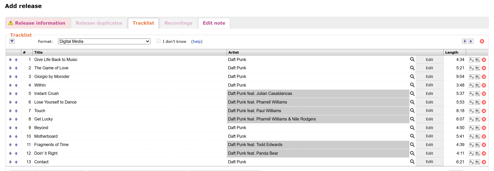
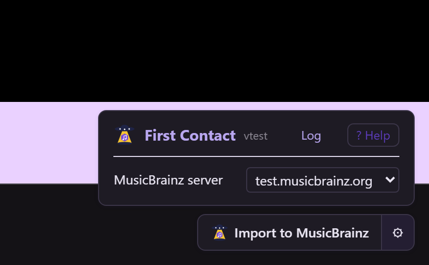

# First Contact 

Import a release into MusicBrainz from the platform's album page with one click: the release editor opens with everything the platform knows filled in.

- Install: [stable](https://raw.githubusercontent.com/majkinetor/musicbrainz-userscripts/refs/heads/stable/userscripts/first_contact/first_contact.user.js) or [latest](https://raw.githubusercontent.com/majkinetor/musicbrainz-userscripts/refs/heads/main/userscripts/first_contact/first_contact.user.js)
- [Changelog](./CHANGELOG.md)
- [View users](https://musicbrainz.org/search/edits?auto_edit_filter=&order=desc&negation=0&combinator=and&conditions.0.field=edit_note_content&conditions.0.operator=includes&conditions.0.args.0=First+Contact)

## Features

- **[Import](#import)** a release from the album page into the MusicBrainz release editor.
- **[Platforms](#platforms)**: what is read from each one.
- **[Artist matching](#artist-matching)** is left to Apollo Editor, which gets every artist's platform link.

## Import

On a platform's album page, click **Import to MusicBrainz** in the bottom-right corner. A new tab opens with MusicBrainz's release editor, filled in:

| Field | From |
|---|---|
| Title, artist credit | the album, with any *feat.* artists split off the title into the credit |
| Type | the platform's album / EP / single / compilation; when the platform doesn't say, EP or Single when the title ends so (*Prophet Margin EP*), or Single for one track |
| Status, packaging | Official, None |
| Release event | the platform's release date, Worldwide |
| Label | the platform's label text |
| Barcode | the platform's UPC |
| Script | Latin, when every title is in Latin letters; otherwise left for you |
| Tracklist | one Digital Media medium per disc, with titles, track artists and lengths |
| External link | the album page |
| Edit note | the album page, and the script's name and version |

Artists are seeded by name only. Check everything, then submit as usual.

MusicBrainz first asks you to **Confirm form submission**, as for every import from another site. Click **Continue**.

While the album is read, the button counts the tracks: *Reading Deezer… 7/13*. If something fails, a message says why and offers **Copy log**.

> [!NOTE]
> The tab opens at once, while the platform is still being read, so the browser doesn't block it as a popup. The data reaches it a moment later.

## Platforms

| Platform | Pages | Notes |
|---|---|---|
| Deezer | `deezer.com/…/album/<id>` | Featured artists come from the title's *feat.* clause: Deezer lists them as main artists. A trailing *(Original Mix)* is dropped from track titles. |
| Bandcamp | `<name>.bandcamp.com/album/<slug>` | Read from the page itself. A comma list of artists (*Future Funk Squad, Omega Sparx, Stu Brootal, The Crystal Method*) is split into separate artists, except the account's own name. On a label's page the label is filled in; on an artist's own page it is left empty. A compilation's *Artist - Title* track titles are split into artist and title. The album link gets both *purchase for download* and, when it streams, *stream for free*. Only the artist the page belongs to has a Bandcamp link to hand off. |

More platforms follow, one at a time ([#650](https://github.com/majkinetor/musicbrainz-userscripts/issues/650)).

## Artist matching

First Contact doesn't pick MusicBrainz artists itself. It hands every credited artist's platform link (the release's and each track's) to [Apollo Editor](../apollo_editor/README.md#artist-matching) on the release editor page, and Apollo matches them.

> [!NOTE]
> The handoff is on the release editor page for any script to read: `document.documentElement.dataset.firstContact` holds it as JSON, the `first-contact:seed` event on `document` carries the same JSON as its `detail`, and a `first-contact:request` event on `document` sends it again. It lists the release and every track with each artist's name, join phrase and platform link, in tracklist order.

## Settings

The **⚙︎** button next to **Import to MusicBrainz**.

| Setting | Default | |
|---|---|---|
| MusicBrainz server | musicbrainz.org | where the release editor opens: musicbrainz.org, beta.musicbrainz.org or test.musicbrainz.org |

