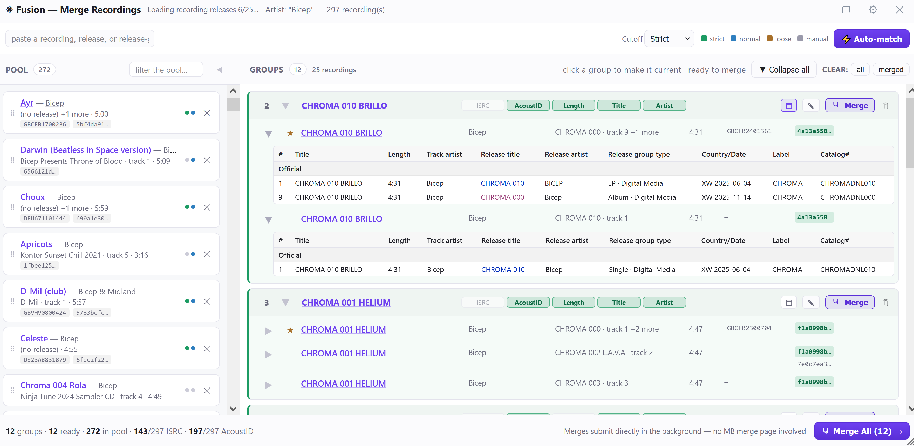

# Fusion 

A merge assistant for MusicBrainz recordings: gather a pool of candidates, let auto-match group the likely duplicates, adjust by hand, then submit every merge directly in the background

- Install: [stable](https://raw.githubusercontent.com/majkinetor/musicbrainz-userscripts/refs/heads/stable/userscripts/fusion/fusion.user.js) or [latest](https://raw.githubusercontent.com/majkinetor/musicbrainz-userscripts/refs/heads/main/userscripts/fusion/fusion.user.js)
- [Changelog](./CHANGELOG.md)
- [View users](https://musicbrainz.org/search/edits?auto_edit_filter=&order=desc&negation=0&combinator=and&conditions.0.field=edit_note_content&conditions.0.operator=includes&conditions.0.args.0=Fusion)

## Features

- **Pool / Groups review UI** — every candidate recording starts in the left-hand **Pool**; drag one into the right-hand **Groups** column, double-click a pool card to add it straight to the *current* group, or select a pool card then click a group to add it. A recording only ever lives in one place at a time.
- **Auto-match** — scans the pool and groups likely duplicates automatically using multiple signals: shared ISRC, shared AcoustID, length within a configurable tolerance, and title/artist similarity (typo-tolerant — a one-letter difference). A **Cutoff** selector controls how strict the combination has to be: *strict* (identifiers only), *normal* (default — identifiers, or title+artist+length together), *loose* (identifiers, or title+length alone, artist not required). Re-running Auto-match only touches whatever is still in the pool, so it never undoes a group you built by hand.
- **Full manual control** — return a recording from a group back to the pool (↩, shown on hover so it can't be clicked by accident), remove it from the group *and* the pool entirely (✕), or build a brand-new group yourself. The merge **target** (the recording that survives) always sits at the top of the card with a gold ★; hover any other row and click its ☆ to make that one the target instead — no separate column needed, the row's shaded background says which one it is. Click a group's header to make it the "current" group for double-click-adds and empty-space drops. 🗑 on a group deletes it — its members go back to the pool, nothing is lost — and **Clear board** does the same for every group at once.
- **Flexible seeding** — opens with a pool already populated from wherever you launched it:
    - **Release page** — that release's own recordings, plus a *"Load recordings from RG edition"* dropdown to pull in another edition from the same release group.
    - **Release group page** — every recording across every release in the group in one go.
    - **Recording page** — just that one recording, to start building a merge from scratch.
    - **Artist → Recordings tab** — the artist's *entire* recording catalogue via the search API, not just the page you're looking at (MB paginates that table at 100 rows; Fusion pulls all of them, up to a 2000 safety cap).
    - Any page: paste a recording, release, or release-group MBID/URL into the input — it is added on paste, no button to press. A release or release-group URL pulls in every recording it contains.
- **Video recordings are never mixed with audio** — a video recording gets a 🎬 marker everywhere it appears, and merging one with an audio recording is refused, hard, at every entry point (Auto-match, drag, double-click, select+click) — no signal, not even a shared ISRC, overrides this.
- **Direct background merges** — a group's **Merge ↗** button (or the footer's **Merge All**, which drives every ready group, several at once) submits the merge itself, the same two real MusicBrainz endpoints MB's own merge page uses (`/recording/merge_queue` → `/recording/merge`), with an edit note auto-composed from whichever signals matched. No tab opens, no MB UI is shown.
- **Shared identifiers are colour-coded** — within a group card, any ISRC or AcoustID held by two or more members is tinted, with a different colour per distinct shared value, so which rows actually agree is obvious at a glance. A value only one member has stays plain.
- **Per-merge edit note** — the ✎ in a group's title turns the whole card into a note editor; the button is tinted purple when a custom note is set. A custom note replaces the auto-generated reason line; Fusion's attribution footer is always appended.
- **Options and log** — the ⚙ menu holds settings (length tolerance, AcoustID enrichment on/off, always-request-a-vote) plus a **Log** button opening activity log window

## How matching works

Auto-match treats two recordings as the same group when either:
- they share an **ISRC**, or
- they share an **AcoustID**, or
- their **title** and **artist credit** are both similar *and* their **length** is within tolerance (5 seconds by default) — title similarity tolerates small typos (edit-distance based), not just exact word overlap, or
- with the **loose** cutoff, title+length alone (no artist match required).

Length alone is never enough to group two recordings — it's supporting evidence only, combined with title (and usually artist). A group formed from ISRC or AcoustID is marked `HIGH` confidence; a group formed only from title+length/title+artist+length is marked `MEDIUM`. Groups you build by hand (drag/select, not Auto-match) are marked `MANUAL` and still show their signal chips for reference, since a merge you intend deliberately doesn't need to justify itself the same way an automatic one does.

This mirrors MB's own [How To Merge Recordings](https://musicbrainz.org/doc/How_To_Merge_Recordings) guidance — matching "acoustic content", not incidental metadata — while staying honest that Fusion's signals are a heuristic, not a guarantee: always glance at the group before merging.

## Submitting merges

Fusion never uses MB's own merge review page. Clicking **Merge** on a group (or **Merge All** for every ready group) drives the same two endpoints MB's own "select recordings → merge" flow uses, directly:

1. `GET /recording/merge_queue?add-to-merge=<id>&add-to-merge=<id>…` — queues the group's recordings server-side.
2. `POST` back to the resulting `/recording/merge` form with the chosen target and an edit note.

This is a normal MusicBrainz edit like any other — it goes through your account exactly as if you'd used MB's own merge page, and if your account isn't an auto-editor (or **"Always require a vote"** is on in Fusion's options) it enters the voting queue rather than applying immediately. Fusion doesn't change that; it only removes the "click through several MB pages to get there" part.

