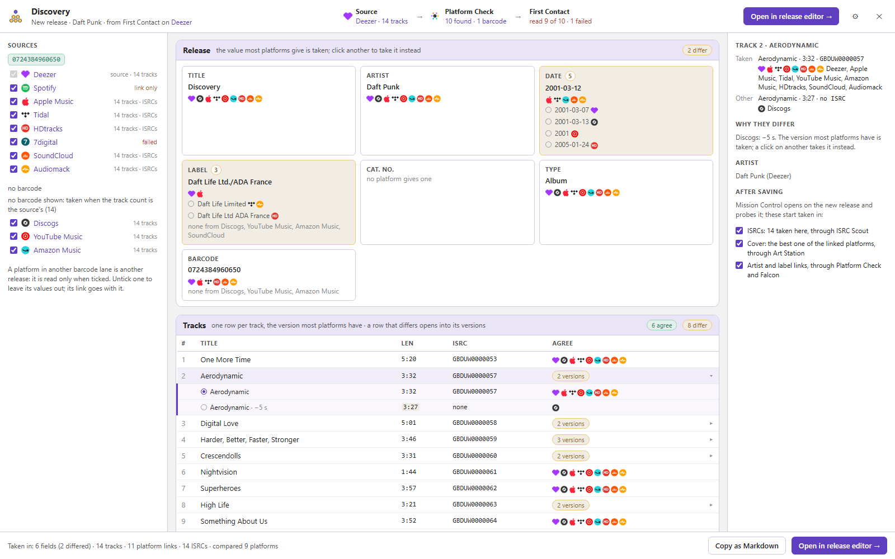

# Mission Control 

One window on a release page that asks the other scripts what the release is missing, lets you review everything they found in one place, and applies it in one go.

- Install: [stable](https://raw.githubusercontent.com/majkinetor/musicbrainz-userscripts/refs/heads/stable/userscripts/mission_control/mission_control.user.js) or [latest](https://raw.githubusercontent.com/majkinetor/musicbrainz-userscripts/refs/heads/main/userscripts/mission_control/mission_control.user.js)
    - Or via bundle: [String Theory](../string_theory/README.md)
- [Changelog](./CHANGELOG.md)
- [View users](https://musicbrainz.org/search/edits?auto_edit_filter=&order=desc&negation=0&combinator=and&conditions.0.field=edit_note_content&conditions.0.operator=includes&conditions.0.args.0=Via+Mission+Control)

> [!IMPORTANT]
> Mission Control finds and applies nothing on its own: each step is done by another script, which has to be installed. [String Theory](../string_theory/README.md) has them all.

## Features

- **[Probe](#probe)**: one click asks every script what is missing, and each card fills in as its answer comes.
- **[Tracks](#tracks)**: a row per track with its ISRCs, recording links, duplicate recordings and credits.
- **[Release and entity links](#release-and-entity-links)**: the platform pages found for the release, its artists and its labels.
- **[Cover art](#cover-art)**: the best cover found, beside the current front.
- **[Release credits](#release-credits)**: what the credit sources have, with a way into Credit Hoarder.
- **[Inspector](#inspector)**: everything found for one track.
- **[Execute](#execute)**: applies what you selected, script by script, in a fixed order.
- **[Consolidate a new release](#consolidate-a-new-release)**: compare an album MusicBrainz doesn't have yet across the platforms, take the best of each into the release editor.

Open Mission Control with its icon in the bottom-right corner of a release page. Right-click the icon for the settings.

## Probe

**↻** in the header asks every script at once. The header and the **Execution order** on the left show each step as it works: what it is doing, and how long since it last reported. A step silent for 20 s turns amber.

| Step                     | Script                                        | Finds                                                  |
| ------------------------ | --------------------------------------------- | ------------------------------------------------------ |
| Release and entity links | [Platform Check](../platform_check/README.md) | platform pages for the release, its artists and labels |
| ISRCs & recording links  | [ISRC Scout](../isrc_scout/README.md)         | ISRCs and track links                                  |
| Cover art                | [Art Station](../art_station/README.md)       | a better front cover                                   |
| Merge suggestions        | [Fusion](../fusion/README.md)                 | duplicate recordings in the release group              |
| Credits                  | [Credit Hoarder](../credit_hoarder/README.md) | per-track credits                                      |

Fusion and Credit Hoarder are slow, so each has a switch under its step: **Auto** fetches during the probe, **Ask** (the default) waits for its **Fetch** button in the Tracks header, **Off** leaves it out.

The album links you select in the Release and entity links card are passed on to ISRC Scout before they are added, so the tracks get their links from those albums too.

## Tracks

One row per track, a column per script: the ISRCs and recording links ISRC Scout found, the duplicates Fusion grouped with the recording, and how many credits Credit Hoarder has.

The Tracks header counts the changes taken in and on how many tracks; each track with one has a bar on its left.

Click a finding to take it in, and again to leave it out; what is taken in is tinted and ticked. New findings start taken in. A link inside a row only opens it. A click anywhere in a track's row also shows it in the [Inspector](#inspector).

To take in or leave out many at once, hold a key while you click: the others follow the one you click.

| Click with | Takes                                                    |
| ---------- | -------------------------------------------------------- |
| Ctrl       | the whole track                                          |
| Alt        | the whole column; on a found link, that platform's links |
| Ctrl+Alt   | everything in the table                                  |

Found links take the same keys with a right-click. Press on an ISRC or a duplicate and drag up or down the column to do the same to every one you pass.

Fusion's count opens what Fusion compared under the row: each recording's artist, release, length, ISRCs, AcoustIDs and open edits, with what differs marked. Once Fusion answers, it looks up the ISRCs and AcoustIDs of each group by itself, one group at a time, and the comparisons fill in as they come. Fusion's icon beside it (*Open in Fusion*) shows the group on Fusion's board. **Expand all** in the Tracks header opens every track's comparison, and **Collapse all** folds them.

## Release and entity links

The platform pages Platform Check found, grouped by the barcode each platform gives: the release's own barcode first, in green, then the others, then the platforms that gave none.

| Mark     | Means                                                                                                          |
| -------- | -------------------------------------------------------------------------------------------------------------- |
| new      | found and not on the release; taken in                                                                         |
| linked   | the release already has it                                                                                     |
| withheld | held back by [link confidence](../platform_check/README.md#link-confidence); take it in by hand if it is right |
| unsure   | may be another artist or label; take it in by hand if it is right                                              |

A link whose track count or format is not the release's is most likely another release: its icon gets an amber dot, and its row says what differs in amber (*10 tracks, the release has 13*). **take all in** leaves those links out; click one to take it in anyway.

A release without a barcode gets a **Barcode** row at the top of *Release* for each barcode the platforms report, each saying where it came from. The one Platform Check is sure of starts taken in: a barcode you pasted, or one reported by a link the release already has, whose track count and medium match the release. A release has one barcode, so taking another in leaves the first out. Execute adds it with the links, in the same edit.

**Artists** and **Labels** list the pages the matched albums name for them. The platforms that found nothing fold into one line of icons. A heading's ✓ count opens the links it already has into rows.

The links are added through [Falcon](../falcon/README.md), out of sight. The card lists each one with its status as it goes; when one fails, **Open Falcon** shows why and lets you retry.

## Cover art

Art Station looks through the platforms the release links for the largest cover, and shows it beside the current front with each one's size. What Execute will do is written under it: enter it as the front and remove the current one, add it beside the current fronts, or nothing when the front already is that cover.

A release without a front cover starts with the cover taken in. Click either image to see both full screen, with **←** **→** between them.

## Release credits

Credit Hoarder's count of credits for each track, from every credit source the release links (Discogs, Qobuz, Deezer, Apple Music). Mission Control only shows them: **Import credits** opens Credit Hoarder on the release's relationship editor with that source, or with all of them, to review and add them there.

## Inspector

Click a track to see, on the right, everything found for it: its ISRCs and where they came from, its recording links (and which are already in MusicBrainz), Fusion's matches and its credits.

## Execute

**Execute** in the header applies what is taken in, step by step in the Execution order; the steps on one line run together. The count on the button is what will be sent. Each card shows its progress, and a step that fails doesn't stop the next one.

Every edit note ends with *Via Mission Control v&lt;version&gt;* and the release.

Click a card's icon or title to switch the card off: it folds to its header, and Execute leaves out what is taken in there. Your selection stays for when you switch it on again.

## Consolidate a new release

For an album MusicBrainz doesn't have yet. On its page on a platform, **Consolidate** in [First Contact](../first_contact/README.md#consolidate) reads it and opens Mission Control over MusicBrainz's empty release editor:

1. [Platform Check](../platform_check/README.md) finds the album on the other platforms. **Sources** on the left groups them by barcode, the album's own first. The platforms in its lane are taken in, and so are those without a barcode that have as many tracks. A platform in another lane is another release, so it is left out until you tick it. If MusicBrainz already has this album (a release one of these links belongs to, with the same barcode, format and track count), a banner at the top names it: add what it lacks there instead of adding the album again. Releases the links belong to that differ in one of those are listed under it as other editions.
2. First Contact reads each platform taken in; the header counts them. Spotify can be read on its own page only, so its link is added but its data isn't compared.
3. **Release** shows each field with the platforms that give each value. The value most of them give is taken, and a tie goes to Platform Check's platform order. Click another value to take it instead.
4. **Tracks** lines the tracklists up. A track the platforms agree on shows their icons. One where they differ in title, ISRC or length (by more than a second) says how many versions it has: click it to see them, and click a version to take it. **N differ** in the header opens or closes them all. A track only one platform has is struck through and left out; click it to take it in, at the end.
5. **Add release** opens MusicBrainz's release editor in this tab with what is taken: the fields, the tracklist with its ISRCs, every taken platform's link, and each artist's pages on all the platforms read, which [Apollo Editor](../apollo_editor/README.md#artist-matching) tries when it matches the artists.

Once you save the release, Mission Control opens on it and probes, for what the editor can't take: the ISRCs taken here (added by ISRC Scout), the best cover (Art Station), and the artist and label links (Platform Check). **After saving**, on the right, chooses which of them start taken in; **Execute** then applies them as on any release.

Click a track to see on the right what each platform gives for it. **Copy as Markdown**, in the **▾** menu beside **Add release**, copies the whole comparison as tables, for an issue or an edit note. **✕** shows the empty editor under it; the corner icon brings Mission Control back.

## Settings

| Setting                                                         | Default |                                                                        |
| --------------------------------------------------------------- | ------- | ---------------------------------------------------------------------- |
| Probe as soon as Mission Control opens                          | off     | no need to click ↻                                                     |
| Reload the release page after an Execute without errors         | off     | shows the result at once; waits until every added link is through      |
| After saving a consolidated release, open Mission Control on it | on      | [probes the new release](#consolidate-a-new-release) for what it lacks |

## Shortcuts

| Key         | Where               |                                                        |
| ----------- | ------------------- | ------------------------------------------------------ |
| right-click | a link in a row     | take it in or leave it out, instead of opening it      |
| Ctrl / Alt  | a click in Tracks   | the whole track / the whole column ([Tracks](#tracks)) |
| drag        | ISRCs or duplicates | take in or leave out every one you pass                |
| ← →         | a cover full screen | the other cover                                        |
| right-click | the corner icon     | settings                                               |
