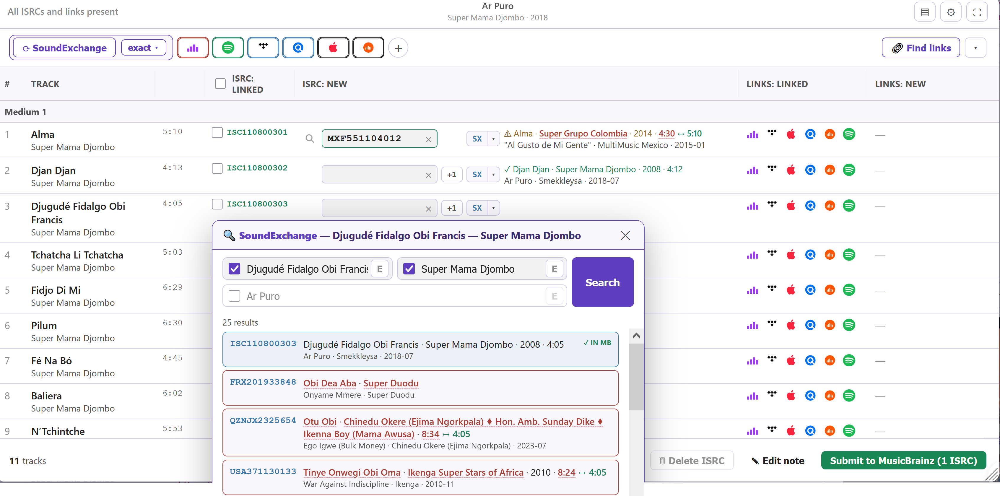

# String Theory — Unified Documentation

*Built 2026-09-01 17:38 · [String Theory README ↗](https://github.com/majkinetor/musicbrainz-userscripts/blob/main/userscripts/string_theory/README.md)*

## Table of contents

1. [Apollo Editor](#apollo-editor)
2. [Art Station](#art-station)
3. [Credit Hoarder](#credit-hoarder)
4. [Group Therapy](#group-therapy)
5. [ISRC Scout](#isrc-scout)
6. [Mammoth](#mammoth)
7. [Platform check](#platform-check)

---

## Apollo Editor

UI and tools for advanced adding and editing of a MusicBrainz release.

- Install: [stable](https://raw.githubusercontent.com/majkinetor/musicbrainz-userscripts/refs/heads/stable/userscripts/apollo_editor/apollo_editor.user.js) or [latest](https://raw.githubusercontent.com/majkinetor/musicbrainz-userscripts/refs/heads/main/userscripts/apollo_editor/apollo_editor.user.js)
    - Or via bundle: [String Theory](../string_theory/README.md)
- [Changelog](../apollo_editor/CHANGELOG.md)
- [View users](https://musicbrainz.org/search/edits?auto_edit_filter=&order=desc&negation=0&combinator=and&conditions.1.field=edit_note_content&conditions.1.operator=includes&conditions.1.args.0=Apollo+Editor)

When you add a release, each track's artist may be set as **plain text with no MBID**, and the recordings are unset. Linking them one by one — searching, picking, occasionally splitting *A feat. B* into two credits — is the slowest part of adding a release. Apollo Editor does the whole tracklist and recording set in one pass and lets you apply the confident matches with one click.

It replaces the native **Tracklist** and **Recordings** editors with two clean, consistent tables with dozens of features. It also makes the **Release Information** tab more functional by suppressing help bubbles and moving external icons to the right column. When adding new releases, the **Duplicates** tab provides a similarity check.

Each takeover is optional and you can flip back to the native editor at any time with the **Original / Apollo** switcher button.

### Features

- **[Tracklist](#tracklist)** — clean artist-picker table with confidence highlighting, change-all-matching scope, split/alias-aware credits, track actions, reordering and keyboard navigation.
- **[Recordings](#recordings)** — side-by-side *Track ↔ Recording* comparison with per-row confidence, character-level diff highlighting, and a suggestion/ISRC-aware recording picker.
- **[Matching](#matching)** — one-click auto-match of artists, recordings and the release label, using the whole release group, with configurable tolerance.
- **[Tools](#tools)** — configurable **Tools** bar (choose/reorder, icon or text, hover-flyout params) plus extra tools, and Revert/Clear for one track or all.
- **[Release Information](#release-information)** — Markdown annotation editor, external links in a right column with a dead-link checker, and a front-cover thumbnail.
- **[Duplicates](#duplicates)** — a red→green **Similarity** score per existing release, expandable to a track-by-track comparison.
- **[Customization](#settings)** — resizable columns, alternate row colours, grid, layouts and match tolerance.
- **Original / Apollo switcher** — every takeover is optional; flip back to the native editor at any time.

### Release Information

**[Settings](#settings)**: *Modify Release information*

Beautification of native page, external links redesign, markdown annotation editor, release cover and array batch removal tools.


- **External links** moved to a right column with a **dead-link checker**
    - **Right-click** a favicon/type to edit it.
    - **Add link (+)** stays a compact **[+]** until clicked, then reads *Paste one or more links*: it accepts **several links at once** and mines URLs out of whatever you paste including full HTML, sorting out duplicates, and setting a link type
- **[Markdown annotation editor](#annotation-editor)** in *Additional information*.
- A **front-cover thumbnail** is positioned under the external links, linking to the release's cover-art page
- Batch removal of array elements - date and labels - using right click on (x) button
- Help bubbles removed

### Tracklist

**[Settings](#settings)**: *Modify Tracklist*

Extremely fast and confident artist matching via multiple mechanisms, advanced tool setup, detailed highlighting, reverting inputs etc.


- **[Auto match artist](#artist-matching)** based on release group, Discogs URL or name
- **Artist selection**
  - Picker with a **confidence** highlight
  - Option to apply pick to **all matching tracks or a single one** (the [Change](#toolbar) in toolbar)
  - **Ctrl-click** a search result to set that artist on every unresolved track
  - Paste an **MBID or a MusicBrainz artist URL** to resolve straight to that artist
  - **Create** unresolved artist (in the background) with multiple fields pre-set (sort, type, external link)
  - **Hover actions**
    - **Split** an artist with a **join-phrase selector**
    - **Delete** split artist
    - **Reorder** artist within split
  - **Aliases** and disambiguation shown in search results and selection
  - **Artist type** icon with a direct link to the artist
  - **Discogs links checking** (with option *Discogs artist link matching*) with quick actions to add them
  - **N unresolved artist** badge with click that positions to the first one
- **Tracks**
  - **Hover actions** - Split & Guess case - left-click to apply to a single track, right-click to apply to every track
  - **Reorder** tracks within a medium with the ⠿ handle.
  - **Keyboard navigation**
- [Tools](#tools) toolbar with native and new tools
- **Highlighting**
  - Changed tracks (left border color)
  - Artist instances in the tracklist
  - All changed artists after picker
  - Pending changes (recordings, artists)
  - [Enlarge Punctuation](#enlarge-punctuation)
  - [Join-phrase spacing](#join-phrase-spacing)
  - Split and splittable tracks
  - Tracks that "Guess case" can affect
- **Expand all media** when release has them collapsed
  - left-click expands single media
  - right-click expands all media
- Table appearance customization: layout, alternate row colors, grid lines
- Pregap, data track and disc id support
- Revert/Clear all inputs

### Recordings

**[Settings](#settings)**: *Modify Recordings*

Side-by-side _Track ↔ Recording_ comparison with a confidence circle per row and inline highlighting of the fields that differ.


- **[Auto match artist](#recording-matching)** based on release group or name and Cutoff settings
- **Recording picker**
  - MusicBrainz suggestions, free-form search, linked "appears on" releases and confidence highlights
  - Paste a **recording MBID** or a MusicBrainz recording URL into the search field
  - Paste an **ISRC** (with or without separators) to resolve it via MusicBrainz — a single match links immediately, several are listed to choose from
- [Update track and recording](#updating-tracks-and-recordings)
  - **Track to recording** — right-click a recording Title/Artist cell (applied on commit)
  - **Recording to track** — right-click a track Title/Artist cell (applied immediately)
- **Highlighting**
  - [Enlarge Punctuation](#enlarge-punctuation)
  - [Join-phrase spacing](#join-phrase-spacing)
- **Expand all media** — a release with many media loads with most collapsed; left-click expands single media, right-click all of them
- Revert/Clear all inputs
- Video recordings show a small video-camera marker next to its name

### Duplicates

**[Settings](#settings)**: *Modify Duplicates*

When release is added, MusicBrainz's **Duplicates** tab lists existing releases you might want to *base your release on* (which means that tracklist and recording mapping will be reused). Apollo augments that native table with **Similarity** attribute.


- A **Similarity** column scores how closely each existing release matches the one you're entering — a folded-title ratio, softened by an **artist** mismatch (×0.75) and a **track-count** gap
- **Click a score** to expand a **track-by-track comparison** beneath the row: each track's *Release* (the existing release) vs *Seeded* (what you're entering) **artist**, **title** and **length**, grouped by medium and with [detailed highlighting](#enable-detailed-highlighting).

The score is computed from the data shown in the native row (no extra requests); the comparison fetches the existing release's tracklist on demand when you open it.

### Annotation editor

**[Settings](#settings)**: *Modify annotations with Markdown*

Edits the [annotation](https://musicbrainz.org/doc/Annotation) as **Markdown** with a live preview. It runs both in the release editor's *Additional information* section and on the standalone **Edit annotation** page for all supported entities.


**Toolbar options**

- **Preview** — a live split view: editor on the left, the annotation rendered updating in real time on the right
- **Clear** — remove all markup from text area
- **Markup** —  switch between editing as Markdown and the MusicBrainz markup
- **Help** — hover for a syntax and shortcut cheatsheet.
- **Maximize** — expand the editor to fill the screen (Esc restores)
- **History** — the annotation's previous versions; select one to display its rendered annotation, with a **↶ revert** button that loads that version back into the editor with markup reconstructed from the rendered HTML

**Editing**

- **Unnamed MusicBrainz entity links are named automatically** — MB `[url]`/`[url|]`, Markdown `[]()`, or a bare URL get the entity name (fetched from the API).
- **Enter** continues the current list; **Tab** on a selection makes a bullet list (Tab again → numbered, again → bullet…); **Shift+Tab** removes the list marker.
- **Ctrl/Cmd+B / +I** bold/italic — wraps the selection, or surrounds the word under the cursor.
- All edits are **undoable** (`Ctrl+Z`).

The Markdown ↔ MB conversion covers links, bold/italic, headings, nested bullet/numbered lists, fenced ` ``` ` ↔ 8‑space code, rules, and encodes a non‑link `[x]` so MusicBrainz doesn't read it as a broken link.

### Tools

Apollo supports all native tools and adds new ones:

1. Native tools: [Track parser](https://musicbrainz.org/doc/How_to_Add_a_Release#The_Track_Parser_(Manual_entry)), Swamp, Reorder, Guess feat, [Guess case](https://musicbrainz.org/doc/Guess_Case)
1. [Search & Replace](#search--replace)
1. [Pattern parser](#pattern-parser)
1. [Length parser](#length-parser)
1. [Resize columns](#resize-columns)
1. [External tools](#external-tools)

#### Customization

Native tools are hidden and replaced by a configurable **Tools** bar. It is highly customizable, supports all native tools, some 3rd party tools and adds few new ones.


The **Tools ▾** label opens a menu of the tools that *haven't* been put on the bar. Picking a tool from that menu uses it right away; a tool with parameters joins the bar **for the current session** so its controls are reachable — it returns to the menu next time (use Customize to keep it). Parameterless tools (e.g. *Guess feat.*) just fire on click.

**Customization** lets you:

- **Show tool on the bar** — select which tools sit on the bar and leave the rest in the **Tools ▾** menu
- **Reorder** — drag the handle to set the order
- **Icon / text** — toggle the `[icon]` and `[text]` segments to show either or both

> [!TIP]
> **Collapsing a tool's parameters** — right-click a tool's name to collapse it to just the name (dotted underline); its parameters then **fly out on hover** (and stay open while you're typing in them). Right-click again to pin them back inline. The collapsed/expanded choice is remembered per tool.

#### Search & Replace

Search a string within track titles and replace it. Clicking the tool name starts a fresh session with the current options applied and the fields cleared. Save common patterns under a name and reuse them from the **★** popup. Last 5 historic items are saved automatically. Each saved pattern row has hover actions: **⛓** add/remove it in a chain, **✎** rename, **✕** delete.

- **Chains** — combine several saved patterns into a named **chain** that runs them all in one click, in order (e.g. *All Quotes* = *Quotes* then *Single quote*). Use **＋ Add chain** to create one, then **⛓** on a pattern to add it (a pattern can belong to several chains).
- **Default** — mark one pattern **or** chain as the default with **◉**; it's shown highlighted in the list and is applied automatically the first time you open the Tracklist in a session (with the usual "N titles replaced" toast).
- **Import / Export** — the button in the popup header opens a JSON view of your saved patterns + chains + the default marker (history excluded); paste and **✓ Import** to replace the set. The **History** section (recent patterns) is collapsed by default — click it to expand.


#### Resize Columns

Set column sizes to predefined variants (Fit, Centered, Default).

#### Pattern parser

Fill a medium's tracklist from pasted text using a **pattern**. Type a pattern, paste the list, review the live preview, apply. Like the native parser it **opens seeded with the current tracklist** (using pattern `#. T - A (L)`), so you can also use it to bulk-edit what's already there.


##### Tokens

The following tokens can be used in constructing pattern (case sensitive):

| Token |   Meaning    |
| ----- | ------------ |
| `#`   | Track number |
| `T`   | Title        |
| `A`   | Artist       |
| `L`   | Length       |
| `M`   | Medium       |
| `-`   | Separator    |
| `_`   | Skip noise   |

Anything else is a literal, whitespace is elastic, and a separator (`-` `–` `—` `/` `:`) matches any one of the set (so `# A - T` also parses an en-dash or slash). A capital letter is a token only when it stands alone; prefix with `$` to force it (`Track: $T`) or to spell one out.
Text fields split on the **first** separator (`A - T` → artist = up to the first `-`, title = the rest) — flip the **split: first / last** toggle to split on the last instead.

**Examples:**

- `#. T` → `1. So What`
- `# A - T (L)` → `1 Miles Davis - So What (9:22)`
- `# A - T (_` → drops a trailing `(original edit)`.

**Slices**

For delimiter-free fixed-width text.

A token can carry a 1-based char range — `T[6-]` (6th char to end), `T[6-20]`, `T[-5]` (first 5), `T[~3-]` (last 3) — or a **`[from:to]`** form that runs from `from` up to (excluding) the first `to` character. `from` is a position or a character; `to` is a character:
- `#[1:.]` = position 1 to the first `.` (`12. Title` → `12`), also `#[1:-]`, `#[1: ]`
- `L[(:)]` = from the first `(` to the first `)` (`So What (9:22)` → `9:22`)
- Prefix a character with `~` for the **last** occurrence instead of the first — `L[~(:)]` on `Hide Me (Bop remix) - Stillhead (4:20)` still finds the real length (`4:20`), where plain `L[(:)]` would grab the title's own `(Bop remix)` first

The preview is one row per pasted line: a **match dot** (green = matched · amber = matched via a per-row pattern · red = no match), the raw text, and the extracted **# / artist / title / length**. A messy line can get its **own pattern** in the row's `pattern` cell without disturbing the rest. **Apply** writes only the fields the pattern produced (so a title-only pattern won't touch lengths); its **▾ menu** applies a single field (only titles / artists / lengths / #s) or adds the missing tracks first when you pasted more lines than the medium has.

##### Freezing

For a tracklist where no single pattern fits every line, **🔒 Freeze matched** locks the current pattern onto every row that's still on `«default»` and already matches — those rows keep that pattern from then on. Then adjust the pattern to solve more rows and freeze again; repeat until everything's matched, without the earlier fixes coming undone.

For a one-off messy line you don't want to write a pattern for, **select the span** in its **raw** cell — a little bar pops up (`#` · `A` · `T` · `L` · `✕`); click a field to bind that span to it (it writes a `T[a-b]`-style slice into the row's pattern), or `✕` to clear the row. Both the main pattern box and each row's pattern cell carry a small **✕** to clear them.

#### Length parser

Fill a medium's track **lengths** from any text — the native track parser wants a specific format, but lengths copied off a site (Bandcamp, foobar2000, …) rarely fit (track numbers land on their own lines, etc.). It **greps every duration out of the text** and lets you review the result before writing anything.

After invoking a tool, several options are offered:


- **Enter text** — type or paste a tracklist into the box.
- **Paste from clipboard** — reads the clipboard directly.
- **Parse from external link** — a **favicon per page linked on the release**; click one and it **fetches that page and reads its text right away** (no extra picker step). It narrows to the smallest part of the page that still holds at least a full tracklist's worth of durations, so nav/player/footer noise is skipped (e.g. it pulls all 20 lengths straight off a Bandcamp album page). When you Apply, the **source URL is added to the edit note**. (If a favicon can't load, it falls back to a clickable hostname chip.)

Once you've picked a source, a **‹ Sources** button in the header returns you to the chooser — handy when a fetched page has no parsable text (e.g. Spotify) and you want to try another link:


Whichever source, it detects everything shaped like a time — `5:50`, `1′23″`, `1'23"`, `1:02:03` — and **ignores** track numbers, titles, years and other noise. The detected times appear as an **editable list**, each next to the track it will fill (item 1 → track 1, …). Because alignment is by order:

- **✕** deletes a row (everything below shifts up);
- **+** on a row inserts a length below it (everything shifts down) — for a duration the parser couldn't see (e.g. a single-digit-seconds `1:2`); **+ add length** appends;
- click a value to **edit** it.

**Invalid** times (e.g. `99:99`) are highlighted red and surface a **prominent badge in the panel header** — they **must be fixed or deleted**, and **Apply** stays disabled until the list is clean. A counter shows *N lengths ↔ M tracks*. **Apply** writes the lengths to the medium's tracks in order (nothing is written until then; **Esc** cancels, **Ctrl+Enter** applies). The panel is **centred, draggable by its header, and resizable**; on a multi-medium release, pick the medium in the header.

<!-- source: discussion #451 / issue #455 -->

#### External tools

Those tools need 3rd party userscript:

- **Guess punctuation** — runs kellnerd's [guess-unicode-punctuation](https://github.com/kellnerd/musicbrainz-scripts#guess-unicode-punctuation) (curly quotes, dashes, ellipses…) over the release. **Requires that script installed** — the tool only appears when it is.

#### Tools integration

Apollo can surface a fire-and-forget button that *another* userscript adds to the page, so you can use it without leaving the Apollo view. Such a tool behaves like any built-in one: it shows in the **Tools ▾** menu and in **Customize…**, where you can pin it to the bar, reorder it, and choose icon/text (the choice persists). It only appears while the providing script is present. Two ways in:

**Recognised buttons** — Apollo adopts a known button *unmodified*, matched by its visible text (e.g. **Guess punctuation** above). Adopting another is a one-line registry entry in Apollo.

**Convention (for script authors)** — tag any element `class="apollo-tool"` and Apollo offers it, no Apollo change needed:

```html
<button class="apollo-tool" data-apollo-label="My tool" data-apollo-icon="★">…</button>
```

- `data-apollo-label` *(optional)* — menu/button label (falls back to the element's text).
- `data-apollo-icon` *(optional)* — a short text glyph **or** a `data:` / `http(s)` image URL (rendered as a small image); default 🔧.
- `data-apollo-id` *(optional)* — stable id for the saved bar/menu placement (falls back to the element's `id`, then a slug of the label).

Activating either kind **clicks the element**, then Apollo re-reads the tracklist so its grid reflects the change. This fits tools that are **parameterless or pop their own settings on click** (e.g. a Track parser); tools that need their controls rendered *inline* in Apollo's bar aren't supported.

### Matching

Apollo can automatically match unresolved **artists** and **recordings**. Both work the same way: a *Match* button, a per-row **confidence**, and the single best candidate applied automatically while anything uncertain is left out.

If _Auto-match on start_ is enabled in the [settings](#matching-options), matching will be automatically started on entering add/edit release page.

#### Artist matching

Apollo resolves each unmatched track artist in stages, most-confident first:

1. **Releases from same release group** — it pulls the per-track credits (with MBIDs) from other versions of the album and matches by track title. Other editions usually credit the same songs to the same artists, so this resolves most cases at the highest confidence — especially various-artists compilations.
2. **Exact identity (name or alias)** — an alias is just an alternative name, so name and alias are resolved by **one** check: the artist is linked confidently only when **exactly one** MB artist carries the credited string as its name *or* an alias. This is alias-aware, mirroring MusicBrainz's own [duplicate-artist](https://musicbrainz.org/report/DuplicateArtists) check — so a name that is *also* another artist's alias counts as **ambiguous** and is left for you to pick, not guessed. The badge shows **NAME** or **ALIAS** to say which matched (same confidence either way). It also catches an exact name the fast search under-ranks below a look-alike (*Tee Vee* below *Tee-vee*) and an alias-only credit (*Don Abi* → the artist named *Abiodun*), neither of which the plain name index resolves on its own.
3. **Existing artist credits (co-occurrence)** — when there's *no* unique exact identity (a common name several artists share, a featured "Joni", "Eva", …), Apollo asks MusicBrainz for a recording that credits that name **alongside an artist already known on this release** — a split co-artist or the release artist. If exactly one artist has been co-credited that way, it's the answer, applied with a magenta **CRED** badge. Only an exact credited-as / name hit counts — no fuzzy matching — and a tie is surfaced as candidates to pick from rather than guessed.

Anything none of these resolve is left as a low-confidence top candidate for you to confirm or change.

Each resolved artist is tagged by how it matched (release-group, exact name, exact alias, credit co-occurrence, pre-existing, or manual).

**Confidence levels**:

1. 🟢 Green colored artist box means the artist was matched confidently (release-group, unambiguous exact name or alias, or credit co-occurrence).
1. ⚪ White search box means artist is unresolved or low-confidence, for user to pick; these are what the "N unresolved" counter counts and what clicking that badge jumps to.

#### Discogs artist links

When the release carries a **Discogs link** (read from the page), Apollo uses it for artists — controlled by the *Discogs artist link matching* [setting](#matching-options) (on by default).

##### Match by URL

Before the name search, each track artist is matched by its Discogs URL (taken from the release's Discogs tracklist) against MusicBrainz's URL relationships — a strong, human-verified signal. A single linked MB artist is applied directly with a teal **DISC** badge; several linked artists are offered as candidates to pick from.

This includes **featured artists** split out of the title. Discogs credits them as an extra-artist (not a main track artist) whose role varies — *Featuring* on some releases, *Vocals* / *Backing Vocals* / *Rap* / *MC* on others — so Apollo reads **any performing role** (vocals, rap, voice, performer, narration…; not producers, remixers or instrumentalists) and matches a feat slot by its Discogs artist link, keyed to the slot's credited name, by title or (when titles differ but the track counts agree) by position. That link is often the only reliable bridge, since the split name is frequently just an alias of the MB artist.

##### Adding link

For a slot whose Discogs URL is known, the artist-type icon becomes an actionable Discogs icon when there's something to do — click it to act:
  - unresolved slot → **teal 🔗**: creates the artist seeded with the Discogs link (same as `＋`);
  - matched artist with **no** Discogs link → **teal 🔗**: adds it (opens the artist's edit form pre-seeded, confirmed on return);
  - the Discogs URL already links a **different** MB artist (conflict) → **amber ⚠**: clicking still adds it to this artist, but you're warned which artist it currently points to;
  - the artist already links a **different** Discogs page than the release credits (mismatch) → **amber ⚠**: the tooltip names both pages, and clicking adds the release's link to the artist anyway. A mismatch often means the wrong artist was matched, so it's worth a look first.
- **Badge.** A teal **🔗 N links** badge in the toolbar counts the artists whose Discogs link needs attention — **missing + mismatched** (the tooltip breaks it down). It stays until they're resolved; each click steps to the next such track and focuses its credit field. Adding a link updates every track crediting that same artist at once.

Already-linked artists are verified for free via MusicBrainz's internal entity endpoint, so the rate-limited URL lookup only runs for artists actually missing a link — a fully-linked release is near-instant. Clearing or reverting all artists doesn't trigger a re-check (it runs again when you Match).

#### Recording matching

Apollo fetches **every recording in the release group in one request**, indexes them by title, and matches each track **locally** — choosing the highest-confidence candidate (title + artist + length). It only falls back to a per-track MusicBrainz lookup for the tracks the release group can't satisfy. A full release therefore matches in roughly one fetch rather than one request per track.

**Matching by duplicates (position + similarity).** A title-only match misses when editions word the same track differently (*Salongo Part 1* vs *Salongo, Pt. 1*, *Part 1* vs *Pt 1*). So when the title match doesn't clear the cutoff, Apollo also looks at the **same position** across the release's other editions — and, if those come up short, across releases MB holds under the *same title + artist* in **other release groups** (possible duplicates). A candidate from that slot links only when its title is **similar enough** to the track (≈60% by edit distance, or one contained in the other) *and* its length agrees — so a differently-worded duplicate resolves while an unrelated song that merely shares a slot in a divergent edition does not. It reads each edition's tracklist by position in one request and only reaches outside the RG when the editions don't answer.

*Credited as* values on track and recording don't influence matching.

**Confidence levels**:

| Color |     Meaning      |                               Description                               |
| :---: | ---------------- | ----------------------------------------------------------------------- |
|   🔵   | Exact            | All fields are the same                                                 |
|   🟢   | Tolerance        | Matches within tolerance defined in [settings](#matching-options)       |
|   🟡   | Near             | A single field differs, or the length gap is 3–15s (a near-miss)        |
|   🟠   | Low              | Two fields differ or the length gap alone is >15s (substantially wrong) |
|   🔴   | Very low         | All three differ and the length gap is >10s (almost certainly wrong)    |

The *Cutoff* option in the recording toolbar sets the acceptable confidence.

#### Updating tracks and recordings

When a track's title or artist differs from its linked recording, you can copy the track's value down to the recording (applied when you submit the release — the same as the native checkboxes). Right-click the recording-side **Title** or **Artist** cell:

| Gesture | Action |
|---|---|
| **Right-click** | Toggle copy for that one cell |
| **Ctrl + right-click** | Toggle both fields (that differ) on the row |
| **Alt + right-click** | Toggle that field down the whole column (every differing row) |
| **Ctrl + Alt + right-click** | Toggle both fields on **every row** — the whole side of the table (#443) |

While a copy is on, the cell previews `→ New ` followed by the recording's ~~original~~ value, struck through. Cells that offer a copy carry a subtle underline; a real mismatch stays red.

This mirrors MusicBrainz's **native** update checkboxes exactly — so a copy is offered whenever the native editor would show its checkbox, **including casing-only differences** that Apollo's match tolerance / *Ignore casing* setting would otherwise treat as a match. The tolerance settings still drive the confidence colouring; they no longer hide the copy. Right-clicking a recording cell with no difference does nothing (the browser's context menu is suppressed there).

The same gestures work on the **track side** too (setting the track from its recording), applied immediately. Because the two sides copy in opposite directions, **Ctrl + Alt** covers one side per gesture — run it once on a recording cell and once on a track cell to sweep the whole table.

### Toolbar

| Control | Default | What it does |
|---|---|---|
| **Change** | all matching tracks | Scope of **every** artist action (pick, *Credited as*, join, add/remove/reorder/split): apply to just the edited track, or propagate to every track sharing the same artist credit (whole-credit match, like MB's native "change all matching tracks") |
| **⚡ Match** | — | Match all still-unresolved track artists or recordings (used when *Auto-match on start* is off)|
| **▾** | — | **↺ Revert all** — every track back to page-load state<br>**✕ Clear all** — empty all artists in tracklist or set new recordings|
| **Tools** | — | The tools you choose, each shown at its place on the bar. Tools you don't put on the bar live under the **Tools ▾** menu, which also holds **Customize…** |
| **Cutoff** | 🟡 near | Matches only records at or above the chosen confidence level and leave other unmatched |

### Settings

Accessed using the **⚙** button on the interface switcher button **Original / Apollo**. Settings are saved via the userscript manager's own storage — covered by its backup/restore and cross-browser sync, unlike a plain browser localStorage save — and persist across releases.

#### General

If any of the following options is on, script replaces the native interface elements for the Apollo versions:

- [Modify Release Information](#release-information)
- [Modify Tracklist](#tracklist)
- [Modify Recordings](#recordings)
- [Modify Duplicates](#duplicates)
- [Modify annotations with Markdown](#annotation-editor)
- [Modify header and footer](#modify-header-and-footer)
- [Zen editing](#zen-editing)
- [Auto confirm release submissions](#auto-confirm-release-submissions)

##### Modify header and footer

Hide the native step-tab row and footer and show a compact step switcher instead.

##### Zen editing

Hides MusicBrainz header and footer for minimal distraction.

Hide everything above the Apollo nav bar - the site header, release title and entity tabs and the page footer — leaving just the Apollo interface.

The release title / artist (with version count) is shown in the navigation bar.

##### Auto confirm release submissions

When another site *seeds* the Add/Edit-release form, MusicBrainz shows a confirmation page before opening the editor; Apollo clicks its submit button so you skip that step (integrating [chaban's *Auto click confirm form submission*](https://greasyfork.org/en/scripts/536999) script). Acts only on that seed-confirmation page; add `?skip_confirmation` to a seed URL to bypass it once.

The interface modifications (everything above except *Auto confirm*) are toggled on/off together using the switcher button.

#### Matching options

| Option | Default | What it does |
|---|---|---|
| **Auto-match on start**| Off<br>Off<br>On<br>On | **Tracklist** - Matches artists automatically when the page loads<br>**Recordings** - Matches recordings automatically when the page loads<br>**Label** - When the release's label name has exactly **one** exact MusicBrainz match, selects it automatically on load. Ambiguous names (e.g. *Columbia* → several labels) and names with no exact hit are left for you to pick<br>**Artist** - Same for the release **Artist** field: a seeded/typed release artist with exactly **one** exact MusicBrainz match is selected automatically on load; ambiguous or no-hit names are left for you to pick|
| **Discogs artist link matching**| On | When the release has a Discogs link, match track artists by their [Discogs URL](#discogs-artist-links) (before the name search) and offer to add/create missing links|
|**Length tolerance**|5| Allow a length gap within N seconds (use `0` for exact)|
|**Title tolerance**|1| Allow up to N differing characters in the title (use `0` for exact)|
|**Ignore casing** |On|Case / accent / spacing-only differences don't count|
|**Ignore punctuation**|On| *& → and*, brackets, quotes, dashes and dots are stripped before comparing|
|**Enable detailed highlighting**| On | Highlights the exact differing characters|

##### Enable detailed highlighting

 Highlights the exact **differing characters** in a mismatching **title and artist** (including a casing- or punctuation-only difference the match would otherwise tolerate), instead of the whole field, and shades a **length mismatch** by how large the gap is (faint under a second → solid red past five).

For artists this works at two levels: a **different linked artist** is boxed whole, while a **credited-as** difference on the *same* artist (e.g. *DJ Vadim* vs *Vadim*) has just its differing characters highlighted — the link is kept and matching is unaffected (credited-as never influences matching), so you can *see* the difference without it being treated as a mismatch (#444).

#### Appearance

Applied to **both** tables (Tracklist and Recordings).

| Option | Default | What it does |
|---|---|---|
| **Row layout** | normal | Row density: `compact` (tight) · `normal` · `cozy` (airy). |
| **Alternate row colors** | Off | Tints every other row (and deepens the matched-box green on alternate rows). |
| **Show grid** | Off | Toggle grid lines on rows and/or columns |
| **Enlarge punctuation** | 3px | How much to enlarge confusable characters, in pixels (`0` = no enlargement; the invisible-char / missing-space markers still show under [detailed highlighting](#enable-detailed-highlighting)) |

### Keyboard

|         Key         |            Description            |
| ------------------- | --------------------------------- |
| Down, \<ENTER\>     | focus cell in the next row        |
| Up, SHIFT+\<ENTER\> | focus cell in the previous row    |
| Tab                 | focus cell in the next column     |
| SHIFT+Tab           | focus cell in the previous column |

By default, moving between cells keeps the **caret column** where it was (clamped to the destination's length) instead of selecting the whole field — so you can keep typing or fix casing at the same spot rather than overwriting. Turn off **Keep caret position on row navigation** (gear → Appearance) to restore the old behavior, where arriving on a cell selects the whole field so the next keystroke replaces it.

#### Enlarge punctuation

When [detailed highlighting](#enable-detailed-highlighting) is on:

- Every character that is confusable (a straight `'` `"` `-`, a curly `’`, an en/em dash) is **enlarged**.
- Every invisible character (a no-break or zero-width space, a tab etc.) is rendered as a **visible glyph** with a highlight — so a missing / wrong space can never hide.
- Tooltip shows its Unicode name and exact codepoint.

The _Appearance → Enlarge punctuation by N px_ setting controls **only the enlargement size** — `0` means *no enlargement*, **not** off: the invisible glyphs and missing-space markers still show (they're part of detailed highlighting). To turn the marking off entirely, uncheck **Enable detailed highlighting** (#443).

On the **Tracklist** tab the **Title** can't be styled while it's an editable `<input>`, so it's shown as styled read-only text that **drops into the native input the moment you click or tab into it**.

##### Join-phrase spacing

A join phrase between two artists should have a space on both sides (`" & "`). Where one is **missing** a highlighted `␣` is drawn (`Gandhabba &␣Render`), and a join phrase **missing entirely** between two artists shows `␣?␣`

Feature works on both the [Recordings](#recordings) and the [Tracklist](#tracklist) artists where the join input is outlined and flagged.

Shares the _Enlarge punctuation_ master switch (`0` = off).

##### Join-phrase presets — keyboard (#419)

The join input's preset dropdown (▾) is fully keyboard-driven:

| Key | Action |
| --- | ------ |
| *typing* | opens the dropdown filtered to matching presets (`fe` → `feat.` / `featuring`), top hit pre-highlighted |
| <kbd>↓</kbd> / <kbd>↑</kbd> | open the list / move the highlight (wraps) |
| <kbd>Enter</kbd> | pick the highlighted preset (or commit the typed value when the list is closed) |
| <kbd>Esc</kbd> | close the list |

### Persistence

These are remembered automatically as you use the UI:

- **Column widths** — drag a column border to resize; reset/auto-fit via the **Resize Columns** tool.
- **Suggestions collapsed** — the picker remembers whether its *suggestions* section is collapsed.
- **Tools bar** — which tools are on the bar, their order, each tool's icon/text choice, and whether its parameters are collapsed.
- **Apply mode**, **Cutoff**, and all dialog options above — saved on change.

---

## Art Station

A cover/event-art editor for MusicBrainz: one gallery to view, group, sort, reorder, retype, comment, remove, download, add and source a release's cover and event art — all staged, then applied on **Enter edit**.

- Install: [stable](https://raw.githubusercontent.com/majkinetor/musicbrainz-userscripts/refs/heads/stable/userscripts/art_station/art_station.user.js) or [latest](https://raw.githubusercontent.com/majkinetor/musicbrainz-userscripts/refs/heads/main/userscripts/art_station/art_station.user.js)
    - Or via bundle: [String Theory](../string_theory/README.md)
    - [picker](../art_station/as_picker/README.md) helper script: [install](https://raw.githubusercontent.com/majkinetor/musicbrainz-userscripts/refs/heads/main/userscripts/art_station/as_picker/as_picker.user.js)
- [Changelog](../art_station/CHANGELOG.md)
- [View users](https://musicbrainz.org/search/edits?auto_edit_filter=&order=desc&negation=0&combinator=and&conditions.0.field=edit_note_content&conditions.0.operator=includes&conditions.0.args.0=Art+Station)


It runs on a release's **Cover art** tab and an **Event art** tab, replacing the native list with a gallery. The gallery is the staged state, and **Enter edit** makes MusicBrainz match it.

### Features

- **Gallery** — adjustable thumbnail size, grid or detailed view, group by [type](https://beta.musicbrainz.org/doc/Cover_Art/Types), and sort by position / type / dimensions / newest.
- **Reorder** by dragging a single cover or a whole selection together.
- **Select** with right-click or right-drag.
- **[Single or bulk actions](#single-or-bulk-actions)** — set type, set comment, remove, download (zip) and reports, on one cover or the whole selection.
- **[Add images](#add-images)** — file drop, URL (Enhanced Cover Art Uploads), MH Covers, and reverse-image search.
- **[Full-screen viewer](#full-screen-viewer)** — navigate, zoom, mouse-follow pan, slideshow, set type/comment, delete.
- **[File names ⇄ types](#file-names--types)** — cover types and file names round-trip, so a downloaded archive re-adds with types intact.
- Parallel operations on final commit

Group by type view:


Detailed view (supports Mammoth in comment section):


### Single or bulk actions

Works on one cover or the whole selection:

- **Set type** — tick checkboxes for one or more types, or **right-click a type to set *only* that one and close**.
- **Set comment** — auto-focuses the next comment field on `<ENTER>`.
- **Remove**  — mark for removal.
- **Download** — as a zip archive, files named by type so they round-trip (see [File names ⇄ types](#file-names--types))
- **Reports** in HTML or Markdown — inline, captioned, or a detailed table (position · type-named file · resolution · size) that doubles as the archive `README.md`.

### Add images

- **File drop** — choose local files and upload to the Cover Art Archive in parallel; the **type is guessed from the file name** (see [File names ⇄ types](#file-names--types)).
- **Folder upload** (#359) — drop a **folder** on the gallery, or **Shift-click** the drop zone to browse one. It stages the folder's image/PDF files recursively, but bounded: **one level of subfolders deep** and up to **100 files** (a stray huge tree can't flood the gallery).
- **URL link** — uses [Enhanced Cover Art Uploads](https://raw.github.com/ROpdebee/mb-userscripts/dist/mb_enhanced_cover_art_uploads.user.js) (must be installed) to fetch covers from Discogs, Apple, Spotify, Bandcamp…
  The **`URL (N)`** toolbar button opens a panel listing every source this release offers — its linked platforms plus any [registered providers](#plugin-api) — with one **⬇ Import from …** per source and an **⬇ Import all N sources** below them. **Right-click the button** to run *Import all* straight away without opening the panel ([#558](https://github.com/majkinetor/musicbrainz-userscripts/issues/558)); with nothing to import it opens the panel instead, where **By URL** still is.
- **[MH Covers](https://covers.musichoarders.xyz)** — pick a cover and it drops into the gallery as a staged new cover.
- **Reverse-image search** (the 🔍 on each cover) — look for a higher-resolution copy on Yandex / Google Lens / TinEye / Bing. With the optional [Art Station Picker](../art_station/as_picker/README.md) companion installed, click the better copy on the results (or any site reachable from there) and it's sent straight back into the gallery.
- Fresh covers shown faster than the native UI.

### Full-screen viewer

- Arrow keys for navigation (left/right) and zoom (up/down), with zoom level remembered.
- **Mouse-follow pan** — when zoomed, just move the mouse to pan across the image (no click-and-drag). On by default; toggle in **Setup**.
- Slideshow.
- Set comment and type.
- `<Delete>` key to remove the image.

See [Shortcuts](#shortcuts) for the full key/mouse list.

### File names ⇄ types

Cover types and file names round-trip, so a downloaded archive can be re-added later with types intact.

**On add** (drop / pick / source) — when an image has no type, it's guessed from the file name (toggle in ⚙ setup):

|  Type   |                         Name contains                          |
| ------- | -------------------------------------------------------------- |
| Front   | `front`, `folder`, `cover`, `frontal`, `recto`                 |
| Back    | `back`, `rear`, `verso`                                        |
| Booklet | `booklet`, `inlay`, `insert`                                   |
| Medium  | `cd`, `disc`, `disk`, `vinyl`, `medium`, `label`, `side a/b/…` |

The following types are matched by their name:

- Release: `tray`, `obi`, `spine`, `sticker`, `liner`, `poster`, `matrix`, `runout`, `track`, `top`, `bottom`, `raw`, `unedited`, `watermark`
- Event: `flyer`, `ticket`, `setlist`, `banner`, `program`, `schedule`, `map`, `logo`, `merch`

Matching is word-boundaried and order-aware, so `back cover` → **Back** (not Front) and an album titled *Super Disco Pirata* → no type.

#### File names in download archive

Each file is named 
* `<NN> <type1>,<type2>,..<typeN> <comment>.<ext>`

where `none` is used where no type is given 

**Example**: `09 front,sticker Front cover with the sticker.jpg`.

### Comment memory (Mammoth)

The comment field in the **detailed view** carries the `mmth-pin` class, so if you also run [Mammoth](../mammoth), its **baby field-memory** attaches to it automatically — a small 🦣 pin lets you save and recall past comments (key `art-station-comment`). No configuration; it's Mammoth's [documented cross-userscript convention](../mammoth/README.md#using-mammoth-from-another-userscript). Art Station's own `comment…` preset list still works independently when Mammoth isn't installed.

### Applying changes

Every change is staged. **Enter edit** opens a panel that lists the pending operations and submits them as real MusicBrainz edits — remove, retype/comment, reorder and new-image uploads — each crediting *Art Station* in the edit note.

- Edits, removes and uploads all run in **parallel** (upload + register per image); a single **reorder** edit runs **last** and sets the final order, so register order doesn't matter. If a run has failures, **Repeat** re-runs just the failed ops — and re-runs the reorder too, so a retried upload still lands in place.
- A shared **edit note** and **make votable** apply to every edit.
- While a run is in progress the dialog can't be dismissed by clicking outside, and leaving the page warns first — so edits are never silently cut off. Use **Cancel** to abort.

### Plugin API

Another userscript can register its own cover/event-art **provider** — it appears as an `⬇ Import from <name>` button in the **Source** popover, alongside the built-in ECAU platforms, and its images stage into the gallery like any other. This lets a site-specific script (e.g. one that's already logged in to a fan site) do the fetch with its own session and hand the bytes to Art Station.

```js
window.ArtStation?.registerProvider({
  name: 'SpringsteenLyrics',          // required — the button label
  id:   'springsteen',                // optional — de-dupe key (defaults to name)
  icon: 'https://example.com/favicon.ico',  // optional — badge favicon (a missing/404 one is fine)
  match: 'springsteenlyrics.com',     // optional — string | string[] | RegExp | (url)=>boolean
  async run(ctx) {
    // ctx = { mbid, entity:'release'|'event', artist, title, url, link, links }
    //   link  = the first release/event external link your `match` hit (links = all of them)
    const html = await fetchWithYourSession(ctx.link);
    return [
      { url: 'https://…/front.jpg', types: ['Front'], comment: '' },
      // or { dataUrl }, or { blob, source } — see below
    ];
  }
});
```

- **`match`** gates the button: it only shows when the release/event actually links a matching URL, and those link(s) are passed to `run()` as `ctx.link` / `ctx.links`. Omit `match` and the button always shows.
- **`run(ctx)`** returns one item or an array of items. Each item is `{ types?, comment? }` plus **one** image source:
  - **`url`** or **`dataUrl`** — Art Station fetches/decodes it in its own realm (most robust; prefer this).
  - **`blob`** (or `file`) — bytes your script fetched itself (e.g. behind an authenticated session). Also include **`source`** (the image URL) so Art Station can re-fetch if a cross-sandbox blob can't be used directly.
- Works on both **release cover art** and **event event art** — the button, matching and `ctx.entity` are entity-aware.
- If a manager isolates `window` between userscripts, register via the event fallback instead: `document.dispatchEvent(new CustomEvent('artstation:register-provider', { detail: provider }))`.
- When Art Station isn't installed, `window.ArtStation` is simply absent, so the `?.` call is a no-op.

### Shortcuts

**Gallery** (when a cover is focused — arrow to it first):

| Key | Action |
|---|---|
| `←` `→` `↑` `↓` | move the cursor between covers |
| `Enter` | open the focused cover full-screen |
| `Space` | select / deselect the focused cover |
| `Delete` | mark the focused cover for removal (undo in the grid) |

**Full-screen viewer:**

| Key | Action |
|---|---|
| `←` `→` | previous / next cover |
| `↑` `↓` | zoom in / out |
| `Enter` | edit the comment |
| `D` | download the original |
| `Delete` | mark the cover for removal |
| `P` | play / pause the slideshow |
| `Esc` | close (dismisses an open popover or comment edit first) |

**Mouse:**

| Gesture | Action |
|---|---|
| **right-click the `URL (N)` button** | import from all N sources at once, skipping the panel ([#558](https://github.com/majkinetor/musicbrainz-userscripts/issues/558)) |
| right-click / right-drag | select / paint-select covers |
| scroll wheel over the size slider | resize thumbnails |
| **hold right-click + scroll wheel** (anywhere in the gallery) | resize thumbnails |
| full-screen, zoomed: **move the mouse** | pan the image (follow-pan; on by default — see Setup). Off → click-and-drag to pan |
| full-screen: **scroll wheel** | zoom toward the cursor |

### Notes

- [Development documentation](../art_station/DEVELOP.md)

---

## Credit Hoarder

Import track and release credits from streaming and database providers into MusicBrainz relationships, with a review phase so you only ever seed  entities that actually exist in MB.

- Install: [stable](https://raw.githubusercontent.com/majkinetor/musicbrainz-userscripts/refs/heads/stable/userscripts/credit_hoarder/dist/credit_hoarder.user.js) or [latest](https://raw.githubusercontent.com/majkinetor/musicbrainz-userscripts/refs/heads/main/userscripts/credit_hoarder/dist/credit_hoarder.user.js)
    - Or via bundle: [String Theory](../string_theory/README.md)
- [Changelog](../credit_hoarder/CHANGELOG.md)


The script presents itself on the **Edit relationships** screen of a MusicBrainz release when there's something to import — a linked provider (or one [Platform Check](../platform_check/README.md) found), **or** track titles that name a remixer (the **Titles** source). On a release with neither it stays out of the way. Make sure to read [Style / Relationships](https://musicbrainz.org/doc/Style/Relationships) for the general guidelines.

> [!NOTE] 
> Credit Hoarder is the [multi-source](#providers) successor to the single-source [Discogs Importer](../discogs_credits/README.md)

> [!TIP] 
> **[Group Therapy](../group_therapy/README.md)** adds general relationship-editor helpers — batch group-delete, hover-highlight, and copy/move credits between recordings, works and releases.

### Workflow

1. CH fetches the provider's credits and gathers every entity (artists, labels, places), presenting them in the **Credit Review Table**.
    1. Each entity is matched by name and — where the provider exposes one — by its source URL.
    1. Perfect hits are auto-selected; ambiguous or non-existent entities are left for you to resolve or ignore.
1. Once the review table is confirmed, **Instant Fill** runs.
    1. Entities with a resolved MB ID are attached to the release or the track (per the options); the rest are skipped and reported in the log.
    1. Some relationships attach to the **work** rather than the recording; a missing work can be created automatically (per the *Create works* option). If the work doesn't exist and creation is off, the relationship is skipped and logged.
1. After any manual fixes, you confirm the MusicBrainz edit.

### Features

- **[Import bar](#import-bar)** — pick a source (Discogs / Tidal / Qobuz / Deezer / Apple Music / Metal Archives / Titles) and the import options (per-track credits, move-to-tracks, create-works, dedup).
- **[Credit Review Table](#credit-review-table)** — confirm each source ↔ MusicBrainz match before dispatch: parallel lookup, inline search, auto-match, entity creation.
- **[Instant Fill](#instant-fill)** — write the confirmed relationships into the MB relationship editor in one pass.

#### Import bar

The UI strip at the top of the page with the source picker, the option toggles, log output, a documentation link, and Copy-log buttons. Options are saved via the userscript manager's own storage — covered by its backup/restore and cross-browser sync — and persist across sessions.


- **Source picker** — an **Import credits:** label followed by one brand icon per source available on the release (Discogs, Tidal, Qobuz, Deezer, Apple Music, Metal Archives, and the title-derived **Titles** source). **Left-click** an icon to import from that source; **right-click** to open the source's page. Several sources can be run in one session — the edits stack and are submitted together.
- **⚛ All** (consolidated import) — shown when **more than one** source is available. Harvests every source, merges their credits into **one** de-duplicated review table (see [Consolidated import](#consolidated-import)), and dispatches once. Clicking any source icon (or ⚛ All again) while a preflight/review is open cancels it and returns you to the picker.
- **Per-track credits** — import track-level artist credits in addition to release-level credits.
- **Move release credits to tracks** — move appropriate release-level credits down to all recordings (instruments, vocals, producer, mix, …). Pre-existing release-level credits aren't moved.
- **Use works** — a master toggle plus a mode picker (#424):
    - **toggle off** — no work relationship is touched at all: nothing is created *and* nothing is attached to pre-existing works; skipped work-level credits are logged.
    - `create none` (default) — use only works that already exist; never create one. Work-only credits with no existing work are logged and skipped.
    - `create needed` — also create a work when a composer/lyricist/writer credit needs one. 
- **Options**
    - **Equivalence sets** — skip a role when an equivalent role already exists on the target (writer ≡ composer).
    - **Duplicate roles** — skip a role when the target recording already has the same role (regardless of attributes / dates / tasks).
  
#### Credit Review Table

A single-row-per-entity table for confirming source ↔ MusicBrainz matches before dispatch.

**Row state** is conveyed by colour:
- ⚪ auto match
- 🟢 user selected
- 🟡 name differs — resolved via URL but the MB name doesn't match the source (worth verifying)
- 🔴 needs attention — not resolved

**Source-URL link state** (for providers that expose an artist URL — Discogs, Tidal; not Qobuz or Deezer) appears as a single chip per row:
- ✓ source URL already linked
- 🔗 add the source link — click opens MB's edit page pre-filled
- ⚠ linked to a different MB entity

Efficiency features:

- **Parallel lookup** — all artists, labels and places are checked against MB through a shared throttle.
- **Cache** — resolved source ↔ MB MBID mappings persist across sessions and are checked first; each record shows a badge with how it was originally resolved (`name` / `url` / `name+url` / `user`). Sources that expose a per-credit URL (Discogs, Tidal) cache globally by that URL; **name-only** credits (Qobuz, Deezer, the title-derived remixers) cache **per release** — keyed by the release and the name — so re-running the same release reuses your picks without a bare name leaking a resolution onto a different release.
- **Inline MB search** — a live search field on every row; type a name or paste an MBID / MB URL.
- **Auto-match** — name search and source-URL lookup run in parallel; auto-resolution only when trustworthy:
    - **Both agree** on the same MB entity → resolved with high confidence.
    - **Only one side** returns a hit → auto-accepted only when strong (unique exact-name match OR a direct source↔MB URL relation).
    - **They disagree** → left unresolved for manual review.
- **Entity creation**
    - `+` opens MB's create page pre-filled (name, sort name, type, source URL); after save the tab closes itself and the row auto-selects the new entity. Right-click does it in the background.
    - `▾` opens advanced creation options (where the provider supports it, e.g. Discogs): set disambiguation by the role or from text selected in the source profile, take the real name from the source profile.
- **Refresh from MB** — 🔄 deletes the existing cache and re-resolves every entity against fresh MB data.
- **Credited as** — a per-entity override that sets `entity1_credit` on every dispatched rel for that entity (if the entity already exists in relationships, the most common *credited as* value is used). Helper buttons **[MB]** and **[source]** set the value to the MB or source name quickly.
- **MB roles** — each artist's header carries an **MB roles** toggle; clicking it fetches that artist's existing MB relationship categories (`producer`, `mix`, `mastering`, `instrument`, …) as tags, so you can sanity-check the source role against the artist's known roles. On request only (one extra request per artist), cached for the session.
- **Preflight diagnostics** — a collapsed `<details>` block below the main log with a per-worker / per-request trace, for when something feels slow.

#### Consolidated import

Triggered by **⚛ All** when a release has more than one source. Instead of running each provider separately and resolving the same people over and over, it harvests every source, merges the results into a **single** review table, and dispatches once.

- **De-duplication happens twice.** First before resolution — identical credits (same entity, role, attributes and track position) collapse to one row, so the same person credited by Tidal *and* Qobuz isn't resolved twice. Then after resolution — rows are merged by MB entity (MBID), and an unresolved credit is folded into a resolved row of the **same name** when that name resolves to exactly one MBID.
- **Typo tolerance.** An unresolved credit that is a tight, length-guarded edit-distance typo of a **uniquely-resolved** name is folded onto that MBID (e.g. *Mark Barott* → *Mark Barrott*). Short names get no fuzz, and a typo that's ambiguous between two resolved names is left alone.
- **Source column.** The leftmost column shows a brand badge per provider that credited the row — **coloured** when that provider supplied an artist URL (click it to open the provider page), **greyed** when the credit was name-only. So you can see at a glance that, say, *Alan Morrallee* came from both Tidal and Qobuz.
- **Add all links.** When a merged row carries artist URLs from several providers, the 🔗 add-link button shows the count and seeds **every** provider URL into MB's edit page at once (extras can be trimmed in MB's dialog); creating a new artist likewise seeds all of them.
- **Edit note** records the real sources, e.g. `Source: Import all (Tidal, Qobuz, Deezer)`.
- The **Log ▾** menu gains **Copy all** — the combined harvest JSON for the whole run.


#### Instant Fill

The dispatch-based, zero-dialog import. Idempotent — skips relationships that already exist on the target or were dispatched earlier in the same session.

- Release-level: labels, places, company credits, release artists, …
- Tracklist: instruments, vocals, task attributes, …
- Work-level: lyrics, composer, writer (with work auto-creation per the chosen *Create works* option), …
- Detailed statistics in the edit note. When several sources are run on one release before submitting, each source's stats **stack** under one shared header (newest on top, one block per source). A credit a previous source already staged is reported as *already added this session* — distinct from *already in MB* — so e.g. Discogs shows "10 added" and a following Tidal run shows "2 added, 4 already added this session" rather than a misleading combined total.

### Diagnostics

The log panel records every step. The log menu offers **Copy log** (includes the raw source data), **Copy without JSON**, and per-provider raw/parsed copies (**Copy Discogs / Tidal / Qobuz / Deezer / Apple**) for filing issues — each labelled by the source it came from.

### Providers

Providers differ in how rich their credits are and — crucially — whether they expose a stable **artist identity** that resolves to MB exactly, or only a **name** that has to be searched and confirmed.

| Provider    | Credits exposed                                                                                                                                                                                                     | Artist identity                                                                                                                                                                                                                                                                              | How it's fetched                                                                                                                                                                                                          | Auth                                                                                                                    |
| ----------- | ------------------------------------------------------------------------------------------------------------------------------------------------------------------------------------------------------------------- | -------------------------------------------------------------------------------------------------------------------------------------------------------------------------------------------------------------------------------------------------------------------------------------------- | ------------------------------------------------------------------------------------------------------------------------------------------------------------------------------------------------------------------------- | ----------------------------------------------------------------------------------------------------------------------- |
| **Discogs** | Fullest — performers + instruments, engineering, production, artwork, mastering, …                                                                                                                                  | Discogs **artist IDs** → exact MB resolution via URL relationships                                                                                                                                                                                                                           | Discogs API                                                                                                                                                                                                               | none                                                                                                                    |
| **Tidal**   | Per-track: Producer, Mixing/Recording/Sound Engineer, Composer, Lyricist, Writer, Orchestrator, (Music) Publisher. **Plus release-level credits** from the Info tab — instruments, vocals, conductor, artwork, etc. | **Tidal artist IDs** on ~99% of credits → exact MB resolution via URL relationships                                                                                                                                                                                                          | companion harvest in an anonymously-opened `tidal.com/album/<id>/credits` tab (per-track **and** the Info tab's "Additional Credits"), relayed back cross-tab                                                             | none                                                                                                                    |
| **Qobuz**   | Composer, Lyricist, Producer, Publisher, performers                                                                                                                                                                 | mostly **names only**, but via `album/get` the **composer** (and main artist) carry a Qobuz artist **id** → an `open.qobuz.com/artist/<id>` link for exact resolution / addable "streaming" link; the other roles have no id in the API, so they resolve by MB **name search + your review** | authenticated `album/get` when signed in to Qobuz via [Platform Check](../platform_check/README.md) (reliable, geo-independent, and the source of the composer id); otherwise the server-rendered store page (names only) | optional [Qobuz login](../platform_check/README.md) — makes the fetch reliable **and** unlocks the composer artist link |
| **Deezer**  | **Composers only** — the per-track "Composers" line (co-writers comma-separated)                                                                                                                                     | **names only** — resolved by MB **name search + your review** (Deezer exposes no artist id for composers, and often abbreviates: "E. Davis", "Richards")                                                                                                                                     | the album page HTML (`deezer.com/us/album/<id>`) server-renders the composer line — a single unauthenticated page fetch (the public JSON API exposes no songwriter credits)                                               | none                                                                                                                    |
| **Apple Music** | Per-track roled credits — Composer, Songwriter/Writer, Lyricist, Producer, Mixing/Recording Engineer, Arranger, Vocals (#435)                                                                     | **names only** — Apple's credits carry no artist URL, so they resolve by MB **name search + your review**, like Deezer/Qobuz                                                                                                                                                                  | the anonymous Apple `amp-api` catalog (`/songs/<id>/credits`) — no login; older/indie tracks may expose no credits. Legacy **iTunes** links (`itunes.apple.com/…/album/id…`) are recognized as the same album (#436)                                                                                                       | none                                                                                                                    |
| **Metal Archives** | Full **lineup** — performers + instruments (band & guest/session), work credits (Songwriting→composer, Lyrics→lyricist, Arrangements→arranger), and other-staff (recording/mixing/mastering, producer, artwork/design/photography). Guitars/Bass default to **electric**; splits are scoped per band | **Metal Archives artist IDs** → exact MB resolution via URL relationships (the "other databases" link) | companion harvest in a background `metal-archives.com/albums/…/<id>` tab — a real browser clears the Cloudflare challenge, the static lineup tables are read and relayed back cross-tab (same mechanism as Tidal) | none |
| **Titles**  | **Remixers only**, derived from the release's own track titles — no external provider                                                                                                                               | **names only** — resolved by MB **name search + your review**                                                                                                                                                                                                                                | reads the track titles already on the MB release                                                                                                                                                                          | none                                                                                                                    |

The **Titles** source parses remixer credits straight from the track-title disambiguation convention, for releases where the remix is named in the title but no provider lists it. A track titled *Song (Artist Remix)*, *Track (KiNK Dub)*, *Tune (Tom Moulton Mix)* or *Cut (Remixed by Someone)* contributes a **remixer** relationship for that recording. Only the reliable *named-remix* convention fires — anonymous descriptors like *(Extended Mix)*, *(Radio Edit)*, *(Original Mix)* or a bare *(Remix)* (edits/versions of the original, not a remix by a named artist) are ignored, and *(Mixed by …)* is left alone (that's an engineer). It's offered (its own icon in the source row) only when the titles actually contain a named remix, probed when the page loads. Everything still goes through the review table before it's committed. Because these remixers carry no source URL, your review picks for them are cached **per release** (keyed by the release and the parsed name) — so re-running the Titles source on the same release reuses your matches instead of re-asking, while a bare name like *Friends* never leaks a resolution onto a different release.

It's a heuristic over a naming convention, so it won't catch every wording (an unusual phrasing, or a remix named after the *track* rather than an artist) — anything it misses you add by hand as usual. The entity-name tooltip shows the full source title, which helps when the parser had to trim part of a name (e.g. *Europa 51* → *Europa*).

Notes & limitations:

- **Artist identity is the dividing line.** Discogs and Tidal carry per-credit artist IDs, so most credits resolve to the exact MB artist automatically. **Qobuz is mostly names-only** — its `album/get` exposes an artist id only for the **composer** and **main artist** (→ an `open.qobuz.com/artist/<id>` link, exact resolution), while every other role is names-only and lands in the review table for you to confirm. **Deezer and Apple Music are names-only** across the board. Provider-specific helpers that depend on a source profile (e.g. pulling a real name / disambiguation from a Discogs profile) only apply to that provider.
- **Coverage varies by release and region.** A provider only appears when the release is linked to it (or Platform Check found it); Tidal/Qobuz catalogues are licensing- and region-dependent.
- **Tidal release-level credits (Info tab).** Many Tidal releases list their credits once for the whole album (on the Info tab → "Additional Credits") rather than per track — some have *no* per-track credits at all. The harvest reads both, so these albums import too. Release-level recording credits (producer, instruments, vocals, …) are pushed to every track when **Move release credits to tracks** is on; artwork/mastering stay at release level.
- **Qobuz position anchoring.** Qobuz's *page* repeats empty credit blocks, so scraped credits are matched to tracks by the page's real track-number markers, not element order. The authenticated `album/get` path (when you're signed in to Qobuz via Platform Check) sidesteps this entirely — its per-track `performers` are 1:1 with tracks and keyed by track number — and is preferred whenever the token is present.
- **Metal Archives (Cloudflare + lineup).** The album page is behind Cloudflare, so — like the Tidal harvest — it opens in a brief **background tab** where a real browser clears the challenge, then reads the static **Band / Guest-session / Other-staff** tables. Credits are album-level with optional per-track `(track N)` qualifiers: **band & guest** performance/work credits become per-track rels (whole tracklist, or just the qualified tracks); **other-staff** (producer/engineering/artwork/…) are release-level. On a **split**, credits are scoped to each band's own tracks. Guitars/Bass default to **electric guitar / bass guitar** unless a detail says otherwise. Guest/session performers get the **guest** attribute. When you create a new artist, the Metal Archives URL is seeded on the form.

#### Role mapping (streaming providers)

| Provider role                                                                                       | MusicBrainz relationship                                                                                                                                               |
| --------------------------------------------------------------------------------------------------- | ---------------------------------------------------------------------------------------------------------------------------------------------------------------------- |
| Composer, Lyricist, Writer, Orchestrator                                                            | **work** rel (works are created on demand, as in the Discogs flow)                                                                                                     |
| Producer, Mixing Engineer (→ *mix*), Recording Engineer (→ *recording*), Sound Engineer (→ *sound*) | **recording** rel                                                                                                                                                      |
| Assistant Mixing / Recording / Sound Engineer                                                       | same **recording** rel as above, with the MB **assistant** attribute ticked (MB has no separate "assistant engineer" relationship)                                     |
| Instruments, Vocals, Background Vocals, Conductor (release-level)                                   | **recording** rel (resolved through the shared instrument/role tables, same as Discogs)                                                                                |
| Artwork (release-level)                                                                             | **release** rel (artwork)                                                                                                                                              |
| Music Publisher                                                                                     | **label → work** *publishing* rel — the publisher is resolved as an MB **label** (by name) and linked to each track's work. `Copyright Control` placeholder is dropped |
| Current Distributor                                                                                 | **label → release** *distributed* rel — the distributor is resolved as an MB **label** (by name)                                                                       |

Tidal roles surfaced in the log but **not** imported: *Primary/Main/Featured Artist* and *Record Label* (the release's own artist credit / label, set elsewhere, not a relationship); and *Mastering Engineer* (artist→recording mastering is deprecated in MB — mastering belongs at release level), *Sound Editor*, *Studio Personnel* (no clean MB target). All appear in the skipped list so nothing is silently dropped.

### Shortcuts

| Key     | Action                               |
| ------- | ------------------------------------ |
| `Enter` | run the search, confirm artist popup |
| `Esc`   | close artist popup                   |

### Notes

-  [Development documentation](../credit_hoarder/DEVELOP.md).

---

## Group Therapy

Batch operations and various helpers on the MusicBrainz *Edit relationships* page.

- Install: [stable](https://raw.githubusercontent.com/majkinetor/musicbrainz-userscripts/refs/heads/stable/userscripts/group_therapy/group_therapy.user.js) or [latest](https://raw.githubusercontent.com/majkinetor/musicbrainz-userscripts/refs/heads/main/userscripts/group_therapy/group_therapy.user.js)
    - Or via bundle: [String Theory](../string_theory/README.md)
- [Changelog](../group_therapy/CHANGELOG.md)
- [View Users](https://musicbrainz.org/search/edits?auto_edit_filter=&order=desc&negation=0&combinator=and&conditions.0.field=edit_note_content&conditions.0.operator=includes&conditions.0.args.0=Group+Therapy)

**Note**: [Uncheck checkboxes with Esc](https://github.com/chaban-mb/userscripts/blob/main/docs/USERSCRIPTS.md#musicbrainz-uncheck-checkboxes-with-esc) is a valuable companion script.

### Features

- Batch delete role, entity, both
- Copy/move credits from recording to recordings, work to works, release to release, release from/to recordings 
- Consolidate release-level credits across an entire release group (matrix + one-click apply)
- Match recordings to existing works (ISRC + ranked title search) and stage the *performance* relationships
- Parse unstructured credit text ("Mastering: Nick Robbins") into release relationships, with a small pattern DSL
- Set a date across a release's credits — a picker to choose the date + exactly which credits get it
- Highlight role or entity everywhere and show tooltip with overall counts
- Works on existing and newly-added relationships
- Right-click entity to open its editor

### Batch delete

Right-click a relationship's **(x)** button for a menu that removes a whole group in one go, each option showing how many it will remove:

- *Remove this one*
- *Remove “\<role\>” — all tracks*
- *Remove “\<target\>” — everywhere*
- *Remove “\<role\>” + “\<target\>”*

Each option shows its **blast radius** — the count and which tracks (or the release) it touches, e.g. *guitar — all tracks (14) · tracks 1–12*.

If you've **selected recordings/works** (ticked their checkboxes), the group options are **scoped to just those** — so *Remove “guitar”* removes it only from the selected recordings, and the menu notes the scope.


It works exactly the same on works:


#### Copy / Move

Select the destination recordings (MB's own recording checkboxes) — **or none, which means every other track** — then

##### From recording/work

Right-click the source recording's checkbox for a menu (its header shows which tracks you're copying to):
- *Copy* — duplicate this recording's credits onto every destination recording, updating any it already has
- *Move* — the same, then remove them from the source. 

**Right-click a work's checkbox** to copy/move that work's own credits (writer, composer, lyricist, …) onto the selected works.

The menu lists each credit with a **checkbox** (all on by default) — untick any you don't want to copy. To pick roles fast:
- **Right-click a credit** selects only that role (e.g. just the composers); **Shift-right-click** *adds* a role to the current selection.
- Hover a credit for two buttons that **select destination tracks by that credit**: **[A]** ticks every track crediting that **artist** (in any role), **[R]** every track crediting that artist **in the same role** — so you can, say, copy a credit onto exactly the tracks that already feature that performer.

Copy/Move act on the ticked credits and the currently-ticked destinations (recomputed live), and the count updates as you go.

 

##### Set dates

If the relationship you right-click carries a **date period** (e.g. a *recorded at “<place>”* with a date), the copy menu also offers **Set dates from (D1 → D2)…**. That date only **seeds** a picker — the tool no longer depends on the rel you invoked it from, so you're free to change it.

The **date picker** ([#398](https://github.com/majkinetor/musicbrainz-userscripts/issues/398)) lists every datable credit on the **selected tracks** (ticked recordings, or all tracks if none are ticked) as a **track → credits** tree, so you pick exactly what gets the date:

- **Header** — an editable **begin / end date** (`YYYY`, `YYYY-MM`, or `YYYY-MM-DD`) and **ended** checkbox, seeded from the rel you clicked.
- **Roles** — a remembered list (persisted across sessions) that drives the **default tick**: any credit whose role is on the list starts checked. **Right-click a credit's role** to add it to the list; **click a chip** to drop it.
- **Credits** — tick any credit by hand (the roles list is only the starting point); a **track checkbox** toggles all of its credits. Already-dated credits are shown greyed with their existing date.
- **Apply** stamps the header date onto every ticked, still-undated credit. Nothing is submitted — the edits land in the editor for you to review and save.

> [!NOTE] 
> **Fills blanks only — it can't overwrite or remove a date.** MusicBrainz's editor reducer merges a relationship update and keeps any existing non-empty date, so a date sent through it is only applied where there was none (which is why already-dated credits are shown but left unchanged). Overwriting or clearing a date would require driving MB's own edit dialog (which we deliberately don't do). See [#385](https://github.com/majkinetor/musicbrainz-userscripts/issues/385) for the details.

##### From release 

The **⧉ Copy from release…** opens a picker to choose one of **release group's** other releases. It then shows a **checklist** of that release's release-level credits (artists + labels, with credited-as, attributes and dates); pick which to copy onto this release (MB merges any it already has).

**Format-aware cleansing** — since the source may be a different edition, credits whose role doesn't suit **this** release's format start **unseleced**, so you don't carry a vinyl-only production credit onto a digital edition.

<br>

##### Release ↔ recordings (Vertical)

The **Vertical:** section in the toolbar copies credits between the release and its own recordings, with two icon buttons:

- **⬆ Release → recordings** — copy (or **Move**) the selected release-level credits onto its recordings, or all if none are selected. Release/packaging roles that don't belong on a recording (liner notes, compiler, mastering, artwork, design, photography, manufactured, pressed/printed, publishing, ℗/©, …) start **unselected**
- **⬇ Recordings → release** — collect the recordings' credits onto the release as a **union** across all tracks (deduped by role + artist), each row showing the **track range** it covers.

Each credit's link type is mapped to the **destination's entity type by name** (e.g. artist-recording *producer* ↔ artist-release *producer*); a role with no equivalent for that entity is skipped and counted. **Move** also removes the source rels. As always, nothing is submitted — the changes land in the editor for you to review and save.

##### Release Group Consolidation

The **▦ Consolidate RG…** button (next to *Copy from release…*) can spread release-level credits across **every** release in the group at once. It reads all the releases in parallel and builds a **role × release matrix**: one row per distinct credit, one column per release — labelled A, B, C… with a compact **format badge** (Digital / Vinyl / CD / Cassette) — and a green cell wherever the credit already exists.

- **Select** what to add: click a **cell** to toggle it, a **column-header letter** to select every addable credit for that release, or **Auto select** for the whole matrix (**Clear** resets). Credits that are format-specific for a release (e.g. *lacquer cut* on a CD) are held back and shown as `·` — click to force one in.
- The footer shows the plan (*N additions across M releases*). **Apply** creates them as real relationship edits — one batched submission per target release (auto-applied if you're an auto-editor, else queued), each carrying a **detailed edit note** that lists every added credit under the Group Therapy signature.

This is **release-level only** (recordings are already shared across a group). It uses MB's internal edit API, so the additions are submitted directly rather than staged in the editor.


With more than 10 releases in a group you must pick releases to be consolidated manually.


#### Work matching

The **◎ Match works…** button links each recording on the release to an existing MusicBrainz work, so a release of standards or a hits compilation **reuses** the works that already exist instead of creating duplicates. It opens a review table — one row per recording, track on the left, matched work on the right.


The hard part is disambiguation — a bare title like *Beat It* matches many works. Two signals drive it:

- **ISRC** — recordings that share an ISRC almost always share a work; an `/isrc` lookup returns those works (an MB text *search* can't), the strongest signal when ISRCs are present.
- **Work autocomplete** — MB's own `/ws/js/work` endpoint (the one the native *Add relationship → Work* field uses). It returns the writers, work type, disambiguation, and **how many recordings already use each work**. Candidates are ranked by **exact-title match**, then by **popularity** — so *Beat It* resolves to Michael Jackson's work (100+ recordings) over the same-named covers. Exactness ignores a descriptive trailing parenthetical, so *Take My Breath Away (love theme from "Top Gun")* still matches the work *Take My Breath Away*.

Each row gets a **confidence dot**:

| Dot | Meaning |
| --- | --- |
| 🔵 blue | **ISRC-confirmed** — a sibling recording with the same ISRC links this work |
| 🟢 green | **unique title** — the only work with exactly this title |
| 🟡 yellow | **dominant** — exact title and clearly the most-recorded work, but other same-titled works exist |
| 🔴 red | **ambiguous** — several plausible works, often wrong; check it |

Available options:

- **Cutoff** — confidence level (persisted)
- **⚡ Match** — selects every row at and above the current cutoff (disabled while matching runs)
- **✎** (per row) — opens a picker to **search** works (writers + type shown per candidate), **paste a work MBID/URL**, or **＋ create a new work**.
- **＋ New work for unresolved** — creates a new work (named after the track) for every recording still unmatched
- **Clear all** — removes all work associations in the review table (in the ▾ menu next to Match)

**Apply** dispatches all associated works into the relationship editor, where they show up in MB's **pending edits** — the script never submits; you review and **save** yourself.

#### Text parser

The **✎ Text parser…** button ([#522](https://github.com/majkinetor/musicbrainz-userscripts/issues/522)) turns unstructured credit text — liner notes, a Bandcamp/Discogs credits block, or a release's own annotation — into release-level relationships. Same idea as [Apollo](../apollo_editor/README.md)'s pattern-based track parser, adapted for credits.


Paste text (or click **Load annotation** to pull the release's latest annotation straight into the box) and type a **pattern**:

- `R: E` — `Mastering: Nick Robbins`
- `E - R` — `Nick Robbins - Mastering`
- `E[,] - R[,]` / `R[,] - E[,]` — `Cameron Allen - Flute, Tenor Saxophone` splits the role text on commas (and `[, and]` also splits on the word "and"), turning one line into several rows — one per role, same entity. Splitting *both* sides is more general than picking just one: a side with no comma is simply a no-op split, and a comma on both sides produces every (role, entity) combination — `Producer, Mixer - Alice, Bob` becomes 4 rows. `R: E[,]` does the same split on a colon-separated line — `Published by: Warner Chappell, Sony Music Publishing` becomes two rows, same role. `[&]` splits on `&` instead of a comma — `R: E[&]` for `Graphic Design: Ricardo H Fernandes & Yacine Blaeich` (needs surrounding whitespace, so a real name like "AT&T" isn't split mid-word).
- A line can also hold **several credits at once**, separated by `;` — `Guitar: Alice; Bass: Bob` becomes two rows.

`E` stands for **entity** — the credited name can resolve to either an artist, label or place, decided per row (see below), not fixed by the pattern.

A **legal/copyright notice line** is recognized automatically by its marker — no pattern is used — and produces one row per notice found. Recognized markers: **©/(C)/copyright**, **℗/(P)/phonographic copyright**, **licensed to / licensed from / under exclusive licen[cs]e to/from**, **distributed by**, **marketed by** (and **marketed and distributed by**, which fires both). A year right after the marker is optional and, if there are several ("1994, 1996"), it's dropped rather than guessed at which one applies. Multiple holders on one line — `℗ 2012 Shady Records/Aftermath Records/Interscope Records` — split into one row per holder (on `/` or `|`; a piece has to look substantial enough on its own to count, so real names like "SA/NV" aren't chopped in two). Ordinary credits and notice lines can be pasted together in the same block.

A line that packs **two different holders under two different markers** — `Copyright: Albarika Stores BV under exclusive license to Acid Jazz Acquisitions` — is auto-split into two separate lines (one marker each) the moment you paste it or load an annotation, so each holder ends up correctly separated instead of both rows sharing the same undifferentiated text. This only runs once, right after the paste/load — it won't fight you while you're editing by hand afterward.

Every entity resolves as an **artist**, **label**, or **place** decided per row: a role that only exists for one entity  (e.g. *published* is label-only, there's no artist-release equivalent at all) forces the picker to use that entity automatically, with no toggle offered. A role that exists for multiple entities (e.g. _copyright_ which exists for both artist and label), or doesn't resolve at all yet, defaults to a **label** but auto-detects as an **artist** when the name matches one of the release's own credited artists (the usual reason the ambiguity comes up — a self-released artist crediting themselves).

Every parsed line gets its own preview row, tinted by status (amber = matched but not fully resolved, red = the pattern didn't match at all, plain = ready). Role/entity auto-resolve where unambiguous — including a fuzzy fallback ("mastered by" finds "mastering", "compiled" finds "compiler"), a specific-instrument fallback, and a score-based tie-break when MB returns more than one exact name match but one is a clearly better result (e.g. a distinctly higher search-relevance score than a same-named duplicate/bootleg entry). Use **⚡ Match** at the top of the window to run auto-resolution.

Where a role/entity isn't resolved, a **search** link opens a picker (search, paste an MBID/URL, or "+" to create a new artist/label right from the search box). For an already-resolved entity specifically, a left click reopens the picker while a **right click opens the entity itself** in a new tab. When the same name appears on several rows (e.g. one person credited with four different instruments), a normal click on a search result resolves **every row sharing that text** — right-click a result to resolve only the row you clicked ([#544](https://github.com/majkinetor/musicbrainz-userscripts/issues/544)).

**Pasting an MBID or URL resolves it immediately** — there is nothing to choose between, so no result row appears to click. The **+** button creates the missing artist/label with its name, sort name and type pre-filled and an edit note attributing the creation; **right-click +** opens it as a real background tab (the created page posts its MBID back, as Credit Hoarder does), so a run of unresolved names can be fired off and picked up as each one lands. Whatever is in the **search box** is what gets created — trim a `(suffix)` off the name before pressing + and the trimmed name is used.

The role picker is keyboard-navigable: type to filter, **↑/↓** to move (**PgUp/PgDn**, **Home/End** to jump), **Enter** to take the highlighted role, **Esc** to cancel.

Each line can be fixed up without leaving the table: a **pattern override** applies just to that line, its **raw text is directly editable** (writes back into the pasted text above), and **✕** removes the line entirely (from both the table and the source text). The window has a **maximize** button and **drag-resizable columns**.

**Scope** at the bottom-left of the window decides where the credits land: the **Release** (default), or specific **Recordings**. Choosing Recordings reveals a track selector taking any mix of:

| you type | you get |
|---|---|
| `3` or `A1` | the track with that number, as shown in the editor |
| `5-7` | tracks 5 through 7 |
| `1,3` | just those |
| `2:4` / `2:4-6` | track 4 (or 4–6) **on medium 2** — a colon, so `2-4` can only ever mean a range |
| `2:*` | every track on medium 2 |
| `all` | every track |
| *(empty)* | the tracks **ticked** in the editor |

The roles offered follow the scope too: artist→recording and artist→release are different link-type vocabularies in MusicBrainz (a recording has no "booklet editor", a release has no "video appearance"), so switching scope re-matches the roles. The edit note records where the credits went — *Parsed 2 credits from text to 2 recordings (tracks 1, 3)* — so a reviewer can tell which tracks a batched edit touched.

**Apply** stages the resolved rows as real relationships in the editor and closes the tool — nothing is submitted; you review and save yourself. If the text came from **Load annotation**, an **Apply & clear annotation** button also appears: it applies, then opens the release's own annotation editor pre-cleared so you can review and submit removing the now-redundant free text in one more click. 

The pasted text and every resolution made so far are remembered for as long as the page stays open — closing and reopening the tool picks up where you left off, but a real page reload starts fresh.

**🔒** beside the pattern box (*Freeze matched*) pins the current pattern onto every line that still uses the default pattern *and* already matches it, so you can then try a different pattern on what is left without disturbing them — the same idea as Apollo's own freeze.

Deliberately single-line-only: multi-line/grouped-block credit formats aren't parsed, and a track reference *inside* the text (`… (A2, B3)`) is not read — scope is chosen for the whole batch, not per line.

#### Replace role

Right-click a credit's **pencil** to get **Replace role …** ([#470](https://github.com/majkinetor/musicbrainz-userscripts/issues/470)). Two scopes, mirroring the ×-menu's:

- **Replace role “writer”…** — every credit with that role
- **Replace “writer” for “X”…** — that role only where the far end is that one artist

Both narrow to the **ticked recordings/works** when you have a selection, and act on everything when you don't. Pick the new role from a searchable list of the link types MusicBrainz actually accepts for that entity pair; roles you've used recently float to the top.

The motivating case ([community request](https://community.metabrainz.org/t/request-for-a-user-script/778086/18)): an all-instrumental jazz release whose works are all credited *writer* when they should be *composer* — tick the works, right-click one writer credit, replace, done.

MusicBrainz has no bulk "change relationship type", so this is a remove + re-add of the same pair under the new type. Like everything else here it only stages the change in the relationship editor — you review and **save** yourself.

> [!NOTE]
> **Attributes don't carry over.** They belong to a specific link type (a *drums (drum set)* attribute means nothing on *composer*), so MusicBrainz would reject or silently drop them. Credits that had attributes are counted in the confirmation toast so you know which ones to look at, rather than being quietly mangled.

#### Highlight

Hover any entity name or role label to light up every matching occurrence on the page (existing rels blue/white, newly-added blue/yellow), with a tooltip showing the count and which  tracks / the release it appears on, e.g. *48× · tracks 1–12*.


### Edit note

When (and only when) you actually **use** Group Therapy on a page, it stamps MB's edit-note field with a signature line and, under it, an accumulating list of what it did — e.g. *Copied 2 credits from track 1 to tracks 2–5*, *Removed guitar (14)*. Any note already in the field is preserved, the signature is written once, and identical action lines aren't repeated. 


### Settings

Open the **⚙ settings** popover from the toolbar. Every option is remembered per-browser (via the userscript manager).

| Option | Default | What it does |
| --- | --- | --- |
| **Hide help text** | on | Hides MusicBrainz's two help paragraphs at the top of the edit-relationships page. |
| **Hide native batch tools** | off | Hides MusicBrainz's own batch-tools table (`#batch-tools`). |
| **Auto-match on start** | off | Opens the work matcher and runs matching automatically when the page loads. |
| **Auto-match on open** | off | When you open the work matcher, runs matching automatically (otherwise it opens unresolved and you click **⚡ Match**). |
| **Uncollapse media on start** | off | On load, clicks MusicBrainz's **Expand all mediums** so every medium's tracks are reachable during the fill phase (MB collapses mediums past the first few). Expanding a large release takes a moment. |

### Shortcuts

| Where | Action |
| --- | --- |
| right-click a relationship's **×** | open the group-delete menu |
| right-click a recording's **checkbox** | copy / move its credits to the ticked recordings (or all tracks if none ticked) |
| right-click a work's **checkbox** | copy / move that work's credits (writer/composer/…) to the ticked works |
| **right-click an entity name** (artist / work / label / place / …) | open that relationship's **edit dialog** (invokes its pencil) — a bigger target than the small edit icon |
| right-click a credit's **＋ / pencil** | copy scoped to that role / that one credit |
| right-click a **dated** rel's pencil → *Set dates from…* | open the [date picker](#set-dates) — pick date + credits across the selected tracks |
| right-click a credit in the copy list | select only that role · **Shift** adds a role to the selection |
| **[A] / [R]** on a credit (hover) | select all tracks crediting that artist · in the same role |
| hover an entity name / role label | highlight all matches + show a count tooltip |

### Under the hood

Group Therapy drives MusicBrainz's own relationship editor: it reads each relationship straight off the rendered rows (via their React state) and writes changes through MB's reducer — the same mechanism [Credit Hoarder](../credit_hoarder/README.md) uses to dispatch credits.

The small MB-editor dispatch helper is **bundled directly into this single file** rather than shared as a separate module, so Group Therapy stays a one-file, dependency-free userscript. If that helper is ever extracted into a standalone library for both scripts to import, it will live **outside** either userscript and be documented on its own.

---

## ISRC Scout

Shows the release's existing ISRCs and lets you fill in the missing ones from several sources. Finds and manages store links to the recordings.

- Install: [stable](https://raw.githubusercontent.com/majkinetor/musicbrainz-userscripts/refs/heads/stable/userscripts/isrc_scout/isrc_scout.user.js) or [latest](https://raw.githubusercontent.com/majkinetor/musicbrainz-userscripts/refs/heads/main/userscripts/isrc_scout/isrc_scout.user.js)
    - Or via bundle: [String Theory](../string_theory/README.md)
- [Changelog](../isrc_scout/CHANGELOG.md)
- [View users](https://musicbrainz.org/search/edits?auto_edit_filter=&order=desc&negation=0&combinator=and&conditions.0.field=type&conditions.0.operator=%3D&conditions.0.args=76&conditions.0.args=78&conditions.1.field=edit_note_content&conditions.1.operator=includes&conditions.1.args.0=ISRC+Scout)



### Features

- **[ISRC badge](#isrc-badge)** showing how many are missing
- **[ISRC](#isrc-editor)** — a per-track table of existing/new ISRCs with live validation
    - **[Import sources](#import-sources)** — fill the missing ISRCs from several providers
    - **[Delete existing ISRCs](#deleting-existing-isrcs)** in bulk
    - **[Per-track helpers](#per-track-helpers)** — per-row provider lookup with metadata match checks and highlighting
    - **[Submit to MusicBrainz](#submitting)** — one-time OAuth, then submit straight from the editor
- **[Links](#links)** — find and add streaming / store links to recordings (Deezer, Tidal, Beatport, Volumo, Qobuz, Bandcamp, Apple Music, SoundCloud, Spotify), and see every other provider a recording already links to.
  - Find links based on release external links and ISRCs
  - [Batch ending or removing](#ending--removing) link relationship
- Using release group external links and [Platform Check](../platform_check/README.md) links

### Providers

ISRC Scout has **two independent provider systems** — a provider can support one without the other:

1. **[ISRC import](#import-sources)** — bulk-fills the missing ISRCs on the release from a provider.
2. **[Per-track links](#links)** — resolves a per-track provider URL and offers it in the **Add** column of the Links tab.

| Provider | ISRC import | Per-track link | How the link resolves |
| --- | :---: | :---: | --- |
| **Deezer** | ✓ | ✓ | by **ISRC** — global by-ISRC lookup, works on any release |
| **Tidal** | ✓ | ✓ | by **ISRC** — official API (baked-in app token), any release |
| **Beatport** | ✓ | ✓ | by **album** — the Beatport tracklist (id + ISRC), matched by ISRC |
| **Volumo** | ✓ | ✓ | by **album** — the Volumo album JSON (id + ISRC), matched by ISRC |
| **Bandcamp** | – | ✓ | by **album** — album page track list, matched by position + title |
| **Apple Music** | ✓ | ✓ | by **album** — the amp-api album tracklist (id + ISRC) read **anonymously** (token from the web-player JS, no login); ISRC import matched by position, per-track link from the `ld+json`. Legacy **iTunes** links (`itunes.apple.com/…/album/id…`) are recognized as the same album |
| **SoundCloud** | ✓ | ✓ | by **set** — the release's SoundCloud **set** (playlist) is the album; each track's `publisher_metadata.isrc` is read **anonymously** from api-v2 (public `client_id` from the web-player JS, no login), matched by position. A bare **track** URL is handled too, as a single-track release. The per-track link (free streaming) is the track's permalink, matched by position + title. Distributed sets also carry the release barcode (`upc_or_ean`), which Scout **logs** (it doesn't set barcodes — that's Platform Check's job) |
| **HDtracks** | ✓ | – | download store — no per-track pages to link |
| **SoundExchange** | ✓ | – | metadata search only; returns no addable URL |
| **Spotify** | ✓ | ✓ | by **album** — the token-free `open.spotify.com/embed/album/<id>` page ships the ordered tracklist (`__NEXT_DATA__`); per-track link (free streaming) matched by position + title. ISRC import is still via ISRC Hunt (which never exposes the track id) |
| **Qobuz** | ✓¹ | ✓¹ | ¹ needs a **Qobuz login** in [Platform Check](../platform_check/README.md) (album/get is session-gated). ISRCs matched by position; per-track link is the id-only `open.qobuz.com/track/<id>`, matched by ISRC |

> [!IMPORTANT]
> **Album-based** providers (everything except Deezer/Tidal) need the release's album link — either already in MB, or one [Platform Check](../platform_check/README.md) found by barcode, or a URL you paste yourself.

> [!WARNING] 
> Album imports map tracks **by position**, trusting the link — provider titles legitimately diverge (`(feat. …)`, remaster suffixes), so title mismatches alone don't block anything. But each position-matched fill is checked against the MB track **length** (>10 s off ⇒ probably a different recording): suspicious fills stay filled but get an **amber input + tooltip**, a log warning per row and an `⚠ N implausible` count in the summary. A linked album with **more tracks than the release** is called out as a likely wrong link/edition before the fills even finish. Verify amber rows (e.g. right-click the row's ISRC lookup) before submitting.

Beyond these, the Links tab's **Linked** column also **shows every other provider a recording already links to** (YouTube, Amazon Music, or any host by its name) — even ones ISRC Scout can't add. It can't *add* those, but it **can end / remove** them (that acts on the existing relationship). See [other linked providers](#other-linked-providers).

> [!NOTE] Qobuz auth in Platform Check
> Qobuz per-track ISRCs live behind the session-gated `album/get` endpoint — sign in once under **Platform Check → ⚙ Setup → Auth → Qobuz account** and Scout reads the shared token. Without it, the Qobuz button stays hidden.
>
> Qobuz is also the one provider that geo-blocks anonymous access (it takes a VPN to create the account). Once you're registered and logged in, geo-blocking is no longer a factor.

### ISRC badge

An **ISRC** button is injected next to the release title, showing how many tracks already have an ISRC (`✓ 12/12`) or pulsing pink when some are missing (`⚠ 9/12`). Click it to open the editor.

### ISRC editor

A table of every track with its existing ISRCs and an input for the new one. Live validation flags invalid (red), duplicate (orange), and good (green) values. The footer shows how many will be submitted.

#### Import sources

Header toolbar lists available ISRC import sources for the current release. Sources can be generic or depend on appropriate external links and can additionally come via custom URL. 


On above screenshots there are 3 types of sources represented by provider icon markings:

1. With border - from external links in release
2. No border - from [Platform Check](../platform_check/README.md) (must be installed)
3. Blue dot - from release group (with [option](#settings-2) *Use providers from the whole release group*)

Circled providers are from the release, non circled from Platform Check, and blue dot in right upper corner represents provider from the release group.

Button `(+)` lets you import from an URL — paste any album URL to import from it, even when the release has no such link. 

| Button | Source | Auth | Notes |
| --- | --- | --- | --- |
| **⟳ SoundExchange** | [SoundExchange](https://isrc.soundexchange.com/) | none | Searches each track by title/artist, shows candidate ISRCs per row, auto-fills confident matches into empty fields. Searches are capped at **30 at a time** so SoundExchange doesn't block us — remaining tracks show a *"Not searched — click to load the next 30"* message; click any one to continue.|
| **Deezer** | `api.deezer.com` | none | Enabled when the release has a Deezer album relationship. Fetches each track's ISRC and maps by disc/position (title fallback). Deezer needs one request **per track**, so imports are capped at **50 tracks per batch** (a *"Deezer N/M — click to fetch the next 50"* prompt continues) to avoid spamming Deezer on huge releases. |
| **Spotify** | `isrchunt.com` | none | Enabled when the release has a Spotify album relationship. Delegates to ISRC Hunt (which does the Spotify lookup server-side) and scrapes the ISRCs from its result page |
| **Beatport** | `beatport.com` release page | none | Enabled when the release has a Beatport relationship. Beatport is Cloudflare-walled, so a direct cross-origin fetch is always blocked — instead the script opens the release in a brief **background tab** where the page (which the script also runs on) reads the ISRCs out of the embedded `__NEXT_DATA__` and hands them back, then the tab closes. Results are cached, so a repeat import (or one after you've simply visited the page yourself) is instant. |
| **Tidal** | `openapi.tidal.com` | app token (baked in) | Enabled when the release has a Tidal album relationship. Uses Tidal's official API with a built-in client-credentials app token (catalog access, **no user login**); maps each track's ISRC by disc/track number. |
| **Volumo** | `volumo.com/api/v1` | none | Enabled when the release has a Volumo relationship (or one Platform Check found via barcode). Clean unauthenticated API — one call returns every track's ISRC; no Cloudflare/token. Link-only, like the others. |
| **HDtracks** | `hdtracks.azurewebsites.net/api/v1` | none | Enabled when the release has an HDtracks relationship (or one Platform Check found via barcode). Clean unauthenticated, CORS-open API — one `/album/<id>` call returns every track's ISRC inline; no per-track fan-out, no token. The album id is a 24-char ObjectId; a barcode/UPC (e.g. from a legacy `valbum_code` rel) is resolved to it via search first. |
| **Apple Music** | `music.apple.com` amp-api | none | Enabled when the release has an Apple Music relationship (or one Platform Check found). Reads the anonymous amp-api album tracklist (bearer token lifted from the web-player JS, **no login**) and maps each track's ISRC by position. Legacy `itunes.apple.com/…/album/id…` links are recognized as the same album. |
| **SoundCloud** | `api-v2.soundcloud.com` | none | Enabled when the release has a SoundCloud **set** relationship (a bare track URL works as a single-track release). Reads each track's `publisher_metadata.isrc` anonymously from api-v2 (public `client_id` lifted from the web-player JS, **no login**), mapped by position. Distributed sets also carry the release barcode (`upc_or_ean`), which Scout logs (it doesn't set barcodes — that's Platform Check's job). |
| **Qobuz** | `www.qobuz.com/api.json/0.2` | **login** | Enabled when the release has a Qobuz relationship (or one Platform Check found) **and** you're signed in to Qobuz under [Platform Check](../platform_check/README.md) → ⚙ Setup → Auth. One `album/get` call (with the shared token) returns every track's ISRC; matched by position. A barcode/UPC is resolved to the album id via `album/search` (zero-padded). Session-gated — see above. |

> [!NOTE] Platform Check links
> A Platform Check link that PC **withheld for a barcode/format mismatch** is **not** used here by default (#314). In principle an ISRC identifies a *recording* and is independent of the release's barcode/format — but a barcode mismatch can equally mean PC matched the **wrong release** (e.g. a 1-track Beatport single by a same-prefixed artist), whose ISRCs would be wrong. To deliberately read ISRCs from a barcode/format-mismatched edition anyway, enable **⚙ [Setup] → Ignore Platform Check link confidence**. Genuine content mismatches (wrong track count, etc.) are always skipped, and an in-MB link or a custom URL you paste yourself is unaffected.

##### Spotify 

The script uses [ISRC Hunt](https://isrchunt.com), which does the Spotify lookup **server-side** (with its own credentials) and renders the ISRCs into a plain HTML table. The script fetches `isrchunt.com/spotify/importisrc?releaseId=<album url>`, scrapes that table, and maps the ISRCs to your tracks.

##### Beatport 

Beatport release pages embed the full tracklist — including each track's ISRC — in their `__NEXT_DATA__` hydration JSON, but the site is behind Cloudflare, so a `GM_xmlhttpRequest` from MusicBrainz is always challenged. To get around that the script **also runs on `beatport.com/release/*`**: when you import, it opens the release in a background tab, the in-page copy reads the ISRCs from `__NEXT_DATA__`, stashes them in shared storage for the MusicBrainz tab, and the tab closes itself. Tabs you (or Platform Check) open are harvested too but left open. Harvested ISRCs are cached per release.

##### Tidal

Uses Tidal's official API (`openapi.tidal.com`) with a baked-in client-credentials app token — app-level catalog access, so **no Tidal login is needed**. It reads `/albums/{id}/relationships/items`, taking each track's ISRC from the included track resources and the disc/track number from the relationship metadata.

#### Per-track helpers


- **+1** — fill with the previous track's ISRC incremented by one.
- **ISRC lookup**<br>
Displays track metadata from the ISRC provider. It takes the ISRC in the row (entered or existing) and looks it up **on the selected provider**, showing that track's metadata (title · artist · length, mismatches highlighted) next to the row. It's menu lets you choose an available provider: SoundExchange (default) plus every other provider available for the release. Picking one re-skins **all** per-track buttons to that provider's icon (global for the release, not remembered). **Right-click** a button to inoke on all tracks. Providers with a global by-ISRC endpoint (**SoundExchange**, **Deezer**, **Tidal**) work on any release; the album-based ones (**Beatport / Volumo / HDtracks / Qobuz / Apple Music / SoundCloud**) read the release's album (so they need its link, in MB or found by Platform Check) and match by ISRC.
- **⚙ search on SoundExchange**<br>
Open a panel where you can tweak the title/artist/release + exact toggles for SX. The panel has a **Search on SoundExchange ↗** link that runs the same query on the SoundExchange website.

To avoid overloading ISRC providers, lookup is not called automatically as you type or when values are imported from provider or set via **+1**. A field is verified on provider only when you **unfocus a manually-typed ISRC**, press the row's **ISRC lookup** button, or run the bulk **⟳ SoundExchange** search (as values picked from a SoundExchange without extra request). If SoundExchange shows a captcha or rate limit error, it is shown in the toolbar. Resolve captcha manually to continue.

##### Match checks & highlighting

Every ISRC result is checked against the MB track and **mismatching fields are highlighted in red** (wavy underline, with a tooltip):

| Field | Check |
| --- | --- |
| **Title** | word-set match (tolerates a couple of extra words, e.g. a version suffix) |
| **Artist** | word-set match either direction |
| **Year** | the recording year must be **≤ the MB release year (+1)** — a later recording can't be the source of release's ISRC |
| **Length** | flagged when it differs from MB by **> 10 s**; MB's length is shown inline (`↔ m:ss`) for comparison |

A result that passes all checks is the **best** match (blue, auto-filled when the field is empty); a length-only disagreement is a **warn** (yellow); a title/artist/year disagreement drops it out of the auto-fill running entirely.

#### Deleting existing ISRCs

Check the box next to any existing ISRC and click **🗑 Delete checked**. Deletion goes through the MusicBrainz recording-edit form using your logged-in session (ISRC removal isn't a WS2 operation), and each removal is verified via the web service. Creates normal "Remove ISRC" edits — so you must be logged into musicbrainz.org.

#### Bulk / Export

- **Paste** one ISRC per line in track order (blank line skips a track), or target specific tracks: `3=USABC1234567`, `USABC1234567 | 1.3` (medium.track), or `1.3 USABC1234567`.
- **Apply to empty fields** / **Apply (overwrite)**.
- **Export text** (one per line) / **Export JSON** (`{ recordingMBID: "ISRC" }`) — copied to clipboard.

### Links

ISRC Scout also adds **streaming / store links to recordings** in the background. The **Links** tab shows two columns per track:

- **Linked** — what the recording already links to on MusicBrainz (brand-coloured icon per provider). This includes **every** provider it links to, not just the ones ISRC Scout can add — see [other linked providers](#other-linked-providers) below.
- **Add** — links found but not yet on MB.


#### Providers

| Provider | How it resolves | MB link type |
| --- | --- | --- |
| **Deezer**, **Tidal** | by **ISRC** — a global by-ISRC lookup, so it works on any release whose tracks have ISRCs | free streaming / streaming |
| **Beatport**, **Volumo** | by **album** — the release's Beatport/Volumo album carries every track's **ISRC** (and id), so the per-track URL is matched by ISRC. Both are download stores → *purchase for download* | purchase for download |
| **Qobuz** | by **album** — `album/get` (with the shared [Platform Check](../platform_check/README.md) login token) carries every track's **ISRC** + id; the per-track link is the id-only `open.qobuz.com/track/<id>`, matched by ISRC. Needs the Qobuz login | purchase for download |
| **Bandcamp**, **Apple Music** | by **album page** — the release's Bandcamp/Apple album link lists every track URL, matched to the tracklist by **position + title** (a title mismatch is skipped, never guessed) | free streaming / streaming |
| **SoundCloud** | by **set** — the release's SoundCloud **set** (playlist) lists every track's permalink, matched by **position + title**; a bare track URL is handled as a single-track release | free streaming |

A provider is offered for a track only when it's resolvable (Deezer/Tidal need that track's ISRC; Beatport/Volumo/Bandcamp/Apple/SoundCloud need the release's album link) or the recording is already linked to it.

##### Other linked providers

The **Linked** column also surfaces **every other provider a recording already links to** — Spotify, Qobuz, YouTube, SoundCloud, Amazon Music (each with its name/colour), or any other host shown with a generic globe by its hostname — so you see the full picture of a recording's links in one place, even for providers ISRC Scout can't resolve.

ISRC Scout **can't _add_** these (there's no per-track resolve path for them), but **ending and removing act on the relationship that's already there** — that's a plain edit by URL, no resolve needed — so they get the **same [end / remove actions](#ending--removing)** as the providers it manages: **right-click** toggles *ended*, **middle-click** removes, with the usual `Ctrl` (whole track) / `Alt` (that provider everywhere) modifiers. Only the **Add** column is unavailable for them (once removed, ISRC Scout can't offer it back). *(Spotify and Qobuz have no anonymous ISRC→track URL, so per-track adding isn't possible; they appear here only when already linked.)*

**Dead links aren't offered.** Deezer keeps an ISRC→track mapping even after it pulls the audio, so a by-ISRC lookup can return a track that no longer streams anywhere (Deezer reports it as unreadable, available in zero countries). Find links treats such a track as not found, so it won't offer a broken link to add.

#### Finding & adding

- **🔗 Find links** resolves every track on the available providers and lights up the **Add** column with what's addable (a coloured icon = found, not yet linked). Providers resolve **in parallel** (each with its own light rate-limiting), and the album-based ones (Bandcamp / Apple Music) fetch the album page just once — so a full release resolves in a few seconds rather than one request at a time.
- On an **Add** icon: **left-click** opens the provider track · **right-click** adds it · **Ctrl + right-click** adds every link on that track · **Alt + right-click** adds that provider across all tracks. **➕ Add links** in the footer adds everything found at once.
- Adds happen **in the background** via MusicBrainz's internal edit API over your **logged-in session** — no OAuth needed (unlike ISRC submission); auto-applied if you're an auto-editor, otherwise queued. The edit note matches ISRC Scout's standard format.

#### Ending & removing

On a **Linked** icon, **left-click** opens the provider track. **Right-click toggles the relationship's *ended* flag** — use it when a release is taken down and its streaming links no longer resolve ([MB style](https://musicbrainz.org/doc/Style/Relationships/URLs#When_to_remove)); an ended link is shown **faded**, and right-clicking it again reverts it. **Ctrl + right-click** ends the whole track, **Alt + right-click** ends that provider everywhere.

Actual **removal** is on **middle-click** (right-click's modifiers already scope the *ended* toggle): **middle-click** removes that link · **Ctrl + middle-click** removes all on the track · **Alt + middle-click** removes that provider everywhere.

These end / remove actions work on **any** linked provider — including the [other linked providers](#other-linked-providers) ISRC Scout can't add — since they act on the relationship already on MusicBrainz, not on a resolved candidate.

#### Use providers from the whole release group (option)

Releases in a release group are often split by platform (one edition carries the Deezer link, another Spotify/Tidal, another Bandcamp). Since the recordings are shared, **⚙ → "Use providers from the whole release group"** (off by default) fills in any provider link the current edition is missing from its **sibling releases** — for both ISRC import and track links. A small **purple dot** marks links pulled this way, with a tooltip naming the sibling release.

### Submitting

ISRC submission to MusicBrainz **requires OAuth**:

1. In the editor click **⚙ Setup → Authorize**. A MusicBrainz tab opens, approve, done.
2. Fill in ISRCs, click **Submit to MusicBrainz**.

Credentials and tokens are stored in the userscript's local storage (`GM_setValue`). **Sign out** in Setup clears the stored token.

### Settings


- Authorize on MusicBrainz
- Import-source buttons: show icons/text<br>
The import-source buttons can show as brand icons, text labels, or both (defaults to icons, to keep the toolbar compact).
- Use providers from the whole release group<br>
Fill provider links from releases in the release group — recordings are shared, so a link on any edition resolves here. Costs one extra lookup.
- Ignore Platform Check link confidence<br>
Import from a Platform-Check link even when PC withheld it for a barcode/format mismatch. Off by default — a mismatch can mean PC matched the wrong release, so its ISRCs would be wrong (#314)

### Shortcuts

Keyboard, in the editor / Links modal:

| Key | Action |
|---|---|
| `Esc` | Close the open sub-panel/popup, else the modal (ignored while typing in a field) |
| `Esc` | Close the SoundExchange search panel |
| `Enter` | Submit the focused **Add link** URL / code input, or run the SoundExchange search |

Modifier-clicks on the **Links tab** Add / Linked icons (see [links tab](#links) for the full description):

| Click | Add column | Linked column |
|---|---|---|
| left-click | — | Open the provider track |
| right-click | Add that one link | Toggle *ended* on that link (faded when ended; right-click reverts) |
| `Ctrl`/`⌘` + right-click | Add every link on that track | End every link on that track |
| `Alt` + right-click | Add that provider across all tracks | End that provider across all tracks |
| middle-click | — | Remove that one link |
| `Ctrl`/`⌘` + middle-click | — | Remove every link on that track |
| `Alt` + middle-click | — | Remove that provider across all tracks |

### Notes

#### Qobuz — the full investigation

#353 / #201

Qobuz's public catalogue API (`www.qobuz.com/api.json/0.2/…`) has two relevant endpoints:
- **`album/search`** (album-level: `upc`, `label`, `year`, `tracks_count`) — **works anonymously** with the web-player app_id **`712109809`**. This is all [Platform Check](../platform_check/README.md) needs to *locate/verify* a Qobuz release.
- **`album/get`** — the **only** endpoint that carries per-track **`isrc`** (and roled `performers`). It is **geo-gated, not session-gated** (#418 corrected the original conclusion):
  - **from a country Qobuz serves**, app_id `712109809` returns **`200`** with full `tracks.items[]` (isrc + performers) **anonymously** — no cookies, no token (verified from a HAR capture in #418).
  - **from anywhere else**, the same anonymous request → **`404` "No result matching given argument"** for *every* album id — even ids `album/search` just returned. The anonymous API resolves catalogue visibility by **request IP**; the original #353 investigation ran from a non-Qobuz country, which made it look session-gated.
  - the other web app_id `798273057` → **`401` "User authentication is required"** regardless.
  - **with a logged-in `user_auth_token`** (header `X-User-Auth-Token`) → **`200`** from anywhere: the login's real contribution is the **account's region**, not authentication.
- The **store page HTML has zero ISRCs** — so there's no anonymous scrape fallback.

**So ISRC Scout prefers the session when you're logged in (one request, any country) and works anonymously otherwise** (#418) — in Qobuz countries no login is needed at all, and a stale session falls back to the anonymous path. [Platform Check](../platform_check/README.md) owns the login (email + password → `user_auth_token`, password sent as an MD5 digest and **never stored**) and shares the token via the `mbtools:qobuz` `localStorage` key on the MB origin — exactly how the Beatport token is shared. ISRC Scout reads that token for the ISRC import here; Credit Hoarder reads the same token for roled Qobuz credits.

Other Qobuz gotchas:
- **Brutal rate-limiting** — a few requests and it `429`s; honour `Retry-After`.
- **Barcode padding** — Qobuz stores the UPC as the 13-digit EAN with a **leading zero** (`0199257198605`), so a barcode-first `album/search` must try the zero-padded form (#354).
- The slug-less `open.qobuz.com/album/<id>` form that an MB rel often carries is an **SPA shell** with no data; the album id is the last path segment either way.

---

## Mammoth

Mammoth keeps your reusable edit notes in a compact panel **beside** the edit-note field on every edit form, and remembers the ones you submit.

- Install: [stable](https://raw.githubusercontent.com/majkinetor/musicbrainz-userscripts/refs/heads/stable/userscripts/mammoth/mammoth.user.js) or [latest](https://raw.githubusercontent.com/majkinetor/musicbrainz-userscripts/refs/heads/main/userscripts/mammoth/mammoth.user.js)
    - Or via bundle: [String Theory](../string_theory/README.md)
- [Changelog](../mammoth/CHANGELOG.md)


### Features

- **[Saved notes](#saved-notes)** — save, pin as quick-buttons, search, sort and reorder edit notes.
- **[Mammoth babies](#mammoth-babies)** — the same save/reuse on other controls with **[custom fields](#custom-fields)** by CSS selector.
- **Per-type notes** — keep saved notes and history separate per edit-note type (release / artist / recording…).
- **History** — remembers the last N submitted edit notes, newest-first and de-duplicated.
- **Import / export** — batch load/export notes per input type; entity fields (Artist/Label) keep their MBID so a re-import resolves the real entity (see [Settings](#settings-3)).
- **Replace or Insert** — left-click does your default, right-click the other; append skips a line already present (see [Shortcuts](#shortcuts-4)).
- **Compact** — one-line rows, full note on hover; choose how many show before the list scrolls.
- **Resizable** — the edit-note field is widened and centered; drag the separator to resize
- **Minimized mode** — collapse the panel to a small icon; hover to peek, click to pin; remembered across pages.

### Saved notes

- **＋** saves the current text; in **History**, `★` on a row moves it to saved notes. Reorder by **drag** (the `⠿` handle on the right, shown on hover) and delete with `🗑`.
- **Note search** — narrows the list to notes containing the typed phrase (see [Shortcuts](#shortcuts-4) for keys).
- **Quick buttons** — click `★` on a saved note to pin it as a button below the input field.
- **Sort** — **Manual** (drag & drop, default), **Most used** or **Recent**.

### Mammoth babies

A small 🦣 pin sits in each field; click it to recall values you've saved for that field (stored per field, shared across releases). The built-in fields — catalogue №, label, artist, status, language, script, country, type, and task fields — are **seeded into the [Babies](#custom-fields) config**, so you can edit, disable, or re-add them (**↺ Defaults**) exactly like your own. 


The pin opens a compact panel with a toolbar:

- `＋` - save the current value; entity fields (Label, Artist) save the selected MBID, so a recalled value resolves the real entity; custom fields do not save MBID automatically but can be added manually by editing a note (MBID remains hidden from menu and buttons).
- `✕` - clear the field

Note actions:

 - `★` pins a value as an always-visible **button under the field** 
 - `◉` marks one entry as the **default** (auto-fills the field when it's empty)
 - `🗑` delete note
 - `⠿` drag to reorder

Pinned buttons wrap to new rows, labelled with the value truncated to the configured length — see **[Settings] - "Button label length"**:


#### Custom fields

The built-in babies cover several native controls, but you can put a 🦣 on **any** field on **any** MusicBrainz page — open **`⚙` → Babies** tab and **＋ Add field**:


| Column | Meaning |
|---|---|
| **Selector** | The field's CSS selector (Inspect the element → *Copy selector*). **Comma-separate** several selectors to cover more than one field with a single row. A live *matches N* / *bad selector* readout tells you if it's right. |
| **Label** | The popover title, and the **identity** of the field: two fields with the **same label share one saved list**. |
| **px** | Nudge the pin left/right by N pixels, to clear a field's own icon or arrow (optional). |
| **lvl** (deltav) | Where the pinned-button bar attaches. `0` (default) = floats below the field (absolute — can overlap UI beneath it). `N` > 0 = injected **in the document flow** right after the field's Nth ancestor, so it takes real space and pushes the UI below it down. Bump it until the buttons sit cleanly (e.g. the artist row's autocomplete wrapper is usually `1`–`2`). |
| **↵** (submit) | On recall, **submit the field's form** ~200 ms after the value is set — commits a tag, runs a header search, etc. (like pressing Enter). Select it only on fields whose form is safe to submit on recall. |

Changes apply live (the page is re-scanned), and your list is remembered across sessions. Works on `<input>`, `<select>`, and `<textarea>`.

**Resolving autocompletes:** on an entity autocomplete (artist, instrument, …), save the value **with its MBID** appended — e.g. `handclaps b8d84cec-…` — and recalling it resolves the real entity (MB reads the id straight from the pasted text, no search needed).

**Fields that commit on Enter (tags, search):** Check the row's **↵** box (or JSON `"submit": true`) and recall **submits the field's form** ~200 ms after filling it, exactly like clicking its submit button. Works for the tag box (`<form id="tag-form">`) and the header search.

The **`{ } JSON`** button (top-right of the section) switches the editor to a JSON text box — the same list as an editable, copy-pasteable blob, so it doubles as **export** (copy the box) and **import** (paste + **Apply**). Keys: `selector` (required), `label`, `deltax`, `deltav`, `submit`, `mbid`, and `enable`; trailing commas and empty `{}` entries are tolerated:

```json
[
  { "selector": "div.instrument div.autocomplete2 input", "label": "Instrument", "deltax": 16 },
  { "selector": "input[id^=\"label-\"]", "label": "Label", "mbid": true },
  { "selector": "input.tag-input", "label": "Tags", "submit": true }
]
```

**`enable`** defaults to `true`; set `"enable": false` (or click the **◉/○** toggle that appears when you hover a row) to **disable** a field — it's kept in the list (shown dimmed) but gets no pin. Handy for switching a built-in off without deleting it.

**`mbid`** is **JSON-only** (no column in the grid). It enables entity-MBID capture and is meaningful **only on the built-in Label and Artist fields** — there it reads the release editor's model so a saved value keeps the real entity; on any other field it does nothing (falls back to text). It's shipped on for those two built-ins; you normally won't set it yourself.

### Settings 

Accessed using the `⚙` button. 


| Setting | Default | Notes |
|---|---|---|
| **Scope per resource** | off | Keep notes separate per edit-note type (release / artist / …). |
| **Hide help text** | off | Hides MusicBrainz's help paragraphs above the field. |
| **Default click action** | `replace` | What a left-click does (`replace`, or `append`). Right-click does the other. |
| **Insert new line when appending** | on | Append a blank line before note. |
| **Show note search** | off | Show the search box above the note list (for big lists). |
| **Sort saved notes** | `Manual` | `Manual` (drag order), `Most used`, or `Recent`. |
| **Button label length** | `24` | Character length of the pinned quick-buttons' labels (4–80), for both the main and baby pins. |
| **Items shown** | `6` | How many list rows to render before the list scrolls. |
| **History size** | `10` | How many submitted notes to remember (1–50). |
| **Show mammoth babies** | on | Field memory on other controls (catalog №, label, artist, status…). Toggles on/off live. |

The `⚙` window has three tabs: **Settings** (above), **[Babies](#custom-fields)** (the built-in + your own baby fields), and **Import / Export** (paste to import many notes, or **Export all** — with a *1 note per line* / *empty line separates notes* toggle that applies both ways).

### Using Mammoth from another userscript

Integration is done by convention:

- Panel: any `textarea.edit-note` on the page gets the full Mammoth panel automatically.
- Baby: use `class="mmth-pin"`

Mammoth enhances **any `textarea.edit-note` on the page**, not just MusicBrainz's own — a `MutationObserver` picks up fields added dynamically too. So another userscript that has its own edit-note field (e.g. [Art Station](../art_station)'s "Enter edit" dialog) can host the full Mammoth panel **with no API and no changes to Mammoth**:

1. **Give your edit-note field `class="edit-note"`.** Mammoth wraps it (`.mmth-wrap`) and attaches the saved-notes / history panel.

   ```html
   <textarea class="edit-note"></textarea>
   ```

2. **History capture is automatic** if your submit button matches Mammoth's heuristic — a document-wide click on a button whose text starts with `enter edit` / `submit` / `add edit` / `save`, or that has class `submit`, records the field into history.

3. **You own the layout.** Mammoth lays the field out beside a ~300px panel (`.mmth-side`) with a drag splitter (`.mmth-vsep`); scope your own CSS to fit it into your container — e.g. hide the splitter and give the wrap a bottom margin inside a modal:

   ```css
   #your-dialog .mmth-wrap { margin: 0 0 12px; max-width: none; gap: 10px; }
   #your-dialog .mmth-vsep { display: none; }
   ```

To get a Mammoth baby on your own field, add the `mmth-pin` class:

```html
<input class="mmth-pin" data-mmth-key="my-cat-no" data-mmth-label="Catalogue №">
```

- `data-mmth-key` (optional) — storage key; fields sharing a key share their saved values. Omit it and Mammoth derives one from the element's id/name/label (keyFor, :996).
- `data-mmth-label` (optional) — the popover title.
- `data-mmth-dx="<px>"` (optional) — nudge the pin (e.g. past a custom affordance).

The popover always carries a filter box for the saved values. `Ctrl`/`Cmd`+`,` while the field is focused opens the popover at the field, with the filter focused; `↑`/`↓` move and `Enter` picks.

Works on `<input>`, `<select>`, `<textarea>`. Stored under its own key mammoth-fields:data (separate from edit-note history).

### Shortcuts

In the edit-note field (and Mammoth's panel):

| Key | Action |
|---|---|
| `Ctrl`/`⌘` + `Enter` | Submit the edit (clicks the page's *Enter edit* / submit button) |
| `Ctrl`/`⌘` + `↑` / `↓` | Cycle through your saved notes, replacing the field |
| `Ctrl`/`⌘` + `B` | Wrap the selection — or the word at the caret — in **bold** markup |
| `Ctrl`/`⌘` + `I` | Wrap the selection — or the word at the caret — in *italic* markup |
| `Ctrl`/`⌘` + `,` | Focus the note search box |

On a saved-note row or a pinned quick-button:

| Action | Result |
|---|---|
| click | apply with your default (replace / append) |
| right-click | apply the other way |
| `Ctrl`/`⌘` + click | replace the field **and submit** the edit (parity with `Ctrl`/`⌘` + `Enter`) |

In the note search box:

| Key | Action |
|---|---|
| `↑` / `↓` | Move the highlighted match |
| `Enter` | Apply the highlighted match (or the first if none) |
| `Esc` | Clear the search |

---

## Platform check

Find URLs for a particular MusicBrainz release on online platforms, verify track counts, surface label / year / format alongside.

- Install: [stable](https://raw.githubusercontent.com/majkinetor/musicbrainz-userscripts/refs/heads/stable/userscripts/platform_check/platform_check.user.js) or [latest](https://raw.githubusercontent.com/majkinetor/musicbrainz-userscripts/refs/heads/main/userscripts/platform_check/platform_check.user.js)
    - Or via bundle: [String Theory](../string_theory/README.md)
- [Changelog](../platform_check/CHANGELOG.md)
- [View users](https://musicbrainz.org/search/edits?auto_edit_filter=&order=desc&negation=0&combinator=and&conditions.0.field=edit_note_content&conditions.0.operator=includes&conditions.0.args.0=Platform+Check)


### Features

- **Multiple [platforms](#platforms)** supported with customizable position and visibility
- **Header info** — MB's release year, format, label and track count in the dashboard header
- **Insert links to release** — open the release's edit page and insert one or all confirmed platform links. A Bandcamp album whose page includes a **digital** release gets **both** relationships on the one URL — *stream for free* and *purchase for download* (#423); physical-only Bandcamp pages get just the stream rel.
- **Open all found** — open each confirmed platform page not yet in MB in its own tab (plus the Discogs master) Mismatches and unverifiable links are skipped. *(Watch for pop-up blocking.)*
- **Options** — detailed appearance, authentication, link confidence settings etc.
- **Diagnostic log** — per-source filter chips to isolate a single platform's chain

### Overview

The userscript runs on `musicbrainz.org/release/*` and tries to locate each release on a supported set of [platforms](#platforms). When the release already has a platform URL in MB's URL relationships it is used directly. Otherwise, it falls back to a chain of sources — platform APIs, Wikidata, then generic web search.

Once a URL is settled, the script fetches the platform's metadata (track count, year, label, format where available) and shows it alongside the MB-side numbers so you can see at a glance whether a candidate looks right. Results are cached per release so revisiting a page does no outbound traffic until you click ↻. 

Link availability is determined by the icon and text color:

| Color   | Meaning                             |
| ------- | ----------------------------------- |
| Colored | link found                          |
| Gray    | link found but details do not match |
| Faded   | link not found                      |
| Circled | link exists in MB relationships     |

Matched links that are not already associated (colored & not circled) can be **inserted to the release** (or release group with Discogs) by opening its *edit* page and populating one or more links:

1. **Left click**<br>
    1. Title - Open link if found, open search for provider if not found (use [↗] button in the footer to open all)
    2. Icon - Open the release editor with the link(s) queued, ready to review and **Enter edit** (use [+] button in the footer to add all)
2. **Right click**<br>
    1. Title - Open search for provider
    2. Icon - Add the link(s) **silently in the background**: an inactive tab opens, submits the edit itself, and closes when done — you never leave the panel (#464)

The `+`/icon add opens a **new tab** by default so the panel stays put; setup option **"Add links in a new tab"** turns that off, so it navigates the current tab instead (#464). Either way, **right-click** always adds in the background regardless of that setting.

A right-click `+` can have **two** edits in flight, because they land on different entities: the platform links go onto the **release**, and the **Discogs master** goes onto the **release group**. Both are backgrounded and both close themselves when they commit ([#559](https://github.com/majkinetor/musicbrainz-userscripts/issues/559)) — previously only the release half was, and the release-group editor was left open in a focused tab. That is why the script also runs on `/release-group/*` pages: the tab has to be able to close itself after MusicBrainz redirects there. Nothing else happens on a release-group page — the dashboard only ever mounts on a release.

Setup option **Compact unmatched providers** keeps the panel tidy, every provider **starts compact** — a strip of dimmed brand icons at the bottom — and **rises into a full row only when it's a clean match**. Everything else stays in the strip: not-found *and* found-but-mismatched providers (a different barcode/format — a *different release*), the latter keeping a subtle **amber ring** so that "found but wrong" signal isn't lost. Click a strip icon to run that platform's search, exactly like clicking its row. Rows rise with a subtle fade so the panel doesn't jump as results stream in. **Discogs and Bandcamp always keep their full rows** (matched or not), since they carry the format/reference detail.

#### Barcode matching

When the MB release has a barcode (read from the release page, with the MB API as a fallback), providers that support a barcode lookup try it **first** for an exact match before any text search.

This avoids the ambiguity of title/artist search when a barcode is available, and prefers the *exact* edition over a Wikidata/search match that may be a different barcode. Platforms index the same GTIN under different zero-paddings (a 12-digit UPC-A, a 13-digit EAN with a leading `0`, a 14-digit form), so when the exact-barcode lookup misses, it is retried with the other paddings (by adding leading zeros which do not change GTIN) before falling back to search (#354). A returned album's own barcode is verified against the query where the API exposes it, since Deezer occasionally hands back an unrelated album for a barcode it doesn't have (#356).

MusicBrainz treats a different barcode as a different release, so a found link with a mismatching barcode is the wrong entity per the [URL style guidelines](https://musicbrainz.org/doc/Style/Relationships/URLs#Which_entity_to_link_to).

Platform Check now (#182):

- Captures the found item's barcode where the provider exposes it and, when it differs from MB's, marks the row with a **subtle amber bar on the left edge** — the barcode itself is shown only in the row tooltip + the diagnostic log.
- Runs **[SAMBL](https://sambl.lioncat6.com)** (`/api/find?query=<UPC>&type=upc`) as a parallel barcode resolver. Its unique contribution here is the exact-barcode **Spotify** album (which has no other unauthenticated UPC route).
- Has a setup option **"Check barcodes for link confidence"**
  - **if they exist** — withhold from `+`/`↗` only links whose barcode is *known and differs*.
  - **strictly** — only add *barcode-confirmed* links, i.e. also withhold links whose barcode can't be checked (Apple/Spotify, which don't expose a UPC).
  - The left-bar indicator shows known mismatches regardless of this setting.
  - A **withheld** link (by either the barcode or format check) is shown **grayed out and non-clickable** — like any other mismatch.
  - The **Discogs master** is exempt from barcode/format withholding (#416): it goes onto the MB **release group**, which spans every edition's format and barcode — it only requires the Discogs release to be a confirmed (`✓`) match.

#### Format matching

MusicBrainz treats a different format as a different release, so a digital-store link doesn't belong on a CD/Vinyl release per the same [URL guidelines](https://musicbrainz.org/doc/Style/Relationships/URLs#Which_entity_to_link_to). Only **Bandcamp** and **Discogs** expose a real format; every other provider is a digital-only storefront, so an absent format counts as **Digital**. 

Platform Check has a setup option **"Use format for link confidence"** (on by default, in *if they exist* mode) with two modes (#182):

- **if they exist** — withhold from `+`/`↗` only links whose format is *known and incompatible* with the MB release (e.g. a Spotify/Apple/Tidal link on a CD release)
- **strictly** — also withhold links whose format can't be determined
- A **violet bar on the left edge** marks incompatible rows while the option is on (digital-on-physical is common enough to be noise otherwise). Bandcamp/Discogs editions that *include* MB's medium (e.g. Bandcamp "Digital, CD" on a CD release) are compatible and pass.

Each release's format is shown as a compact **4-quadrant circle**: Vinyl (top-right), Cassette (top-left), CD (bottom-left), Digital (bottom-right). The present family/families are coloured and the full format is in the tooltip. Any format collapses to those four (optical discs — DVD/SACD/Blu-ray — fold into CD), and a multi-format Discogs/Bandcamp match becomes one glyph instead of a long text list. Switch to text using **Setup → Appearance → Format marker: Text**.

### Platforms

| Provider                    |  Barcode  | Track count | Wikidata |     Login      |
| --------------------------- | :-------: | :---------: | :------: | :------------: |
| [Discogs](#discogs)         |  capture  |     ✓      |    –     |       –        |
| [Bandcamp](#bandcamp)       |  capture  |     ✓      |    –     |       –        |
| [Spotify](#spotify-1)         | via SAMBL |     ✓      |  P2205   |       –        |
| [Apple Music](#apple-music) |  lookup   |     ✓      |  P5121   |       –        |
| [Deezer](#deezer)           |  lookup   |     ✓      |    –     |       –        |
| [Tidal](#tidal-1)             |    ✓     |     ✓      |  P4577   | baked-in token |
| [Qobuz](#qobuz)             |    ✓     |     ✓      |    –     |   optional¹    |
| [Beatport](#beatport-1)       |     –     |     ✗      |  P11312  |   optional²    |
| [Volumo](#volumo)           |    ✓     |     ✓      |    –     |       –        |
| [HDtracks](#hdtracks)       |    ✓     |     ✓      |    –     |       –        |
| [SoundCloud](#soundcloud)   |  capture  |     ✓      |    –     |       –        |

**Barcode** legend: `✓` = barcode-first lookup **and** the found item's barcode captured for confidence · `lookup` = barcode-first lookup only (found barcode not exposed) · `capture` = no barcode search, but the found barcode is captured · `via SAMBL` = the barcode-exact album comes from the SAMBL resolver · `–` = neither.

¹ **Qobuz login** (⚙ Setup → Auth) makes verification use `album/get` — reliable track count + **barcode** — instead of the geo-flaky, 429-throttled store-page scrape. The same token is shared with **ISRC Scout** (ISRC import) and **Credit Hoarder** (roled credits). Only the token is stored, never your password. Qobuz is **the one provider that geo-blocks anonymous access** (in some regions even account registration needs a VPN) — but that's *anonymous*-only: once registered and signed in, the token works from your normal connection, region regardless.

² **Beatport login** (⚙ Setup → Auth) enables verified Beatport matching (and the `+` insert), and lets ISRC Scout import Beatport ISRCs.

### Provider details

Each provider is resolved by a **method** chain, tried in order: the existing **MB** URL relationship → an exact **barcode** lookup → the provider's **local search** (LS — its API/site search) → a generic **global search** (GS — DuckDuckGo / Brave with a `site:` query).

#### Discogs

- **API** — `api.discogs.com`
    - Search: `/database/search?q=`
    - Album: `/releases/<id>` (track count)
    - Barcode: `/database/search?barcode=<UPC>` (barcode-first); found barcode captured from the release's `identifiers`
- **Local search:** Discogs API search
- **Global search:** —
- **Track verify:** Discogs API release detail
- **Wikidata cross-ref:** —
- **Login:** —
- **Method:** MB → barcode → LS
- **Notes:**
    - **Format-aware** — when MB's format is CD, the first attempt looks for a CD release so a vinyl entry can't shadow an existing CD one; if that returns nothing it retries without the format filter.
    - Checks whether any Discogs **master** is already linked on MB's **release group**.
    - Exposes a real **format** and always keeps its full row.

#### Bandcamp

- **API** — none (page-scraped)
    - Search: — (uses site search / GS)
    - Album: JSON-LD + `og:description`
    - Barcode: capture-only via `TralbumData.current.upc` (in the `data-tralbum` attribute, not the JSON-LD); no barcode search
- **Local search:** `bandcamp.com/search?q=`
- **Global search:** DuckDuckGo / Brave
- **Track verify:** JSON-LD + `og:description` ("N track album") — see hidden-tracks note
- **Wikidata cross-ref:** —
- **Login:** —
- **Method:** LS → GS
- **Notes:**
    - **Hidden tracks (#183)** — bonus tracks can be *download-only* (not in the streaming player). JSON-LD `numTracks` counts only the streamable ones; the `og:description` "N track album" carries the real total. PC reports that true total, logs how many are hidden, and marks the count with a small superscript **ⁿ** (hover for "N download-only track(s) hidden from streaming").
    - **Barcode (#194)** — hand-entered and **often absent** (withheld only in *strict* mode). Per [Harmony](https://github.com/kellnerd/harmony/issues/42) the digital `current.upc` can coincide with a **physical package's** barcode — when it does it's **ignored** (logged), not used.
    - Exposes a real **format** and always keeps its full row.

#### Spotify

- **API** — none for catalog (GS + embed)
    - Search: — (no unauthenticated catalog search)
    - Album: `/embed/album/<id>` HTML parse
    - Barcode: no unauthenticated UPC route of its own — the barcode-exact album comes from **SAMBL**
- **Local search:** —
- **Global search:** DuckDuckGo / Brave (`site:open.spotify.com/album/`)
- **Track verify:** `/embed/album/<id>` HTML parse
- **Wikidata cross-ref:** P2205
- **Login:** —
- **Method:** GS (+ SAMBL barcode resolver)
- **Notes:**
    - [SAMBL](https://sambl.lioncat6.com) (`/api/find?query=<UPC>&type=upc`) runs in parallel; its unique contribution is the exact-barcode Spotify album (Spotify has no other unauthenticated UPC route).

#### Apple Music

- **API** — iTunes (`itunes.apple.com`)
    - Search: `itunes.apple.com/search?term=`
    - Album: `itunes.apple.com/lookup?id=<ID>`
    - Barcode: `itunes.apple.com/lookup?upc=<UPC>` (barcode-first; retried with other zero-paddings, #354). The found barcode is **not** exposed, so no capture for confidence.
- **Local search:** iTunes Search API
- **Global search:** —
- **Track verify:** iTunes Lookup API
- **Wikidata cross-ref:** P5121
- **Login:** —
- **Method:** barcode → LS
- **Notes:**
    - Digital-only storefront (format counts as Digital).

#### Deezer

- **API** — `api.deezer.com`
    - Search: `/search/album?q=`
    - Album: `/album/<id>`
    - Barcode: `/album/upc:<UPC>` (barcode-first; retried with other zero-paddings, #354). The returned album's barcode is verified against the query, since `album/upc:` occasionally hands back an unrelated album (#356).
- **Local search:** Deezer API search
- **Global search:** —
- **Track verify:** Deezer API album detail
- **Wikidata cross-ref:** —
- **Login:** —
- **Method:** barcode → LS
- **Notes:**
    - Barcode used for lookup + sanity-check, but the found value isn't surfaced as a dashboard capture.

#### Tidal

- **API** — `openapi.tidal.com/v2` (baked-in client-credentials app token — catalog access, **no user login**)
    - Search: `/searchResults`
    - Album: `/albums/<id>` (count / year / label)
    - Barcode: `/albums?filter[barcodeId]=<UPC>` (barcode-first; found barcode captured)
- **Local search:** Tidal API search
- **Global search:** —
- **Track verify:** Tidal API album detail
- **Wikidata cross-ref:** P4577
- **Login:** baked-in app token (no user login)
- **Method:** barcode → LS

#### Qobuz

- **API** — catalogue API `www.qobuz.com/api.json/0.2` with the web player's `app_id` (`712109809`)
    - Search: `album/search` (works **anonymously**)
    - Album: `album/get` — track count, year, label, **UPC** — **session-gated** (401/404 anonymously, #353), so login-only
    - Barcode: `album/search?query=<UPC>` (barcode-first, exact; zero-padded too, #354); UPC captured from `album/get`
- **Local search:** Qobuz API search
- **Global search:** DuckDuckGo / Brave (last resort)
- **Track verify:** `album/get` **(login)** → store-page scrape fallback (track count from per-track add-to-cart markers — the page duplicates every track row, so `track__info` blocks can't be counted directly — plus JSON-LD name/year, label link, `og:title` artist). The log names the source: *Verified via API album/get* vs *store page*.
- **Wikidata cross-ref:** —
- **Login:** **optional** — signed in, verification uses `album/get` (reliable count + UPC); the shared token also powers ISRC Scout's Qobuz ISRC import and Credit Hoarder's roled Qobuz credits. Qobuz geo-blocks *anonymous* access only (footnote ¹).
- **Method:** MB → barcode → LS → GS
- **Notes:**
    - Throttles aggressively — the scraper does one `Retry-After` retry and leaves a row retryable rather than caching a false miss.
    - **Format** is absent (digital-only).

#### Beatport

- **API** — official **v4** (`api.beatport.com/v4`), login-gated
    - Search: — (site is **Cloudflare-walled**, so pages can't be fetched to verify)
    - Album: — (unverifiable without login)
    - Barcode: –
- **Local search:** —
- **Global search:** DuckDuckGo / Brave (`site:beatport.com/release/`, best slug-vs-title match)
- **Track verify:** **unverifiable** (Cloudflare-walled) — a search-found link is surfaced as an **unverified** match (`?`) and excluded from the `+` insert and `↗` open-all.
- **Wikidata cross-ref:** P11312
- **Login:** **optional** — enables verified matching + the `+` insert, and lets ISRC Scout import Beatport ISRCs.
- **Method:** MB → Wikidata (P11312) → GS
- **Notes:**
    - The one provider that can't self-verify without a login.

#### Volumo

- **API** — `volumo.com/api/v1` (clean, unauthenticated JSON — no Cloudflare/token)
    - Search: `/search?query=`
    - Album: `/albums/<id>` (track count)
    - Barcode: `/album_by_icpn/<UPC>` (barcode-first, exact; found barcode captured)
- **Local search:** Volumo API search
- **Global search:** —
- **Track verify:** Volumo API album detail
- **Wikidata cross-ref:** —
- **Login:** —
- **Method:** MB → barcode → LS
- **Notes:**
    - MB doesn't auto-classify `volumo.com`, so the `+` insert force-sets the **purchase for download** type.
    - ISRC Scout can import a Volumo release's ISRCs from the link this finds.

#### HDtracks

- **API** — `hdtracks.azurewebsites.net/api/v1` high-resolution store API (clean, unauthenticated, CORS-open — no Cloudflare/token)
    - Search: `/albums/search?q=`
    - Album: `/albums/search?q=` (track count from the search result)
    - Barcode: `/albums/search?q=<UPC>` (barcode-first, exact; found barcode captured)
- **Local search:** HDtracks API search
- **Global search:** —
- **Track verify:** HDtracks API album detail
- **Wikidata cross-ref:** —
- **Login:** —
- **Method:** MB → barcode → LS
- **Notes:**
    - Canonical URL is `https://www.hdtracks.com/#/album/<id>`; the thousands of legacy MB rels (`valbum_code=<UPC>`, slug-id, artist page) are recoverable by barcode.
    - No dedicated HDtracks link type ([MBS-9023](https://tickets.metabrainz.org/browse/MBS-9023)), so the `+` insert force-sets **purchase for download** (id 74).
    - ISRC Scout can import an HDtracks release's ISRCs from the link this finds.

#### SoundCloud

- **API** — the anonymous `api-v2.soundcloud.com` (public `client_id` lifted from the web-player JS — no login)
    - Resolve: `/resolve?url=<set|track>` → the playlist (track count + track ids) or a single track
    - Tracks: `/tracks?ids=` → each track's `publisher_metadata` (barcode, `p_line` label)
    - Barcode: **link-derived** — read from the linked set/track, not searched (see note)
- **Local search:** `/search/playlists?q=` (title + track-count verified before trusting a set)
- **Global search:** —
- **Track verify:** set/track count vs MB
- **Wikidata cross-ref:** —
- **Login:** —
- **Method:** MB → LS
- **Notes:**
    - Unlike every other provider, SoundCloud **can't be searched by barcode** — the release UPC lives per-track inside the set (`publisher_metadata.upc_or_ean`, the same value across the set on distributed releases; self-uploads omit it). So it's link-derived, like Bandcamp's capture: when the release links a SoundCloud set/track, its barcode is read and fed to the barcode-confidence check. Only a barcode the **whole set agrees on** is trusted (a mixed-UPC compilation yields none).
    - Both a **set** (playlist → the album) and a bare **track** URL (a *single-track release*) are recognized; a track resolves to a 1-track release.
    - ISRC Scout imports a SoundCloud set's per-track ISRCs and links from the same set (and the single ISRC/link for a track release).

### Settings


### Shortcuts

| Key   | Action                      |
| ----- | --------------------------- |
| `Esc` | Close the open modal/dialog |


---

*[String Theory](https://github.com/majkinetor/musicbrainz-userscripts/blob/main/userscripts/string_theory/README.md) — by majkinetor*
