# String Theory — Unified Documentation

*Built 2026-10-10 12:40 · [String Theory README ↗](https://github.com/majkinetor/musicbrainz-userscripts/blob/main/userscripts/string_theory/README.md)*

## Table of contents

1. [Apollo Editor](#apollo-editor)
2. [Art Station](#art-station)
3. [Credit Hoarder](#credit-hoarder)
4. [Fusion](#fusion)
5. [Group Therapy](#group-therapy)
6. [ISRC Scout](#isrc-scout)
7. [Mammoth](#mammoth)
8. [Mission Control](#mission-control)
9. [Platform Check](#platform-check)

---

## Apollo Editor

A faster release editor for MusicBrainz: artists and recordings matched in one pass, clean tables for the tracklist and recordings, and tools for everything MusicBrainz's own editor makes slow.

- Install: [stable](https://raw.githubusercontent.com/majkinetor/musicbrainz-userscripts/refs/heads/stable/userscripts/apollo_editor/apollo_editor.user.js) or [latest](https://raw.githubusercontent.com/majkinetor/musicbrainz-userscripts/refs/heads/main/userscripts/apollo_editor/apollo_editor.user.js)
    - Or via bundle: [String Theory](../string_theory/README.md)
- [Changelog](../apollo_editor/CHANGELOG.md)
- [View users](https://musicbrainz.org/search/edits?auto_edit_filter=&order=desc&negation=0&combinator=and&conditions.1.field=edit_note_content&conditions.1.operator=includes&conditions.1.args.0=Apollo+Editor)


### Features

- **[Release information](#release-information)**: external links in a right column with a dead-link checker, a cover thumbnail, no help bubbles.
- **[Tracklist](#tracklist)**: an artist table with confidence colours, splitting, reordering and keyboard navigation.
- **[Recordings](#recordings)**: track and recording side by side, with the differing characters highlighted.
- **[Matching](#matching)**: artists, recordings, the release label and the release artist matched automatically, and a missing language and script detected.
- **[Tools](#tools)**: a configurable toolbar with the native tools and Apollo's own.
- **[Duplicates](#duplicates)**: a similarity score for each existing release, with a track-by-track comparison.
- **[Annotation editor](#annotation-editor)**: Markdown with a live preview.
- **[Highlighting](#highlighting)**: confusable punctuation, invisible characters and missing spaces made visible.

Each part is optional, and Apollo's icon in the bottom-right corner switches back to MusicBrainz's own editor at any time; it's in colour while Apollo is on and grey while off.

### Release information


- **External links** sit in a right column, checked for dead links. Right-click a favicon or type to edit it. A link type that takes the video attribute shows a small camera glyph instead of a checkbox: click it to mark the link as video (filled when on).
- **+** takes several links at once and pulls URLs out of anything pasted, HTML included, dropping duplicates and setting each link's type.
- A **front-cover thumbnail** under the links opens the cover-art page.
- Right-click a date's or label's ✕ to remove all of them.
- The help bubbles are gone, including the "You selected …" ones on the artist, label and release group: the badges say what is linked.
- The release **Artist** field is the Tracklist's artist cell, in place of MusicBrainz's box and its Edit popup. One line per artist: the credited-as name takes the place of the **Artist** label, the artist search lines up with Title, then the join phrase and the line's match badge. **↵** adds an artist, **⋔** splits a combined name, **⠿** reorders, **✕** removes, and **＋** / **🔗** / **⚠** offer to create the artist or add its link. The **Original** view brings back MusicBrainz's editor.
- The release **Artist** is [matched](#artist-matching) on load like a track artist, through the same stages: the Discogs or platform link, the release artist of other editions, the exact name or alias, and co-credit with the artists on the tracks. A confident match is linked. Each artist's badge sits at the end of its line, its match card on hover; click an uncertain **LOW** badge to link its candidate.
- The release **Label** is linked on load by its Discogs or platform link when exactly one label has it, else when exactly one label has its name or alias. A badge by the field says which; a label already on the release shows **set**, one you picked shows **user**. Hover the badge for the label and its disambiguation; click it to open the label.
- The **Label** field searches with Apollo's picker, as the artist does: each label shows its aliases, disambiguation, type, label code and years, and an icon that opens it. **↑↓** + **Enter** pick, **Show more…** fetches more, and a pasted MBID or label URL is set at once. **＋** in place of the search icon creates the typed label, with its Discogs or platform link when no label has it yet, and sets it once saved; right-click to create it silently in a background tab. A linked label shows its disambiguation after its name. The **Original** view brings back MusicBrainz's search.

### Tracklist


**Artists**

- The picker colours each artist by [match confidence](#artist-matching), and shows aliases, disambiguation and a type icon linking to the artist.
- **Change** in the toolbar sets whether an edit applies to one track or to every track with the same credit.
- Ctrl-click a search result to set it on every unresolved track. Paste an MBID or artist URL to resolve it directly.
- **＋** creates an unresolved artist in the background, with sort name, type and its Discogs or platform link filled in.
- On hover: **split** an artist (with a join-phrase picker), remove a split artist, or reorder artists within a credit.
- The **N unresolved** badge jumps to the first unresolved artist.

**Tracks**

- On hover: **Split** and **Guess case**; left-click for one track, right-click for all.
- **⠿** drags a track within its medium. **⤓** moves a track and everything below it into the data section; **⤒** moves it back. A medium with a disc ID can't have data tracks.
- On hover, the last column has the track's **↺** (revert, when it has changed) and **✕** (remove). It sits after **Match**, so it never covers the match badges.
- Changed tracks get a coloured left border; pending changes, splittable tracks and tracks Guess case would change are highlighted.
- Left-click a collapsed medium to expand it, right-click to expand all.
- Pregap and data tracks and disc IDs are supported.

### Recordings


- Each row shows the track and its recording, a [confidence](#recording-matching) circle, and the characters that differ.
- The picker offers MusicBrainz's suggestions, a search, and the releases each candidate appears on. Paste a recording MBID or URL, or an ISRC: one match is linked at once, several are listed.
- **＋** on hover unlinks a recording, so the track gets a new one; **↺** restores the link the page loaded with.
- Videos have a camera marker before their name.
- Right-click a title or artist cell to copy it to the other side:

| Gesture                  | Copies                                               |
| ------------------------ | ---------------------------------------------------- |
| Right-click              | that cell                                            |
| Ctrl + right-click       | both fields of the row                               |
| Alt + right-click        | that field in every row                              |
| Ctrl + Alt + right-click | both fields in every row                             |
| Right-drag               | every cell it passes over, on the side it started on |

On the recording side the copy is applied when you submit, like MusicBrainz's own checkboxes; the cell shows `→ New` and the old value struck through. On the track side it's applied at once. A copy is offered wherever MusicBrainz would show its checkbox, including case-only differences.

### Matching

**⚡ Match** matches everything still unresolved, or it runs when the page loads (see [Settings](#settings)). The best candidate is applied when it's confident enough; anything uncertain is left for you, as a candidate to confirm.

#### Artist matching

Stages, most confident first:

1. **Discogs or platform link.** When the release links to Discogs, each credited artist (featured ones too) is matched by the Discogs link on the MusicBrainz artist. Badge: **DISC**. When the release was imported with [First Contact](../first_contact/README.md), each credited artist is matched the same way by its page on the platform the release came from (Deezer, Spotify, Tidal, …). Badge: the platform, such as **DZ** for Deezer.
2. **Release group.** The same track on other releases in the group, with its credited artists. This settles most tracks, compilations included. Badge: **RG**.
3. **Same position on other editions.** The track at the same position on the release group's other editions and on the [duplicates](#duplicates), when that track passes the [recording](#recording-matching) test (similar title and length within tolerance, or a title in another script on a medium that lines up). Its artist is taken if the name matches loosely (spaces, punctuation, quotes, a leading *The* ignored, or 85% similar): *Juan Formel* → *Juan Formell*, *Cedric Im Brooks* → *Cedric “Im” Brooks*. When the editions agree the artist is linked, keeping the seeded credited name. Badge: **POS**. When they disagree nothing is linked, and they head the picker under **On other editions at this position**.
4. **Exact name or alias.** Linked only when exactly one artist has the credited name as its name or an alias, among all of MusicBrainz's matches, not only the first page. Badge: **NAME** or **ALIAS**.
5. **Co-credit.** For a shared name, an artist credited with that name next to an artist already on this release. Exactly one such artist is linked; a tie is offered to pick from. Badge: **CRED**.

Green means matched confidently; a white search box means unresolved, counted by **N unresolved**.

**Match card.** Hover a badge for half a second and a card opens under it. It shows:
- the stage, and whether Apollo linked the artist or you picked it;
- the linked artist, with its disambiguation, type, area and dates;
- the evidence the stage had: the Discogs artist or the platform page; the release-group release and track; each other edition and whom it credits (✓ / ✗), with a release found by the duplicate search (the same title and artist, outside the release group) marked as such, since it may be this very release already in MusicBrainz; the alias; the co-credit counts;
- the other candidates;
- when it matched.

The card stays open while the pointer is on it, so its links can be followed; Esc or moving away closes it. It only shows what the match already read, so it makes no requests.

| Badge                     | Meaning                                                                               |
| ------------------------- | ------------------------------------------------------------------------------------- |
| **DISC**                  | the Discogs artist credited on the release is linked from this MusicBrainz artist     |
| **DZ**, **SP**, **TD**, … | its page on the platform the release came from is linked from this MusicBrainz artist |
| **RG**                    | another release in the release group credits this artist on the same track            |
| **POS**                   | other editions credit this artist on the track at this position                       |
| **NAME**                  | the only MusicBrainz artist with this name (aliases checked too)                      |
| **ALIAS**                 | the only MusicBrainz artist with this credit as an alias                              |
| **CRED**                  | credited beside an artist already on this release, more often than any namesake       |
| **USER**                  | picked by you                                                                         |
| **SET**                   | linked before Apollo matched: by the release, the seed or the page                    |
| **LOW**                   | uncertain; the card lists what each stage found                                       |

The platform badges: **DZ** Deezer, **SP** Spotify, **TD** Tidal, **AM** Apple Music, **YTM** YouTube Music, **BC** Bandcamp, **BP** Beatport, **QZ** Qobuz, **SC** SoundCloud, **AMZ** Amazon Music, **VO** Volumo, **HD** HDtracks, **AMK** Audiomack, **7D** 7digital, **OTO** Ototoy.

**Discogs links.** When the Discogs link is known, the type icon offers what's missing: **🔗** creates the artist with the link, or adds the link to the matched artist. **⚠** warns that the link belongs to a different artist, or that the artist links a different Discogs page (often a wrong match). **🔗 N links** in the toolbar counts them and steps through them.

**Platform links.** A release imported with First Contact gets the same offers for each artist's platform page: **🔗** creates the artist with it, or adds it to the matched artist; **⚠** warns that it belongs to a different artist.

The release **Artist** and **Label** are matched on load too; see [Release information](#release-information).

> [!NOTE]
> After a match, Apollo sometimes rebuilds its table, when the page's tracklist changed meanwhile. The badges are kept. If one is ever lost (the artist stays linked, but shows as *set*), a toast says so and offers **Copy log**: please paste it into [#638](https://github.com/majkinetor/musicbrainz-userscripts/issues/638).

#### Recording matching

**ISRC first.** On a release imported with [First Contact](../first_contact/README.md) from a platform that gives ISRCs (Deezer, Apple Music, Tidal, Beatport, …), the release's ISRCs are looked up first, together in one search. A recording that is the only one with that ISRC, and agrees with the track on title and artist, is linked ahead of every other candidate. When several recordings share the ISRC, or the one that has it differs from the track, they are only offered: the picker lists them on top with an **ISRC** badge.

All the release group's recordings come in one request and are matched by title, artist and length. Tracks the group can't answer are looked up one by one. When a title is worded differently (*Part 1* / *Pt. 1*), the same position on other editions, and then on releases of the same title and artist in other groups, is used if the title is similar and the length agrees. A title in another script (*Kalimba Night* for *カリンバナイト*) can't be compared, so its position is used when that edition's whole medium lines up: as many tracks, and every length within the tolerance.

| Colour | Confidence |                                               |
| :----: | ---------- | --------------------------------------------- |
|   🔵    | Exact      | every field the same                          |
|   🟢    | Tolerance  | within the [tolerances](#settings)            |
|   🟡    | Near       | one field differs, or lengths 3–15 s apart    |
|   🟠    | Low        | two fields differ, or lengths over 15 s apart |
|   🔴    | Very low   | all three differ, lengths over 10 s apart     |

**Cutoff** in the toolbar sets the lowest confidence that's linked. *Credited as* doesn't affect matching.

#### Language and script

When the release has no **Language** or **Script**, Apollo fills them in from the release and track titles, and marks the field **auto**. Bracketed parts such as *(Live)* or *[Remastered]* and anything after *feat.* are left out.

- **Script**: the one that more than 70% of the letters are written in. Kana makes it *Japanese* and Hangul *Korean*. When no script reaches 70%, as with parallel titles like *Laula Mulle Laulu = Обійми*, it's *[Multiple scripts]*.
- **Language**: [lande](https://github.com/fabiospampinato/lande), the detector Harmony uses, reads each script's words on their own and needs three titles or more and 80% confidence. It knows 50 languages and works in every browser. When the titles mix Latin with another script, that script's language is used, since the Latin is usually its translation or transliteration. When lande isn't sure, a script that implies its language names one: Japanese, Korean, Greek, Hebrew, Thai, Armenian or Georgian.

Every language and script found is listed at the top of the field's list under **Detected by Apollo**, most likely first, with *[Multiple languages]* or *[Multiple scripts]* to pick them all.

A field that a seed or you already set is never touched. Apollo keeps updating its guess while you type titles, until you change the field yourself. Hover **auto** to see how the guess was made.

### Tools


The toolbar holds the tools you choose; the rest are in **Tools ▾**, with **Customize…** to pick, reorder and show each tool as icon, text or both. A tool with settings picked from the menu joins the bar until the page closes. Right-click a tool's name to fold its settings into a hover flyout.

| Tool                                                    |                                                                                                                                   |
| ------------------------------------------------------- | --------------------------------------------------------------------------------------------------------------------------------- |
| Track parser, Swap, Reset #, Guess feat., Guess case    | MusicBrainz's own                                                                                                                 |
| [Search and Replace](#search-and-replace)               | replace text in titles, with saved patterns                                                                                       |
| [Pattern parser](#pattern-parser)                       | a tracklist from text, by a pattern                                                                                               |
| [Length parser](#length-parser)                         | track lengths from any text or page                                                                                               |
| [Merge mediums, Split medium](#merge-and-split-mediums) | restructure the mediums, keeping the recordings                                                                                   |
| Resize columns                                          | Fit, Centered or Default widths                                                                                                   |
| Guess punctuation                                       | kellnerd's [guess-unicode-punctuation](https://github.com/kellnerd/musicbrainz-scripts#guess-unicode-punctuation), when installed |
| **↺ Revert all**, **✕ Clear all** (under ▾)             | back to the loaded page, or empty                                                                                                 |

#### Search and Replace


Replaces text in track titles. **★** saves patterns under a name; the last five are kept as history. **⛓** puts patterns in a **chain** run in order; **◉** marks one pattern or chain as the default, applied when the tracklist first opens. **Import / Export** is the whole set as JSON.

#### Pattern parser


Fills a medium from pasted text, by a pattern. It opens with the current tracklist, so it also bulk-edits.

| Token |              | Token |                               |
| ----- | ------------ | ----- | ----------------------------- |
| `#`   | track number | `M`   | medium                        |
| `T`   | title        | `-`   | separator: any of `- – — / :` |
| `A`   | artist       | `_`   | skip the rest                 |
| `L`   | length       |       |                               |

Anything else is literal and whitespace is elastic. A capital is a token only standing alone; `$T` forces one. Fields split at the first separator; **split: last** splits at the last. Examples: `#. T`, `# A - T (L)`, `# A - T (_`.

For fixed-width text a token takes a range: `T[6-]`, `T[6-20]`, `T[-5]`, `T[~3-]` (last 3), or `[from:to]` up to a character, such as `#[1:.]` or `L[(:)]`. `~` before a character means its last occurrence: `L[~(:)]`.

Each line's dot shows whether it matched (amber: by its own pattern). A row can get its own pattern, or you select part of its raw text and bind it to a field. **🔒 Freeze matched** keeps the current pattern on every row it matches, so you can change the pattern for the rest. **Apply** writes only the fields the pattern has; its ▾ applies one field, or adds missing tracks first.

#### Length parser


Reads every duration (`5:50`, `1′23″`, `1:02:03`) out of text and ignores the rest. The source is typed or pasted text, the clipboard, a page linked on the release (one favicon each), or a link pasted with **Ctrl+V**; a fetched page's URL goes into the edit note.

The lengths line up with the tracks by order: **✕** removes a row, **+** inserts one, click a value to edit it. An invalid time blocks **Apply**; an empty row leaves that track's length alone. On a release with several mediums, pick the medium in the header.

#### Merge and split mediums


- **Merge mediums**: the ticked mediums go into the first of them, in order; the others are removed.
- **Split medium**: the chosen track and the ones after it become a new medium after it, in the same format.

Titles, lengths, credits and recordings are kept and tracks are renumbered. Nothing is submitted until you enter the edit. A medium with a disc ID is refused.

> [!NOTE]
> MusicBrainz records this as an *Edit medium* plus a *Remove medium* per merged-away medium, or an *Add medium* for a split. The moved tracks get new track MBIDs. Without auto-edit rights, *Remove medium* waits for votes, so the old mediums show beside the merged one until then.

#### Other scripts' tools

Apollo lists a button another userscript adds to the page like one of its own. A few are recognised by their text; any element with `class="apollo-tool"` is offered too:

```html
<button class="apollo-tool" data-apollo-label="My tool" data-apollo-icon="★">…</button>
```

`data-apollo-icon` is a glyph or an image URL (default 🔧); `data-apollo-id` keeps its place on the bar. Apollo clicks the element and re-reads the tracklist, so this suits tools without inline settings.

### Duplicates


On the Add release *Duplicates* tab, a **Similarity** score for each existing release, from the titles, the artist and the track count. Click a score for a track-by-track comparison. Once artists are matched, the *Seeded* artists there are links, and the unmatched ones are underlined in amber.

### Annotation editor


Edits the annotation as Markdown, in the release editor and on every entity's *Edit annotation* page. The toolbar has **Preview** (side by side, live), **Clear**, **Markup** (Markdown or MusicBrainz's own), **Help**, **Maximize** and **History**, which shows earlier versions and loads one back.

- An unnamed MusicBrainz link gets the entity's name.
- Enter continues a list; Tab on a selection makes a list and cycles bullets and numbers; Shift+Tab removes it.
- Links, emphasis, headings, nested lists, code blocks and rules convert both ways.

### Highlighting

With *Enable detailed highlighting* on:

- the differing characters of a title or artist are marked, and a length gap is shaded by its size. A different artist is boxed whole; a *credited as* difference on the same artist marks only its characters;
- confusable characters (`'` `’` `"` `-` `–` `—`) are enlarged, and invisible ones (no-break, zero-width, tab) are drawn, with their Unicode name in the tooltip;
- a join phrase missing a space shows `␣`, and a missing join phrase `␣?␣`.

A tracklist title shows styled until you click it, then becomes the input with the caret where you clicked.


Apollo follows a dark MusicBrainz theme, such as kellnerd's [userstyle](https://github.com/kellnerd/userstyles#musicbrainz).

### Settings

Right-click Apollo's corner icon. Column widths, the toolbar layout, **Change**, **Cutoff** and the picker's folded sections are remembered as you use them.

| Setting                                                       | Default |                                                                           |
| ------------------------------------------------------------- | ------- | ------------------------------------------------------------------------- |
| Modify Release information, Tracklist, Recordings, Duplicates | on      | replace that part of the editor                                           |
| Modify annotations with Markdown                              | on      | the [annotation editor](#annotation-editor)                               |
| Modify header and footer                                      | on      | a compact step switcher instead of the tabs and footer                    |
| Zen editing                                                   | on      | hide the site header, title and footer; the title moves into Apollo's bar |
| Auto confirm release submissions                              | on      | skip the confirmation page when a site seeds a release                    |
| Auto-match on start: Tracklist, Recordings                    | off     | match on load                                                             |
| Auto-match on start: Label, Artist                            | on      | match the release [artist and label](#release-information) on load        |
| Discogs artist link matching                                  | on      | match by [Discogs link](#artist-matching) and offer missing links         |
| Detect language and script                                    | on      | fill in a missing [language and script](#language-and-script)             |
| Length tolerance                                              | 5 s     | `0` for exact                                                             |
| Title tolerance                                               | 1       | differing characters allowed                                              |
| Ignore casing                                                 | on      | case, accents and spacing don't count                                     |
| Ignore punctuation                                            | on      | `&`/*and*, brackets, quotes, dashes and dots don't count                  |
| Enable detailed highlighting                                  | on      | see [Highlighting](#highlighting)                                         |
| Row layout                                                    | normal  | compact, normal or cozy                                                   |
| Alternate row colors                                          | off     | every other track tinted                                                  |
| Show grid                                                     | rows    | lines between rows and/or columns                                         |
| Enlarge punctuation by                                        | 3 px    | `0` stops the enlarging; the markers stay                                 |
| Keep caret position on row navigation                         | on      | off: a cell is selected whole on arrival                                  |
| Highlight all instances of an artist on hover                 | off     | hovering an artist highlights it on every track                           |

### Shortcuts

| Where         | Key                |                                                 |
| ------------- | ------------------ | ----------------------------------------------- |
| Tracklist     | ↓, Enter           | next row                                        |
| Tracklist     | ↑, Shift+Enter     | previous row                                    |
| Tracklist     | Tab, Shift+Tab     | next, previous column                           |
| Join phrase   | typing, ↓ ↑, Enter | filter the presets, move, pick                  |
| Length parser | Ctrl+V             | read the lengths from the link on the clipboard |
| Length parser | Ctrl+Enter         | apply                                           |
| Annotation    | Ctrl+B, Ctrl+I     | bold, italic                                    |
| Annotation    | Tab, Shift+Tab     | make or change a list, remove it                |

---

## Art Station

A cover and event art editor for MusicBrainz: one gallery to view, sort, reorder, retype, comment, remove, download and source a release's art, all staged and applied on **Enter edit**.

- Install: [stable](https://raw.githubusercontent.com/majkinetor/musicbrainz-userscripts/refs/heads/stable/userscripts/art_station/art_station.user.js) or [latest](https://raw.githubusercontent.com/majkinetor/musicbrainz-userscripts/refs/heads/main/userscripts/art_station/art_station.user.js)
    - Or via bundle: [String Theory](../string_theory/README.md)
    - [Picker](../art_station/as_picker/README.md) companion: [install](https://raw.githubusercontent.com/majkinetor/musicbrainz-userscripts/refs/heads/main/userscripts/art_station/as_picker/as_picker.user.js)
- [Changelog](../art_station/CHANGELOG.md)
- [View users](https://musicbrainz.org/search/edits?auto_edit_filter=&order=desc&negation=0&combinator=and&conditions.0.field=edit_note_content&conditions.0.operator=includes&conditions.0.args.0=Art+Station)


### Features

- **[Gallery](#gallery)** on a release's *Cover art* and an event's *Event art* tab: views, grouping, sorting and reordering by drag.
- **[Actions](#actions)** on one cover or the selection: type, comment, remove, download, report.
- **[Add images](#add-images)**: files, folders, zips, URLs, MH Covers, reverse-image search.
- **[Full-screen viewer](#full-screen-viewer)** with zoom, pan and slideshow.
- **[File names ⇄ types](#file-names--types)**: a downloaded archive re-adds with its types and comments.
- **[Applying changes](#applying-changes)** as parallel edits, with automatic retries.

### Gallery

Thumbnail size, a grid or a detailed view, grouping by [type](https://musicbrainz.org/doc/Cover_Art/Types), and sorting by position, type, dimensions or date. Drag one cover, or a whole selection, to reorder; select with right-click or right-drag.

Art Station's icon in the bottom-right corner switches to MusicBrainz's own page and back; it's in colour while Art Station shows and grey while off. Right-click it for the settings (⚙ below).

| Grouped by type                    | Detailed view                      |
| ---------------------------------- | ---------------------------------- |
|  |  |

Each cover shows its size and resolution. *Show each cover's file type next to its size* (⚙, off by default) adds the format: `3.2Mb PNG`.

### Actions

- **Set type**: tick one or more types; right-click a type to set only that one.
- **Set comment**: Enter moves to the next cover's comment. With [Mammoth](../mammoth) installed, the comment field gets its 🦣 memory.
- **Remove**: marks the cover for removal.
- **Only this**: on a new cover, while there are others (after *Import all*, say), **✓ only this** in its top-left corner marks every other new cover for removal; the release's own covers stay. **↺ keep** brings one back.
- **Download** as a zip, [named by type](#file-names--types).
- **Report** in HTML or Markdown: inline, captioned, or a table (position, file, resolution, size) that also serves as the archive's `README.md`.

### Add images

| Source                                        |                                                                                  |
| --------------------------------------------- | -------------------------------------------------------------------------------- |
| Files                                         | drop or pick; the type is [guessed from the name](#file-names--types)            |
| Folder                                        | drop one, or Shift-click the drop zone; one level of subfolders, up to 100 files |
| Zip                                           | drop or pick one; unpacked in the browser like a folder                          |
| URL                                           | **Ctrl+V** a URL anywhere on the gallery, or the **URL (N)** panel               |
| [MH Covers](https://covers.musichoarders.xyz) | pick a cover; it's staged as a new one                                           |
| Reverse-image search                          | 🔍 on a cover searches Yandex, Google Lens, TinEye or Bing for a bigger copy      |

An Art Station download, added back as a zip, restores each cover's types and comment.

The **URL (N)** panel has an import for each source the release links, plus any [registered providers](../art_station/DEVELOP.md#plugin-api). Right-click it to import from all of them; middle-click to import from all and keep only the best cover (highest resolution, then smallest file), with the edit note saying Art Station chose it. Imports from a URL need [Enhanced Cover Art Uploads](https://raw.github.com/ROpdebee/mb-userscripts/dist/mb_enhanced_cover_art_uploads.user.js).

With the [Picker](../art_station/as_picker/README.md), clicking a copy in the search results sends it back to the gallery.

> [!NOTE]
> Zips may be stored or deflated; encrypted and ZIP64 archives are skipped with a message. Pasting into an input (the URL box, a comment) is left to that input.

### Full-screen viewer

← → move between covers, ↑ ↓ zoom (the level is remembered). When zoomed, the image follows the mouse (switch it off in ⚙ to drag instead). **P** runs a slideshow, **Enter** edits the comment, **Delete** marks the cover for removal. See [Shortcuts](#shortcuts-1).

**Rotate** (↶ ↷ next to **Download**) turns the cover 90° at a time; repeat for 180°/270°. A cover you added but haven't submitted rotates in place. An existing, published cover can't be changed on the archive, so rotating it stages the rotated copy as a new cover — same type, comment and position — and marks the original for removal; on **Enter edit** that's an add plus a remove. PNGs rotate losslessly; JPEGs are re-saved at high quality.

### File names ⇄ types

When an added image has no type, it's guessed from its file name (switch it off in ⚙):

| Type | Name contains |
| --- | --- |
| Front | `front`, `folder`, `cover`, `frontal`, `recto` |
| Back | `back`, `rear`, `verso` |
| Booklet | `booklet`, `inlay`, `insert` |
| Medium | `cd`, `disc`, `disk`, `vinyl`, `medium`, `label`, `side a/b/…` |
| *by name* | `tray`, `obi`, `spine`, `sticker`, `liner`, `poster`, `matrix`, `runout`, `track`, `top`, `bottom`, `raw`, `unedited`, `watermark`; for events `flyer`, `ticket`, `setlist`, `banner`, `program`, `schedule`, `map`, `logo`, `merch` |

Matching is by whole word and order-aware: `back cover` is **Back**, and *Super Disco Pirata* is no type at all.

Downloads are named `<NN> <types> <comment>.<ext>`, with `none` for no type, e.g. `09 front,sticker Front cover with the sticker.jpg`.

### Applying changes

**Enter edit** lists the staged operations and submits them as MusicBrainz edits, with one edit note and *make votable* for all.

- Operations are listed in two columns (one in a narrow window). Each shows the cover it acts on and its own progress bar; the bar at the top counts the whole batch.
- While images upload, the top bar also shows what's been sent and the live upload rate, *↑ 256.0 KB / 1.61 MB · 213.4 KB/s*; once they're done, the total and the average, *↑ 1.61 MB at 254.0 KB/s*.
- The edit note starts folded to one line: its line count and first line. Click it to edit.
- **Dry run** is in the menu on **Submit edits** (▾): it shows what each edit would send, and submits nothing.
- Removes, edits and uploads run in parallel; one reorder edit runs last and sets the final order.
- **Repeat** re-runs only the failed operations, and the reorder after them.
- With *Automatically repeat failures* on (the default), Art Station retries the failed operations by itself, up to 10 times or 10 minutes. The pause between attempts grows as they pile up. A footer row shows the attempt and the countdown; **Close** stops it.
- While a run is in progress, leaving the page asks first, and a click outside the dialog doesn't close it.

> [!NOTE]
> *Upload timeout* (⚙, default 10 minutes, at most 120) is how long one file may take to reach the Internet Archive. Raise it for large PDF booklets when the Archive is slow; the failure message says when this limit was hit.

### Shortcuts

| Key       | Where           |                                 |
| --------- | --------------- | ------------------------------- |
| Ctrl+V    | gallery         | import the URL on the clipboard |
| ← → ↑ ↓   | gallery         | move between covers             |
| Enter     | gallery         | open the cover full-screen      |
| Space     | gallery         | select or deselect the cover    |
| Delete    | gallery, viewer | mark for removal                |
| ← → / ↑ ↓ | viewer          | previous, next / zoom           |
| Enter     | viewer          | edit the comment                |
| D         | viewer          | download the original           |
| P         | viewer          | slideshow                       |

| Mouse                                                  |                                                    |
| ------------------------------------------------------ | -------------------------------------------------- |
| right-click / right-drag                               | select / paint-select covers                       |
| right-click **URL (N)**                                | import from every source                           |
| middle-click **URL (N)**                               | import from every source, keep only the best cover |
| wheel on the size slider, or right button held + wheel | resize thumbnails                                  |
| viewer: wheel                                          | zoom toward the cursor                             |

### Notes

Another userscript can add its own image source, shown as **Import from &lt;name&gt;** in the URL panel; how is in [DEVELOP.md](../art_station/DEVELOP.md#plugin-api).

---

## Credit Hoarder

Imports track and release credits from streaming services and databases into MusicBrainz relationships, with a review step so only entities that really exist in MusicBrainz are linked.

- Install: [stable](https://raw.githubusercontent.com/majkinetor/musicbrainz-userscripts/refs/heads/stable/userscripts/credit_hoarder/dist/credit_hoarder.user.js) or [latest](https://raw.githubusercontent.com/majkinetor/musicbrainz-userscripts/refs/heads/main/userscripts/credit_hoarder/dist/credit_hoarder.user.js)
    - Or via bundle: [String Theory](../string_theory/README.md)
- [Changelog](../credit_hoarder/CHANGELOG.md)

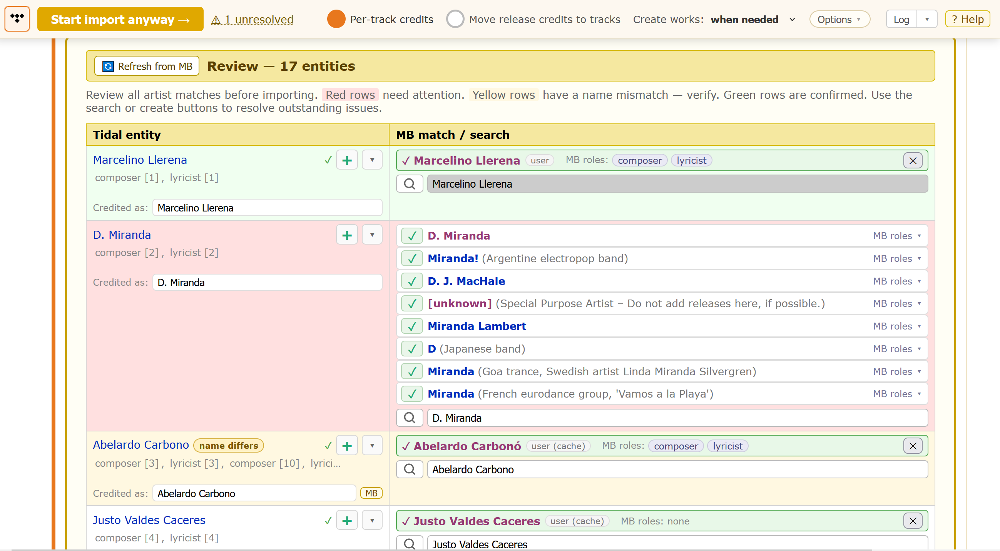

It appears on a release's **Edit relationships** page when there's something to import: a linked [provider](#providers) (or one [Platform Check](../platform_check/README.md) found), or track titles that name a remixer. See [Style / Relationships](https://musicbrainz.org/doc/Style/Relationships) for the guidelines.

> [!TIP]
> [Group Therapy](../group_therapy/README.md) adds batch helpers for the same page: group delete, highlight, copy and move credits.

### Features

- **[Import bar](#import-bar)**: pick a [source](#providers) and the import options.
- **[Review table](#review-table)**: confirm each credited name's MusicBrainz match, with automatic matching, search and entity creation.
- **[Consolidated import](#consolidated-import)** of every source at once, de-duplicated.
- **[Instant Fill](#instant-fill)** writes the confirmed relationships into the editor in one pass.
- **[Diagnostics](#diagnostics)**: a log of every step, to copy into an issue.

The flow: Credit Hoarder fetches the credits and lists every artist, label and place in the review table; clear matches are selected for you. You resolve the rest (or leave them out) and confirm. Instant Fill adds the relationships, and you review and submit the edit as usual.

### Import bar

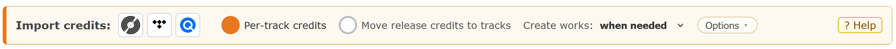

- **Import credits:** one icon per source available on this release. Click to import; right-click opens the source's page. Several sources can run in one session; their edits stack.
- **⚛ All** (with more than one source) runs a [consolidated import](#consolidated-import).

| Option                         |                                                                                          |
| ------------------------------ | ---------------------------------------------------------------------------------------- |
| Per-track credits              | import track credits as well as release credits                                          |
| Move release credits to tracks | put release-level recording credits (instruments, vocals, producer, mix…) on every track |
| Use works                      | existing works only, or also the ones writer credits need                                |
| Equivalence sets               | skip a role when an equivalent one is already there (writer ≡ composer)                  |
| Duplicate roles                | skip a role the recording already has                                                    |

*Use works*: *create none* (the default) uses existing works only, *create needed* also creates a work a composer, lyricist or writer credit needs, and off never touches works.

### Review table

One row per credited entity:

| Row |                                                    |
| --- | -------------------------------------------------- |
| ⚪   | matched automatically                              |
| 🟢   | picked by you                                      |
| 🟡   | matched by URL, but the names differ; worth a look |
| 🔴   | unresolved                                         |

For sources that give an artist URL (Discogs, Tidal, Metal Archives), a chip shows it: ✓ already linked in MusicBrainz, 🔗 add it (opens the edit page prefilled), ⚠ linked to a different entity.

**Automatic matching**, in this order:

1. **Source URL**: the artist is linked to that URL in MusicBrainz. When it also carries the credited name, as its name or an alias, the row says `name+url` or `alias+url`; otherwise just `url`, and **+ alias** is offered. That is checked on the artist itself, so an alias added a moment ago counts at once.
2. **Release context**: one of the release artist's related artists (band members, collaborators) carries the name or alias. So *George Harrison* on a Beatles release, although MusicBrainz has several.
3. **Exact name or alias**, when exactly one MusicBrainz artist carries it (*Don Abi* → *Abiodun*). A common name like *Kim* can't be proven unique and is left for you, with the reason on the row.
4. **Co-credit**: a recording that credits the name alongside the release artist (*Options › Matching*, on by default).

When name and URL disagree, the row is left for you. Each match is cached with how it was made (`url`, `name+url`, `alias+url`, `context`, `name`, `alias`, `co-credit`, `user`); adding an alias with **+ alias** updates it. **🔄 Refresh from MB** re-matches rows cached before a change. Credits with a URL are cached by that URL; name-only credits are cached per release, so a bare name never carries over to another release. 🔄 clears the cache and matches again.

On a row:

- **Search** by name, or paste an MBID or a MusicBrainz URL.
- **+** opens MusicBrainz's create page prefilled (name, sort name, type, source URL); the new entity is selected when you save. Right-click creates it in the background. **▾** adds options where the source has a profile (Discogs): disambiguation from the role or from selected profile text, the real name. Its **Create ↗** takes a right-click too, to create it in the background.
- **+ alias**: when the credited name is neither the artist's name nor an alias, offers to add it as one, so the next import matches it directly. Click opens the add-alias form prefilled (the button turns ✓ once the alias exists); right-click adds it in the background. A one-off spelling is better left to *Credited as*.
- **Credited as** sets the credited name on every relationship for that entity. **[MB]** and **[source]** fill in either name.
- **⋔ Split** turns a combined name (`&`, `and`, `feat.`, `vs.`, `with`, `×`, `,`, `;`) into one row per artist, expanding a shared surname: *George & Ira Gershwin* → *George Gershwin*, *Ira Gershwin*.
- **MB roles** shows the artist's existing relationship types (producer, mix, instrument…), to sanity-check the source's role.

### Consolidated import

**⚛ All** harvests every source, merges the credits into one review table, and fills once, so the same person credited by Tidal and Qobuz is resolved once.

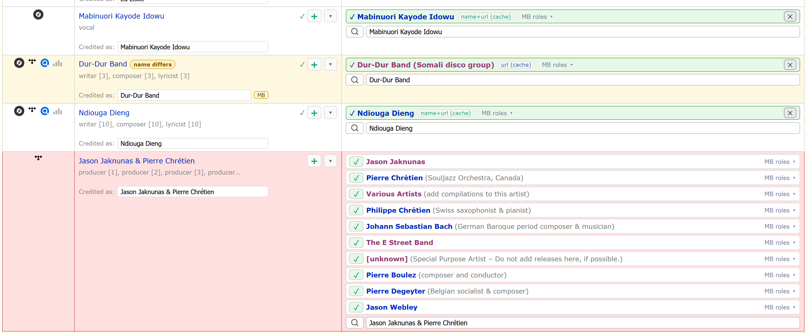

- Identical credits merge before matching; rows that resolve to the same entity merge after. An unresolved name that is a close typo of a uniquely resolved one joins it (*Mark Barott* → *Mark Barrott*); short names and ambiguous typos don't.
- The **source** column shows each provider that credited the row: coloured when it gave an artist URL (click to open it), grey when only a name.
- 🔗 adds every provider's URL at once, and a new artist is created with all of them.
- The edit note names the sources: `Source: Import all (Tidal, Qobuz, Deezer)`.

### Instant Fill

Adds the confirmed relationships to the editor without dialogs: release-level (labels, places, companies, artists), per track (instruments, vocals, engineers…) and per work (composer, lyricist, writer). A relationship that already exists, or was added earlier in the session, is skipped.

The edit note carries the statistics, one block per source when several ran. What an earlier source already added is reported as *already added this session*, not as *already in MB*.

### Providers

| Source         | Credits                                                                                  | Artist identity                            | Login    |
| -------------- | ---------------------------------------------------------------------------------------- | ------------------------------------------ | -------- |
| Discogs        | the fullest: performers, instruments, engineering, production, artwork, mastering        | Discogs artist ID                          |          |
| Tidal          | producer, engineers, writers and publisher per track; performers and artwork per release | Tidal artist ID, on nearly all credits     |          |
| Metal Archives | the lineup with instruments, work credits, other staff                                   | Metal Archives artist ID                   |          |
| Qobuz          | composer, lyricist, producer, publisher, performers                                      | names, except the composer and main artist | optional |
| Apple Music    | composer, writer, lyricist, producer, engineers, arranger, vocals                        | names                                      |          |
| YouTube Music  | writer, producer                                                                         | names                                      |          |
| Deezer         | composers only                                                                           | names                                      |          |
| Titles         | remixers named in the release's own track titles                                         | names                                      |          |

A source with an artist ID resolves to the exact MusicBrainz artist; a name-only credit goes through matching and your review.

- **Tidal** and **Metal Archives** are read in a background tab (Metal Archives is behind Cloudflare), and the credits are sent back. Many Tidal albums list their credits once, on the Info tab; those are read too.
- **Qobuz**: signed in under [Platform Check](../platform_check/README.md), Credit Hoarder reads Qobuz's API, which is reliable and gives the composer's artist ID. Otherwise it reads the store page, names only.
- **YouTube Music** is read anonymously, from each song's *Credits* (⋮ → Credits), for a release linked to a YouTube Music album. It has three groups: *Written by* (a writer, on the work), *Produced by* (producer) and *Performed by*, which is the track's artist credit and isn't imported. *Music metadata provided by* is the label, also not imported. Some labels send no credits at all. YouTube Music numbers a multi-disc album straight through, so its songs are placed on the release's mediums by their track counts; when the counts don't add up, the log says so.
- **Metal Archives**: guitars and bass default to electric; guests get the *guest* attribute; on a split release, each band's credits stay on its own tracks.
- **Titles** reads named remixes: *Song (Artist Remix)*, *Track (KiNK Dub)*, *Tune (Tom Moulton Mix)*, *Cut (Remixed by Someone)* each give that recording a remixer. *(Extended Mix)*, *(Radio Edit)*, a bare *(Remix)* and *(Mixed by …)* don't. It's a heuristic over a naming habit, so check what it finds.

| Streaming role                                | MusicBrainz relationship                                                      |
| --------------------------------------------- | ----------------------------------------------------------------------------- |
| Composer, Lyricist, Writer, Orchestrator      | on the work (created if *Use works* allows)                                   |
| Producer, Mixing / Recording / Sound Engineer | on the recording (*mix*, *recording*, *sound*); an assistant gets *assistant* |
| Instruments, Vocals, Conductor                | on the recording                                                              |
| Artwork                                       | on the release                                                                |
| Music Publisher                               | a label, *publishing* the work (`Copyright Control` is dropped)               |
| Distributor                                   | a label, *distributed* the release                                            |

Not imported, but listed as skipped: main and featured artists and the record label (set elsewhere), mastering engineer (belongs on the release), sound editor, studio personnel.

### Diagnostics

The log records every step. Its menu copies the log with or without the raw data, and each source's raw and parsed data, for an issue. *Preflight diagnostics* under the log trace every request.

### Shortcuts

| Key   |                                          |
| ----- | ---------------------------------------- |
| Enter | run the search; confirm the artist popup |
| Esc   | close the artist popup                   |

### Notes

- Credit Hoarder succeeds the single-source [Discogs Importer](../discogs_credits/README.md).
- [Development documentation](../credit_hoarder/DEVELOP.md)

---

## Fusion

A merge assistant for MusicBrainz recordings: gather candidates, let Match group the duplicates, adjust by hand, and submit every merge from one window.

- Install: [stable](https://raw.githubusercontent.com/majkinetor/musicbrainz-userscripts/refs/heads/stable/userscripts/fusion/fusion.user.js) or [latest](https://raw.githubusercontent.com/majkinetor/musicbrainz-userscripts/refs/heads/main/userscripts/fusion/fusion.user.js)
    - Or via bundle: [String Theory](../string_theory/README.md)
- [Changelog](../fusion/CHANGELOG.md)
- [View users](https://musicbrainz.org/search/edits?auto_edit_filter=&order=desc&negation=0&combinator=and&conditions.0.field=edit_note_content&conditions.0.operator=includes&conditions.0.args.0=Fusion)

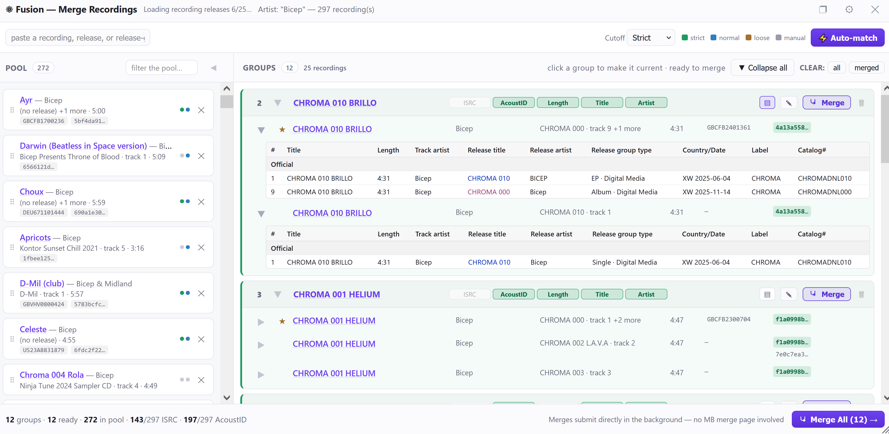

### Features

- **[Pool and groups](#pool-and-groups)**: candidates on the left, merge groups on the right.
- **[Seeding](#seeding)** from a release, a release group, a recording, or an artist's whole catalogue.
- **[Match](#match)** groups likely duplicates by ISRC, AcoustID, title, artist and length.
- **[Merging](#merging)** submits the merges in the background, each with an itemised edit note.

### Pool and groups

Every candidate starts in the **Pool**. Put it in a group by dragging it, by double-clicking it (it joins the *current* group, the one whose header you clicked last), or by selecting it and clicking a group.

In a group:

- the **target**, the recording that survives, sits on top with a gold ★; click another row's ☆ to change it;
- ↩ returns a recording to the pool, ✕ drops it altogether;
- 🗑 deletes the group and returns its members to the pool; **Clear board** does it for every group;
- an ISRC or AcoustID that two or more members share is tinted, one colour per shared value, so you can see which rows agree;
- a length outside the tolerance is flagged amber, with the spread next to the title.

### Seeding

Fusion opens with a pool already filled from the page you launched it on:

| Page                | Pool                                                                   |
| ------------------- | ---------------------------------------------------------------------- |
| Release             | its recordings; *Load recordings from RG edition* adds another edition |
| Release group       | the recordings of every release in the group                           |
| Recording           | that recording                                                         |
| Artist → Recordings | the artist's entire catalogue, not just the visible page (up to 2000)  |

On any page, pasting a recording, release or release-group MBID or URL into the input adds it (a release adds all of its recordings).

### Match

Match groups the recordings still in the pool, so a group you built by hand is never undone. The **Cutoff** sets how much evidence it needs:

| Cutoff             | Groups two recordings when they share…                                     |
| ------------------ | -------------------------------------------------------------------------- |
| strict             | an ISRC or an AcoustID                                                     |
| normal *(default)* | …or a similar title and artist, with lengths within tolerance (or unknown) |
| loose              | …or a similar title with either the length or the artist                   |

Titles tolerate small typos. Artists are compared by MBID when both recordings have them, so *Radium* and *DJ Radium* credited to the same artist match.

Match never groups:

- a video with an audio recording (not even with a shared ISRC; manual grouping refuses it too);
- a recording that has an open edit;
- lengths more than 30 s apart.

A group's chips show which signals hold for **every** member; one that holds for only some of them is shown as partial.

> [!NOTE]
> This follows MusicBrainz's [How To Merge Recordings](https://musicbrainz.org/doc/How_To_Merge_Recordings): match the acoustic content, not incidental metadata. The signals are a heuristic, so glance at each group before merging.

### Merging

**Merge ↗** on a group, or **Merge All** in the footer, submits the merge without opening MusicBrainz's merge page. Merge All prepares several groups in parallel and submits them one at a time, because MusicBrainz keeps one merge queue per session.

Each merge gets an edit note listing what matched ("Same ISRC …", "Length difference 5s (3:59 – 4:04)"). ✎ in a group's title replaces it with your own text; Fusion's attribution line is always appended.

It is an ordinary edit on your account: unless you're an auto-editor, it goes to a vote (see [Settings](#settings-1) to always ask for one).

> [!NOTE]
> Under the hood, Fusion queues the group with `GET /recording/merge_queue?add-to-merge=…` and posts MusicBrainz's own `/recording/merge` form with the target and the note. If MusicBrainz bounces the form instead of creating the edit, the group is marked failed, not done.

### Settings

The ⚙ window (or right-click Fusion's corner icon), which also holds the activity **Log**:

| Setting                                           | Default |                                                            |
| ------------------------------------------------- | ------- | ---------------------------------------------------------- |
| Always require a vote                             | off     | send even your auto-edits to a vote                        |
| Look up AcoustIDs                                 | on      | fetch the pool's AcoustIDs from acoustid.org               |
| Match on open                                     | off     | run Match once the pool has loaded                         |
| Preload group release details                     | off     | fetch every grouped recording's releases in the background |
| Length tolerance                                  | 5 s     | lengths this close count as the same                       |
| Match never groups if lengths differ by more than | 30 s    | whatever else matches; grouping by hand still can          |

---

## Group Therapy

Batch operations and helpers for the MusicBrainz *Edit relationships* page.

- Install: [stable](https://raw.githubusercontent.com/majkinetor/musicbrainz-userscripts/refs/heads/stable/userscripts/group_therapy/group_therapy.user.js) or [latest](https://raw.githubusercontent.com/majkinetor/musicbrainz-userscripts/refs/heads/main/userscripts/group_therapy/group_therapy.user.js)
    - Or via bundle: [String Theory](../string_theory/README.md)
- [Changelog](../group_therapy/CHANGELOG.md)
- [View users](https://musicbrainz.org/search/edits?auto_edit_filter=&order=desc&negation=0&combinator=and&conditions.0.field=edit_note_content&conditions.0.operator=includes&conditions.0.args.0=Group+Therapy)

> [!TIP]
> [Uncheck checkboxes with Esc](https://github.com/chaban-mb/userscripts/blob/main/docs/USERSCRIPTS.md#musicbrainz-uncheck-checkboxes-with-esc) is a good companion.

### Features

- **[Batch delete](#batch-delete)** by role, by entity, or both.
- **[Copy and move](#copy-and-move)** credits between recordings, works, releases, and a release and its recordings.
- **[Set dates](#set-dates)** on many credits at once.
- **[Release group consolidation](#release-group-consolidation)**: one matrix of release credits across the whole group.
- **[Work matching](#work-matching)** links recordings to existing works.
- **[Text parser](#text-parser)** turns liner notes into relationships.
- **[Replace role](#replace-role)** on many credits at once.
- **[Highlight](#highlight)** a role or an entity everywhere, with counts.
- **[Edit note](#edit-note)**: a line per action, under Group Therapy's signature.

Everything works on existing and newly added relationships, and everything except consolidation only stages changes: you review and save.

### Batch delete

Right-click a relationship's **×**:

- *Remove this one*
- *Remove "‹role›" — all tracks*
- *Remove "‹target›" — everywhere*
- *Remove "‹role›" + "‹target›"*

Each option shows what it touches, e.g. *guitar — all tracks (14) · tracks 1–12*. With recordings or works ticked, the options apply only to those. The same works on works.

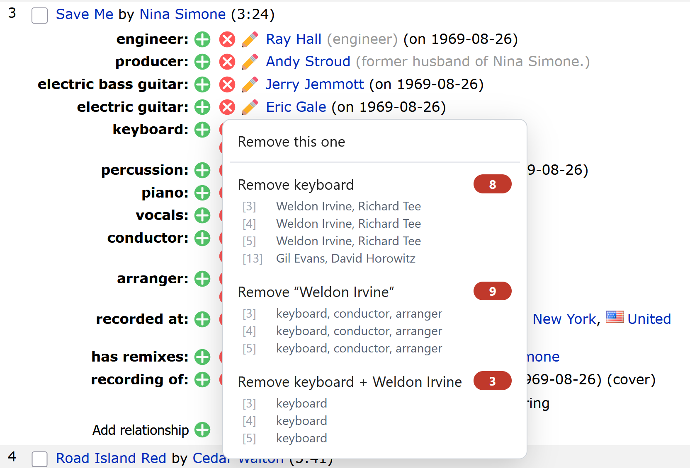

### Copy and move

The destinations are the ticked recordings, or every other track when none are ticked.

**From a recording or work**: right-click its checkbox and choose *Copy* or *Move* (copy, then remove from the source). The menu lists the credits, all ticked:

- right-click a credit to keep only its role; Shift + right-click adds a role;
- hover a credit for **[A]**, which ticks every track crediting that artist, and **[R]**, the same artist in the same role.

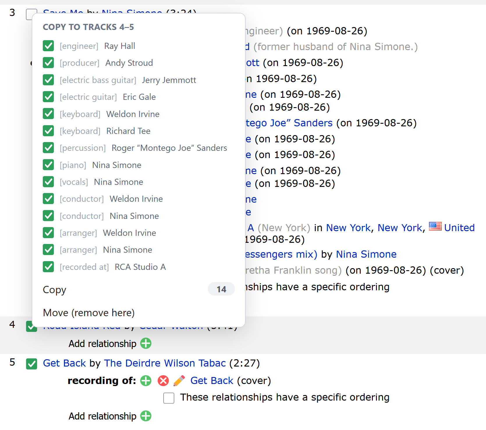

**From another release** in the group: **⧉ Copy from release…** lists its release credits (artists and labels) to pick from. Roles that don't suit this release's format start unticked, so a vinyl-only credit doesn't reach a digital edition.

**Between the release and its recordings** (the toolbar's *Vertical* section):

- **⬆ Release → recordings** copies or moves the release credits to the recordings. Release-only roles (liner notes, mastering, artwork, ℗, ©…) start unticked.
- **⬇ Recordings → release** collects the recordings' credits onto the release, with the track range each covers.

Both take a [track selector](#track-selector) and map each role to the destination's link type by name; a role with no equivalent is skipped and counted.

#### Set dates

When the relationship you right-click has a date (a *recorded at* with a date, say), the copy menu offers **Set dates from…**. It lists every datable credit on the selected tracks as a track → credits tree:

- the begin and end date (`YYYY`, `YYYY-MM` or `YYYY-MM-DD`) are prefilled from that relationship and editable;
- credits whose role is on your remembered **roles** list start ticked (right-click a role to add it, click its chip to drop it);
- **Apply** sets the date on every ticked credit that has none.

> [!NOTE]
> It fills blanks only: MusicBrainz's editor keeps an existing date when a relationship is updated, so dated credits are shown but left unchanged.

### Release group consolidation

**▦ Consolidate RG…** shows every release credit across the group as a role × release matrix: one row per credit, one column per release (A, B, C…, with a format badge), green where the credit exists.

- Click a cell to add that credit to that release, a column letter to add everything addable to it, or **Auto select** for all. A credit that doesn't suit a release's format shows `·`; click to force it.
- **Apply** submits the additions directly, one batch per release, each with an edit note listing what it added.
- A release whose credits couldn't be read (MusicBrainz throttling) shows `?` and gets nothing until **Retry** reads it.
- With more than 10 releases, you pick which ones to consolidate.

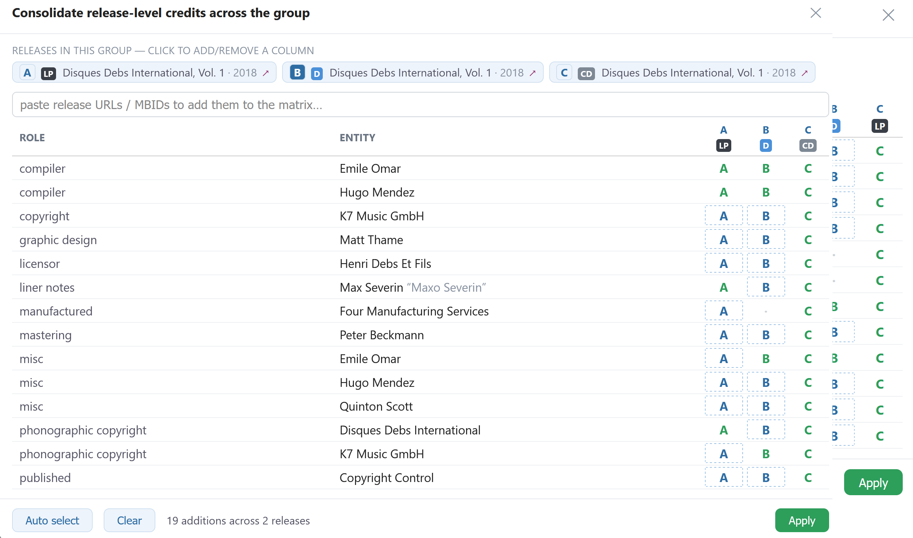

### Work matching

**◎ Match works…** links each recording to an existing work, so a compilation of standards reuses the works instead of creating duplicates. Candidates come from ISRCs (a recording sharing an ISRC usually shares the work) and from MusicBrainz's work search, ranked by exact title, then by how many recordings use each work. *Beat It* thus resolves to Michael Jackson's work, not a same-named cover.

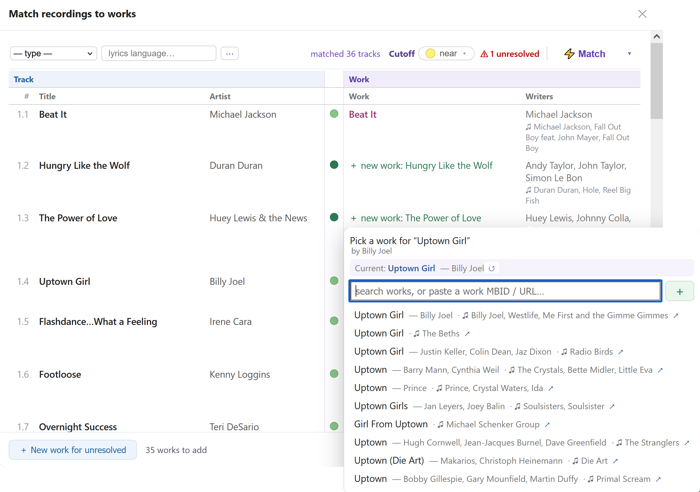

| Dot |                                                                       |
| --- | --------------------------------------------------------------------- |
| 🔵   | confirmed by a shared ISRC                                            |
| 🟢   | the only work with this title                                         |
| 🟡   | exact title and clearly the most recorded, but others share the title |
| 🔴   | ambiguous; check it                                                   |

**⚡ Match** selects the rows at or above the **Cutoff**. ✎ on a row searches, takes a pasted work MBID or URL, or creates a work. **＋ New work for unresolved** creates one for every unmatched recording. **Apply** stages the performance relationships.

### Text parser

**✎ Text parser…** turns credit text (liner notes, a credits block, or the release's annotation via **Load annotation**) into relationships, with a pattern like [Apollo's track parser](../apollo_editor/README.md#pattern-parser):

| Pattern       | Line                                                                      |
| ------------- | ------------------------------------------------------------------------- |
| `R: E`        | `Mastering: Nick Robbins`                                                 |
| `E - R`       | `Nick Robbins - Mastering`                                                |
| `E[,] - R[,]` | `Cameron Allen - Flute, Tenor Saxophone` → one row per role               |
| `R: E[&]`     | `Graphic Design: Ricardo H Fernandes & Yacine Blaeich` → one row per name |

`R` is the role, `E` the entity: an artist, label or place, decided per row. `[,]` splits on commas (`[, and]` also on "and", `[&]` on "&"); a `;` separates several credits on one line.


- **Copyright lines** (©, ℗, *licensed to/from*, *distributed by*, *marketed by*) are recognised without a pattern. One year becomes both the begin and end date, as [MusicBrainz asks](https://musicbrainz.org/relationship/2ed5a497-4f85-4b3f-831e-d341ad28c544). Several holders on one line (`℗ 2012 Shady/Aftermath/Interscope`) become one row each, and a line with two markers is split in two when pasted.
- **⚡ Match** resolves roles and entities where it can (including *mastered by* → *mastering*). A role that exists only for labels picks a label; an ambiguous one defaults to a label, or an artist when the name is one of the release's artists.
- Instruments and vocal types resolve to the *instrument* or *vocal* role plus that attribute: *Flute*, *Lead Vocals*, *Backing Vocals* → *background vocals*. A leading *Guest*, *Additional*, *Solo*, *Co-*, *Executive*, *Assistant* or *Associate* is added as an attribute when the role allows it: *Guest Vocals*, *Co-Producer*, *Executive Producer*.
- Row colours: plain is ready, amber is matched but unresolved, red didn't match.
- **search** on a row opens a picker: search, paste an MBID or URL, or **+** to create the artist or label (right-click **+** to create it in a background tab). Picking a result resolves every row with the same name; right-click resolves only that row.
- Each line can have its own **pattern**, its text can be edited in place, and **✕** removes it. **🔒 Freeze matched** pins the current pattern on the lines it already matches, like in Apollo.
- **Scope** sends the credits to the release (default) or to recordings chosen with a [track selector](#track-selector); the roles offered follow the scope.
- **Apply** stages the rows. After **Load annotation**, **Apply & clear annotation** also opens the annotation editor, emptied.

The text and the resolutions last until the page reloads.

**Credits that name their tracks**: with **Tracks: auto** (the default), a clause like `(tracks 2,6,9)`, `[tracks 1-3]`, `on tracks 2 and 6` or just `(A1, B2)` sends that row to those tracks, and every other row follows Scope. A clause counts only when every number is a track on this release, so `(2003)` stays a year. A line with two track lists is marked **⚠ split line** and stays release-level.

> [!NOTE]
> Only single-line credits are parsed; grouped multi-line blocks are not.

#### Track selector

| You type       | You get                               |
| -------------- | ------------------------------------- |
| `3`, `A1`      | that track, as numbered in the editor |
| `5-7`, `1,3`   | a range, a list                       |
| `2:4`, `2:4-6` | track 4 (4–6) on medium 2             |
| `2:*`          | every track on medium 2               |
| `all`          | every track                           |
| *(empty)*      | the ticked tracks                     |

A number that matches no track position counts as the Nth track, so on a vinyl `1, 2, 4` finds A1, A2, B1.

### Replace role

Right-click a credit's pencil for **Replace role "writer"…** (every credit with that role) or **Replace "writer" for "X"…** (only that artist's), limited to the ticked recordings or works if any. Pick the new role from the types MusicBrainz accepts for that pair. Typical use: turn every *writer* on an instrumental release into *composer*.

> [!NOTE]
> MusicBrainz can't change a relationship's type, so this removes and re-adds it. Attributes belong to the old type and are dropped; the toast counts the credits that had some.

### Highlight

Hover an entity or a role to light up every occurrence, with a count and where it appears: *48× · tracks 1–12*.

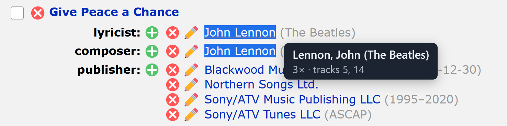

### Edit note

Once you use Group Therapy on a page, it adds its signature to the edit note, followed by a line per action (*Copied 2 credits from track 1 to tracks 2–5*, *Removed guitar (14)*). Your own text stays.

### Settings

| Setting                   | Default |                                                 |
| ------------------------- | ------- | ----------------------------------------------- |
| Hide help text            | on      | hide MusicBrainz's help above the relationships |
| Hide native batch tools   | off     | hide MusicBrainz's own batch-tools table        |
| Auto-match on start       | off     | open the work matcher and match on page load    |
| Auto-match on open        | off     | match when the work matcher opens               |
| Uncollapse media on start | off     | expand every medium on load                     |

### Shortcuts

| Gesture                                      |                                           |
| -------------------------------------------- | ----------------------------------------- |
| right-click a relationship's **×**           | [batch delete](#batch-delete)             |
| right-click a recording's or work's checkbox | [copy / move](#copy-and-move) its credits |
| right-click an entity name                   | open that relationship's edit dialog      |
| right-click a credit's pencil                | replace role, or set dates                |
| right-click a credit in the copy list        | keep only that role (Shift adds it)       |
| hover an entity or role                      | highlight it                              |

### Notes

Group Therapy works through MusicBrainz's own relationship editor: it reads the relationships from the page and writes through the editor's state, like [Credit Hoarder](../credit_hoarder/README.md). Consolidation is the exception, submitting with MusicBrainz's edit API.

---

## ISRC Scout

Shows a release's ISRCs, fills in the missing ones from several providers, and finds and manages its recordings' streaming and store links.

- Install: [stable](https://raw.githubusercontent.com/majkinetor/musicbrainz-userscripts/refs/heads/stable/userscripts/isrc_scout/isrc_scout.user.js) or [latest](https://raw.githubusercontent.com/majkinetor/musicbrainz-userscripts/refs/heads/main/userscripts/isrc_scout/isrc_scout.user.js)
    - Or via bundle: [String Theory](../string_theory/README.md)
- [Changelog](../isrc_scout/CHANGELOG.md)
- [View users](https://musicbrainz.org/search/edits?auto_edit_filter=&order=desc&negation=0&combinator=and&conditions.0.field=type&conditions.0.operator=%3D&conditions.0.args=76&conditions.0.args=78&conditions.1.field=edit_note_content&conditions.1.operator=includes&conditions.1.args.0=ISRC+Scout)

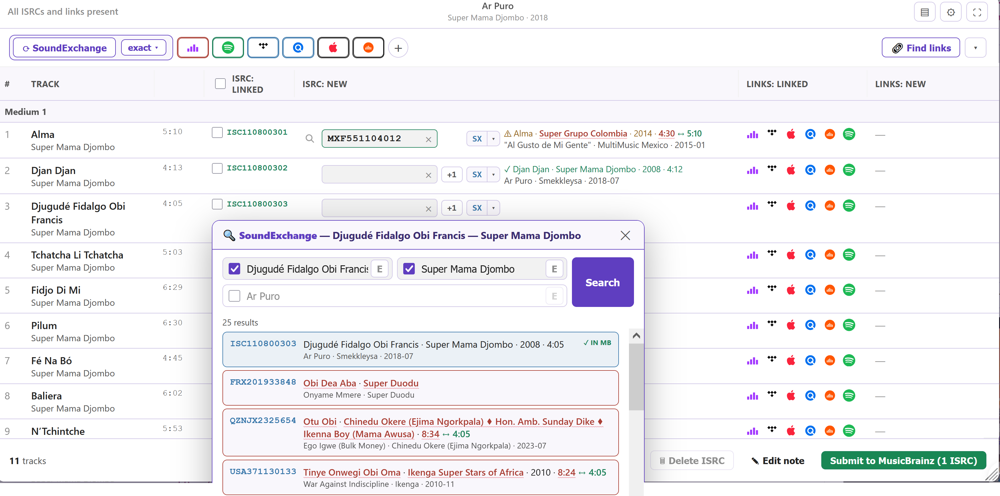

### Features

- **[Providers](#providers-1)** found through the release group and [Platform Check](../platform_check/README.md), not just the release's own links.
- **[ISRC badge](#isrc-editor)** by the release title, showing how many tracks lack an ISRC.
- **[ISRC editor](#isrc-editor)**: every track's ISRCs, with validation, provider [imports](#importing-isrcs), [per-track lookups](#per-track-lookup), bulk paste, export and deletion.
- **[Links](#links)**: find and add the recordings' streaming and store links, and end or remove existing ones.

### Providers

| Provider                        | ISRC import | Track links | Resolved by                                                                           |
| ------------------------------- | :---------: | :---------: | ------------------------------------------------------------------------------------- |
| Deezer                          |      ✓      |      ✓      | ISRC, on any release                                                                  |
| Tidal                           |      ✓      |      ✓      | ISRC, on any release                                                                  |
| Beatport                        |      ✓      |      ✓      | the album, matched by ISRC                                                            |
| Volumo                          |      ✓      |      ✓      | the album, matched by ISRC                                                            |
| Qobuz                           |      ✓      |      ✓      | the album; ISRCs by position, links by ISRC                                           |
| Apple Music                     |      ✓      |      ✓      | the album; by position (+ title for links)                                            |
| SoundCloud                      |      ✓      |      ✓      | the set (a track URL counts as a one-track release); by position (+ title for links)  |
| Audiomack                       |      ✓      |      ✓      | the album (a song URL counts as a one-track release); by position (+ title for links) |
| Spotify                         |      ✓      |      ✓      | ISRCs through [a lookup service](#spotify); links from the album, by position + title |
| Bandcamp                        |             |      ✓      | the album page, by position + title                                                   |
| [YouTube Music](#youtube-music) |             |      ✓      | the album, when linked (by position + title); else ISRC, on any release               |
| [Amazon Music](#amazon-music)   |             |      ✓      | the album, when linked (by position + title)                                          |
| HDtracks                        |      ✓      |             | the album                                                                             |
| [7digital](#7digital)           |      ✓      |             | the album: each track searched by title                                               |
| SoundExchange                   |      ✓      |             | a title and artist search                                                             |

An album-based provider needs the release's album link: already in MusicBrainz, found by Platform Check, or pasted with **(+)**. No login is needed anywhere except Qobuz outside the countries it serves (see [Qobuz](#qobuz)).

> [!WARNING]
> Album imports map tracks by position and trust the link: provider titles legitimately differ (*feat.*, *remaster*). A fill whose length is more than 10 s off is kept but marked amber, and counted as *⚠ N implausible*. An album with more tracks than the release is flagged as a likely wrong edition. Check the amber rows before submitting.

### ISRC editor

Click the **ISRC** badge (`✓ 12/12`, or `⚠ 9/12` pulsing when some are missing). Each track shows its ISRCs and an input for a new one: red is invalid, orange a duplicate, green good.

#### Importing ISRCs

The toolbar shows the providers available for this release:

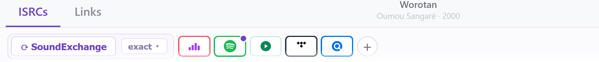

| Icon     | Comes from                                                                         |
| -------- | ---------------------------------------------------------------------------------- |
| circled  | the release's own links                                                            |
| plain    | [Platform Check](../platform_check/README.md)                                      |
| blue dot | another release in the group (option *Use providers from the whole release group*) |

**(+)** imports from any album URL you paste. **⟳ SoundExchange** searches every track by title and artist, fills the confident matches, and shows the other candidates per row; it searches 30 tracks at a time, so click a *Not searched* row to continue. Deezer, which needs a request per track, fetches 50 at a time the same way.

> [!NOTE]
> A Platform Check link withheld for a barcode or format mismatch isn't used, because the mismatch may mean it's a different release altogether. *Ignore Platform Check link confidence* uses it anyway; a wrong track count always excludes it.

#### Per-track lookup

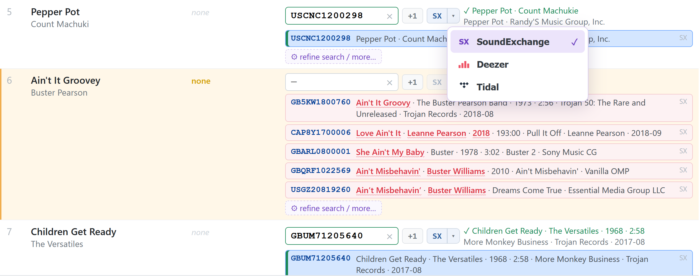

- **+1** fills the previous track's ISRC plus one.
- The **lookup** button looks the row's ISRC up on the selected provider and shows its title, artist and length next to the row, mismatches in red. Guests don't count as a mismatch: a *feat.* clause is left out of both titles, and when the credits differ only the main artist has to match, since databases list guests differently. Nor does a typo: a word one letter off (*Les Ecrocs* for *Les Escrocs*), in words of five letters or more, reads as the same song: the lookup marks it ⚠, and **All** counts it with the note *its title is spelled differently*. Its menu switches every row to another provider; right-click runs it on all tracks.
- **All** (top of the menu) checks the row's ISRCs on every provider available for the release at once (not SoundExchange, which serves a captcha on nearly every run): the entered one and every ISRC the recording already has. The row shows a verdict: **✓ 4/4** when every provider that knows the ISRC agrees, **⚠ 1/4** when some don't, **– 0/4** when none knows it. Hover the verdict (or the row's **All** button) to see the comparison next to it (right of the verdict, or above the row when there's no room there, so the rows below stay free); move down either column to walk the tracks, click the verdict to pin it so you can select text. Clicking one of its ISRCs pins it too, and the comparison stays where it is. Each line starts with the provider's verdict:
  - Deezer and Tidal look the ISRC up: ✓ their song for it is this track, ⚠ it is another song.
  - An album provider (Qobuz, Apple, Beatport…) reads the release's album there: ✓ it has this ISRC at the same position as this track (📍), or at another position (↪ track 3: the album orders its tracks differently). Deezer and Tidal can't say where: they only look the ISRC up. When the album hasn't the ISRC at all, ✗ it has **another** ISRC at this track's position, offered with **use**. An ISRC that belongs to another track of the release, or that the row already has, is never offered.
  - The header lists the row's ISRCs first, then any other ISRC a provider named, each with how many providers have it for this track. The comparison shows the row's first ISRC; click another of the row's to see what the providers say about that one, or an ISRC a provider named to see only the providers that name it. **copy** puts the comparison on the clipboard as a Markdown table (provider, track, length, note; the ISRC is in its heading, and in the note where an album has another one).
  - **All** is also the last button in the toolbar, when the release has more than one provider: it checks every track, as a right-click on a row's **All** does.
- **⚙** opens a SoundExchange search you can tune (title, artist, release, exact), with a link to run it on their site.

| Check         | Mismatch when                                                             |
| ------------- | ------------------------------------------------------------------------- |
| Title, artist | the words don't match (a couple of extra words, like a version, are fine) |
| Year          | recorded after the release year (+1)                                      |
| Length        | more than 10 s off; MusicBrainz's length is shown alongside               |

A result passing every check fills an empty field (blue); a length mismatch only warns (yellow). Lookups don't run while you type: only when you leave a field you typed into, press the button, or run the SoundExchange search. A SoundExchange captcha or rate limit shows in the toolbar; solve it there and continue.

#### Paste, export, delete

- **Paste** one ISRC per line in track order (an empty line skips a track), or address tracks: `3=USABC1234567`, `USABC1234567 | 1.3`, `1.3 USABC1234567`. Then *Apply to empty fields* or *Apply (overwrite)*.
- **Export** as text or JSON (`{ recordingMBID: "ISRC" }`), to the clipboard.
- Tick existing ISRCs and **🗑 Delete checked**: one *Remove ISRC* edit each, through your logged-in session.

#### Submitting

Submitting ISRCs needs OAuth once: **⚙ Setup → Authorize**, approve in the tab that opens. Then **Submit to MusicBrainz**. *Sign out* forgets the token. test.musicbrainz.org has its own accounts, so it is authorized separately; musicbrainz.org and beta share one authorization. A token MusicBrainz no longer accepts is forgotten, and Setup asks you to authorize again.

### Links

The **Links** tab shows, per track, what each recording already links to (**Linked**) and what was found but isn't linked yet (**Add**). Linked shows every provider, including ones ISRC Scout can't add (YouTube, Amazon Music, any host).

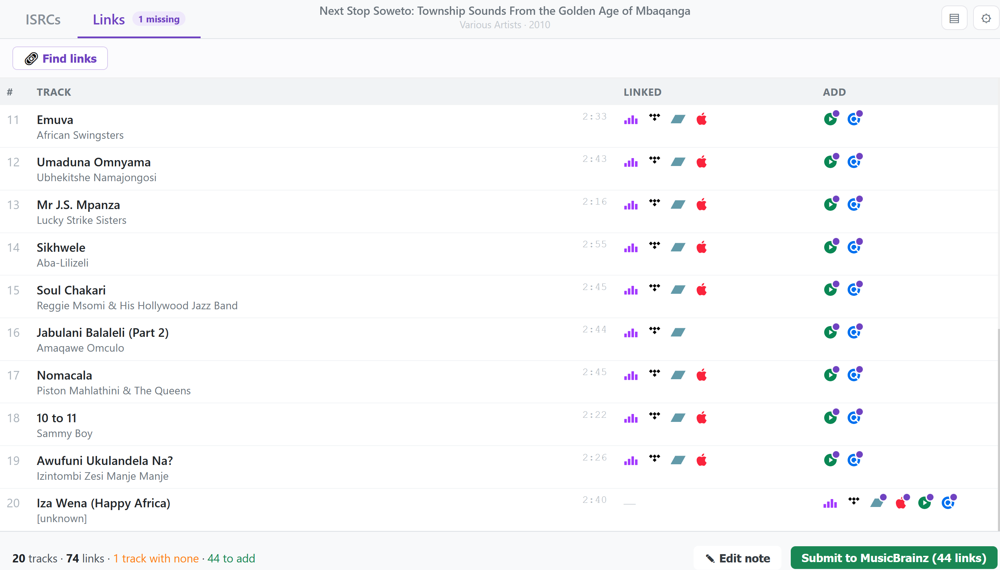

**Find links** resolves every track on every available provider, in parallel. A provider matched by position (Apple Music, Bandcamp, SoundCloud, Audiomack, Spotify, YouTube Music, Amazon Music) must have the track's title there; a typo in it, as above, still counts, and so do a "feat." the platform keeps in the title where MusicBrainz moved it to the artist credit, and an apostrophe written differently. A Deezer track that no longer plays anywhere is not offered. **➕ Add links** adds everything found; adding goes through your logged-in session (no OAuth), with ISRC Scout's edit note.

#### Match

**⚡ Match**, at the right of the toolbar after **Find links**, does both steps in one click. It imports ISRCs from the fastest source the release links: one-request sources (Qobuz, Audiomack, Apple Music, Tidal, …) before per-track ones (Deezer, 7digital) and Spotify. If a source fails or gives nothing, it tries the next. Then it runs **Find links** with the ISRCs it found. A link pulled from the release group is skipped, since whether it fits this release needs you to look. Mission Control's probe uses the same order.

| Click               | on an **Add** icon               | on a **Linked** icon                           |
| ------------------- | -------------------------------- | ---------------------------------------------- |
| left                | open the provider's track        | open the provider's track                      |
| right               | add this link                    | toggle *ended* (shown faded)                   |
| Ctrl + right        | add every link on the track      | end every link on the track                    |
| Alt + right         | add this provider on every track | end this provider on every track               |
| middle              |                                  | remove this link                               |
| Ctrl / Alt + middle |                                  | remove on the track / this provider everywhere |

End a link when the release is taken down and it no longer resolves ([MusicBrainz style](https://musicbrainz.org/doc/Style/Relationships/URLs#When_to_remove)). Ending and removing work on any linked provider.

> [!TIP]
> Editions are often split by platform: one carries Deezer, another Spotify. With *Use providers from the whole release group* on, a provider missing here is taken from a sibling release (it shares the recordings) and marked with a purple dot.

### Settings

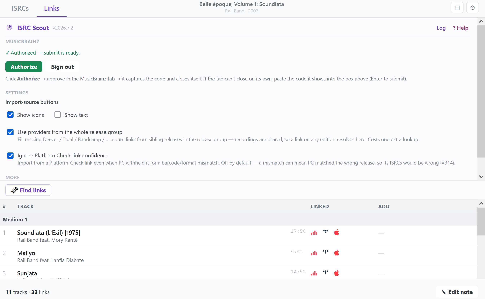

| Setting                                    | Default |                                                                    |
| ------------------------------------------ | ------- | ------------------------------------------------------------------ |
| Authorize                                  |         | OAuth for submitting ISRCs                                         |
| Import buttons                             | icons   | icons, text, or both                                               |
| Use providers from the whole release group | off     | take missing providers from sibling releases (one more lookup)     |
| Ignore Platform Check link confidence      | off     | use links Platform Check withheld for a barcode or format mismatch |
| Spotify ISRC source                        | molla   | or ISRC Hunt                                                       |

### Shortcuts

| Key   |                                                               |
| ----- | ------------------------------------------------------------- |
| Esc   | close the open panel, else the editor                         |
| Enter | submit the focused URL input, or run the SoundExchange search |

The mouse gestures on links are in the [Links](#links) table.

### Notes

#### YouTube Music

YouTube Music shows no ISRCs. When the release links its YouTube Music album (Platform Check finds it), each track is taken from that album's tracklist by position and title, as official audio, never a music video. A song a free listener can't play (YouTube Premium only, or not available at all) is left out, since the links are added as *free streaming*. Without a linked album, the track's ISRC is searched, and a result counts only when it is official audio (not a user upload), has the track's title, is within 3 s of its length, and comes from this release's album. The log names every result it skipped, and why. The edit note names each link's YouTube Music album.

> [!NOTE]
> A search for an ISRC YouTube Music doesn't know brings up unrelated songs instead of nothing, and labels sometimes reuse an ISRC for another version of a song with the same title and length: [JP92Q2400507](https://musicbrainz.org/isrc/JP92Q2400507) is both *メズマライザー* and its *Critical Damage ver.* Hence the strict search. The album's tracklist is read from its own playlist, because its album page, seen without logging in, shows a track's music video in its place. The edit note names the album because a song's URL stops saying which album it was on once it is delisted.

#### Amazon Music

Amazon Music shows no ISRCs, and has no ISRC search, so its track links come only from the release's Amazon Music album, when the release links it (Platform Check finds it by name). Each track is taken from the album's tracklist by position, or by title when the album orders it differently, and only when the title matches and the length is within 3 seconds. It is read as a guest, with no Amazon account, and the links are added as *streaming page*.

#### 7digital

7digital is read through the catalogue its web store uses, with no login. It can't list an album's tracks, so each track of the release is searched for by its title (with the album's title, then with its artist), and the results from the linked 7digital album are kept, each with its ISRC, disc and position. One search often brings up the whole album; when it doesn't, there is a search per track, a few at a time, which takes some seconds on a long album. A 7digital track has no page of its own, so there are no track links.

#### Spotify

Spotify's own ISRC API needs a paid developer account, so ISRCs come through a service that looks them up with its own credentials. Pick it in **⚙ Setup**; switch if one is down or throttled:

- **[molla](https://isrc.mollamusicgroup.com)** returns the album's ISRCs in album order. When its track count matches the release they're mapped by position, otherwise by title and artist, and unmatched tracks stay empty. Its quota is shared by all its users, so a burst may need a retry a minute later.
- **[ISRC Hunt](https://isrchunt.com)** returns them by disc and position.

#### Beatport

Beatport is behind Cloudflare, so ISRC Scout can't fetch it from MusicBrainz. It also runs on `beatport.com/release/*`: an import opens the release in a background tab, reads the ISRCs there and closes it. A Beatport release page you open yourself is read too, and results are cached.

#### Qobuz

Qobuz's `album/get`, the only endpoint with per-track ISRCs, answers anonymously only from countries Qobuz serves; from anywhere else it answers *404* for every album. Signing in under [Platform Check](../platform_check/README.md) (*⚙ Setup → Auth → Qobuz account*) works from anywhere: the login lends its account's region. Platform Check keeps the token (the password is never stored), and ISRC Scout and Credit Hoarder read it. Qobuz rate-limits hard, and a barcode search needs the 13-digit, zero-padded EAN.

---

## Mammoth

Reusable edit notes in a panel beside the edit-note field of every edit form, and remembered values for any other field.

- Install: [stable](https://raw.githubusercontent.com/majkinetor/musicbrainz-userscripts/refs/heads/stable/userscripts/mammoth/mammoth.user.js) or [latest](https://raw.githubusercontent.com/majkinetor/musicbrainz-userscripts/refs/heads/main/userscripts/mammoth/mammoth.user.js)
    - Or via bundle: [String Theory](../string_theory/README.md)
- [Changelog](../mammoth/CHANGELOG.md)

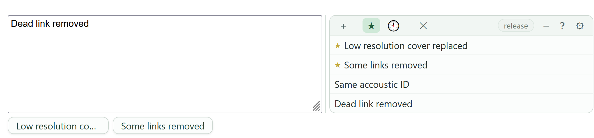

### Features

- **[Saved notes](#saved-notes)**: save, pin as buttons, search, sort and reorder edit notes.
- **[History](#saved-notes)** of the notes you submitted.
- **[Mammoth babies](#mammoth-babies)**: the same for other fields (catalogue number, label, artist…), and **[any field you choose](#custom-fields)**.
- **[Import and export](#settings-4)** of notes.
- **[Other scripts' edit-note fields](#notes-4)** get the same panel.

### Saved notes

- **＋** saves the current text. In **History**, ★ moves a note to the saved ones.
- ★ on a saved note pins it as a **button** under the field.
- Sort **manually** (drag ⠿), by **most used** or by **recent**. A search box narrows long lists.
- Click applies a note with your default action (replace or append); right-click does the other. Appending skips a line that's already there.

The field is widened and centred; drag the separator to resize the panel. The panel can be minimized to an icon: hover to peek, click to pin.

> [!TIP]
> With *Scope per resource* on, each kind of edit note (release, artist, recording…) keeps its own saved notes and history.

### Mammoth babies

A 🦣 pin in a field recalls the values saved for it, shared across releases. The built-in ones cover catalogue number, label, artist, status, language, script, country, type and the task fields.

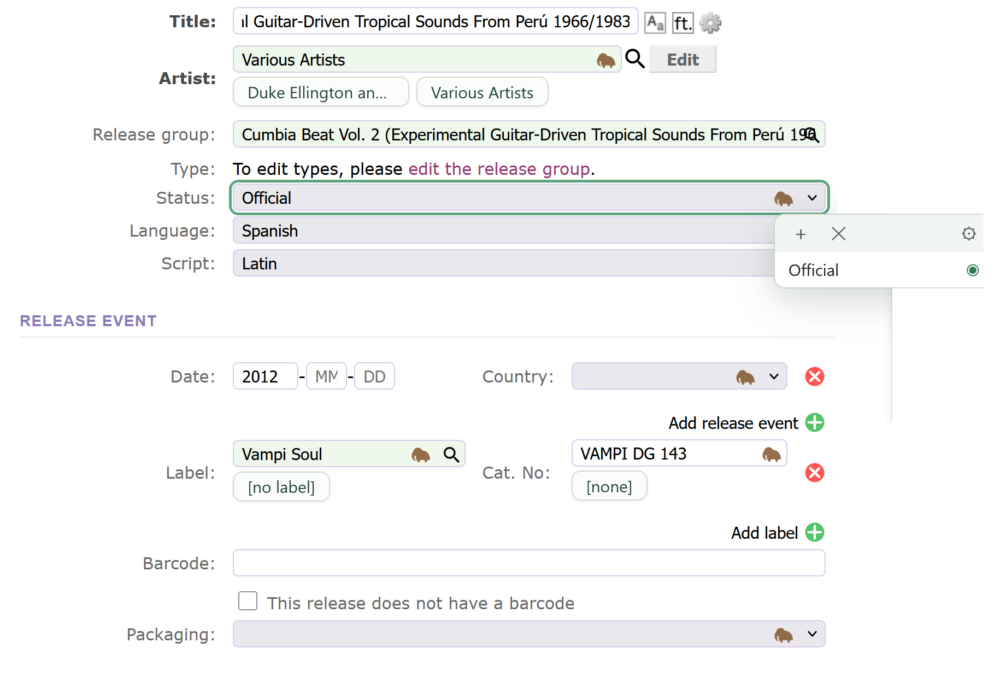

In the pin's panel, **＋** saves the current value and **✕** clears the field. On a saved value:

|     |                                                        |
| --- | ------------------------------------------------------ |
| ★   | pin it as a button under the field                     |
| ◉   | make it the default, filled in when the field is empty |
| 🗑   | delete                                                 |
| ⠿   | drag to reorder                                        |

Label and Artist save the selected entity's MBID, so a recalled value is the real entity, not a new search.

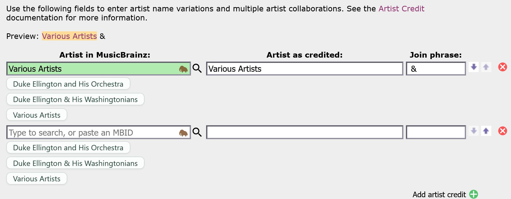

#### Custom fields

Put a 🦣 on any field of any MusicBrainz page: **⚙ → Babies → ＋ Add field**. The built-in fields are listed there too, so you can edit, disable or restore them (**↺ Defaults**).

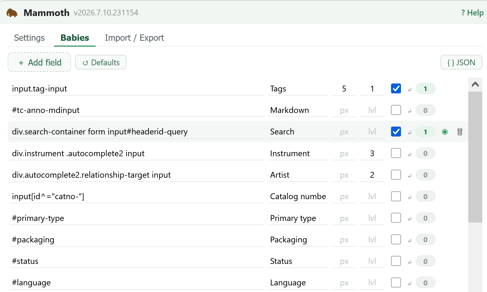

| Column       |                                                                                        |
| ------------ | -------------------------------------------------------------------------------------- |
| **Selector** | its selector (Inspect → *Copy selector*); commas for several; *matches N* checks it    |
| **Label**    | the panel's title, and the field's identity: fields with the same label share one list |
| **px**       | nudge the pin sideways, clear of the field's own icon                                  |
| **lvl**      | where the bar attaches: `0` floats under the field, `N` goes after its Nth ancestor    |
| **↵**        | submit the field's form after a recall, like pressing Enter (tags, header search)      |

Changes apply live. Works on `<input>`, `<select>` and `<textarea>`.

> [!TIP]
> On an entity autocomplete (instrument, artist…), save the value with its MBID appended, e.g. `handclaps b8d84cec-…`. Recalling it then selects that entity directly.

**`{ } JSON`** switches the list to editable JSON, which is also the export (copy) and import (paste + **Apply**):

```json
[
  { "selector": "div.instrument div.autocomplete2 input", "label": "Instrument", "deltax": 16 },
  { "selector": "input.tag-input", "label": "Tags", "submit": true },
  { "selector": "#some-field", "label": "Off for now", "enable": false }
]
```

Keys: `selector` (required), `label`, `deltax` (px), `deltav` (lvl), `submit`, `enable`, and `mbid`, which only means something on the built-in Label and Artist fields.

### Settings

**⚙** opens three tabs: **Settings**, **[Babies](#custom-fields)**, and **Import / Export** (paste many notes, or *Export all*, one note per line or separated by empty lines).

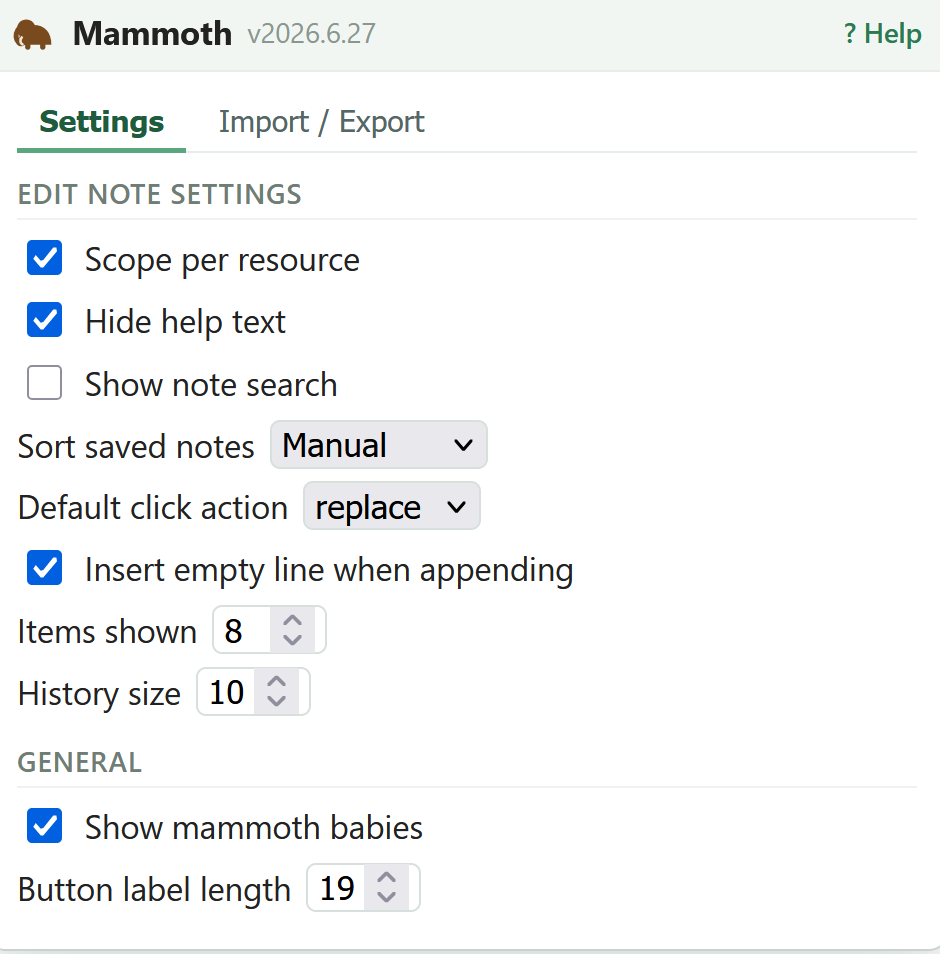

| Setting                        | Default |                                                       |
| ------------------------------ | ------- | ----------------------------------------------------- |
| Scope per resource             | off     | separate notes per edit-note type                     |
| Hide help text                 | off     | hide MusicBrainz's help above the field               |
| Default click action           | replace | or append; right-click does the other                 |
| Insert new line when appending | on      | an appended note starts on a new line                 |
| Show note search               | off     | a search box over the saved notes                     |
| Sort saved notes               | Manual  | or Most used, Recent                                  |
| Button label length            | 24      | characters on pinned buttons (4–80)                   |
| Items shown                    | 6       | rows before the list scrolls                          |
| History size                   | 10      | submitted notes to remember (1–50)                    |
| Show mammoth babies            | on      | the [Mammoth babies](#mammoth-babies) on other fields |

### Shortcuts

In the edit-note field:

| Key          |                                                             |
| ------------ | ----------------------------------------------------------- |
| Ctrl + Enter | submit the edit                                             |
| Ctrl + ↑ / ↓ | cycle through saved notes                                   |
| Ctrl + B / I | bold / italic around the selection or the word at the caret |
| Ctrl + ,     | focus the note search                                       |

On a saved note or a pinned button:

|              |                                       |
| ------------ | ------------------------------------- |
| click        | apply with the default action         |
| right-click  | apply the other way                   |
| Ctrl + click | replace the field and submit the edit |

In a baby field, **Ctrl + ,** opens its panel with the filter focused; ↑ / ↓ and Enter pick a value. (Ctrl is ⌘ on a Mac.)

### Notes

Mammoth adds its panel to every edit-note field on the page, including the ones other userscripts add, such as their own edit windows. How another script hosts it, and adds a baby to its own fields, is in [DEVELOP.md](../mammoth/DEVELOP.md).

---

## Mission Control

One window on a release page that asks the other scripts what the release is missing, lets you review everything they found in one place, and applies it in one go.

- Install: [stable](https://raw.githubusercontent.com/majkinetor/musicbrainz-userscripts/refs/heads/stable/userscripts/mission_control/mission_control.user.js) or [latest](https://raw.githubusercontent.com/majkinetor/musicbrainz-userscripts/refs/heads/main/userscripts/mission_control/mission_control.user.js)
    - Or via bundle: [String Theory](../string_theory/README.md)
- [Changelog](../mission_control/CHANGELOG.md)
- [View users](https://musicbrainz.org/search/edits?auto_edit_filter=&order=desc&negation=0&combinator=and&conditions.0.field=edit_note_content&conditions.0.operator=includes&conditions.0.args.0=Via+Mission+Control)

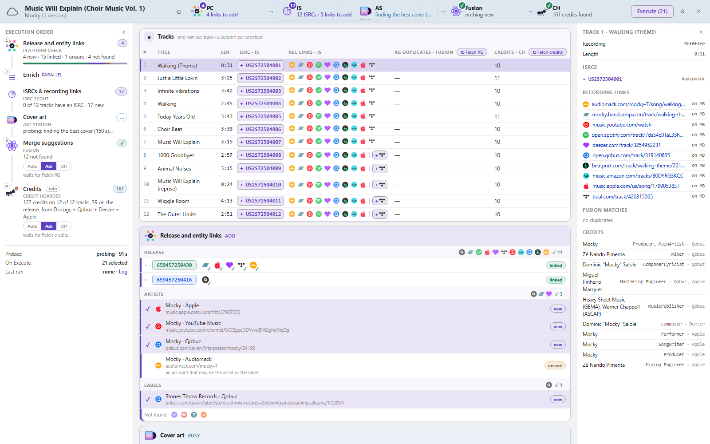

> [!IMPORTANT]
> Mission Control finds and applies nothing on its own: each step is done by another script, which has to be installed. [String Theory](../string_theory/README.md) has them all.

### Features

- **[Probe](#probe)**: one click asks every script what is missing, and each card fills in as its answer comes.
- **[Tracks](#tracks)**: a row per track with its ISRCs, recording links, duplicate recordings and credits.
- **[Release and entity links](#release-and-entity-links)**: the platform pages found for the release, its artists and its labels.
- **[Cover art](#cover-art)**: the best cover found, beside the current front.
- **[Release credits](#release-credits)**: what the credit sources have, with a way into Credit Hoarder.
- **[Inspector](#inspector)**: everything found for one track.
- **[Execute](#execute)**: applies what you selected, script by script, in a fixed order.

Open Mission Control with its icon in the bottom-right corner of a release page. Right-click the icon for the settings.

### Probe

**↻** in the header asks every script at once. The header and the **Execution order** on the left show each step as it works: what it is doing, and how long since it last reported. A step silent for 20 s turns amber.

| Step                     | Script                                        | Finds                                                  |
| ------------------------ | --------------------------------------------- | ------------------------------------------------------ |
| Release and entity links | [Platform Check](../platform_check/README.md) | platform pages for the release, its artists and labels |
| ISRCs & recording links  | [ISRC Scout](../isrc_scout/README.md)         | ISRCs and track links                                  |
| Cover art                | [Art Station](../art_station/README.md)       | a better front cover                                   |
| Merge suggestions        | [Fusion](../fusion/README.md)                 | duplicate recordings in the release group              |
| Credits                  | [Credit Hoarder](../credit_hoarder/README.md) | per-track credits                                      |

Fusion and Credit Hoarder are slow, so each has a switch under its step: **Auto** fetches during the probe, **Ask** (the default) waits for its **Fetch** button in the Tracks header, **Off** leaves it out.

The album links you select in the Release and entity links card are passed on to ISRC Scout before they are added, so the tracks get their links from those albums too.

### Tracks

One row per track, a column per script: the ISRCs and recording links ISRC Scout found, the duplicates Fusion grouped with the recording, and how many credits Credit Hoarder has.

Click a finding to take it in, and again to leave it out; what is taken in is tinted and ticked. New findings start taken in. A link inside a row only opens it. A click anywhere in a track's row also shows it in the [Inspector](#inspector).

Fusion's count opens what Fusion compared under the row: each recording's artist, release, length, ISRCs, AcoustIDs and open edits, with what differs marked. **Check ISRC & AcoustID** looks those up for this group only, and **Open in Fusion** shows the group on Fusion's board.

### Release and entity links

The platform pages Platform Check found, grouped by the barcode each platform gives: the release's own barcode first, in green, then the others, then the platforms that gave none.

| Mark     | Means                                                                                                          |
| -------- | -------------------------------------------------------------------------------------------------------------- |
| new      | found and not on the release; taken in                                                                         |
| linked   | the release already has it                                                                                     |
| withheld | held back by [link confidence](../platform_check/README.md#link-confidence); take it in by hand if it is right |
| unsure   | may be another artist or label; take it in by hand if it is right                                              |

**Artists** and **Labels** list the pages the matched albums name for them. The platforms that found nothing fold into one line of icons. A heading's ✓ count opens the links it already has into rows.

The links are added through [Falcon](../falcon/README.md), out of sight. The card lists each one with its status as it goes; when one fails, **Open Falcon** shows why and lets you retry.

### Cover art

Art Station looks through the platforms the release links for the largest cover, and shows it beside the current front with each one's size. What Execute will do is written under it: enter it as the front and remove the current one, add it beside the current fronts, or nothing when the front already is that cover.

A release without a front cover starts with the cover taken in. Click either image to see both full screen, with **←** **→** between them.

### Release credits

Credit Hoarder's count of credits for each track, from every credit source the release links (Discogs, Qobuz, Deezer, Apple Music). Mission Control only shows them: **Import credits** opens Credit Hoarder on the release's relationship editor with that source, or with all of them, to review and add them there.

### Inspector

Click a track to see, on the right, everything found for it: its ISRCs and where they came from, its recording links (and which are already in MusicBrainz), Fusion's matches and its credits.

### Execute

**Execute** in the header applies what is taken in, step by step in the Execution order; the steps on one line run together. The count on the button is what will be sent. Each card shows its progress, and a step that fails doesn't stop the next one.

Every edit note ends with *Via Mission Control v&lt;version&gt;* and the release.

Click a card's icon or title to switch the card off: it folds to its header, and Execute leaves out what is taken in there. Your selection stays for when you switch it on again.

### Settings

| Setting                                                 | Default |                                                                   |
| ------------------------------------------------------- | ------- | ----------------------------------------------------------------- |
| Probe as soon as Mission Control opens                  | off     | no need to click ↻                                                |
| Reload the release page after an Execute without errors | off     | shows the result at once; waits until every added link is through |

### Shortcuts

| Key         | Where               |                                                   |
| ----------- | ------------------- | ------------------------------------------------- |
| right-click | a link in a row     | take it in or leave it out, instead of opening it |
| ← →         | a cover full screen | the other cover                                   |
| right-click | the corner icon     | settings                                          |

---

## Platform Check

Finds a MusicBrainz release on the streaming and store platforms, checks each match against the release's barcode, format and track count, and adds the good ones to the release.

- Install: [stable](https://raw.githubusercontent.com/majkinetor/musicbrainz-userscripts/refs/heads/stable/userscripts/platform_check/platform_check.user.js) or [latest](https://raw.githubusercontent.com/majkinetor/musicbrainz-userscripts/refs/heads/main/userscripts/platform_check/platform_check.user.js)
    - Or via bundle: [String Theory](../string_theory/README.md)
- [Changelog](../platform_check/CHANGELOG.md)
- [View users](https://musicbrainz.org/search/edits?auto_edit_filter=&order=desc&negation=0&combinator=and&conditions.0.field=edit_note_content&conditions.0.operator=includes&conditions.0.args.0=Platform+Check)

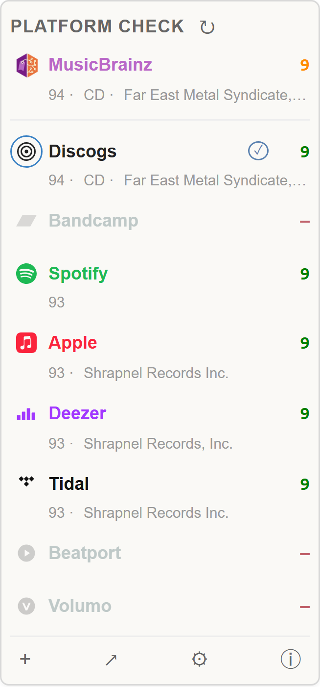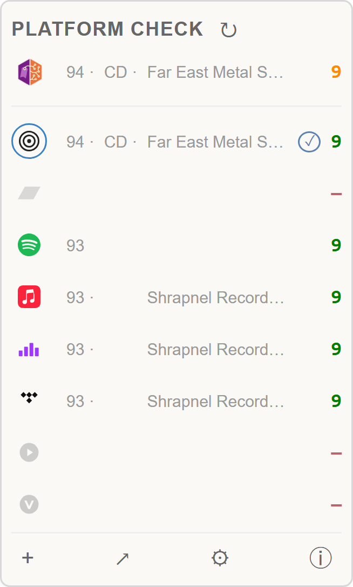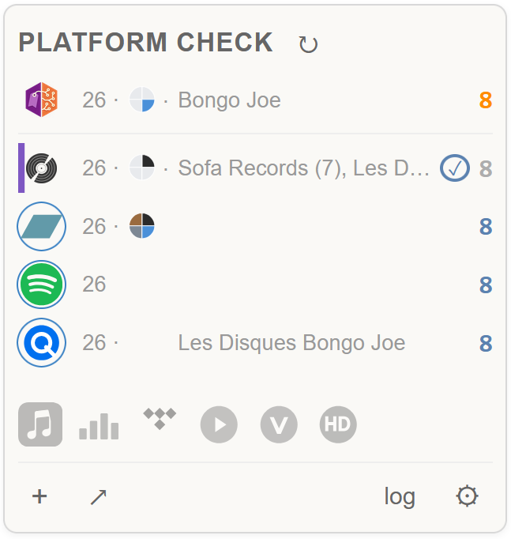

### Features

- **[Dashboard](#dashboard)** on every release page: each [platform](#platforms), with its track count, year, label and format beside MusicBrainz's.
- **[Link confidence](#link-confidence)**: a match with a different barcode or format is a different release, and is not added.
- **[Adding links](#adding-links)** to the release, one or all, in the foreground or in the background, or opening all the pages found.
- **[Pasting a barcode](#pasting-a-barcode)** on a release that has none, or picking one the platforms report: the platforms are checked against it, and an added link adds it too.
- **[Artists and labels](#artists-and-labels)**: the artist and label pages the matched albums name, added to the release's MusicBrainz artists and labels through [Falcon](../falcon/README.md).

### Dashboard

A link already in the release's relationships is used as is. Otherwise each platform is searched: by barcode first, then the platform's own search, Wikidata, and a web search. The platform's details are fetched and shown next to MusicBrainz's, and the result is cached until you press ↻. While the platforms are searched, ↻ spins; click it to stop, which leaves the ones not done yet unchecked.

| Icon and name |                                                                                     |
| ------------- | ----------------------------------------------------------------------------------- |
| coloured      | found                                                                               |
| grey          | found, but the details don't match                                                  |
| faded         | not found                                                                           |
| marked        | already linked in MusicBrainz: a ring, or another mark from *Settings › Appearance* |
| amber bar     | found, with a different barcode                                                     |
| violet bar    | found, in a format this release isn't                                               |

| Track count |                                        |
| ----------- | -------------------------------------- |
| green       | matches MusicBrainz, fetched this scan |
| blue        | matches MusicBrainz, from the cache    |
| amber       | differs from MusicBrainz               |
| ?           | link found, track count unreadable     |
| red —       | not found                              |

Hover a track count for what its colour means.

A release's format is a four-quadrant circle: vinyl, cassette, CD, digital (DVD, SACD and Blu-ray count as CD).

> [!TIP]
> *Compact unmatched providers* shrinks a provider that found nothing (or is still searching) to a dimmed icon at the bottom; it rises into a row once it finds something. *Compact low-confidence providers* does the same for a found release that isn't a clean match (different barcode or format, or withheld), shown with an amber ring; with it off, that row stays, with its tracks, year and label. Discogs and Bandcamp always keep their rows.

### Link confidence

MusicBrainz treats a different barcode or a different format as a different release, so such a link [belongs elsewhere](https://musicbrainz.org/doc/Style/Relationships/URLs#Which_entity_to_link_to). Both checks can run *if they exist* (withhold a link only when its barcode or format is known and differs) or *strictly* (also withhold a link that can't be checked). A withheld link is greyed out and left out of adding and *Open all*.

- **Barcodes** are looked up with every zero-padding (UPC-A, EAN-13, 14 digits). Deezer's answer is checked against the barcode asked for, since it sometimes returns an unrelated album.
- **Formats**: only Bandcamp and Discogs report a format; the other platforms are digital. A Bandcamp or Discogs edition that includes this release's medium ("Digital, CD" on a CD release) passes.
- The **Discogs master** is exempt from both: it goes on the release group, which spans every edition.

### Adding links

| Click                                      | on the name                                            | on the icon                                                                                |
| ------------------------------------------ | ------------------------------------------------------ | ------------------------------------------------------------------------------------------ |
| left                                       | open the page (or the platform's search, if not found) | open the release editor with the link added, for you to review                             |
| right                                      | open the platform's search                             | add the link in the background                                                             |
| middle, or Alt+left                        |                                                        | add the link even when [link confidence](#link-confidence) withholds it, in the foreground |
| Ctrl+middle, or Ctrl+Alt+left (⌘ on a Mac) |                                                        | the same, in the background                                                                |

A middle click (or Alt+click) on a link that passes link confidence is a plain add. One it overrides is marked in the edit note, with the reason: *(added by hand over link confidence: barcode not confirmed)*.

The footer's **+** adds every confirmed link (middle-click or Alt+click: the withheld ones too; with Ctrl, in the background) and **↗** opens them all. A background add opens an inactive tab that submits the edit and closes itself; the Discogs master goes onto the release group the same way. The Discogs master's own ✓ adds just the master: click for the editor, right-click in the background.

> [!NOTE]
> Firefox throttles background tabs hard, slowing a background add down. *Keep background-add tabs awake* plays an inaudible tone, which exempts the tab. It needs **Allow Audio** for musicbrainz.org (padlock → *Autoplay*); without it, the log reports the tone as blocked.

### Pasting a barcode

A release without a barcode can borrow one: copy it (from the cover, a store page, Harmony) and press Ctrl+V anywhere on the release page, outside a text field. The platforms are scanned again as if the release had it, so a barcode lookup finds what a text search misses, and [link confidence](#link-confidence) checks the matches against it.

- The barcode shows next to ↻ in the header; click it to remove it and scan without it.
- A link added from the panel (icon or **+**, in the foreground or the background) puts the barcode on the release too, in the same edit, and the edit note says so.
- It stays with the release, across reloads, until it's removed or the release has a barcode of its own.
- A release that already has a barcode refuses the paste, with an error.

The matched platforms often show a barcode the release lacks. On a release without one, a dashed barcode button next to ↻ counts the barcodes they report. Click it for the list: each barcode with the platforms that report it, the ones in this release's format (physical or digital) first. A barcode from another format, with a wrong check digit, or already on another MusicBrainz release (most likely that edition's) is marked ⚠, the last with a link to that release. Click one to use it as if you pasted it; right-click to copy it. A barcode picked or pasted while the platforms are still being searched stops that search and starts over with it.
- Accepted: 8, 12, 13 or 14 digits, spaces and dashes allowed. A wrong check digit is used anyway, with a warning; MusicBrainz then asks you to confirm it in the editor.

### Artists and labels

A matched album usually names its artists' pages on that platform, and sometimes its label's. **Artists & labels**, in the footer next to **+** and **↗**, lists them against this release's MusicBrainz artists and labels: one row per artist or label, one column per platform. Once the scans finish, the button shows how many links would be added as a purple badge beside its name, like an unread count.

| Mark |                                                                                           |
| ---- | ----------------------------------------------------------------------------------------- |
| ✓    | already linked in MusicBrainz                                                             |
| +    | found, not linked yet: will be added                                                      |
| ⚠    | on another MusicBrainz artist or label: not added; hover shows which, click opens it      |
| +?   | may be the artist or the label (Bandcamp, SoundCloud, Audiomack): left out until taken in |
| ·    | no page, or the platform didn't find the release                                          |

Click a mark to open the page (a ⚠ opens the MusicBrainz artist or label that has it); right-click to take it in or leave it out. **Run N in Falcon** closes the table, queues every row with its new links in Falcon on this page and starts it (with *Close Falcon after a successful import* on, Falcon closes once every link is added, and stays open when one fails); **▾ › Send only** queues them and Falcon waits for you to press Start. Where Falcon doesn't run, it opens in a new tab with the links queued, not started; the edit note names the release. Without Falcon, a row's **✎** opens that artist's or label's edit page with its new links filled in, for you to submit.

- **Which artists**: the release's artist credit (not Various Artists) and each track's, which a compilation needs. Tracks are paired by position, so a platform with another track count gives no track artists.
- **Matching**: by name, ignoring case, accents and *&* / *and*. When no name matches, by position, but only when both credits have as many artists; otherwise the artist is left out, and the log says why.
- **Which platforms**: Discogs, Deezer, Apple Music, Qobuz, Beatport (signed in), YouTube Music, Bandcamp, SoundCloud and Audiomack. Label pages come from Discogs, Qobuz, Beatport and the accounts.
- **Link types**: MusicBrainz types most links itself. Where it offers several and picks none, the link is sent typed: Qobuz as *purchase for download*, Apple Music as *streaming*, Audiomack as *stream for free*.
- **Other locales**: MusicBrainz keeps a Qobuz or Apple Music link in whatever locale it was entered. A page already linked as `gb-en`, `fr-fr`, `de-de` or `/gb/` (or open.qobuz.com, itunes.apple.com) shows ✓, not +. Falcon catches any other locale when it runs and doesn't add the page again.
- Every matched platform counts (a ✓), including one that [link confidence](#link-confidence) withholds for its barcode or format: another edition still has the same artists and labels.

> [!NOTE]
> The pages come from the album answers the scan already read, so they cost no extra platform requests. MusicBrainz is asked once which of the links it already has, and on whom (one request per 100 links): when the scans finish, for the count, and the table reuses that answer. With *Count the links to add* off, it is asked only when you open the table. A match cached before this feature is read again once, on the next scan of the release.

### Platforms

| Platform      | Barcode                                                                    | Login    |
| ------------- | -------------------------------------------------------------------------- | -------- |
| Discogs       | read                                                                       |          |
| Bandcamp      | read                                                                       |          |
| Spotify       | looked up (through [Wallstream](https://tools.wallstream.com/isrc-lookup)) |          |
| Apple Music   | looked up and read                                                         |          |
| Deezer        | looked up                                                                  |          |
| Tidal         | looked up and read                                                         |          |
| YouTube Music | looked up                                                                  |          |
| Amazon Music  |                                                                            |          |
| Qobuz         | looked up and read                                                         | optional |
| Beatport      |                                                                            | optional |
| Volumo        | looked up and read                                                         |          |
| HDtracks      | looked up and read                                                         |          |
| 7digital      | looked up and read                                                         |          |
| SoundCloud    | read from the linked set                                                   |          |
| Audiomack     | read                                                                       |          |

*Looked up*: the barcode finds the album. *Read*: the found album's barcode is checked against the release's.

- **Qobuz**: signed in, matches are verified through its API (track count and barcode); otherwise its store page is scraped, which is slower and throttled. The login is shared with ISRC Scout and Credit Hoarder. Only the token is stored, never the password.
- **Beatport** is behind Cloudflare: without a login, a match found by web search can't be verified, shows `?`, and isn't added. Signed in, it is verified, and ISRC Scout can import its ISRCs.
- **Bandcamp**: bonus tracks that are download-only are counted and marked ⁿ. A Bandcamp barcode that is really a physical package's is ignored.
- **Apple Music** is read from the catalogue its web player uses, anonymously. Of the albums a barcode brings up, only the one with that barcode counts, and the track count is songs only, without music videos. Apple's catalogue differs by country, so a release is looked for in several storefronts at once (the release's own link's, the US, UK, Germany, France, Japan, Brazil and Australia), and when none has it, in all of Apple's storefronts at once, about a second. The log says which storefront a match came from, and the link keeps it. If that catalogue can't be reached, the older iTunes search is used, which gives no barcode.
- **Discogs**: on a CD release, a CD edition is searched first. The release group's Discogs master is checked too.
- **YouTube Music** is read anonymously, through the catalogue its web player uses. Its search finds most albums by their barcode, and the rest by artist and title. It shows no barcode and can return another edition of the album, so every hit must also match on track count and title. A barcode search can also bring up another edition from the same group of versions, with a different barcode. So a match is never taken as barcode-confirmed, and strict barcode mode withholds it. When YouTube Music lists *other versions* of the album, the link's tooltip and the log name them, for you to check. The album page names no label, so the label comes from a song's credits (*Music metadata provided by*, usually the label, sometimes a distributor). Some labels send no credits, and those rows have no label. Links are added as *stream for free*.
- **Amazon Music** is read as a guest (no Amazon account), through the catalogue its web player uses. It has no barcode search and shows no barcode, so an album is found by artist and title only, and taken only when its title and track count both match; when two editions match, the one from the release's year wins. A match is never barcode-confirmed, so strict barcode mode withholds it. The guest catalogue is amazon.com's (US), so an album sold only elsewhere may not be found. The year comes from the album page's date, and the label from its ℗ line. MusicBrainz makes the link a *streaming page* by itself.
- **SoundCloud** can't be searched by barcode; it's read from the linked set, and trusted only when the whole set agrees on it.
- **Audiomack** is read through the API its web player uses, with no login. Its search finds albums by artist and title only, never by barcode, and fans re-upload albums there, so every hit is opened and its barcode read: the one with the release's barcode wins; otherwise one whose track count matches and that has a barcode at all. A song link counts as a one-track release. The label comes from the ℗ line. Links are added as *stream for free*.
- **7digital** is read through the catalogue its web store uses, with no login. It finds an album by its barcode, in the UK store and then the US one, and has the track count, year and label. Without a barcode match, artist and title are searched. The link is to the store the album was found in; MusicBrainz makes it *purchase for download* by itself.
- **Volumo** and **HDtracks** are added as *purchase for download*, since MusicBrainz has no type of their own.

### Settings

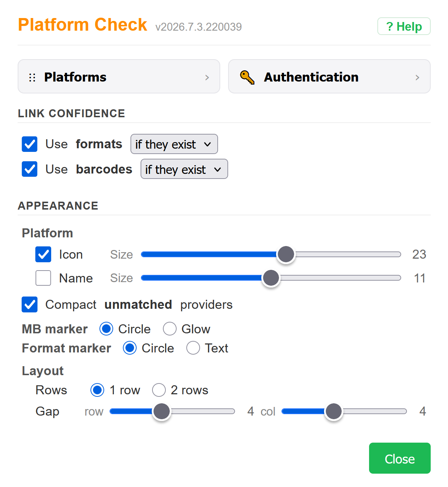

| Section          |                                                                                            |
| ---------------- | ------------------------------------------------------------------------------------------ |
| Platforms        | order them, or leave some out; the button shows how many are on                            |
| Logins           | Beatport and Qobuz; the button shows how many you are signed in to                         |
| Link confidence  | *Use barcodes* and *Use formats* (off, if they exist, strictly)                            |
| Adding links     | *Open the editor in a new tab* (on; off navigates this tab); *Keep background tabs awake*  |
| Artists & labels | *Count the links to add* (on); *Close Falcon after a successful import* (off)              |
| Appearance       | icon and name, their sizes, compact rows, the *In MusicBrainz* and *Format* marks, spacing |

### Shortcuts

| Key                                            |                                                                                                    |
| ---------------------------------------------- | -------------------------------------------------------------------------------------------------- |
| Esc                                            | close the open dialog                                                                              |
| Ctrl+V                                         | on a release without a barcode, [use the pasted barcode](#pasting-a-barcode)                       |
| Alt+click                                      | as a middle click: add a link [link confidence](#link-confidence) withholds; on **+**, all of them |
| Ctrl+middle-click, Ctrl+Alt+click (⌘ on a Mac) | the same, in the background                                                                        |

### Notes

The **Log** keeps every lookup, with a filter per platform.


---

*[String Theory](https://github.com/majkinetor/musicbrainz-userscripts/blob/main/userscripts/string_theory/README.md) — by majkinetor*
