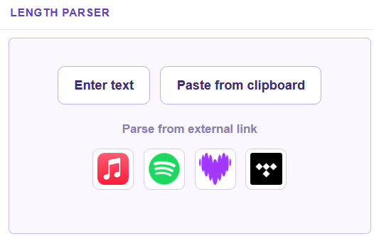
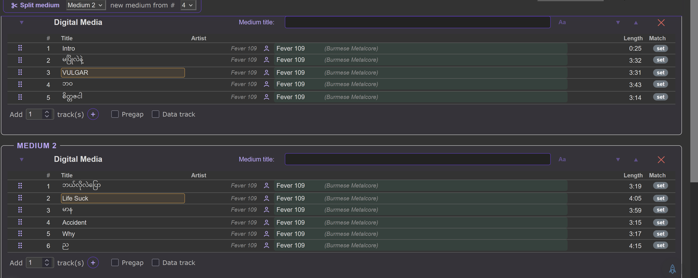
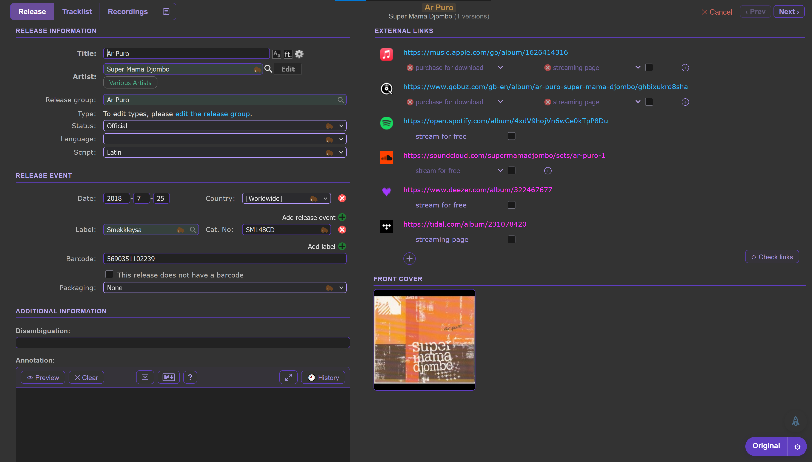
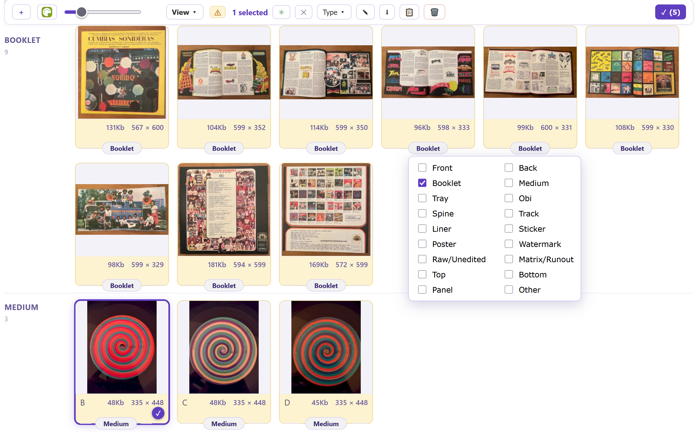
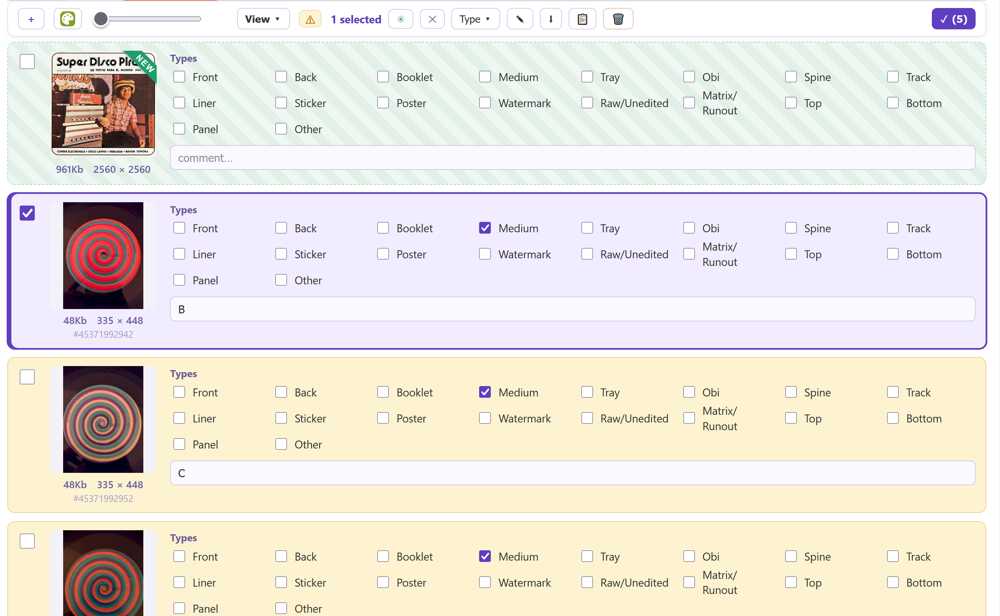

# String Theory — Unified Documentation

*Built 2026-09-27 00:45 · [String Theory README ↗](https://github.com/majkinetor/musicbrainz-userscripts/blob/main/userscripts/string_theory/README.md)*

## Table of contents

1. [Apollo Editor](#apollo-editor)
2. [Art Station](#art-station)
3. [Credit Hoarder](#credit-hoarder)
4. [Fusion](#fusion)
5. [Group Therapy](#group-therapy)
6. [ISRC Scout](#isrc-scout)
7. [Mammoth](#mammoth)
8. [Platform Check](#platform-check)

---

## Apollo Editor

UI and tools for advanced adding and editing of a MusicBrainz release.

- Install: [stable](https://raw.githubusercontent.com/majkinetor/musicbrainz-userscripts/refs/heads/stable/userscripts/apollo_editor/apollo_editor.user.js) or [latest](https://raw.githubusercontent.com/majkinetor/musicbrainz-userscripts/refs/heads/main/userscripts/apollo_editor/apollo_editor.user.js)
    - Or via bundle: [String Theory](../string_theory/README.md)
- [Changelog](../apollo_editor/CHANGELOG.md)
- [View users](https://musicbrainz.org/search/edits?auto_edit_filter=&order=desc&negation=0&combinator=and&conditions.1.field=edit_note_content&conditions.1.operator=includes&conditions.1.args.0=Apollo+Editor)

When you add a release, each track's artist may be set as **plain text with no MBID**, and the recordings are unset. Linking them one by one — searching, picking, occasionally splitting *A feat. B* into two credits — is the slowest part of adding a release. Apollo Editor does the whole tracklist and recording set in one pass and lets you apply the confident matches with one click.

It replaces the native **Tracklist** and **Recordings** editors with two clean, consistent tables with dozens of features. It also makes the **Release Information** tab more functional by suppressing help bubbles and moving external icons to the right column. When adding new releases, the **Duplicates** tab provides a similarity check.

Each takeover is optional and you can flip back to the native editor at any time with the **Original / Apollo** switcher button.

### Features

- **[Tracklist](#tracklist)** — clean artist-picker table with confidence highlighting, change-all-matching scope, split/alias-aware credits, track actions, reordering and keyboard navigation.
- **[Recordings](#recordings)** — side-by-side *Track ↔ Recording* comparison with per-row confidence, character-level diff highlighting, and a suggestion/ISRC-aware recording picker.
- **[Matching](#matching)** — one-click auto-match of artists, recordings and the release label, using the whole release group, with configurable tolerance.
- **[Tools](#tools)** — configurable **Tools** bar (choose/reorder, icon or text, hover-flyout params) plus extra tools, and Revert/Clear for one track or all.
- **[Release Information](#release-information)** — Markdown annotation editor, external links in a right column with a dead-link checker, and a front-cover thumbnail.
- **[Duplicates](#duplicates)** — a red→green **Similarity** score per existing release, expandable to a track-by-track comparison.
- **[Customization](#settings)** — resizable columns, alternate row colours, grid, layouts and match tolerance.
- **Original / Apollo switcher** — every takeover is optional; flip back to the native editor at any time.

### Release Information

**[Settings](#settings)**: *Modify Release information*

Beautification of native page, external links redesign, markdown annotation editor, release cover and array batch removal tools.


- **External links** moved to a right column with a **dead-link checker**
    - **Right-click** a favicon/type to edit it.
    - **Add link (+)** stays a compact **[+]** until clicked, then reads *Paste one or more links*: it accepts **several links at once** and mines URLs out of whatever you paste including full HTML, sorting out duplicates, and setting a link type
- **[Markdown annotation editor](#annotation-editor)** in *Additional information*.
- A **front-cover thumbnail** is positioned under the external links, linking to the release's cover-art page
- Batch removal of array elements - date and labels - using right click on (x) button
- Help bubbles removed

### Tracklist

**[Settings](#settings)**: *Modify Tracklist*

Extremely fast and confident artist matching via multiple mechanisms, advanced tool setup, detailed highlighting, reverting inputs etc.


- **[Auto match artist](#artist-matching)** based on release group, Discogs URL or name
- **Artist selection**
  - Picker with a **confidence** highlight
  - Option to apply pick to **all matching tracks or a single one** (the [Change](#toolbar) in toolbar)
  - **Ctrl-click** a search result to set that artist on every unresolved track
  - Paste an **MBID or a MusicBrainz artist URL** to resolve straight to that artist
  - **Create** unresolved artist (in the background) with multiple fields pre-set (sort, type, external link)
  - **Hover actions**
    - **Split** an artist with a **join-phrase selector**
    - **Delete** split artist
    - **Reorder** artist within split
  - **Aliases** and disambiguation shown in search results and selection
  - **Artist type** icon with a direct link to the artist
  - **Discogs links checking** (with option *Discogs artist link matching*) with quick actions to add them
  - **N unresolved artist** badge with click that positions to the first one
- **Tracks**
  - **Hover actions** - Split & Guess case - left-click to apply to a single track, right-click to apply to every track
  - **Reorder** tracks within a medium with the ⠿ handle — audio tracks among audio tracks, data tracks among data tracks (a drag never crosses the boundary; the ⤓/⤒ buttons do that).
  - **Data tracks** — ⤓ on a track moves it *and everything below it on that medium* into the data section; ⤒ on a data track moves it *and every data track above it* back. Both are in the move column, on hover. Not offered on a disc-ID medium, which MusicBrainz doesn't allow.
  - **Keyboard navigation**
- [Tools](#tools) toolbar with native and new tools
- **Highlighting**
  - Changed tracks (left border color)
  - Artist instances in the tracklist
  - All changed artists after picker
  - Pending changes (recordings, artists)
  - [Enlarge Punctuation](#enlarge-punctuation)
  - [Join-phrase spacing](#join-phrase-spacing)
  - Split and splittable tracks
  - Tracks that "Guess case" can affect
- **Expand all media** when release has them collapsed
  - left-click expands single media
  - right-click expands all media
- Table appearance customization: layout, alternate row colors, grid lines
- Pregap, data track and disc id support
- Revert/Clear all inputs

### Recordings

**[Settings](#settings)**: *Modify Recordings*

Side-by-side _Track ↔ Recording_ comparison with a confidence circle per row and inline highlighting of the fields that differ.


- **[Auto match artist](#recording-matching)** based on release group or name and Cutoff settings
- **Recording picker**
  - MusicBrainz suggestions, free-form search, linked "appears on" releases and confidence highlights
  - Paste a **recording MBID** or a MusicBrainz recording URL into the search field
  - Paste an **ISRC** (with or without separators) to resolve it via MusicBrainz — a single match links immediately, several are listed to choose from
- [Update track and recording](#updating-tracks-and-recordings)
  - **Track to recording** — right-click a recording Title/Artist cell (applied on commit)
  - **Recording to track** — right-click a track Title/Artist cell (applied immediately)
- **Highlighting**
  - [Enlarge Punctuation](#enlarge-punctuation)
  - [Join-phrase spacing](#join-phrase-spacing)
- **Expand all media** — a release with many media loads with most collapsed; left-click expands single media, right-click all of them
- **Unset a link from the row** — hover a recording and click **＋** to drop the link; the track then creates a **new recording** on submit. It sits in the first position on the right, with ↺ (revert to the page-load link) beside it.
- Revert/Clear all inputs
- Video recordings show a small video-camera marker **before** the name, so videos are easy to spot down a column of ragged titles

### Duplicates

**[Settings](#settings)**: *Modify Duplicates*

When release is added, MusicBrainz's **Duplicates** tab lists existing releases you might want to *base your release on* (which means that tracklist and recording mapping will be reused). Apollo augments that native table with **Similarity** attribute.


- A **Similarity** column scores how closely each existing release matches the one you're entering — a folded-title ratio, softened by an **artist** mismatch (×0.75) and a **track-count** gap
- **Click a score** to expand a **track-by-track comparison** beneath the row: each track's *Release* (the existing release) vs *Seeded* (what you're entering) **artist**, **title** and **length**, grouped by medium and with [detailed highlighting](#enable-detailed-highlighting).

The score is computed from the data shown in the native row (no extra requests); the comparison fetches the existing release's tracklist on demand when you open it.

### Annotation editor

**[Settings](#settings)**: *Modify annotations with Markdown*

Edits the [annotation](https://musicbrainz.org/doc/Annotation) as **Markdown** with a live preview. It runs both in the release editor's *Additional information* section and on the standalone **Edit annotation** page for all supported entities.


**Toolbar options**

- **Preview** — a live split view: editor on the left, the annotation rendered updating in real time on the right
- **Clear** — remove all markup from text area
- **Markup** —  switch between editing as Markdown and the MusicBrainz markup
- **Help** — hover for a syntax and shortcut cheatsheet.
- **Maximize** — expand the editor to fill the screen (Esc restores)
- **History** — the annotation's previous versions; select one to display its rendered annotation, with a **↶ revert** button that loads that version back into the editor with markup reconstructed from the rendered HTML

**Editing**

- **Unnamed MusicBrainz entity links are named automatically** — MB `[url]`/`[url|]`, Markdown `[]()`, or a bare URL get the entity name (fetched from the API).
- **Enter** continues the current list; **Tab** on a selection makes a bullet list (Tab again → numbered, again → bullet…); **Shift+Tab** removes the list marker.
- **Ctrl/Cmd+B / +I** bold/italic — wraps the selection, or surrounds the word under the cursor.
- All edits are **undoable** (`Ctrl+Z`).

The Markdown ↔ MB conversion covers links, bold/italic, headings, nested bullet/numbered lists, fenced ` ``` ` ↔ 8‑space code, rules, and encodes a non‑link `[x]` so MusicBrainz doesn't read it as a broken link.

### Tools

Apollo supports all native tools and adds new ones:

1. Native tools: [Track parser](https://musicbrainz.org/doc/How_to_Add_a_Release#The_Track_Parser_(Manual_entry)), Swamp, Reorder, Guess feat, [Guess case](https://musicbrainz.org/doc/Guess_Case)
1. [Search & Replace](#search--replace)
1. [Pattern parser](#pattern-parser)
1. [Length parser](#length-parser)
1. [Merge & split mediums](#merge--split-mediums)
1. [Resize columns](#resize-columns)
1. [External tools](#external-tools)

#### Customization

Native tools are hidden and replaced by a configurable **Tools** bar. It is highly customizable, supports all native tools, some 3rd party tools and adds few new ones.


The **Tools ▾** label opens a menu of the tools that *haven't* been put on the bar. Picking a tool from that menu uses it right away; a tool with parameters joins the bar **for the current session** so its controls are reachable — it returns to the menu next time (use Customize to keep it). Parameterless tools (e.g. *Guess feat.*) just fire on click.

**Customization** lets you:

- **Show tool on the bar** — select which tools sit on the bar and leave the rest in the **Tools ▾** menu
- **Reorder** — drag the handle to set the order
- **Icon / text** — toggle the `[icon]` and `[text]` segments to show either or both

> [!TIP]
> **Collapsing a tool's parameters** — right-click a tool's name to collapse it to just the name (dotted underline); its parameters then **fly out on hover** (and stay open while you're typing in them). Right-click again to pin them back inline. The collapsed/expanded choice is remembered per tool.

#### Search & Replace

Search a string within track titles and replace it. Clicking the tool name starts a fresh session with the current options applied and the fields cleared. Save common patterns under a name and reuse them from the **★** popup. Last 5 historic items are saved automatically. Each saved pattern row has hover actions: **⛓** add/remove it in a chain, **✎** rename, **✕** delete.

- **Chains** — combine several saved patterns into a named **chain** that runs them all in one click, in order (e.g. *All Quotes* = *Quotes* then *Single quote*). Use **＋ Add chain** to create one, then **⛓** on a pattern to add it (a pattern can belong to several chains).
- **Default** — mark one pattern **or** chain as the default with **◉**; it's shown highlighted in the list and is applied automatically the first time you open the Tracklist in a session (with the usual "N titles replaced" toast).
- **Import / Export** — the button in the popup header opens a JSON view of your saved patterns + chains + the default marker (history excluded); paste and **✓ Import** to replace the set. The **History** section (recent patterns) is collapsed by default — click it to expand.


#### Resize Columns

Set column sizes to predefined variants (Fit, Centered, Default).

#### Pattern parser

Fill a medium's tracklist from pasted text using a **pattern**. Type a pattern, paste the list, review the live preview, apply. Like the native parser it **opens seeded with the current tracklist** (using pattern `#. T - A (L)`), so you can also use it to bulk-edit what's already there.


##### Tokens

The following tokens can be used in constructing pattern (case sensitive):

| Token |   Meaning    |
| ----- | ------------ |
| `#`   | Track number |
| `T`   | Title        |
| `A`   | Artist       |
| `L`   | Length       |
| `M`   | Medium       |
| `-`   | Separator    |
| `_`   | Skip noise   |

Anything else is a literal, whitespace is elastic, and a separator (`-` `–` `—` `/` `:`) matches any one of the set (so `# A - T` also parses an en-dash or slash). A capital letter is a token only when it stands alone; prefix with `$` to force it (`Track: $T`) or to spell one out.
Text fields split on the **first** separator (`A - T` → artist = up to the first `-`, title = the rest) — flip the **split: first / last** toggle to split on the last instead.

**Examples:**

- `#. T` → `1. So What`
- `# A - T (L)` → `1 Miles Davis - So What (9:22)`
- `# A - T (_` → drops a trailing `(original edit)`.

**Slices**

For delimiter-free fixed-width text.

A token can carry a 1-based char range — `T[6-]` (6th char to end), `T[6-20]`, `T[-5]` (first 5), `T[~3-]` (last 3) — or a **`[from:to]`** form that runs from `from` up to (excluding) the first `to` character. `from` is a position or a character; `to` is a character:
- `#[1:.]` = position 1 to the first `.` (`12. Title` → `12`), also `#[1:-]`, `#[1: ]`
- `L[(:)]` = from the first `(` to the first `)` (`So What (9:22)` → `9:22`)
- Prefix a character with `~` for the **last** occurrence instead of the first — `L[~(:)]` on `Hide Me (Bop remix) - Stillhead (4:20)` still finds the real length (`4:20`), where plain `L[(:)]` would grab the title's own `(Bop remix)` first

The preview is one row per pasted line: a **match dot** (green = matched · amber = matched via a per-row pattern · red = no match), the raw text, and the extracted **# / artist / title / length**. A messy line can get its **own pattern** in the row's `pattern` cell without disturbing the rest. **Apply** writes only the fields the pattern produced (so a title-only pattern won't touch lengths); its **▾ menu** applies a single field (only titles / artists / lengths / #s) or adds the missing tracks first when you pasted more lines than the medium has.

##### Freezing

For a tracklist where no single pattern fits every line, **🔒 Freeze matched** locks the current pattern onto every row that's still on `«default»` and already matches — those rows keep that pattern from then on. Then adjust the pattern to solve more rows and freeze again; repeat until everything's matched, without the earlier fixes coming undone.

For a one-off messy line you don't want to write a pattern for, **select the span** in its **raw** cell — a little bar pops up (`#` · `A` · `T` · `L` · `✕`); click a field to bind that span to it (it writes a `T[a-b]`-style slice into the row's pattern), or `✕` to clear the row. Both the main pattern box and each row's pattern cell carry a small **✕** to clear them.

#### Length parser

Fill a medium's track **lengths** from any text — the native track parser wants a specific format, but lengths copied off a site (Bandcamp, foobar2000, …) rarely fit (track numbers land on their own lines, etc.). It **greps every duration out of the text** and lets you review the result before writing anything.

After invoking a tool, several options are offered:



- **Enter text** — type or paste a tracklist into the box.
- **Paste from clipboard** — reads the clipboard directly.
- **Parse from external link** — a **favicon per page linked on the release**; click one and it **fetches that page and reads its text right away** (no extra picker step). It narrows to the smallest part of the page that still holds at least a full tracklist's worth of durations, so nav/player/footer noise is skipped (e.g. it pulls all 20 lengths straight off a Bandcamp album page). When you Apply, the **source URL is added to the edit note**. (If a favicon can't load, it falls back to a clickable hostname chip.)
- **Paste a link** — with a link on the clipboard, press **Ctrl+V** anywhere in the window (any page, not only one linked on the release): it is fetched and read exactly like a favicon click, source credited in the edit note. Pasted text that isn't a link goes into the box as usual.

Once you've picked a source, a **‹ Sources** button in the header returns you to the chooser — handy when a fetched page has no parsable text (e.g. Spotify) and you want to try another link:


Whichever source, it detects everything shaped like a time — `5:50`, `1′23″`, `1'23"`, `1:02:03` — and **ignores** track numbers, titles, years and other noise. The detected times appear as an **editable list**, each next to the track it will fill (item 1 → track 1, …). Because alignment is by order:

- **✕** deletes a row (everything below shifts up);
- **+** on a row inserts a length below it (everything shifts down) — for a duration the parser couldn't see (e.g. a single-digit-seconds `1:2`); **+ add length** appends;
- click a value to **edit** it.

**Invalid** times (e.g. `99:99`) are highlighted red and surface a **prominent badge in the panel header** — they **must be fixed or deleted**, and **Apply** stays disabled until the list is clean. An **empty** row is allowed: that track keeps the length it already has (nothing is cleared), so a source that lacks a few lengths can still be applied — insert an empty row with **+** to keep the rest aligned. A counter shows *N lengths ↔ M tracks*. **Apply** writes the lengths to the medium's tracks in order (nothing is written until then; **Esc** cancels, **Ctrl+Enter** applies). The panel is **centred, draggable by its header, and resizable**; on a multi-medium release, pick the medium in the header.

<!-- source: discussion #451 / issue #455 -->

#### Merge & split mediums

Restructure the mediums without redoing the tracklist by hand. Both tools keep every track's **title, length, artist credit and recording** and reset the track numbers.

**Merge mediums** — all 14 one-track media of a release ticked, about to become one medium:


**Split medium** — pick the medium and the track the new medium starts at:



- **Merge mediums** — tick the mediums to merge (all are ticked by default); they all go into the **first ticked** one, in medium order, and the others are removed. Tick a subset to merge only some of them (e.g. `2` and `4`).
- **Split medium** — pick the medium and the track the **new medium starts at**; that track and everything after it move to a new medium, inserted right after the original, with the same format. Later mediums shift down by one.

Picking either tool from the **Tools ▾** menu only shows its controls; it runs when you click its name. Nothing is submitted: review the result and enter the edit as usual.

What MusicBrainz records is what doing it by hand produces: an *Edit medium* (tracks added, existing recordings reused) plus a *Remove medium* per merged-away medium, or an *Add medium* for a split. The moved tracks get new track MBIDs; the recordings don't change. For editors without auto-edit privileges, *Remove medium* waits for votes, so until it passes the release briefly shows the old mediums next to the merged one.

A medium with a disc ID is refused: MusicBrainz locks its tracklist.

<!-- source: issue #615 -->

#### External tools

Those tools need 3rd party userscript:

- **Guess punctuation** — runs kellnerd's [guess-unicode-punctuation](https://github.com/kellnerd/musicbrainz-scripts#guess-unicode-punctuation) (curly quotes, dashes, ellipses…) over the release. **Requires that script installed** — the tool only appears when it is.

#### Tools integration

Apollo can surface a fire-and-forget button that *another* userscript adds to the page, so you can use it without leaving the Apollo view. Such a tool behaves like any built-in one: it shows in the **Tools ▾** menu and in **Customize…**, where you can pin it to the bar, reorder it, and choose icon/text (the choice persists). It only appears while the providing script is present. Two ways in:

**Recognised buttons** — Apollo adopts a known button *unmodified*, matched by its visible text (e.g. **Guess punctuation** above). Adopting another is a one-line registry entry in Apollo.

**Convention (for script authors)** — tag any element `class="apollo-tool"` and Apollo offers it, no Apollo change needed:

```html
<button class="apollo-tool" data-apollo-label="My tool" data-apollo-icon="★">…</button>
```

- `data-apollo-label` *(optional)* — menu/button label (falls back to the element's text).
- `data-apollo-icon` *(optional)* — a short text glyph **or** a `data:` / `http(s)` image URL (rendered as a small image); default 🔧.
- `data-apollo-id` *(optional)* — stable id for the saved bar/menu placement (falls back to the element's `id`, then a slug of the label).

Activating either kind **clicks the element**, then Apollo re-reads the tracklist so its grid reflects the change. This fits tools that are **parameterless or pop their own settings on click** (e.g. a Track parser); tools that need their controls rendered *inline* in Apollo's bar aren't supported.

### Matching

Apollo can automatically match unresolved **artists** and **recordings**. Both work the same way: a *Match* button, a per-row **confidence**, and the single best candidate applied automatically while anything uncertain is left out.

If _Auto-match on start_ is enabled in the [settings](#matching-options), matching will be automatically started on entering add/edit release page.

#### Artist matching

Apollo resolves each unmatched track artist in stages, most-confident first:

1. **Releases from same release group** — it pulls the per-track credits (with MBIDs) from other versions of the album and matches by track title. Other editions usually credit the same songs to the same artists, so this resolves most cases at the highest confidence — especially various-artists compilations.
2. **Exact identity (name or alias)** — an alias is just an alternative name, so name and alias are resolved by **one** check: the artist is linked confidently only when **exactly one** MB artist carries the credited string as its name *or* an alias. This is alias-aware, mirroring MusicBrainz's own [duplicate-artist](https://musicbrainz.org/report/DuplicateArtists) check — so a name that is *also* another artist's alias counts as **ambiguous** and is left for you to pick, not guessed. The badge shows **NAME** or **ALIAS** to say which matched (same confidence either way). It also catches an exact name the fast search under-ranks below a look-alike (*Tee Vee* below *Tee-vee*) and an alias-only credit (*Don Abi* → the artist named *Abiodun*), neither of which the plain name index resolves on its own. "Exactly one" is only trusted when MusicBrainz returns **every** artist matching the name: its search doesn't rank exact matches first, so for a common name (*Kim* matches 2,777 artists) a single exact match among the results proves nothing — such a name is left for you to pick (or for the co-credit step below).
3. **Existing artist credits (co-occurrence)** — when there's *no* unique exact identity (a common name several artists share, a featured "Joni", "Eva", …), Apollo asks MusicBrainz for a recording that credits that name **alongside an artist already known on this release** — a split co-artist or the release artist (never *Various Artists* or another special-purpose artist). If exactly one artist has been co-credited that way, it's the answer, applied with a magenta **CRED** badge. Only an exact credited-as / name hit counts — no fuzzy matching — and a tie is surfaced as candidates to pick from rather than guessed.

Anything none of these resolve is left as a low-confidence top candidate for you to confirm or change.

Each resolved artist is tagged by how it matched (release-group, exact name, exact alias, credit co-occurrence, pre-existing, or manual).

**Confidence levels**:

1. 🟢 Green colored artist box means the artist was matched confidently (release-group, unambiguous exact name or alias, or credit co-occurrence).
1. ⚪ White search box means artist is unresolved or low-confidence, for user to pick; these are what the "N unresolved" counter counts and what clicking that badge jumps to.

#### Discogs artist links

When the release carries a **Discogs link** (read from the page), Apollo uses it for artists — controlled by the *Discogs artist link matching* [setting](#matching-options) (on by default).

##### Match by URL

Before the name search, each track artist is matched by its Discogs URL (taken from the release's Discogs tracklist) against MusicBrainz's URL relationships — a strong, human-verified signal. A single linked MB artist is applied directly with a teal **DISC** badge; several linked artists are offered as candidates to pick from.

This includes **featured artists** split out of the title. Discogs credits them as an extra-artist (not a main track artist) whose role varies — *Featuring* on some releases, *Vocals* / *Backing Vocals* / *Rap* / *MC* on others — so Apollo reads **any performing role** (vocals, rap, voice, performer, narration…; not producers, remixers or instrumentalists) and matches a feat slot by its Discogs artist link, keyed to the slot's credited name, by title or (when titles differ but the track counts agree) by position. That link is often the only reliable bridge, since the split name is frequently just an alias of the MB artist.

##### Adding link

For a slot whose Discogs URL is known, the artist-type icon becomes an actionable Discogs icon when there's something to do — click it to act:
  - unresolved slot → **teal 🔗**: creates the artist seeded with the Discogs link (same as `＋`);
  - matched artist with **no** Discogs link → **teal 🔗**: adds it (opens the artist's edit form pre-seeded, confirmed on return);
  - the Discogs URL already links a **different** MB artist (conflict) → **amber ⚠**: clicking still adds it to this artist, but you're warned which artist it currently points to;
  - the artist already links a **different** Discogs page than the release credits (mismatch) → **amber ⚠**: the tooltip names both pages, and clicking adds the release's link to the artist anyway. A mismatch often means the wrong artist was matched, so it's worth a look first.
- **Badge.** A teal **🔗 N links** badge in the toolbar counts the artists whose Discogs link needs attention — **missing + mismatched** (the tooltip breaks it down). It stays until they're resolved; each click steps to the next such track and focuses its credit field. Adding a link updates every track crediting that same artist at once.

Already-linked artists are verified for free via MusicBrainz's internal entity endpoint, so the rate-limited URL lookup only runs for artists actually missing a link — a fully-linked release is near-instant. Clearing or reverting all artists doesn't trigger a re-check (it runs again when you Match).

#### Recording matching

Apollo fetches **every recording in the release group in one request**, indexes them by title, and matches each track **locally** — choosing the highest-confidence candidate (title + artist + length). It only falls back to a per-track MusicBrainz lookup for the tracks the release group can't satisfy. A full release therefore matches in roughly one fetch rather than one request per track.

**Matching by duplicates (position + similarity).** A title-only match misses when editions word the same track differently (*Salongo Part 1* vs *Salongo, Pt. 1*, *Part 1* vs *Pt 1*). So when the title match doesn't clear the cutoff, Apollo also looks at the **same position** across the release's other editions — and, if those come up short, across releases MB holds under the *same title + artist* in **other release groups** (possible duplicates). A candidate from that slot links only when its title is **similar enough** to the track (≈60% by edit distance, or one contained in the other) *and* its length agrees — so a differently-worded duplicate resolves while an unrelated song that merely shares a slot in a divergent edition does not. It reads each edition's tracklist by position in one request and only reaches outside the RG when the editions don't answer.

*Credited as* values on track and recording don't influence matching.

**Confidence levels**:

| Color |     Meaning      |                               Description                               |
| :---: | ---------------- | ----------------------------------------------------------------------- |
|   🔵   | Exact            | All fields are the same                                                 |
|   🟢   | Tolerance        | Matches within tolerance defined in [settings](#matching-options)       |
|   🟡   | Near             | A single field differs, or the length gap is 3–15s (a near-miss)        |
|   🟠   | Low              | Two fields differ or the length gap alone is >15s (substantially wrong) |
|   🔴   | Very low         | All three differ and the length gap is >10s (almost certainly wrong)    |

The *Cutoff* option in the recording toolbar sets the acceptable confidence.

#### Updating tracks and recordings

When a track's title or artist differs from its linked recording, you can copy the track's value down to the recording (applied when you submit the release — the same as the native checkboxes). Right-click the recording-side **Title** or **Artist** cell:

| Gesture | Action |
|---|---|
| **Right-click** | Toggle copy for that one cell |
| **Ctrl + right-click** | Toggle both fields (that differ) on the row |
| **Alt + right-click** | Toggle that field down the whole column (every differing row) |
| **Ctrl + Alt + right-click** | Toggle both fields on **every row** — the whole side of the table (#443) |

While a copy is on, the cell previews `→ New ` followed by the recording's ~~original~~ value, struck through. Cells that offer a copy carry a subtle underline; a real mismatch stays red.

This mirrors MusicBrainz's **native** update checkboxes exactly — so a copy is offered whenever the native editor would show its checkbox, **including casing-only differences** that Apollo's match tolerance / *Ignore casing* setting would otherwise treat as a match. The tolerance settings still drive the confidence colouring; they no longer hide the copy. Right-clicking a recording cell with no difference does nothing (the browser's context menu is suppressed there).

The same gestures work on the **track side** too (setting the track from its recording), applied immediately. Because the two sides copy in opposite directions, **Ctrl + Alt** covers one side per gesture — run it once on a recording cell and once on a track cell to sweep the whole table.

### Toolbar

| Control | Default | What it does |
|---|---|---|
| **Change** | all matching tracks | Scope of **every** artist action (pick, *Credited as*, join, add/remove/reorder/split): apply to just the edited track, or propagate to every track sharing the same artist credit (whole-credit match, like MB's native "change all matching tracks") |
| **⚡ Match** | — | Match all still-unresolved track artists or recordings (used when *Auto-match on start* is off)|
| **▾** | — | **↺ Revert all** — every track back to page-load state<br>**✕ Clear all** — empty all artists in tracklist or set new recordings|
| **Tools** | — | The tools you choose, each shown at its place on the bar. Tools you don't put on the bar live under the **Tools ▾** menu, which also holds **Customize…** |
| **Cutoff** | 🟡 near | Matches only records at or above the chosen confidence level and leave other unmatched |

### Settings

Accessed using the **⚙** button on the interface switcher button **Original / Apollo**. Settings are saved via the userscript manager's own storage — covered by its backup/restore and cross-browser sync, unlike a plain browser localStorage save — and persist across releases.

#### General

If any of the following options is on, script replaces the native interface elements for the Apollo versions:

- [Modify Release Information](#release-information)
- [Modify Tracklist](#tracklist)
- [Modify Recordings](#recordings)
- [Modify Duplicates](#duplicates)
- [Modify annotations with Markdown](#annotation-editor)
- [Modify header and footer](#modify-header-and-footer)
- [Zen editing](#zen-editing)
- [Auto confirm release submissions](#auto-confirm-release-submissions)

##### Modify header and footer

Hide the native step-tab row and footer and show a compact step switcher instead.

##### Zen editing

Hides MusicBrainz header and footer for minimal distraction.

Hide everything above the Apollo nav bar - the site header, release title and entity tabs and the page footer — leaving just the Apollo interface.

The release title / artist (with version count) is shown in the navigation bar.

##### Auto confirm release submissions

When another site *seeds* the Add/Edit-release form, MusicBrainz shows a confirmation page before opening the editor; Apollo clicks its submit button so you skip that step (integrating [chaban's *Auto click confirm form submission*](https://greasyfork.org/en/scripts/536999) script). Acts only on that seed-confirmation page; add `?skip_confirmation` to a seed URL to bypass it once.

The interface modifications (everything above except *Auto confirm*) are toggled on/off together using the switcher button.

#### Matching options

| Option | Default | What it does |
|---|---|---|
| **Auto-match on start**| Off<br>Off<br>On<br>On | **Tracklist** - Matches artists automatically when the page loads<br>**Recordings** - Matches recordings automatically when the page loads<br>**Label** - When the release's label name has exactly **one** exact MusicBrainz match, selects it automatically on load. Ambiguous names (e.g. *Columbia* → several labels) and names with no exact hit are left for you to pick<br>**Artist** - Same for the release **Artist** field: a seeded/typed release artist with exactly **one** exact MusicBrainz match is selected automatically on load; ambiguous or no-hit names are left for you to pick|
| **Discogs artist link matching**| On | When the release has a Discogs link, match track artists by their [Discogs URL](#discogs-artist-links) (before the name search) and offer to add/create missing links|
|**Length tolerance**|5| Allow a length gap within N seconds (use `0` for exact)|
|**Title tolerance**|1| Allow up to N differing characters in the title (use `0` for exact)|
|**Ignore casing** |On|Case / accent / spacing-only differences don't count|
|**Ignore punctuation**|On| *& → and*, brackets, quotes, dashes and dots are stripped before comparing|
|**Enable detailed highlighting**| On | Highlights the exact differing characters|

##### Enable detailed highlighting

 Highlights the exact **differing characters** in a mismatching **title and artist** (including a casing- or punctuation-only difference the match would otherwise tolerate), instead of the whole field, and shades a **length mismatch** by how large the gap is (faint under a second → solid red past five).

For artists this works at two levels: a **different linked artist** is boxed whole, while a **credited-as** difference on the *same* artist (e.g. *DJ Vadim* vs *Vadim*) has just its differing characters highlighted — the link is kept and matching is unaffected (credited-as never influences matching), so you can *see* the difference without it being treated as a mismatch (#444).

#### Appearance

Applied to **both** tables (Tracklist and Recordings).

| Option | Default | What it does |
|---|---|---|
| **Row layout** | normal | Row density: `compact` (tight) · `normal` · `cozy` (airy). |
| **Alternate row colors** | Off | Tints every other row (and deepens the matched-box green on alternate rows). |
| **Show grid** | Off | Toggle grid lines on rows and/or columns |
| **Enlarge punctuation** | 3px | How much to enlarge confusable characters, in pixels (`0` = no enlargement; the invisible-char / missing-space markers still show under [detailed highlighting](#enable-detailed-highlighting)) |

### Keyboard

#### Tracklist

|         Key         |            Description            |
| ------------------- | --------------------------------- |
| Down, \<ENTER\>     | focus cell in the next row        |
| Up, SHIFT+\<ENTER\> | focus cell in the previous row    |
| Tab                 | focus cell in the next column     |
| SHIFT+Tab           | focus cell in the previous column |

By default, moving between cells keeps the **caret column** where it was (clamped to the destination's length) instead of selecting the whole field — so you can keep typing or fix casing at the same spot rather than overwriting. Turn off **Keep caret position on row navigation** (gear → Appearance) to restore the old behavior, where arriving on a cell selects the whole field so the next keystroke replaces it.

#### Length parser

| Key        | Description                                                               |
| ---------- | ------------------------------------------------------------------------- |
| Ctrl+V     | with a link on the clipboard: fetch that page and read its track lengths  |
| Ctrl+Enter | apply                                                                     |
| Esc        | close without applying                                                    |

#### Enlarge punctuation

When [detailed highlighting](#enable-detailed-highlighting) is on:

- Every character that is confusable (a straight `'` `"` `-`, a curly `’`, an en/em dash) is **enlarged**.
- Every invisible character (a no-break or zero-width space, a tab etc.) is rendered as a **visible glyph** with a highlight — so a missing / wrong space can never hide.
- Tooltip shows its Unicode name and exact codepoint.

The _Appearance → Enlarge punctuation by N px_ setting controls **only the enlargement size** — `0` means *no enlargement*, **not** off: the invisible glyphs and missing-space markers still show (they're part of detailed highlighting). To turn the marking off entirely, uncheck **Enable detailed highlighting** (#443).

On the **Tracklist** tab the **Title** can't be styled while it's an editable `<input>`, so it's shown as styled read-only text that **drops into the native input the moment you click or tab into it** — with the caret landing on the character you clicked, so positioning it takes one click and not two ([#601](https://github.com/majkinetor/musicbrainz-userscripts/issues/601)).

##### Join-phrase spacing

A join phrase between two artists should have a space on both sides (`" & "`). Where one is **missing** a highlighted `␣` is drawn (`Gandhabba &␣Render`), and a join phrase **missing entirely** between two artists shows `␣?␣`

Feature works on both the [Recordings](#recordings) and the [Tracklist](#tracklist) artists where the join input is outlined and flagged.

Shares the _Enlarge punctuation_ master switch (`0` = off).

##### Join-phrase presets — keyboard (#419)

The join input's preset dropdown (▾) is fully keyboard-driven:

| Key | Action |
| --- | ------ |
| *typing* | opens the dropdown filtered to matching presets (`fe` → `feat.` / `featuring`), top hit pre-highlighted |
| <kbd>↓</kbd> / <kbd>↑</kbd> | open the list / move the highlight (wraps) |
| <kbd>Enter</kbd> | pick the highlighted preset (or commit the typed value when the list is closed) |
| <kbd>Esc</kbd> | close the list |

### Dark theme

Apollo supports dark theme that can be enabled via [Stylus](https://github.com/kellnerd/userstyles#musicbrainz):




### Persistence

These are remembered automatically as you use the UI:

- **Column widths** — drag a column border to resize; reset/auto-fit via the **Resize Columns** tool.
- **Suggestions collapsed** — the picker remembers whether its *suggestions* section is collapsed.
- **Tools bar** — which tools are on the bar, their order, each tool's icon/text choice, and whether its parameters are collapsed.
- **Apply mode**, **Cutoff**, and all dialog options above — saved on change.

---

## Art Station

A cover and event art editor for MusicBrainz: one gallery to view, sort, reorder, retype, comment, remove, download and source a release's art, all staged and applied on **Enter edit**.

- Install: [stable](https://raw.githubusercontent.com/majkinetor/musicbrainz-userscripts/refs/heads/stable/userscripts/art_station/art_station.user.js) or [latest](https://raw.githubusercontent.com/majkinetor/musicbrainz-userscripts/refs/heads/main/userscripts/art_station/art_station.user.js)
    - Or via bundle: [String Theory](../string_theory/README.md)
    - [Picker](../art_station/as_picker/README.md) companion: [install](https://raw.githubusercontent.com/majkinetor/musicbrainz-userscripts/refs/heads/main/userscripts/art_station/as_picker/as_picker.user.js)
- [Changelog](../art_station/CHANGELOG.md)
- [View users](https://musicbrainz.org/search/edits?auto_edit_filter=&order=desc&negation=0&combinator=and&conditions.0.field=edit_note_content&conditions.0.operator=includes&conditions.0.args.0=Art+Station)


### Features

- **Gallery** on a release's *Cover art* and an event's *Event art* tab: thumbnail size, grid or detailed view, group by [type](https://musicbrainz.org/doc/Cover_Art/Types), sort by position, type, dimensions or date.
- **Reorder** by dragging one cover or a whole selection. Select with right-click or right-drag.
- **[Actions](#actions)** on one cover or the selection: type, comment, remove, download, report.
- **[Add images](#add-images)**: files, folders, zips, URLs, MH Covers, reverse-image search.
- **[Full-screen viewer](#full-screen-viewer)** with zoom, pan and slideshow.
- **[File names ⇄ types](#file-names--types)**: a downloaded archive re-adds with its types and comments.
- **[Applying changes](#applying-changes)** as parallel edits, with automatic retries.

| Grouped by type | Detailed view |
|---|---|
|  |  |

### Actions

- **Set type**: tick one or more types; right-click a type to set only that one.
- **Set comment**: Enter moves to the next cover's comment. With [Mammoth](../mammoth) installed, the comment field gets its 🦣 memory.
- **Remove**: marks the cover for removal.
- **Download** as a zip, [named by type](#file-names--types).
- **Report** in HTML or Markdown: inline, captioned, or a table (position, file, resolution, size) that also serves as the archive's `README.md`.

### Add images

| Source | |
|---|---|
| Files | drop or pick; the type is [guessed from the name](#file-names--types) |
| Folder | drop one, or Shift-click the drop zone; one level of subfolders, up to 100 files |
| Zip | drop or pick one; unpacked in the browser like a folder. An Art Station download restores each cover's types and comment. |
| URL | **Ctrl+V** a URL anywhere on the gallery, or the **URL (N)** panel: one import per source the release links, plus [registered providers](#plugin-api). Right-click **URL (N)** to import from all of them. Needs [Enhanced Cover Art Uploads](https://raw.github.com/ROpdebee/mb-userscripts/dist/mb_enhanced_cover_art_uploads.user.js). |
| [MH Covers](https://covers.musichoarders.xyz) | pick a cover; it's staged as a new one |
| Reverse-image search | 🔍 on a cover searches Yandex, Google Lens, TinEye or Bing for a bigger copy. With the [Picker](../art_station/as_picker/README.md), clicking the copy on the results sends it back to the gallery. |

> [!NOTE]
> Zips may be stored or deflated; encrypted and ZIP64 archives are skipped with a message. Pasting into an input (the URL box, a comment) is left to that input.

### Full-screen viewer

← → move between covers, ↑ ↓ zoom (the level is remembered). When zoomed, the image follows the mouse (switch it off in ⚙ to drag instead). **P** runs a slideshow, **Enter** edits the comment, **Delete** marks the cover for removal. See [Shortcuts](#shortcuts).

### File names ⇄ types

When an added image has no type, it's guessed from its file name (switch it off in ⚙):

| Type | Name contains |
|---|---|
| Front | `front`, `folder`, `cover`, `frontal`, `recto` |
| Back | `back`, `rear`, `verso` |
| Booklet | `booklet`, `inlay`, `insert` |
| Medium | `cd`, `disc`, `disk`, `vinyl`, `medium`, `label`, `side a/b/…` |
| *by name* | `tray`, `obi`, `spine`, `sticker`, `liner`, `poster`, `matrix`, `runout`, `track`, `top`, `bottom`, `raw`, `unedited`, `watermark`; for events `flyer`, `ticket`, `setlist`, `banner`, `program`, `schedule`, `map`, `logo`, `merch` |

Matching is by whole word and order-aware: `back cover` is **Back**, and *Super Disco Pirata* is no type at all.

Downloads are named `<NN> <types> <comment>.<ext>`, with `none` for no type, e.g. `09 front,sticker Front cover with the sticker.jpg`.

### Applying changes

**Enter edit** lists the staged operations and submits them as MusicBrainz edits, with one edit note and *make votable* for all.

- Removes, edits and uploads run in parallel; one reorder edit runs last and sets the final order.
- **Repeat** re-runs only the failed operations, and the reorder after them.
- With *Automatically repeat failures* on (the default), Art Station retries the failed operations by itself, up to 10 times or 10 minutes. The pause between attempts grows as they pile up. A footer row shows the attempt and the countdown; **Close** stops it.
- While a run is in progress, leaving the page asks first, and a click outside the dialog doesn't close it.

> [!NOTE]
> *Upload timeout* (⚙, default 10 minutes, at most 120) is how long one file may take to reach the Internet Archive. Raise it for large PDF booklets when the Archive is slow; the failure message says when this limit was hit.

### Plugin API

Another userscript can add its own source. It appears as **Import from &lt;name&gt;** in the URL panel, and its images are staged like any other. A site script that's logged in to a fan site, say, can fetch with its own session and hand the images over:

```js
window.ArtStation?.registerProvider({
  name: 'SpringsteenLyrics',              // the button label
  id: 'springsteen',                      // optional de-dupe key (defaults to name)
  icon: 'https://example.com/favicon.ico',// optional
  match: 'springsteenlyrics.com',         // optional: string | string[] | RegExp | (url) => boolean
  async run(ctx) {                        // ctx = { mbid, entity: 'release'|'event', artist, title, url, link, links }
    return [{ url: 'https://…/front.jpg', types: ['Front'], comment: '' }];
  },
});
```

- **`match`** shows the button only when the release or event links a matching URL; those are passed as `ctx.link` and `ctx.links`.
- Each returned item is `{ types?, comment? }` plus one image: **`url`** or **`dataUrl`** (preferred: Art Station fetches it itself), or **`blob`** with its **`source`** URL.
- If your manager isolates `window` between scripts, dispatch `artstation:register-provider` with the provider as `detail` instead.

### Shortcuts

| Key | Where | |
|---|---|---|
| Ctrl+V | gallery | import the URL on the clipboard |
| ← → ↑ ↓ | gallery | move between covers |
| Enter | gallery | open the cover full-screen |
| Space | gallery | select or deselect the cover |
| Delete | gallery, viewer | mark for removal |
| ← → / ↑ ↓ | viewer | previous, next / zoom |
| Enter | viewer | edit the comment |
| D | viewer | download the original |
| P | viewer | slideshow |

| Mouse | |
|---|---|
| right-click / right-drag | select / paint-select covers |
| right-click **URL (N)** | import from every source |
| wheel on the size slider, or right button held + wheel | resize thumbnails |
| viewer: wheel | zoom toward the cursor |

### Notes

- [Development documentation](../art_station/DEVELOP.md)

---

## Credit Hoarder

Imports track and release credits from streaming services and databases into MusicBrainz relationships, with a review step so only entities that really exist in MusicBrainz are linked.

- Install: [stable](https://raw.githubusercontent.com/majkinetor/musicbrainz-userscripts/refs/heads/stable/userscripts/credit_hoarder/dist/credit_hoarder.user.js) or [latest](https://raw.githubusercontent.com/majkinetor/musicbrainz-userscripts/refs/heads/main/userscripts/credit_hoarder/dist/credit_hoarder.user.js)
    - Or via bundle: [String Theory](../string_theory/README.md)
- [Changelog](../credit_hoarder/CHANGELOG.md)


It appears on a release's **Edit relationships** page when there's something to import: a linked [provider](#providers) (or one [Platform Check](../platform_check/README.md) found), or track titles that name a remixer. See [Style / Relationships](https://musicbrainz.org/doc/Style/Relationships) for the guidelines.

> [!TIP]
> [Group Therapy](../group_therapy/README.md) adds batch helpers for the same page: group delete, highlight, copy and move credits.

### Features

- **[Import bar](#import-bar)**: pick a source and the import options.
- **[Review table](#review-table)**: confirm each credited name's MusicBrainz match, with automatic matching, search and entity creation.
- **[Consolidated import](#consolidated-import)** of every source at once, de-duplicated.
- **[Instant Fill](#instant-fill)** writes the confirmed relationships into the editor in one pass.

The flow: Credit Hoarder fetches the credits and lists every artist, label and place in the review table; clear matches are selected for you. You resolve the rest (or leave them out) and confirm. Instant Fill adds the relationships, and you review and submit the edit as usual.

### Import bar


- **Import credits:** one icon per source available on this release. Click to import; right-click opens the source's page. Several sources can run in one session; their edits stack.
- **⚛ All** (with more than one source) runs a [consolidated import](#consolidated-import).

| Option | |
|---|---|
| Per-track credits | import track credits as well as release credits |
| Move release credits to tracks | put release-level recording credits (instruments, vocals, producer, mix…) on every track |
| Use works | off: never touch works. *create none* (default): use existing works only. *create needed*: also create a work a composer, lyricist or writer credit needs. |
| Equivalence sets | skip a role when an equivalent one is already there (writer ≡ composer) |
| Duplicate roles | skip a role the recording already has |

### Review table

One row per credited entity:

| Row | |
|---|---|
| ⚪ | matched automatically |
| 🟢 | picked by you |
| 🟡 | matched by URL, but the names differ; worth a look |
| 🔴 | unresolved |

For sources that give an artist URL (Discogs, Tidal, Metal Archives), a chip shows it: ✓ already linked in MusicBrainz, 🔗 add it (opens the edit page prefilled), ⚠ linked to a different entity.

**Automatic matching**, in this order:

1. **Source URL**: the artist is linked to that URL in MusicBrainz.
2. **Release context**: one of the release artist's related artists (band members, collaborators) carries the name or alias. So *George Harrison* on a Beatles release, although MusicBrainz has several.
3. **Exact name or alias**, when exactly one MusicBrainz artist carries it (*Don Abi* → *Abiodun*). A common name like *Kim* can't be proven unique and is left for you, with the reason on the row.
4. **Co-credit**: a recording that credits the name alongside the release artist (*Options › Matching*, on by default).

When name and URL disagree, the row is left for you. Each match is cached with how it was made (`url`, `context`, `name`, `alias`, `co-credit`, `user`). Credits with a URL are cached by that URL; name-only credits are cached per release, so a bare name never carries over to another release. 🔄 clears the cache and matches again.

On a row:

- **Search** by name, or paste an MBID or a MusicBrainz URL.
- **+** opens MusicBrainz's create page prefilled (name, sort name, type, source URL); the new entity is selected when you save. Right-click creates it in the background. **▾** adds options where the source has a profile (Discogs): disambiguation from the role or from selected profile text, the real name.
- **+ alias**: when the credited name is neither the artist's name nor an alias, offers to add it as one, so the next import matches it directly. Click opens the add-alias form prefilled (the button turns ✓ once the alias exists); right-click adds it in the background. A one-off spelling is better left to *Credited as*.
- **Credited as** sets the credited name on every relationship for that entity. **[MB]** and **[source]** fill in either name.
- **⋔ Split** turns a combined name (`&`, `and`, `feat.`, `vs.`, `with`, `×`, `,`, `;`) into one row per artist, expanding a shared surname: *George & Ira Gershwin* → *George Gershwin*, *Ira Gershwin*.
- **MB roles** shows the artist's existing relationship types (producer, mix, instrument…), to sanity-check the source's role.

### Consolidated import

**⚛ All** harvests every source, merges the credits into one review table, and fills once, so the same person credited by Tidal and Qobuz is resolved once.


- Identical credits merge before matching; rows that resolve to the same entity merge after. An unresolved name that is a close typo of a uniquely resolved one joins it (*Mark Barott* → *Mark Barrott*); short names and ambiguous typos don't.
- The **source** column shows each provider that credited the row: coloured when it gave an artist URL (click to open it), grey when only a name.
- 🔗 adds every provider's URL at once, and a new artist is created with all of them.
- The edit note names the sources: `Source: Import all (Tidal, Qobuz, Deezer)`.

### Instant Fill

Adds the confirmed relationships to the editor without dialogs: release-level (labels, places, companies, artists), per track (instruments, vocals, engineers…) and per work (composer, lyricist, writer). A relationship that already exists, or was added earlier in the session, is skipped.

The edit note carries the statistics, one block per source when several ran. What an earlier source already added is reported as *already added this session*, not as *already in MB*.

### Providers

| Source | Credits | Artist identity | Login |
|---|---|---|---|
| Discogs | the fullest: performers, instruments, engineering, production, artwork, mastering | Discogs artist ID | |
| Tidal | per track (producer, engineers, writers, publisher) and release-level (instruments, vocals, conductor, artwork) | Tidal artist ID, on nearly all credits | |
| Metal Archives | the lineup with instruments, work credits, other staff | Metal Archives artist ID | |
| Qobuz | composer, lyricist, producer, publisher, performers | names, except the composer and main artist | optional |
| Apple Music | composer, writer, lyricist, producer, engineers, arranger, vocals | names | |
| Deezer | composers only | names | |
| Titles | remixers named in the release's own track titles | names | |

A source with an artist ID resolves to the exact MusicBrainz artist; a name-only credit goes through matching and your review.

- **Tidal** and **Metal Archives** are read in a background tab (Metal Archives is behind Cloudflare), and the credits are sent back. Many Tidal albums list their credits once, on the Info tab; those are read too.
- **Qobuz**: signed in under [Platform Check](../platform_check/README.md), Credit Hoarder reads Qobuz's API, which is reliable and gives the composer's artist ID. Otherwise it reads the store page, names only.
- **Metal Archives**: guitars and bass default to electric; guests get the *guest* attribute; on a split release, each band's credits stay on its own tracks.
- **Titles** reads named remixes: *Song (Artist Remix)*, *Track (KiNK Dub)*, *Tune (Tom Moulton Mix)*, *Cut (Remixed by Someone)* each give that recording a remixer. *(Extended Mix)*, *(Radio Edit)*, a bare *(Remix)* and *(Mixed by …)* don't. It's a heuristic over a naming habit, so check what it finds.

| Streaming role | MusicBrainz relationship |
|---|---|
| Composer, Lyricist, Writer, Orchestrator | on the work (created if *Use works* allows) |
| Producer, Mixing / Recording / Sound Engineer | on the recording (*mix*, *recording*, *sound*); an assistant gets the *assistant* attribute |
| Instruments, Vocals, Conductor | on the recording |
| Artwork | on the release |
| Music Publisher | a label, *publishing* the work (`Copyright Control` is dropped) |
| Distributor | a label, *distributed* the release |

Not imported, but listed as skipped: main and featured artists and the record label (set elsewhere), mastering engineer (belongs on the release), sound editor, studio personnel.

### Diagnostics

The log records every step. Its menu copies the log with or without the raw data, and each source's raw and parsed data, for an issue. *Preflight diagnostics* under the log trace every request.

### Shortcuts

| Key | |
|---|---|
| Enter | run the search; confirm the artist popup |
| Esc | close the artist popup |

### Notes

- Credit Hoarder succeeds the single-source [Discogs Importer](../discogs_credits/README.md).
- [Development documentation](../credit_hoarder/DEVELOP.md)

---

## Fusion

A merge assistant for MusicBrainz recordings: gather candidates, let Auto-match group the duplicates, adjust by hand, and submit every merge from one window.

- Install: [stable](https://raw.githubusercontent.com/majkinetor/musicbrainz-userscripts/refs/heads/stable/userscripts/fusion/fusion.user.js) or [latest](https://raw.githubusercontent.com/majkinetor/musicbrainz-userscripts/refs/heads/main/userscripts/fusion/fusion.user.js)
    - Or via bundle: [String Theory](../string_theory/README.md)
- [Changelog](../fusion/CHANGELOG.md)
- [View users](https://musicbrainz.org/search/edits?auto_edit_filter=&order=desc&negation=0&combinator=and&conditions.0.field=edit_note_content&conditions.0.operator=includes&conditions.0.args.0=Fusion)


### Features

- **[Pool and groups](#pool-and-groups)**: candidates on the left, merge groups on the right.
- **[Seeding](#seeding)** from a release, a release group, a recording, or an artist's whole catalogue.
- **[Auto-match](#auto-match)** groups likely duplicates by ISRC, AcoustID, title, artist and length.
- **[Merging](#merging)** submits the merges in the background, each with an itemised edit note.

### Pool and groups

Every candidate starts in the **Pool**. Put it in a group by dragging it, by double-clicking it (it joins the *current* group, the one whose header you clicked last), or by selecting it and clicking a group.

In a group:

- the **target**, the recording that survives, sits on top with a gold ★; click another row's ☆ to change it;
- ↩ returns a recording to the pool, ✕ drops it altogether;
- 🗑 deletes the group and returns its members to the pool; **Clear board** does it for every group;
- an ISRC or AcoustID that two or more members share is tinted, one colour per shared value, so you can see which rows agree;
- a length outside the tolerance is flagged amber, with the spread next to the title.

### Seeding

Fusion opens with a pool already filled from the page you launched it on:

| Page | Pool |
|---|---|
| Release | its recordings; *Load recordings from RG edition* adds another edition |
| Release group | the recordings of every release in the group |
| Recording | that recording |
| Artist → Recordings | the artist's entire catalogue, not just the visible page (up to 2000) |

On any page, pasting a recording, release or release-group MBID or URL into the input adds it (a release adds all of its recordings).

### Auto-match

Auto-match groups the recordings still in the pool, so a group you built by hand is never undone. The **Cutoff** sets how much evidence it needs:

| Cutoff | Groups two recordings when they share… |
|---|---|
| strict | an ISRC or an AcoustID |
| normal *(default)* | …or a similar title and artist, with lengths within tolerance (or unknown) |
| loose | …or a similar title with either the length or the artist |

Titles tolerate small typos. Artists are compared by MBID when both recordings have them, so *Radium* and *DJ Radium* credited to the same artist match.

Auto-match never groups:

- a video with an audio recording (not even with a shared ISRC; manual grouping refuses it too);
- a recording that has an open edit;
- lengths more than 30 s apart.

A group's chips show which signals hold for **every** member; one that holds for only some of them is shown as partial.

> [!NOTE]
> This follows MusicBrainz's [How To Merge Recordings](https://musicbrainz.org/doc/How_To_Merge_Recordings): match the acoustic content, not incidental metadata. The signals are a heuristic, so glance at each group before merging.

### Merging

**Merge ↗** on a group, or **Merge All** in the footer, submits the merge without opening MusicBrainz's merge page. Merge All prepares several groups in parallel and submits them one at a time, because MusicBrainz keeps one merge queue per session.

Each merge gets an edit note listing what matched ("Same ISRC …", "Length difference 5s (3:59 – 4:04)"). ✎ in a group's title replaces it with your own text; Fusion's attribution line is always appended.

It is an ordinary edit on your account: unless you're an auto-editor, it goes to a vote (see [Settings](#settings-1) to always ask for one).

> [!NOTE]
> Under the hood, Fusion queues the group with `GET /recording/merge_queue?add-to-merge=…` and posts MusicBrainz's own `/recording/merge` form with the target and the note. If MusicBrainz bounces the form instead of creating the edit, the group is marked failed, not done.

### Settings

The ⚙ window, which also holds the activity **Log**:

| Setting | Default | |
|---|---|---|
| Always require a vote | off | send even your auto-edits to a vote |
| Look up AcoustIDs | on | fetch the pool's AcoustIDs from acoustid.org |
| Auto-match on open | off | run Auto-match once the pool has loaded |
| Preload group release details | off | fetch every grouped recording's releases in the background |
| Length tolerance | 5 s | lengths this close count as the same |
| Never auto-group if lengths differ by more than | 30 s | |

---

## Group Therapy

Batch operations and helpers for the MusicBrainz *Edit relationships* page.

- Install: [stable](https://raw.githubusercontent.com/majkinetor/musicbrainz-userscripts/refs/heads/stable/userscripts/group_therapy/group_therapy.user.js) or [latest](https://raw.githubusercontent.com/majkinetor/musicbrainz-userscripts/refs/heads/main/userscripts/group_therapy/group_therapy.user.js)
    - Or via bundle: [String Theory](../string_theory/README.md)
- [Changelog](../group_therapy/CHANGELOG.md)
- [View users](https://musicbrainz.org/search/edits?auto_edit_filter=&order=desc&negation=0&combinator=and&conditions.0.field=edit_note_content&conditions.0.operator=includes&conditions.0.args.0=Group+Therapy)

> [!TIP]
> [Uncheck checkboxes with Esc](https://github.com/chaban-mb/userscripts/blob/main/docs/USERSCRIPTS.md#musicbrainz-uncheck-checkboxes-with-esc) is a good companion.

### Features

- **[Batch delete](#batch-delete)** by role, by entity, or both.
- **[Copy and move](#copy-and-move)** credits between recordings, works, releases, and a release and its recordings.
- **[Set dates](#set-dates)** on many credits at once.
- **[Release group consolidation](#release-group-consolidation)**: one matrix of release credits across the whole group.
- **[Work matching](#work-matching)** links recordings to existing works.
- **[Text parser](#text-parser)** turns liner notes into relationships.
- **[Replace role](#replace-role)** on many credits at once.
- **[Highlight](#highlight)** a role or an entity everywhere, with counts.

Everything works on existing and newly added relationships, and everything except consolidation only stages changes: you review and save.

### Batch delete

Right-click a relationship's **×**:

- *Remove this one*
- *Remove "‹role›" — all tracks*
- *Remove "‹target›" — everywhere*
- *Remove "‹role›" + "‹target›"*

Each option shows what it touches, e.g. *guitar — all tracks (14) · tracks 1–12*. With recordings or works ticked, the options apply only to those. The same works on works.


### Copy and move

The destinations are the ticked recordings, or every other track when none are ticked.

**From a recording or work**: right-click its checkbox and choose *Copy* or *Move* (copy, then remove from the source). The menu lists the credits, all ticked:

- right-click a credit to keep only its role; Shift + right-click adds a role;
- hover a credit for **[A]**, which ticks every track crediting that artist, and **[R]**, the same artist in the same role.


**From another release** in the group: **⧉ Copy from release…** lists its release credits (artists and labels) to pick from. Roles that don't suit this release's format start unticked, so a vinyl-only credit doesn't reach a digital edition.

**Between the release and its recordings** (the toolbar's *Vertical* section):

- **⬆ Release → recordings** copies or moves the release credits to the recordings. Release-only roles (liner notes, mastering, artwork, ℗, ©…) start unticked.
- **⬇ Recordings → release** collects the recordings' credits onto the release, with the track range each covers.

Both take a [track selector](#track-selector) and map each role to the destination's link type by name; a role with no equivalent is skipped and counted.

#### Set dates

When the relationship you right-click has a date (a *recorded at* with a date, say), the copy menu offers **Set dates from…**. It lists every datable credit on the selected tracks as a track → credits tree:

- the begin and end date (`YYYY`, `YYYY-MM` or `YYYY-MM-DD`) are prefilled from that relationship and editable;
- credits whose role is on your remembered **roles** list start ticked (right-click a role to add it, click its chip to drop it);
- **Apply** sets the date on every ticked credit that has none.

> [!NOTE]
> It fills blanks only: MusicBrainz's editor keeps an existing date when a relationship is updated, so dated credits are shown but left unchanged. See #385.

### Release group consolidation

**▦ Consolidate RG…** shows every release credit across the group as a role × release matrix: one row per credit, one column per release (A, B, C…, with a format badge), green where the credit exists.

- Click a cell to add that credit to that release, a column letter to add everything addable to it, or **Auto select** for all. A credit that doesn't suit a release's format shows `·`; click to force it.
- **Apply** submits the additions directly, one batch per release, each with an edit note listing what it added.
- A release whose credits couldn't be read (MusicBrainz throttling) shows `?` and gets nothing until **Retry** reads it.
- With more than 10 releases, you pick which ones to consolidate.


### Work matching

**◎ Match works…** links each recording to an existing work, so a compilation of standards reuses the works instead of creating duplicates. Candidates come from ISRCs (a recording sharing an ISRC usually shares the work) and from MusicBrainz's work search, ranked by exact title, then by how many recordings use each work. *Beat It* thus resolves to Michael Jackson's work, not a same-named cover.


| Dot | |
|---|---|
| 🔵 | confirmed by a shared ISRC |
| 🟢 | the only work with this title |
| 🟡 | exact title and clearly the most recorded, but others share the title |
| 🔴 | ambiguous; check it |

**⚡ Match** selects the rows at or above the **Cutoff**. ✎ on a row searches, takes a pasted work MBID or URL, or creates a work. **＋ New work for unresolved** creates one for every unmatched recording. **Apply** stages the performance relationships.

### Text parser

**✎ Text parser…** turns credit text (liner notes, a credits block, or the release's annotation via **Load annotation**) into relationships, with a pattern like [Apollo's track parser](../apollo_editor/README.md#pattern-parser):

| Pattern | Line |
|---|---|
| `R: E` | `Mastering: Nick Robbins` |
| `E - R` | `Nick Robbins - Mastering` |
| `E[,] - R[,]` | `Cameron Allen - Flute, Tenor Saxophone` → one row per role |
| `R: E[&]` | `Graphic Design: Ricardo H Fernandes & Yacine Blaeich` → one row per name |

`R` is the role, `E` the entity: an artist, label or place, decided per row. `[,]` splits on commas (`[, and]` also on "and", `[&]` on "&"); a `;` separates several credits on one line.


- **Copyright lines** (©, ℗, *licensed to/from*, *distributed by*, *marketed by*) are recognised without a pattern. One year becomes both the begin and end date, as [MusicBrainz asks](https://musicbrainz.org/relationship/2ed5a497-4f85-4b3f-831e-d341ad28c544). Several holders on one line (`℗ 2012 Shady/Aftermath/Interscope`) become one row each, and a line with two markers is split in two when pasted.
- **⚡ Match** resolves roles and entities where it can (including *mastered by* → *mastering*). A role that exists only for labels picks a label; an ambiguous one defaults to a label, or an artist when the name is one of the release's artists.
- Row colours: plain is ready, amber is matched but unresolved, red didn't match.
- **search** on a row opens a picker: search, paste an MBID or URL, or **+** to create the artist or label (right-click **+** to create it in a background tab). Picking a result resolves every row with the same name; right-click resolves only that row.
- Each line can have its own **pattern**, its text can be edited in place, and **✕** removes it. **🔒 Freeze matched** pins the current pattern on the lines it already matches, like in Apollo.
- **Scope** sends the credits to the release (default) or to recordings chosen with a [track selector](#track-selector); the roles offered follow the scope.
- **Apply** stages the rows. After **Load annotation**, **Apply & clear annotation** also opens the annotation editor, emptied.

The text and the resolutions last until the page reloads.

**Credits that name their tracks**: with **Tracks: auto** (the default), a clause like `(tracks 2,6,9)`, `[tracks 1-3]`, `on tracks 2 and 6` or just `(A1, B2)` sends that row to those tracks, and every other row follows Scope. A clause counts only when every number is a track on this release, so `(2003)` stays a year. A line with two track lists is marked **⚠ split line** and stays release-level.

> [!NOTE]
> Only single-line credits are parsed; grouped multi-line blocks are not.

#### Track selector

| You type | You get |
|---|---|
| `3`, `A1` | that track, as numbered in the editor |
| `5-7`, `1,3` | a range, a list |
| `2:4`, `2:4-6` | track 4 (4–6) on medium 2 |
| `2:*` | every track on medium 2 |
| `all` | every track |
| *(empty)* | the ticked tracks |

A number that matches no track position counts as the Nth track, so on a vinyl `1, 2, 4` finds A1, A2, B1.

### Replace role

Right-click a credit's pencil for **Replace role "writer"…** (every credit with that role) or **Replace "writer" for "X"…** (only that artist's), limited to the ticked recordings or works if any. Pick the new role from the types MusicBrainz accepts for that pair. Typical use: turn every *writer* on an instrumental release into *composer*.

> [!NOTE]
> MusicBrainz can't change a relationship's type, so this removes and re-adds it. Attributes belong to the old type and are dropped; the toast counts the credits that had some.

### Highlight

Hover an entity or a role to light up every occurrence, with a count and where it appears: *48× · tracks 1–12*.


### Edit note

Once you use Group Therapy on a page, it adds its signature to the edit note, followed by a line per action (*Copied 2 credits from track 1 to tracks 2–5*, *Removed guitar (14)*). Your own text stays.

### Settings

| Setting | Default | |
|---|---|---|
| Hide help text | on | hide MusicBrainz's help above the relationships |
| Hide native batch tools | off | |
| Auto-match on start | off | open the work matcher and match on page load |
| Auto-match on open | off | match when the work matcher opens |
| Uncollapse media on start | off | expand every medium on load |

### Shortcuts

| Gesture | |
|---|---|
| right-click a relationship's **×** | [batch delete](#batch-delete) |
| right-click a recording's or work's checkbox | [copy / move](#copy-and-move) its credits |
| right-click an entity name | open that relationship's edit dialog |
| right-click a credit's pencil | replace role, or set dates |
| right-click a credit in the copy list | keep only that role (Shift adds it) |
| hover an entity or role | highlight it |

### Notes

Group Therapy works through MusicBrainz's own relationship editor: it reads the relationships from the page and writes through the editor's state, like [Credit Hoarder](../credit_hoarder/README.md). Consolidation is the exception, submitting with MusicBrainz's edit API.

---

## ISRC Scout

Shows a release's ISRCs, fills in the missing ones from several providers, and finds and manages its recordings' streaming and store links.

- Install: [stable](https://raw.githubusercontent.com/majkinetor/musicbrainz-userscripts/refs/heads/stable/userscripts/isrc_scout/isrc_scout.user.js) or [latest](https://raw.githubusercontent.com/majkinetor/musicbrainz-userscripts/refs/heads/main/userscripts/isrc_scout/isrc_scout.user.js)
    - Or via bundle: [String Theory](../string_theory/README.md)
- [Changelog](../isrc_scout/CHANGELOG.md)
- [View users](https://musicbrainz.org/search/edits?auto_edit_filter=&order=desc&negation=0&combinator=and&conditions.0.field=type&conditions.0.operator=%3D&conditions.0.args=76&conditions.0.args=78&conditions.1.field=edit_note_content&conditions.1.operator=includes&conditions.1.args.0=ISRC+Scout)


### Features

- **[ISRC badge](#isrc-editor)** by the release title, showing how many tracks lack an ISRC.
- **[ISRC editor](#isrc-editor)**: every track's ISRCs, with validation, provider [imports](#importing-isrcs), [per-track lookups](#per-track-lookup), bulk paste, export and deletion.
- **[Links](#links)**: find and add the recordings' streaming and store links, and end or remove existing ones.
- **[Providers](#providers-1)** found through the release group and [Platform Check](../platform_check/README.md), not just the release's own links.

### Providers

| Provider | ISRC import | Track links | Resolved by |
|---|:---:|:---:|---|
| Deezer | ✓ | ✓ | ISRC, on any release |
| Tidal | ✓ | ✓ | ISRC, on any release |
| Beatport | ✓ | ✓ | the album, matched by ISRC |
| Volumo | ✓ | ✓ | the album, matched by ISRC |
| Qobuz | ✓ | ✓ | the album; ISRCs by position, links by ISRC |
| Apple Music | ✓ | ✓ | the album; by position (+ title for links) |
| SoundCloud | ✓ | ✓ | the set (a track URL counts as a one-track release); by position (+ title for links) |
| Spotify | ✓ | ✓ | ISRCs through [a lookup service](#spotify); links from the album, by position + title |
| Bandcamp | | ✓ | the album page, by position + title |
| HDtracks | ✓ | | the album |
| SoundExchange | ✓ | | a title and artist search |

An album-based provider needs the release's album link: already in MusicBrainz, found by Platform Check, or pasted with **(+)**. No login is needed anywhere except Qobuz outside the countries it serves (see [Qobuz](#qobuz)).

> [!WARNING]
> Album imports map tracks by position and trust the link: provider titles legitimately differ (*feat.*, *remaster*). A fill whose length is more than 10 s off is kept but marked amber, and counted as *⚠ N implausible*. An album with more tracks than the release is flagged as a likely wrong edition. Check the amber rows before submitting.

### ISRC editor

Click the **ISRC** badge (`✓ 12/12`, or `⚠ 9/12` pulsing when some are missing). Each track shows its ISRCs and an input for a new one: red is invalid, orange a duplicate, green good.

#### Importing ISRCs

The toolbar shows the providers available for this release:


| Icon | Comes from |
|---|---|
| circled | the release's own links |
| plain | [Platform Check](../platform_check/README.md) |
| blue dot | another release in the group (option *Use providers from the whole release group*) |

**(+)** imports from any album URL you paste. **⟳ SoundExchange** searches every track by title and artist, fills the confident matches, and shows the other candidates per row; it searches 30 tracks at a time, so click a *Not searched* row to continue. Deezer, which needs a request per track, fetches 50 at a time the same way.

> [!NOTE]
> A Platform Check link withheld for a barcode or format mismatch isn't used, because the mismatch may mean it's a different release altogether. *Ignore Platform Check link confidence* uses it anyway; a wrong track count always excludes it.

#### Per-track lookup


- **+1** fills the previous track's ISRC plus one.
- The **lookup** button looks the row's ISRC up on the selected provider and shows its title, artist and length next to the row, mismatches in red. Its menu switches every row to another provider; right-click runs it on all tracks.
- **⚙** opens a SoundExchange search you can tune (title, artist, release, exact), with a link to run it on their site.

| Check | Mismatch when |
|---|---|
| Title, artist | the words don't match (a couple of extra words, like a version, are fine) |
| Year | recorded after the release year (+1) |
| Length | more than 10 s off; MusicBrainz's length is shown alongside |

A result passing every check fills an empty field (blue); a length mismatch only warns (yellow). Lookups don't run while you type: only when you leave a field you typed into, press the button, or run the SoundExchange search. A SoundExchange captcha or rate limit shows in the toolbar; solve it there and continue.

#### Paste, export, delete

- **Paste** one ISRC per line in track order (an empty line skips a track), or address tracks: `3=USABC1234567`, `USABC1234567 | 1.3`, `1.3 USABC1234567`. Then *Apply to empty fields* or *Apply (overwrite)*.
- **Export** as text or JSON (`{ recordingMBID: "ISRC" }`), to the clipboard.
- Tick existing ISRCs and **🗑 Delete checked**: one *Remove ISRC* edit each, through your logged-in session.

#### Submitting

Submitting ISRCs needs OAuth once: **⚙ Setup → Authorize**, approve in the tab that opens. Then **Submit to MusicBrainz**. *Sign out* forgets the token.

### Links

The **Links** tab shows, per track, what each recording already links to (**Linked**) and what was found but isn't linked yet (**Add**). Linked shows every provider, including ones ISRC Scout can't add (YouTube, Amazon Music, any host).


**🔗 Find links** resolves every track on every available provider, in parallel. A Deezer track that no longer plays anywhere is not offered. **➕ Add links** adds everything found; adding goes through your logged-in session (no OAuth), with ISRC Scout's edit note.

| Click | on an **Add** icon | on a **Linked** icon |
|---|---|---|
| left | open the provider's track | open the provider's track |
| right | add this link | toggle *ended* (shown faded) |
| Ctrl + right | add every link on the track | end every link on the track |
| Alt + right | add this provider on every track | end this provider on every track |
| middle | | remove this link |
| Ctrl / Alt + middle | | remove on the track / this provider everywhere |

End a link when the release is taken down and it no longer resolves ([MusicBrainz style](https://musicbrainz.org/doc/Style/Relationships/URLs#When_to_remove)). Ending and removing work on any linked provider.

> [!TIP]
> Editions are often split by platform: one carries Deezer, another Spotify. With *Use providers from the whole release group* on, a provider missing here is taken from a sibling release (it shares the recordings) and marked with a purple dot.

### Settings


| Setting | Default | |
|---|---|---|
| Authorize | | OAuth for submitting ISRCs |
| Import buttons | icons | icons, text, or both |
| Use providers from the whole release group | off | take missing providers from sibling releases (one more lookup) |
| Ignore Platform Check link confidence | off | use links Platform Check withheld for a barcode or format mismatch |
| Spotify ISRC source | molla | or ISRC Hunt |

### Shortcuts

| Key | |
|---|---|
| Esc | close the open panel, else the editor |
| Enter | submit the focused URL input, or run the SoundExchange search |

The mouse gestures on links are in the [Links](#links) table.

### Notes

#### Spotify

Spotify's own ISRC API needs a paid developer account, so ISRCs come through a service that looks them up with its own credentials. Pick it in **⚙ Setup**; switch if one is down or throttled:

- **[molla](https://isrc.mollamusicgroup.com)** returns the album's ISRCs in album order. When its track count matches the release they're mapped by position, otherwise by title and artist, and unmatched tracks stay empty. Its quota is shared by all its users, so a burst may need a retry a minute later.
- **[ISRC Hunt](https://isrchunt.com)** returns them by disc and position.

#### Beatport

Beatport is behind Cloudflare, so ISRC Scout can't fetch it from MusicBrainz. It also runs on `beatport.com/release/*`: an import opens the release in a background tab, reads the ISRCs there and closes it. A Beatport release page you open yourself is read too, and results are cached.

#### Qobuz

Qobuz's `album/get`, the only endpoint with per-track ISRCs, answers anonymously only from countries Qobuz serves; from anywhere else it answers *404* for every album. Signing in under [Platform Check](../platform_check/README.md) (*⚙ Setup → Auth → Qobuz account*) works from anywhere: the login lends its account's region. Platform Check keeps the token (the password is never stored), and ISRC Scout and Credit Hoarder read it. Qobuz rate-limits hard, and a barcode search needs the 13-digit, zero-padded EAN.

---

## Mammoth

Reusable edit notes in a panel beside the edit-note field of every edit form, and remembered values for any other field.

- Install: [stable](https://raw.githubusercontent.com/majkinetor/musicbrainz-userscripts/refs/heads/stable/userscripts/mammoth/mammoth.user.js) or [latest](https://raw.githubusercontent.com/majkinetor/musicbrainz-userscripts/refs/heads/main/userscripts/mammoth/mammoth.user.js)
    - Or via bundle: [String Theory](../string_theory/README.md)
- [Changelog](../mammoth/CHANGELOG.md)


### Features

- **[Saved notes](#saved-notes)**: save, pin as buttons, search, sort and reorder edit notes.
- **[History](#saved-notes)** of the notes you submitted.
- **[Mammoth babies](#mammoth-babies)**: the same for other fields (catalogue number, label, artist…), and **[any field you choose](#custom-fields)**.
- **[Import and export](#settings-4)** of notes.
- **[Integration](#using-mammoth-from-another-userscript)** with other userscripts' edit-note fields.

### Saved notes

- **＋** saves the current text. In **History**, ★ moves a note to the saved ones.
- ★ on a saved note pins it as a **button** under the field.
- Sort **manually** (drag ⠿), by **most used** or by **recent**. A search box narrows long lists.
- Click applies a note with your default action (replace or append); right-click does the other. Appending skips a line that's already there.

The field is widened and centred; drag the separator to resize the panel. The panel can be minimized to an icon: hover to peek, click to pin.

> [!TIP]
> With *Scope per resource* on, each kind of edit note (release, artist, recording…) keeps its own saved notes and history.

### Mammoth babies

A 🦣 pin in a field recalls the values saved for it, shared across releases. The built-in ones cover catalogue number, label, artist, status, language, script, country, type and the task fields.


In the pin's panel, **＋** saves the current value and **✕** clears the field. On a saved value:

| | |
|---|---|
| ★ | pin it as a button under the field |
| ◉ | make it the default, filled in when the field is empty |
| 🗑 | delete |
| ⠿ | drag to reorder |

Label and Artist save the selected entity's MBID, so a recalled value is the real entity, not a new search.


#### Custom fields

Put a 🦣 on any field of any MusicBrainz page: **⚙ → Babies → ＋ Add field**. The built-in fields are listed there too, so you can edit, disable or restore them (**↺ Defaults**).


| Column | |
|---|---|
| **Selector** | the field's CSS selector (Inspect → *Copy selector*); comma-separate to cover several fields. A *matches N* readout checks it. |
| **Label** | the panel's title, and the field's identity: fields with the same label share one list |
| **px** | nudge the pin sideways, clear of the field's own icon |
| **lvl** | where the button bar attaches: `0` floats under the field; `N` inserts it after the field's Nth ancestor, pushing the page down |
| **↵** | submit the field's form after a recall, like pressing Enter (tags, header search) |

Changes apply live. Works on `<input>`, `<select>` and `<textarea>`.

> [!TIP]
> On an entity autocomplete (instrument, artist…), save the value with its MBID appended, e.g. `handclaps b8d84cec-…`. Recalling it then selects that entity directly.

**`{ } JSON`** switches the list to editable JSON, which is also the export (copy) and import (paste + **Apply**):

```json
[
  { "selector": "div.instrument div.autocomplete2 input", "label": "Instrument", "deltax": 16 },
  { "selector": "input.tag-input", "label": "Tags", "submit": true },
  { "selector": "#some-field", "label": "Off for now", "enable": false }
]
```

Keys: `selector` (required), `label`, `deltax` (px), `deltav` (lvl), `submit`, `enable`, and `mbid`, which only means something on the built-in Label and Artist fields.

### Settings

**⚙** opens three tabs: **Settings**, **[Babies](#custom-fields)**, and **Import / Export** (paste many notes, or *Export all*, one note per line or separated by empty lines).


| Setting | Default | |
|---|---|---|
| Scope per resource | off | separate notes per edit-note type |
| Hide help text | off | hide MusicBrainz's help above the field |
| Default click action | replace | or append; right-click does the other |
| Insert new line when appending | on | |
| Show note search | off | |
| Sort saved notes | Manual | or Most used, Recent |
| Button label length | 24 | characters on pinned buttons (4–80) |
| Items shown | 6 | rows before the list scrolls |
| History size | 10 | submitted notes to remember (1–50) |
| Show mammoth babies | on | |

### Shortcuts

In the edit-note field:

| Key | |
|---|---|
| Ctrl + Enter | submit the edit |
| Ctrl + ↑ / ↓ | cycle through saved notes |
| Ctrl + B / I | bold / italic around the selection or the word at the caret |
| Ctrl + , | focus the note search |

On a saved note or a pinned button:

| | |
|---|---|
| click | apply with the default action |
| right-click | apply the other way |
| Ctrl + click | replace the field and submit the edit |

In a baby field, **Ctrl + ,** opens its panel with the filter focused; ↑ / ↓ and Enter pick a value. (Ctrl is ⌘ on a Mac.)

### Using Mammoth from another userscript

Mammoth enhances **any** `textarea.edit-note` on the page, including fields another script adds later, so another script can host the panel with no API:

1. Give your edit-note field `class="edit-note"`.
2. History is recorded when a button whose text starts with *Enter edit*, *Submit*, *Add edit* or *Save* (or with class `submit`) is clicked.
3. Fit the layout with CSS scoped to your container, for example:

   ```css
   #your-dialog .mmth-wrap { margin: 0 0 12px; max-width: none; gap: 10px; }
   #your-dialog .mmth-vsep { display: none; }
   ```

For a baby on your own field, add `class="mmth-pin"`:

```html
<input class="mmth-pin" data-mmth-key="my-cat-no" data-mmth-label="Catalogue №">
```

`data-mmth-key` (fields sharing a key share values), `data-mmth-label` (the panel title) and `data-mmth-dx` (pin nudge, px) are optional.

---

## Platform Check

Finds a MusicBrainz release on the streaming and store platforms, checks each match against the release's barcode, format and track count, and adds the good ones to the release.

- Install: [stable](https://raw.githubusercontent.com/majkinetor/musicbrainz-userscripts/refs/heads/stable/userscripts/platform_check/platform_check.user.js) or [latest](https://raw.githubusercontent.com/majkinetor/musicbrainz-userscripts/refs/heads/main/userscripts/platform_check/platform_check.user.js)
    - Or via bundle: [String Theory](../string_theory/README.md)
- [Changelog](../platform_check/CHANGELOG.md)
- [View users](https://musicbrainz.org/search/edits?auto_edit_filter=&order=desc&negation=0&combinator=and&conditions.0.field=edit_note_content&conditions.0.operator=includes&conditions.0.args.0=Platform+Check)


### Features

- **[Dashboard](#dashboard)** on every release page: each [platform](#platforms), with its track count, year, label and format beside MusicBrainz's.
- **[Link confidence](#link-confidence)**: a match with a different barcode or format is a different release, and is not added.
- **[Adding links](#adding-links)** to the release, one or all, in the foreground or in the background.
- **Open all found**: every confirmed platform page not yet in MusicBrainz, each in a tab (plus the Discogs master). Mind the pop-up blocker.
- A **log** with a filter per platform.

### Dashboard

A link already in the release's relationships is used as is. Otherwise each platform is searched: by barcode first, then the platform's own search, Wikidata, and a web search. The platform's details are fetched and shown next to MusicBrainz's, and the result is cached until you press ↻.

| Icon and name | |
|---|---|
| coloured | found |
| grey | found, but the details don't match |
| faded | not found |
| circled | already linked in MusicBrainz |
| amber bar | found, with a different barcode |
| violet bar | found, in a format this release isn't |

A release's format is a four-quadrant circle: vinyl, cassette, CD, digital (DVD, SACD and Blu-ray count as CD).

> [!TIP]
> *Compact unmatched providers* keeps only clean matches as rows; the rest shrink to dimmed icons at the bottom, a mismatch with an amber ring. Discogs and Bandcamp always keep their rows.

### Link confidence

MusicBrainz treats a different barcode or a different format as a different release, so such a link [belongs elsewhere](https://musicbrainz.org/doc/Style/Relationships/URLs#Which_entity_to_link_to). Both checks can run *if they exist* (withhold a link only when its barcode or format is known and differs) or *strictly* (also withhold a link that can't be checked). A withheld link is greyed out and left out of adding and *Open all*.

- **Barcodes** are looked up with every zero-padding (UPC-A, EAN-13, 14 digits). Deezer's answer is checked against the barcode asked for, since it sometimes returns an unrelated album.
- **Formats**: only Bandcamp and Discogs report a format; the other platforms are digital. A Bandcamp or Discogs edition that includes this release's medium ("Digital, CD" on a CD release) passes.
- The **Discogs master** is exempt from both: it goes on the release group, which spans every edition.

### Adding links

| Click | on the name | on the icon |
|---|---|---|
| left | open the page (or the platform's search, if not found) | open the release editor with the link added, for you to review |
| right | open the platform's search | add the link in the background |

The footer's **+** adds every confirmed link and **↗** opens them all. A background add opens an inactive tab that submits the edit and closes itself; the Discogs master goes onto the release group the same way.

> [!NOTE]
> Firefox throttles background tabs hard, slowing a background add down. *Keep background-add tabs awake* plays an inaudible tone, which exempts the tab. It needs **Allow Audio** for musicbrainz.org (padlock → *Autoplay*); without it, the log reports the tone as blocked.

### Platforms

| Platform | Barcode | Login |
|---|---|---|
| Discogs | read | |
| Bandcamp | read | |
| Spotify | looked up (through [Wallstream](https://tools.wallstream.com/isrc-lookup)) | |
| Apple Music | looked up | |
| Deezer | looked up | |
| Tidal | looked up and read | |
| Qobuz | looked up and read | optional |
| Beatport | | optional |
| Volumo | looked up and read | |
| HDtracks | looked up and read | |
| SoundCloud | read from the linked set | |

*Looked up*: the barcode finds the album. *Read*: the found album's barcode is checked against the release's.

- **Qobuz**: signed in, matches are verified through its API (track count and barcode); otherwise its store page is scraped, which is slower and throttled. The login is shared with ISRC Scout and Credit Hoarder. Only the token is stored, never the password.
- **Beatport** is behind Cloudflare: without a login, a match found by web search can't be verified, shows `?`, and isn't added. Signed in, it is verified, and ISRC Scout can import its ISRCs.
- **Bandcamp**: bonus tracks that are download-only are counted and marked ⁿ. A Bandcamp barcode that is really a physical package's is ignored.
- **Discogs**: on a CD release, a CD edition is searched first. The release group's Discogs master is checked too.
- **SoundCloud** can't be searched by barcode; it's read from the linked set, and trusted only when the whole set agrees on it.
- **Volumo** and **HDtracks** are added as *purchase for download*, since MusicBrainz has no type of their own.

### Settings


| Section | |
|---|---|
| Platforms | order them, or leave some out |
| Authentication | Beatport and Qobuz logins |
| Link confidence | *Use barcodes* and *Use formats* (off, if they exist, strictly); *Add links in a new tab* (on; off navigates this tab); *Keep background-add tabs awake* |
| Appearance | icon and name size, *Compact unmatched providers*, the MusicBrainz marker (circle or glow), the format marker (circle or text), one or two rows |

### Shortcuts

| Key | |
|---|---|
| Esc | close the open dialog |


---

*[String Theory](https://github.com/majkinetor/musicbrainz-userscripts/blob/main/userscripts/string_theory/README.md) — by majkinetor*
